# NWTR Product Excellence Loop

## Operating Mode

Run as a continuous loop, three phases in sequence. Each item:
- Ships in its own commit with verification
- Auto-deploys via Vercel on push
- Gets a quick visual verification screenshot before marking done
- Updates `tasks/lessons.md` if anything surprising emerges

**Stop conditions**: User says stop, or all phases complete and the product feels worthy of an investor demo.

---

## Phase A: Consumer Magic (Signature delight features)

Goal: Make the product feel **alive, intelligent, and unmistakably premium** — features that turn first-time visitors into evangelists.

### A1. Cmd+K Command Palette (Linear/Raycast-style)
Global keyboard-driven palette. Press `Cmd/Ctrl+K` from anywhere.
- Fuzzy search across: pages, properties, AI commands ("Calculate my deposit", "Find 3BHK in Koramangala")
- Recently visited, quick actions, theme switcher
- Keyboard nav (arrows + enter), ESC to close
- Framer Motion panel slide-in
- New file: `src/components/command-palette.tsx` + hook for global registration in root layout

### A2. Property Detail Page
`/properties/[id]` — the missing page that "View Details" should navigate to.
- Full-bleed image gallery (carousel) with keyboard nav
- Sticky right-side deposit calculator pre-filled for this property
- Amenities grid, neighborhood snapshot, floor plan placeholder
- Owner profile snippet with trust badges
- "Schedule Viewing" CTA → modal with date/time picker (no backend yet, console.log + toast confirmation)
- "Save to Favorites" heart toggle (localStorage persistence)
- New files: `src/app/properties/[id]/page.tsx`, `src/components/property/image-gallery.tsx`, `src/components/property/schedule-viewing-modal.tsx`

### A3. AI Assistant with Real Tools (Function Calling)
Upgrade [src/app/api/v1/ai/chat/route.ts](src/app/api/v1/ai/chat/route.ts) from a basic chat to an agent that DOES things.
- Tools: `searchProperties({locality, bhk, maxDeposit})`, `calculateDeposit({propertyValue, percentage})`, `saveProperty({id})`, `scheduleViewing({propertyId, datetime})`
- Use Vercel AI SDK `tools` + `streamText`
- Chat widget renders tool calls as rich cards (e.g., property results inline)
- Context awareness: knows current page, current user role from session
- Update `src/components/ai/chat-widget.tsx` to render `parts: tool-invocation` properly

### A4. Live Activity Ticker (Trust through liveness)
A subtle animated ticker on the landing page + dashboard that makes the platform feel alive.
- Landing: "₹2.3 Cr deposited today · 47 properties verified · 12 viewings scheduled" — values count up via AnimatedCounter, refresh every 30s with subtle pulse
- Dashboard tenant overview: "You're saving ₹1,247 today" — live counting animation since deposit start date
- New file: `src/components/sections/activity-ticker.tsx`

### A5. Property Comparison Panel
On property browse page, checkbox on each card adds it to a comparison drawer (max 3).
- Floating bottom drawer slides up when 2+ selected
- "Compare" button opens side-by-side: deposit, monthly equivalent, amenities, location, savings vs traditional
- Persistent across page navigations (Zustand or React Context)
- New files: `src/components/property/comparison-drawer.tsx`, `src/lib/stores/comparison.ts`

---

## Phase B: Real User Flows (Transactional UX)

Goal: Make the **core transactions actually work end-to-end** with beautiful UX. No fake "Submit" buttons — every flow has clear states, validation, optimistic UI, and confirmation.

### B1. Deposit Checkout Flow
Multi-step modal/page when user clicks "Start Your Journey" on a property.
- Step 1: Eligibility check (income range, employment, KYC tier display)
- Step 2: Deposit configuration (slider for percentage, tenure dropdown, see locked-in monthly payout)
- Step 3: Review (summary card, terms checkbox, "I understand my deposit is invested in...")
- Step 4: Confirmation (success state with vault-lock animation reused from explainer, "What happens next" timeline)
- Progress indicator at top
- Each step has client-side validation, smooth transitions
- New file: `src/app/properties/[id]/deposit/page.tsx` + step components

### B2. KYC Submission Flow
At `/dashboard/tenant/kyc` — tiered KYC matching the docs (Tier 1/2/3).
- Tier 1: PAN, Aadhaar number (text inputs with format masks)
- Tier 2: Upload bank statement, ITR (uses existing `file-upload.tsx`)
- Tier 3: Schedule video KYC (date picker + RM contact)
- Progress bar showing current tier
- Submitted-state showing "Under review" with estimated time
- New file: `src/app/dashboard/tenant/kyc/page.tsx`

### B3. Owner Listing Flow
`/dashboard/owner/list-property` — multi-step wizard to list a property.
- Step 1: Property basics (title, address, BHK, area)
- Step 2: Photos (drag-drop multi-image upload with reorder)
- Step 3: Amenities (chip-style multi-select)
- Step 4: Pricing (market value input, NWTR auto-calculates expected monthly payout)
- Step 5: Review + submit (status: "Pending verification by RM")
- New file: `src/app/dashboard/owner/list-property/page.tsx`

### B4. Viewing Scheduling
Real flow for "Schedule Viewing" button on property detail.
- Calendar grid (next 14 days), morning/afternoon/evening slots
- Confirmation with calendar `.ics` download link
- New file: `src/components/property/viewing-scheduler.tsx`

---

## Phase C: Polish Pass (Refine every surface)

Goal: Fix small but cumulative quality issues. Make every interaction feel deliberate.

### C1. Fix Known Visual Issues
- Navbar overlap with hero subheadline when scrolling (saw this in audit)
- Verify all dark mode coverage on dashboard pages
- Property card hover states feel right at all breakpoints

### C2. Empty States (Everywhere)
- Tenant dashboard with no deposit yet → beautiful empty state with "Browse Properties" CTA
- Owner dashboard with no properties → "List Your First Property" empty state
- Comparison drawer with no selections → friendly prompt
- Search results with no matches → "Try widening filters" suggestion
- Reusable `<EmptyState icon title description action>` component

### C3. Microinteractions Pass
- Save-to-favorites: heart fills + subtle pulse + toast
- Slider drag: number ticks animate smoothly
- Form submit: button shows checkmark briefly after success
- Page nav: subtle progress bar at top (nprogress-style)
- New file: `src/components/route-progress.tsx`

### C4. Mobile Polish Verification
- Open every page at 375px viewport via browser tool, screenshot, fix overflow/spacing issues
- Bottom nav: ensure role-aware (currently TENANT only)
- Dashboard tables: convert to card layout on mobile
- Property detail: image gallery swipe gestures

### C5. SEO & Performance Final Pass
- OG images (generate dynamic via `@vercel/og` for property pages)
- JSON-LD `RealEstateListing` schema on property detail
- Verify Lighthouse 90+ on key pages
- Lazy-load below-fold sections, especially the GSAP scroll explainer

---

## Execution Cadence

```mermaid
flowchart LR
  A1[A1 Command Palette] --> A2[A2 Property Detail]
  A2 --> A3[A3 AI Tools]
  A3 --> A4[A4 Activity Ticker]
  A4 --> A5[A5 Comparison]
  A5 --> B1[B1 Deposit Checkout]
  B1 --> B2[B2 KYC Flow]
  B2 --> B3[B3 Listing Flow]
  B3 --> B4[B4 Viewing Schedule]
  B4 --> C1[C1 Fix Visuals]
  C1 --> C2[C2 Empty States]
  C2 --> C3[C3 Microinteractions]
  C3 --> C4[C4 Mobile Polish]
  C4 --> C5[C5 SEO and Perf]
```

Each task = one focused commit with this format:
- `feat: <user-facing capability>` for new features
- `polish: <refinement>` for visual/UX work
- `fix: <issue>` for bug fixes

After every 3-4 commits I'll redeploy to Vercel and screenshot-verify the change visible in production.

---

## Risk Mitigation

| Risk | Mitigation |
|------|-----------|
| Subagent failures (Cursor browser-use issues seen earlier) | Use MCP browser tool directly + Task tool for code generation only |
| Scope creep on flows (could spend days on B1 alone) | Each flow is "first-class but mocked" — real UX, fake backend persistence (localStorage / console) |
| Vercel build cache breaking Prisma again | `build` script already has `prisma generate &&` prefix |
| Bundle bloat from feature additions | Code-split heavy modals/pages with `next/dynamic` |
| Dark mode regression on new components | Use `dark:` variants on every new bg/text class |

---

## Verification Standard (per task)

1. `npx next build` passes with zero type errors
2. Local visual verification via MCP browser (if dev server running) or post-deploy via prod URL
3. Commit with descriptive message
4. Auto-deploys to Vercel; next task only starts after build green

---

## Out of Scope (For Now)

- Real backend persistence (would need Neon DB + env vars) — flows are functional UX only
- Email sending (Resend not wired up; would need API key)
- Real payment integration (Razorpay/UPI) — visual checkout only
- Mobile app (PWA manifest is enough for now)

These are queued for a later "Backend Activation" phase once user provides DB + API credentials.
