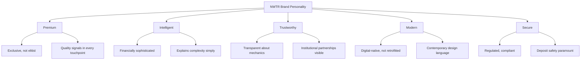
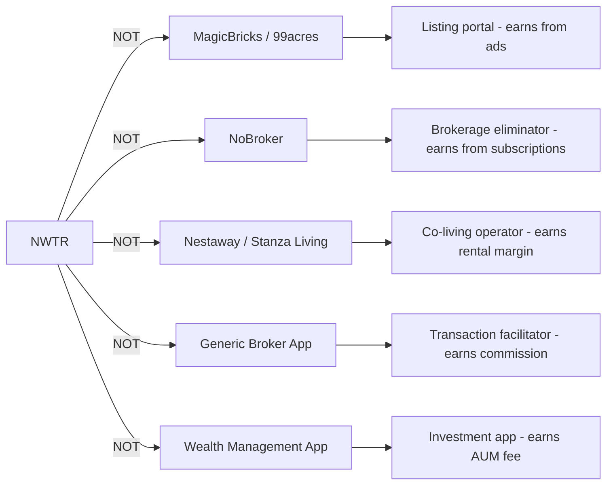

# NWTR — Brand Positioning

---
title: Brand Positioning & Identity
version: 1.0
audience: Marketing, Design, Leadership
last-updated: 2026-05-21
status: draft
related-docs:
  - "../03-ux-ui/design-language.md"
  - "../03-ux-ui/hni-communication-guidelines.md"
  - "./hni-persona-analysis.md"
  - "./market-opportunity.md"
---

## TL;DR

NWTR positions as a premium fintech-proptech hybrid — intelligent, trustworthy, and modern. The brand speaks to India's wealthy professionals who expect institutional-grade financial products with consumer-grade experiences. Visual identity draws from geometric precision (Zoho-inspired) evolved with premium fintech aesthetics (CRED/Zerodha). Anti-positioning: we are NOT a listing portal, NOT a brokerage disruptor, NOT a co-living startup.

---

## Brand Essence

### Core Promise

> **Your money stays yours. Your home stays premium.**

NWTR promises that premium living doesn't require wealth destruction. The deposit-based model preserves capital while delivering an elevated lifestyle — the financial equivalent of having your cake and eating it too.

### Brand Essence Statement

NWTR is **intelligent wealth preservation through premium living** — a financial innovation that respects both the aspirations of India's high earners and the mathematical reality that rent is the most regressive recurring expense in their lives.

### Single-Line Brand Definition

> A premium financial product, delivered as a real estate experience.

---

## Positioning Statement

**For** high-net-worth professionals, NRIs, and senior executives in Indian metros

**Who** spend ₹24-60 lakh annually on rent that builds zero wealth

**NWTR is** a deposit-based living platform

**That** eliminates monthly rent entirely while preserving your capital and guaranteeing property owners reliable monthly income

**Unlike** traditional rental platforms (NoBroker, MagicBricks) that merely digitize the broken rent-payment model

**NWTR** transforms idle security deposits into yield-generating instruments — creating value where the current system destroys it.

---

## Brand Personality

### The Five Pillars



### Personality Spectrum

| Dimension | We Are | We Are Not |
|-----------|--------|-----------|
| **Tone** | Confident, calm, knowledgeable | Hype-driven, urgent, salesy |
| **Complexity** | Sophisticated yet accessible | Jargon-heavy or dumbed-down |
| **Energy** | Composed, deliberate | Frenetic, startup-chaotic |
| **Warmth** | Respectfully warm, human | Cold/corporate or artificially friendly |
| **Authority** | Expert with proof | Arrogant or preachy |
| **Innovation** | Quietly revolutionary | Buzzword-addicted |

### Brand Archetype

**The Sage-Creator hybrid:**
- **Sage:** Wisdom, expertise, understanding the financial truth that rent destroys wealth
- **Creator:** Building something entirely new — a category that didn't exist before
- Not the Rebel (we're not anti-establishment), not the Hero (we're not fighting a villain), not the Caregiver (we're not nurturing — we're empowering)

---

## Tone of Voice Guidelines

### Principles

1. **Speak to intelligence** — Our audience manages crores. Never condescend.
2. **Prove, don't claim** — Numbers over adjectives. Show the math.
3. **Calm confidence** — We don't need exclamation marks. The model speaks for itself.
4. **Financial clarity** — Complex concepts, simple language. No jargon gatekeeping.
5. **Respectful urgency** — The opportunity cost is real, but we don't manufacture panic.

### Voice Examples

#### Headlines

| ❌ Don't | ✅ Do |
|----------|-------|
| "Stop wasting money on rent!" | "Your rent builds someone else's wealth. It shouldn't." |
| "Revolutionary new way to live!" | "The math was always there. We just built the product." |
| "Say goodbye to rent forever!" | "₹36 lakh/year. Zero wealth created. There's a better equation." |
| "India's #1 rental platform!" | "Deposit-based living. A new financial category." |
| "Hurry! Limited properties!" | "50 premium properties. Curated for Bangalore's best addresses." |

#### Body Copy

| ❌ Don't | ✅ Do |
|----------|-------|
| "We're disrupting the rental industry with our innovative platform that leverages cutting-edge technology..." | "NWTR invests your deposit in government-backed instruments. The yield pays your owner's monthly income. You get every rupee back." |
| "Our team of experts ensures..." | "Your deposit is held by [NBFC Name], regulated by RBI, invested in FDs and G-Secs rated AA and above." |
| "Join thousands of happy tenants!" | "47 properties live. ₹35.25 Cr AUM. Zero missed payouts." |

#### CTA Buttons

| ❌ Don't | ✅ Do |
|----------|-------|
| "Sign Up Now!" | "See Available Properties" |
| "Get Started Free!" | "Calculate Your Savings" |
| "Claim Your Spot!" | "Speak With an Advisor" |
| "Don't Miss Out!" | "View the Investment Structure" |

### Tone by Context

| Context | Tone | Example |
|---------|------|---------|
| **Homepage hero** | Confident, intriguing | "Premium living. Zero rent. Full deposit return." |
| **Product explanation** | Clear, precise, educational | "Your ₹75L deposit is invested in a blended portfolio of FDs (35%), T-Bills (25%), G-Secs (20%), and AAA bonds (20%). The 7.5% blended yield funds your owner's guaranteed ₹35,000/month payout." |
| **Owner communication** | Reassuring, professional | "Your May payout of ₹35,000 has been credited. View your quarterly yield report." |
| **Tenant onboarding** | Warm, guiding, transparent | "Step 3 of 5: Your deposit will be held by NBFC Partner Name and invested within 24 hours of receipt." |
| **Investor materials** | Analytical, precise, ambitious | "Unit economics demonstrate 25.3% gross margins at property level with clear path to 65%+ operating margins at 500-property scale." |
| **Error/issue states** | Empathetic, solution-focused | "Your NACH mandate setup encountered an issue. Your dedicated RM has been notified and will resolve this within 4 business hours." |
| **Social media** | Sharp, thought-provoking | "₹3L/month in rent = ₹2.6 Cr lost over 10 years. What if that money stayed yours?" |

---

## Visual Identity Direction

### Design Philosophy

**Geometric precision meets premium warmth** — inspired by Zoho's systematic geometric language, evolved with the premium fintech polish of CRED and the analytical clarity of Zerodha.

### Design Principles

1. **Structured, not rigid** — Geometric foundations with organic warmth in illustrations and photography
2. **Spacious, not sparse** — Premium means generous whitespace, not minimalism-for-minimalism's-sake
3. **Data-beautiful** — Financial information presented with the clarity of a Bloomberg terminal and the aesthetics of a luxury brand
4. **Trustworthy at a glance** — Visual weight, institutional typography, confident color usage

### Logo Direction

| Element | Direction |
|---------|-----------|
| **Form** | Geometric wordmark with subtle architectural reference |
| **Style** | Clean, modern sans-serif with custom letterforms |
| **Symbol** | Abstract representation of "deposit → yield → return" cycle (optional icon mark) |
| **Flexibility** | Horizontal lockup (primary) + stacked + icon-only (social/app) |
| **Exclusion zone** | Generous — the logo breathes |

### Typography System

| Level | Typeface Direction | Usage |
|-------|-------------------|-------|
| **Display** | Geometric sans-serif (e.g., Satoshi, General Sans, or custom) | Headlines, hero sections, key numbers |
| **Body** | Humanist sans-serif (e.g., Inter, Plus Jakarta Sans) | Long-form content, explanations |
| **Data** | Monospace or tabular figures (e.g., JetBrains Mono, IBM Plex Mono) | Financial figures, yield percentages, deposit amounts |
| **Accent** | Serif (e.g., Instrument Serif) | Pull quotes, brand statements, premium moments |

---

## Color Palette

### Primary Colors

| Color | Hex | Role | Rationale |
|-------|-----|------|-----------|
| **Deep Navy** | #0A1628 | Primary brand, backgrounds, text | Authority, trust, depth — financial institution DNA |
| **Warm Gold** | #C9A84C | Accent, yields, premium signals | Wealth, prosperity, premium without being gaudy |
| **Clean White** | #FAFBFC | Space, clarity, breathing room | Openness, transparency, purity of intent |

### Secondary Colors

| Color | Hex | Role | Rationale |
|-------|-----|------|-----------|
| **Slate Blue** | #3B5998 | Interactive elements, links | Approachable authority |
| **Sage Green** | #2D8B6F | Success states, positive yields | Growth, security, money well-placed |
| **Warm Gray** | #6B7B8D | Secondary text, subtle elements | Sophistication without coldness |
| **Soft Cream** | #F5F0E8 | Card backgrounds, warm sections | Warmth against navy, premium paper feeling |

### Functional Colors

| Color | Hex | Usage |
|-------|-----|-------|
| **Success** | #1A8F5C | Deposits confirmed, payouts credited |
| **Warning** | #D4930D | Pending actions, approaching deadlines |
| **Error** | #C0392B | Failed transactions, issues requiring attention |
| **Info** | #2980B9 | Informational notifications |

### Color Usage Rules

1. Navy backgrounds for immersive sections (hero, key data displays)
2. White backgrounds for content-heavy areas (portals, dashboards)
3. Gold used sparingly — only for yield numbers, premium badges, and key CTAs
4. Never: full-page gold, gold text on white (accessibility), rainbow gradients
5. Dark mode: Navy deepens to #060D17, cream inverts to muted slate

### Palette Rationale

- **Why not bright blue (like NoBroker)?** We're not a marketplace. We're a financial product. Deep navy signals institutional trust.
- **Why gold over green?** Green says "money/growth" generically. Gold says "wealth preservation" specifically — our core promise.
- **Why not black?** Pure black is stark and cold. Deep navy provides the same authority with greater warmth and sophistication.
- **Why cream over pure white?** Premium physical materials (stationery, packaging) use warm white. Digital cream references this tactile luxury.

---

## Anti-Positioning

### What NWTR is NOT



### Detailed Anti-Positioning

| Category | What They Do | Why We're Different |
|----------|-------------|---------------------|
| **Listing Portals** (MagicBricks, 99acres) | Aggregate properties, sell visibility | We don't list. We curate, match, and manage entire financial lifecycle. |
| **Brokerage Disruptors** (NoBroker) | Remove brokers, charge tenants/owners | We don't reduce cost of renting. We eliminate rent entirely. |
| **Managed Living** (Nestaway, Colive) | Operate properties, charge margin | We don't operate properties. We operate deposits. |
| **Neo-banks** (Jupiter, Fi, CRED) | Financial products for consumers | We're not a bank. We're a financial product specific to living. |
| **Wealth Managers** (Kuvera, Groww) | Help invest across asset classes | We don't manage your portfolio. We create yield from your housing deposit. |

### Brand Guardrails

**Never say or imply:**
- "India's best rental platform" (we're not a rental platform)
- "Affordable living" (we serve premium, not budget)
- "Invest with us" (we're not an investment product for tenants)
- "Passive income" (implies speculation; owner payouts are structured, not passive)
- "Disruptive" / "Revolutionary" / "Game-changing" (let the model speak)
- "Proptech startup" (we're a fintech company in the real estate vertical)

**Always communicate:**
- "Deposit-based living" (our category)
- "Capital preserved" (tenant value)
- "Guaranteed monthly income" (owner value)
- "Regulated partner" (trust signal)
- "Premium properties" (segment signal)

---

## Competitive Brand Map

### Positioning Matrix

```
                    PREMIUM
                       ↑
                       |
           NWTR ●      |
                       |
    Financial ←--------+--------→ Transactional
    Innovation         |           Convenience
                       |
              ● CRED   |   NoBroker ●
                       |
                       |   ● MagicBricks
              ● Zerodha|
                       |        ● Nestaway
                       ↓
                    MASS MARKET
```

### Brand Competitive Audit

| Brand | Positioning | Visual Identity | Tone | Our Differentiation |
|-------|------------|-----------------|------|---------------------|
| **NoBroker** | "Brokerage-free" | Bright orange/blue, playful | Conversational, deal-focused | We're premium, financial, sophisticated |
| **CRED** | "For people with good credit" | Dark, luxurious, animated | Witty, exclusive, irreverent | We're warmer, more transparent, less exclusionary |
| **Zerodha** | "Flat-fee investing" | Clean green, minimal | Educational, straightforward | We share analytical clarity but add premium warmth |
| **Stanza Living** | "Student/young pro living" | Vibrant, energetic | Casual, community-focused | Entirely different segment and sophistication level |
| **Housing.com** | "Property discovery" | Red/white, aggressive | Aspirational, mass-market | We don't sell properties; we eliminate rent |

---

## Brand Narrative Arc

### The Story We Tell

**Act 1: The Problem (Awareness)**
> India's best professionals earn in crores but lose lakhs every month to rent that builds nothing. Their security deposits sit idle while they fund someone else's EMI.

**Act 2: The Insight (Consideration)**
> What if your deposit could work for both of you? The financial infrastructure to make this possible already exists — FDs, T-Bills, NACH mandates, regulated NBFCs. The product just hadn't been built.

**Act 3: The Solution (Conversion)**
> NWTR: Deposit 70-80% of property value. Live premium. Pay zero rent. Get every rupee back. Your owner gets guaranteed monthly income from the yield. The math works.

**Act 4: The Vision (Advocacy)**
> A world where living well doesn't mean losing wealth. Where property ownership isn't the only path to housing stability. Where India's ₹5 lakh crore in security deposits finally works — for everyone.

### Content Pillars

| Pillar | Theme | Content Types |
|--------|-------|---------------|
| **Financial Intelligence** | The math behind deposit-based living | Calculators, comparison tools, yield explainers |
| **Premium Living** | Curated properties and lifestyle content | Property showcases, neighborhood guides, interior inspiration |
| **Trust & Transparency** | How we protect your money | NBFC partner profiles, compliance updates, payout reports |
| **Category Education** | Why this model works globally | Market analysis, regulatory landscape, thought leadership |
| **Owner Prosperity** | Guaranteed income narratives | Owner testimonials, yield case studies, tax optimization |

---

## Tagline Options

### Primary Contenders

| Tagline | Rationale | Audience |
|---------|-----------|----------|
| **"Live premium. Pay zero rent."** | Direct, benefit-first, memorable | Tenant-facing |
| **"Your deposit works. Your rent disappears."** | Mechanistic clarity meets aspiration | Both |
| **"Wealth preserved. Home elevated."** | Dual benefit in four words | Premium positioning |
| **"The end of dead rent."** | Problem-defined, provocative | Awareness |
| **"Where deposits generate income."** | Owner-focused variation | Owner-facing |

### Supporting Lines

| Context | Line |
|---------|------|
| Owner-facing | "Guaranteed monthly income from your property. Zero management." |
| Investor-facing | "India's first deposit-to-yield platform." |
| NRI-facing | "Your Indian property, finally earning what it should." |
| Category definition | "Deposit-based living. A new financial category." |
| Trust signal | "RBI-regulated partner. Government-backed instruments. Your principal returned." |

### Tagline Selection Criteria

- Must work in both English and code-switched contexts (India's premium audience operates bilingually)
- Must be non-generic — couldn't apply to any other company
- Must hint at both the mechanism (deposit) and the benefit (no rent / guaranteed income)
- Must work at billboard size and in app footer
- Avoid: questions, exclamation marks, hyperbole, startup cliches

---

## Brand Application Guidelines

### Digital Presence

| Touchpoint | Brand Expression |
|-----------|-----------------|
| **Website** | Navy hero sections, white content areas, gold yield numbers, generous spacing |
| **Mobile app** | White primary surface, navy navigation, gold for financial data highlights |
| **Email** | Clean HTML, navy header, minimal formatting, clear CTA button |
| **Social media** | Dark backgrounds for data-driven posts, light for lifestyle content |
| **Investor deck** | Navy backgrounds, gold accents, data-forward layouts |

### Physical Touchpoints

| Touchpoint | Brand Expression |
|-----------|-----------------|
| **Business cards** | Heavy stock, navy + gold foil, minimal information |
| **Property signage** | Understated — small navy plaque, "NWTR Managed" |
| **Event presence** | Navy backdrops, warm lighting, live yield dashboards |
| **Welcome kit** | Premium packaging, property details + financial summary |

### Photography Direction

| Category | Style |
|----------|-------|
| **Properties** | Architectural, well-lit, no people (focus on space quality) |
| **Lifestyle** | Natural, premium, diverse professionals in genuine contexts |
| **Abstract** | Geometric patterns, light play, structural details |
| **Never** | Stock photo smiles, handshake photos, generic office shots |

---

## Brand Measurement

### Brand Health Metrics

| Metric | Measurement | Year 1 Target |
|--------|-------------|---------------|
| Unaided awareness (target demo) | Survey | 5% in Bangalore |
| Brand association accuracy | "What does NWTR do?" | 70% mention deposit/rent-free |
| Perceived premium index | 1-10 scale vs competitors | 8.5+ |
| Trust score | Would you deposit ₹75L? | 40% yes (aware audience) |
| NPS (brand-level) | Recommendation likelihood | 60+ |
| Share of voice | % of premium rental conversations | 15% (digital channels) |

---

## Document Cross-References

- [Executive Summary](./executive-summary.md) — Business overview and funding thesis
- [Business Model](./business-model.md) — Economics behind the brand promise
- [Product Vision](./product-vision.md) — Platform that delivers the brand experience
- [Market Opportunity](./market-opportunity.md) — Audience sizing and timing

---

*NWTR — Premium living, mathematically redefined.*
