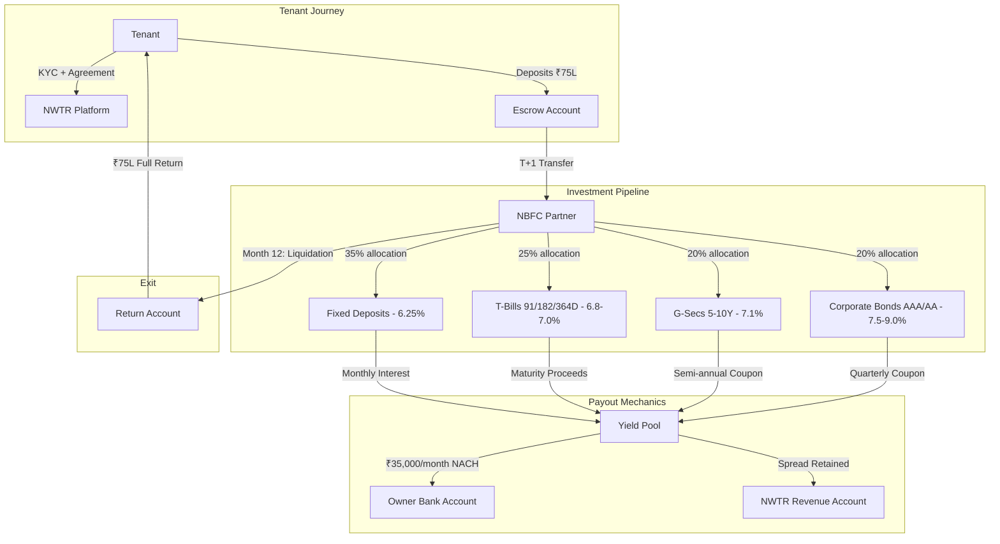
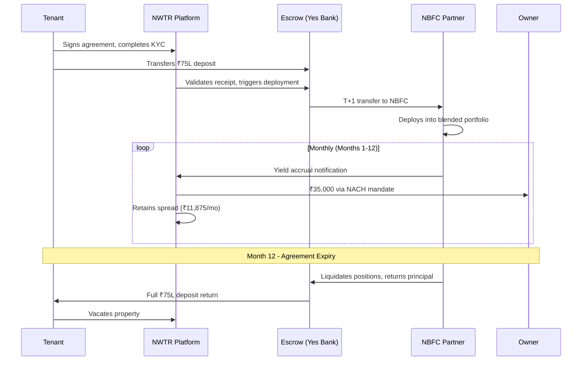
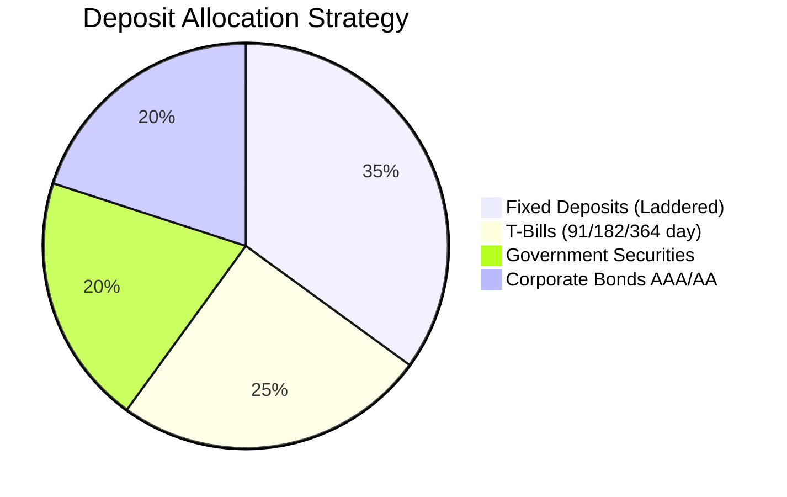
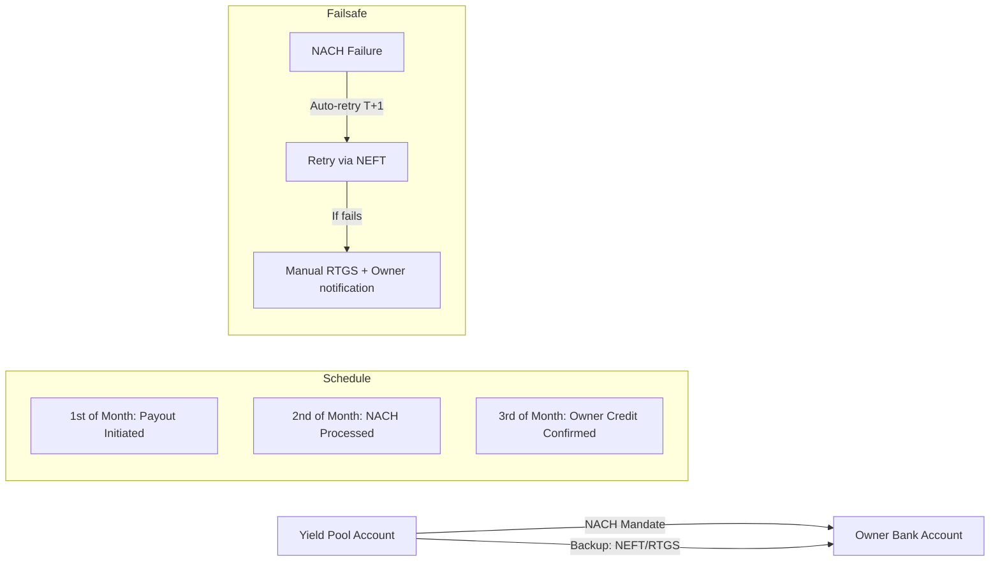
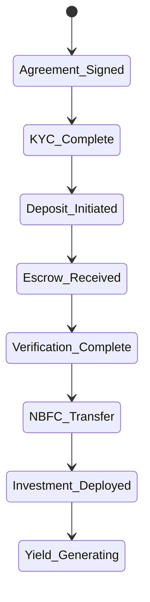
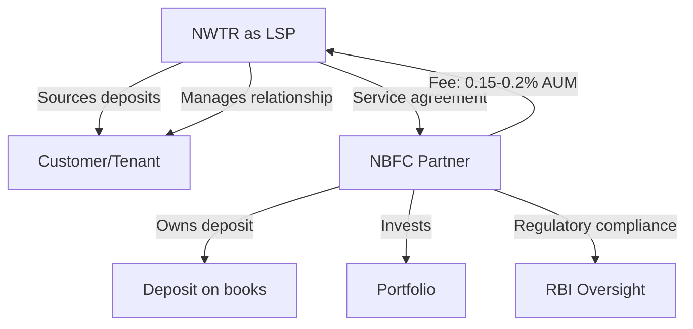

# NWTR — Business Model

---
title: Business Model & Unit Economics
version: 1.0
audience: Investors, Finance Team, NBFC Partners
last-updated: 2026-05-21
status: draft
related-docs:
  - "./executive-summary.md"
  - "./revenue-model.md"
  - "../01-product/escrow-deposit-logic.md"
  - "../01-product/transaction-flow.md"
---

## TL;DR

NWTR operates a capital-light spread business: tenant deposits are routed through an NBFC partner into a diversified fixed-income portfolio (FDs, T-Bills, G-Secs, AAA/AA corporate bonds) yielding 7-8% blended returns. Owners receive guaranteed monthly payouts (~5.6% annualized); NWTR retains the spread (~1.9% or ₹1.4L/year per ₹75L deposit). At 1,000 properties, this generates ₹14+ Cr annual gross revenue with 65%+ gross margins and minimal balance-sheet risk.

---

## Fund Flow Architecture

### Fund Flow Sequence (Timeline View)

---

## Three-Party Value Creation

### Tenant Value Proposition

| Dimension | Traditional Rent | NWTR Model |
|-----------|-----------------|------------|
| Monthly outflow | ₹3-5L/month | ₹0/month |
| Annual cost | ₹36-60L | ₹0 (deposit is returned) |
| Wealth impact | -₹36-60L (pure loss) | ₹0 (capital preserved) |
| Opportunity cost | Massive | Only deposit lock-in |
| Property quality | Market rate | Premium-only |
| Flexibility | 11-month lock-in anyway | 12-month term |
| Credit building | No | Deposit history on record |

**Effective savings for tenant on ₹1 Cr property:** ₹36-48L/year in avoided rent payments.

**True cost to tenant:** Opportunity cost of ₹75L locked for 12 months. At 7% alternative return, this equals ~₹5.25L — still 85% cheaper than traditional rent.

### Owner Value Proposition

| Dimension | Traditional Rental | NWTR Model |
|-----------|-------------------|------------|
| Monthly income | ₹35-40K (with 2-month vacancy) | ₹35,000 guaranteed |
| Vacancy risk | 2-4 months/year | Zero (guaranteed payout) |
| Tenant default risk | 5-10% annually | Zero (deposit-backed) |
| Management overhead | High (maintenance, disputes) | Minimal (NWTR handles) |
| Effective annual yield | 2.8-3.5% (after vacancy) | 4.2% guaranteed |
| Payment reliability | Variable | NACH-automated, 1st of month |
| Property care | Tenant-dependent | Premium tenants, aligned incentives |

**Owner receives:** ₹4,20,000/year guaranteed = ₹35,000/month via NACH mandate, regardless of tenant occupancy status.

### NWTR Value Capture

| Revenue Stream | Per Property (Annual) | At 500 Properties |
|---------------|----------------------|-------------------|
| Primary Spread | ₹1,42,500 | ₹7.13 Cr |
| Platform Fee (one-time, 0.5%) | ₹37,500 | ₹1.88 Cr (new signings) |
| Early Exit Penalty (5% of cases) | ₹18,750 (amortized) | ₹93.75L |
| Renewal Premium (30% renewal rate) | ₹15,000 | ₹22.5L |
| **Total Revenue** | **~₹2,14,000** | **₹10.17 Cr** |

---

## Unit Economics at Multiple Scales

### Assumptions

- Average property value: ₹1 Cr
- Average deposit: ₹75L (75% of property value)
- Blended yield: 7.5% (base case)
- Owner payout rate: 5.6% of deposit
- Operating cost per property: ₹45,000/year (decreasing at scale)
- Customer acquisition cost: ₹1.2L per matched pair (tenant + owner)

### Scale Analysis

| Metric | 10 Properties | 100 Properties | 500 Properties | 1,000 Properties |
|--------|--------------|----------------|----------------|-------------------|
| **AUM** | ₹7.5 Cr | ₹75 Cr | ₹375 Cr | ₹750 Cr |
| **Gross Yield** | ₹56.25L | ₹5.63 Cr | ₹28.13 Cr | ₹56.25 Cr |
| **Owner Payouts** | ₹42L | ₹4.2 Cr | ₹21 Cr | ₹42 Cr |
| **Gross Revenue** | ₹14.25L | ₹1.43 Cr | ₹7.13 Cr | ₹14.25 Cr |
| **Operating Costs** | ₹12L | ₹65L | ₹2.5 Cr | ₹4.3 Cr |
| **Net Revenue** | ₹2.25L | ₹78L | ₹4.63 Cr | ₹9.95 Cr |
| **Net Margin** | 15.8% | 54.5% | 64.9% | 69.8% |
| **Team Size** | 5 | 25 | 60 | 100 |
| **Rev/Employee** | ₹0.45L | ₹3.12L | ₹7.72L | ₹9.95L |

### Breakeven Analysis

- **Property-level breakeven:** Day 1 (spread is positive from first month)
- **Company-level breakeven:** ~80 properties (covers fixed costs of ₹55L/year)
- **CAC payback period:** 7 months per property (₹1.2L CAC / ₹11,875 monthly margin × 1.5 overhead)
- **LTV:CAC ratio:** 4.8x (assuming 2.5 year average relationship)

---

## Investment Allocation Strategy

### Portfolio Construction

### Instrument Detail

| Instrument | Allocation | Yield | Liquidity | Risk | Maturity Strategy |
|-----------|-----------|-------|-----------|------|-------------------|
| **Bank FDs** | 35% | 6.25-6.75% | Medium (premature penalty 0.5-1%) | Sovereign-equivalent | Laddered: 3M, 6M, 9M, 12M tranches |
| **T-Bills** | 25% | 6.8-7.0% | High (secondary market) | Sovereign | Rolling: 91D (10%), 182D (10%), 364D (5%) |
| **G-Secs** | 20% | 7.0-7.2% | Medium-High (NDS-OM) | Sovereign | 5-7 year maturity, hold to maturity |
| **Corporate Bonds** | 20% | 7.5-9.0% | Medium (secondary market) | Low (AAA/AA only) | 1-3 year maturity, diversified issuers |

### FD Laddering Strategy

For a ₹75L deposit, FD allocation (₹26.25L) is laddered as:

| Tranche | Amount | Maturity | Purpose |
|---------|--------|----------|---------|
| Tranche A | ₹6.56L | 3 months | Liquidity buffer + early exit coverage |
| Tranche B | ₹6.56L | 6 months | Mid-term yield optimization |
| Tranche C | ₹6.56L | 9 months | Pre-exit positioning |
| Tranche D | ₹6.56L | 12 months | Maximum yield tranche |

Each tranche rolls over at maturity (except final quarter, which is held liquid for deposit return).

### T-Bill Maturity Matching

| Bill Type | Allocation (of 25%) | Strategy |
|-----------|---------------------|----------|
| 91-day T-Bills | 40% (₹7.5L) | Rolled quarterly, provides liquidity |
| 182-day T-Bills | 40% (₹7.5L) | Semi-annual rolls, balanced yield-liquidity |
| 364-day T-Bills | 20% (₹3.75L) | Annual, highest yield in category |

### Corporate Bond Selection Criteria

- **Minimum rating:** CRISIL AA or equivalent
- **Concentration limit:** Max 10% per issuer
- **Sector diversification:** Max 30% per sector
- **Preferred issuers:** HDFC, LIC Housing, Bajaj Finance, NABARD, PFC, REC
- **Maturity constraint:** ≤ 3 years (matches deposit tenure cycles)

---

## Yield Sensitivity Analysis

### Rate Decline Scenarios

| Scenario | Blended Yield | Owner Payout | NWTR Margin/Property | Impact |
|----------|--------------|-------------|---------------------|--------|
| **Base case** | 7.5% | ₹35,000/mo | ₹1,42,500/yr | Target state |
| **-50 bps** | 7.0% | ₹35,000/mo | ₹1,05,000/yr | -26% margin, viable |
| **-100 bps** | 6.5% | ₹35,000/mo | ₹67,500/yr | -53% margin, tight |
| **-150 bps** | 6.0% | ₹30,000/mo | ₹87,500/yr | Reduce owner payout |
| **-200 bps** | 5.5% | ₹27,500/mo | ₹85,000/yr | Renegotiate terms |

### Rate Decline Mitigation Strategies

1. **Dynamic owner payout bands:** Contracts specify a range (₹30,000-₹40,000/mo) linked to prevailing yield
2. **Portfolio rebalancing:** Shift toward higher-yield corporate bonds (within risk limits) if rates drop
3. **Tenure extension incentive:** Offer 18/24 month deposits with yield lock-in at current rates
4. **Deposit ratio increase:** Move from 75% to 80% deposit if rates compress (more principal = same absolute yield)
5. **Reserve buffer:** Maintain 0.5% yield reserve in first 6 months for rate decline absorption

### Rate Increase Scenarios (Upside)

| Scenario | Blended Yield | Owner Payout | NWTR Margin | Action |
|----------|--------------|-------------|-------------|--------|
| +50 bps | 8.0% | ₹35,000/mo | ₹1,80,000/yr | Retain extra spread |
| +100 bps | 8.5% | ₹37,500/mo | ₹1,95,000/yr | Share partial upside with owner |
| +150 bps | 9.0% | ₹40,000/mo | ₹2,10,000/yr | Premium positioning, owner delight |

---

## Owner Payout Mechanics

### Payment Infrastructure

### Payout Schedule

| Day | Action | Fallback |
|-----|--------|----------|
| 28th of prior month | Yield pool reconciliation | — |
| 1st | NACH mandate triggered | — |
| 2nd | Processing (bank settlement) | If NACH fails → NEFT same day |
| 3rd | Owner credit confirmation + SMS/email | If NEFT fails → RTGS + phone call |
| 5th | Exception handling deadline | Manual intervention, owner notification |

### NACH Mandate Setup

- **Mandate type:** NACH Cr (Credit to owner)
- **Frequency:** Monthly
- **Amount:** Fixed (₹35,000 base case) or variable (within contracted band)
- **Mandate duration:** 12 months (aligned with agreement tenure)
- **Sponsor bank:** Yes Bank / ICICI (primary NACH sponsors)

### Owner Communication

| Event | Channel | Timing |
|-------|---------|--------|
| Payout credited | SMS + Email + App notification | Real-time |
| Monthly statement | Email + Portal | 5th of month |
| Yield report | Portal (detailed) | Quarterly |
| Renewal notice | Email + RM call | 60 days before expiry |

---

## Deposit Lifecycle

### Phase 1: Collection (Day 0 to T+1)

| Step | Timeline | Responsible Party |
|------|----------|-------------------|
| Agreement execution | Day 0 | Tenant + Owner + NWTR |
| Tenant KYC | Day 0-1 | NWTR (digital KYC) |
| Deposit transfer to escrow | Day 0-2 | Tenant |
| Escrow verification | T+0 | NWTR Operations |
| Transfer to NBFC | T+1 | Automated |
| Portfolio deployment | T+1 to T+3 | NBFC Partner |
| First yield accrual | T+30 | NBFC Partner |

### Phase 2: Investment & Yield (Month 1-12)

- Deposits generate yield continuously
- Monthly reconciliation between NBFC yield reports and NWTR records
- Quarterly portfolio rebalancing within allocation bands
- Semi-annual compliance review

### Phase 3: Return (Month 11-12)

| Step | Timeline | Action |
|------|----------|--------|
| Pre-exit notification | Month 11, Day 1 | Notify NBFC to begin liquidity planning |
| FD maturity alignment | Month 11-12 | Don't renew maturing FDs |
| T-Bill non-rollover | Month 11.5+ | Let 91-day bills mature without replacement |
| Bond position closure | Month 12, Week 1 | Sell corporate bond positions |
| G-Sec liquidation | Month 12, Week 2 | Sell on NDS-OM or hold if maturing |
| Principal consolidation | Month 12, Day 25 | All funds in settlement account |
| Deposit return | Month 12, Day 30 | Full amount to tenant's bank account |
| Property handover | Month 12, Day 30 | Tenant vacates, owner inspection |

---

## Early Exit Scenarios

### Tenant-Initiated Early Exit

| Exit Timing | Penalty | Deposit Return | Rationale |
|------------|---------|----------------|-----------|
| Month 1-3 | 3% of deposit (₹2.25L) | ₹72.75L | Covers deployment costs + broken yield |
| Month 4-6 | 2% of deposit (₹1.50L) | ₹73.50L | Partial cost recovery |
| Month 7-9 | 1% of deposit (₹75,000) | ₹74.25L | Minimal penalty, sufficient yield earned |
| Month 10-12 | 0% | ₹75L | Full return (close enough to term end) |

### Owner-Initiated Early Exit

- Owner cannot unilaterally terminate (contractual obligation to honor 12-month term)
- Exception: Property sale — NWTR facilitates tenant relocation, full deposit returned, owner pays 2% transfer fee

### Force Majeure

- Natural disaster / uninhabitable property → Full deposit return within 30 days, no penalty
- Tenant death/incapacitation → Nominee receives full deposit, no penalty
- Regulatory change → Structured 90-day wind-down, full deposit return

### Penalty Revenue Impact

Assuming 5% early exit rate:
- 500 properties × 5% × ₹1.5L average penalty = ₹37.5L additional annual revenue
- This is treated as incidental income, not core margin

---

## Scale Economics and Margin Improvement

### Operating Cost Structure (at Scale)

| Cost Category | At 100 Properties | At 500 Properties | At 1,000 Properties |
|--------------|-------------------|-------------------|---------------------|
| **Technology** | ₹25L (25%) | ₹60L (24%) | ₹90L (21%) |
| **People** | ₹40L (40%) | ₹1.2 Cr (48%) | ₹2.0 Cr (47%) |
| **NBFC fees** | ₹15L (15%) | ₹37.5L (15%) | ₹60L (14%) |
| **Compliance** | ₹10L (10%) | ₹20L (8%) | ₹30L (7%) |
| **Marketing + CAC** | ₹10L (10%) | ₹12.5L (5%) | ₹50L (12%) |
| **Total** | ₹1.0 Cr | ₹2.5 Cr | ₹4.3 Cr |

### Margin Expansion Drivers

1. **Technology leverage:** Platform cost grows sub-linearly (₹25L → ₹90L for 10x scale)
2. **CAC reduction:** Brand recognition + referrals reduce per-property acquisition cost from ₹1.2L → ₹60,000
3. **NBFC fee negotiation:** Volume-based fee compression from 0.2% → 0.1% of AUM
4. **Operational efficiency:** RM-to-property ratio improves from 1:10 → 1:25 with automation
5. **Renewal economics:** Renewals have zero CAC — direct margin contribution
6. **Portfolio yield optimization:** Larger AUM enables access to institutional bond tranches (higher yield)

### Revenue Diversification (Year 3+)

| Stream | Description | Revenue Potential |
|--------|-------------|-------------------|
| Core spread | Primary yield-minus-payout margin | 70% of revenue |
| Platform fees | One-time onboarding charges | 10% |
| Insurance commissions | Referral fees from property insurance | 5% |
| Premium services | Interior design, maintenance packages | 8% |
| Data monetization | Anonymized rental market intelligence | 3% |
| Credit products | Deposit financing for near-HNI tenants | 4% |

### Path to ₹100 Cr Revenue

| Year | Properties | AUM | Gross Revenue | Net Revenue |
|------|-----------|-----|---------------|-------------|
| Year 1 | 50 | ₹37.5 Cr | ₹71L | ₹15L |
| Year 2 | 200 | ₹150 Cr | ₹2.85 Cr | ₹1.4 Cr |
| Year 3 | 600 | ₹450 Cr | ₹8.55 Cr | ₹5.1 Cr |
| Year 4 | 1,500 | ₹1,125 Cr | ₹21.4 Cr | ₹14 Cr |
| Year 5 | 4,000 | ₹3,000 Cr | ₹57 Cr | ₹38 Cr |
| Year 6 | 8,000 | ₹6,000 Cr | ₹114 Cr | ₹78 Cr |

---

## NBFC Partnership Model

### Phase 1: LSP (Loan Service Provider) Model

**Key LSP Terms:**
- NWTR sources and services the relationship
- NBFC holds deposits on its balance sheet (critical for CIS avoidance)
- NBFC handles all RBI-regulated activities
- Revenue share: NWTR retains spread minus NBFC management fee (0.15-0.2% of AUM)
- NBFC provides regulatory umbrella and deposit insurance coverage

### Phase 2: Own NBFC-ICC License (Year 3-4)

- Apply for NBFC-ICC (Investment and Credit Company) license from RBI
- Minimum NOF requirement: ₹2 Cr (well within reach by Year 2)
- Enables direct deposit holding, eliminating partner fee
- Margin improvement: +0.15-0.2% (₹1.13L per property per year at scale)
- Timeline: 12-18 months for license approval

---

## Regulatory Structure (CIS Avoidance)

### Why This is NOT a Collective Investment Scheme

| CIS Characteristic | NWTR Structure | Distinction |
|-------------------|---------------|-------------|
| Pooling of funds | Individual FD/bond accounts per deposit | No commingling of deposits |
| Profit sharing | Fixed payout to owner (not profit-based) | Guaranteed return, not variable |
| Day-to-day control by scheme operator | NBFC manages per RBI norms | Regulated entity manages funds |
| Contribution ≥ ₹25,000 | Yes, exceeds threshold | Structure matters, not amount |
| Promise of returns to depositor | No return promised to tenant | Tenant gets principal back, not yield |

### Legal Architecture

1. **Tripartite agreement:** Tenant ↔ NWTR ↔ Owner (rental arrangement)
2. **Bilateral agreement:** Tenant ↔ NBFC (deposit placement)
3. **Service agreement:** NWTR ↔ NBFC (LSP arrangement)
4. **NACH mandate:** NBFC → Owner (payout)
5. **Escrow agreement:** Bank ↔ NWTR ↔ Tenant (transit security)

> Cross-reference: [Product Vision — Compliance Architecture](./product-vision.md)

---

## Financial Projections Summary

### 5-Year P&L (Base Case)

| Line Item | Year 1 | Year 2 | Year 3 | Year 4 | Year 5 |
|-----------|--------|--------|--------|--------|--------|
| Properties (cumulative) | 50 | 200 | 600 | 1,500 | 4,000 |
| AUM | ₹37.5 Cr | ₹150 Cr | ₹450 Cr | ₹1,125 Cr | ₹3,000 Cr |
| Gross Revenue | ₹71L | ₹2.85 Cr | ₹8.55 Cr | ₹21.4 Cr | ₹57 Cr |
| Platform Fees | ₹25L | ₹75L | ₹2 Cr | ₹4.5 Cr | ₹10 Cr |
| **Total Revenue** | **₹96L** | **₹3.6 Cr** | **₹10.55 Cr** | **₹25.9 Cr** | **₹67 Cr** |
| Operating Costs | ₹80L | ₹2.2 Cr | ₹5.45 Cr | ₹11.9 Cr | ₹29 Cr |
| **EBITDA** | **₹16L** | **₹1.4 Cr** | **₹5.1 Cr** | **₹14 Cr** | **₹38 Cr** |
| EBITDA Margin | 16.7% | 38.9% | 48.3% | 54.1% | 56.7% |

### Key Metrics Evolution

| Metric | Year 1 | Year 3 | Year 5 |
|--------|--------|--------|--------|
| Revenue per property | ₹1.92L | ₹1.76L | ₹1.68L |
| Cost per property | ₹1.6L | ₹0.91L | ₹0.73L |
| Contribution margin | ₹0.32L | ₹0.85L | ₹0.95L |
| CAC payback (months) | 10 | 7 | 5 |
| LTV:CAC | 3.2x | 4.8x | 6.5x |
| Gross margin | 74% | 81% | 85% |

---

## Document Cross-References

- [Executive Summary](./executive-summary.md) — High-level pitch and market overview
- [Product Vision](./product-vision.md) — Platform roadmap and technical architecture
- [Market Opportunity](./market-opportunity.md) — TAM/SAM sizing and growth vectors
- [Brand Positioning](./brand-positioning.md) — Premium positioning strategy

---

*NWTR — Where idle deposits become guaranteed income streams.*
