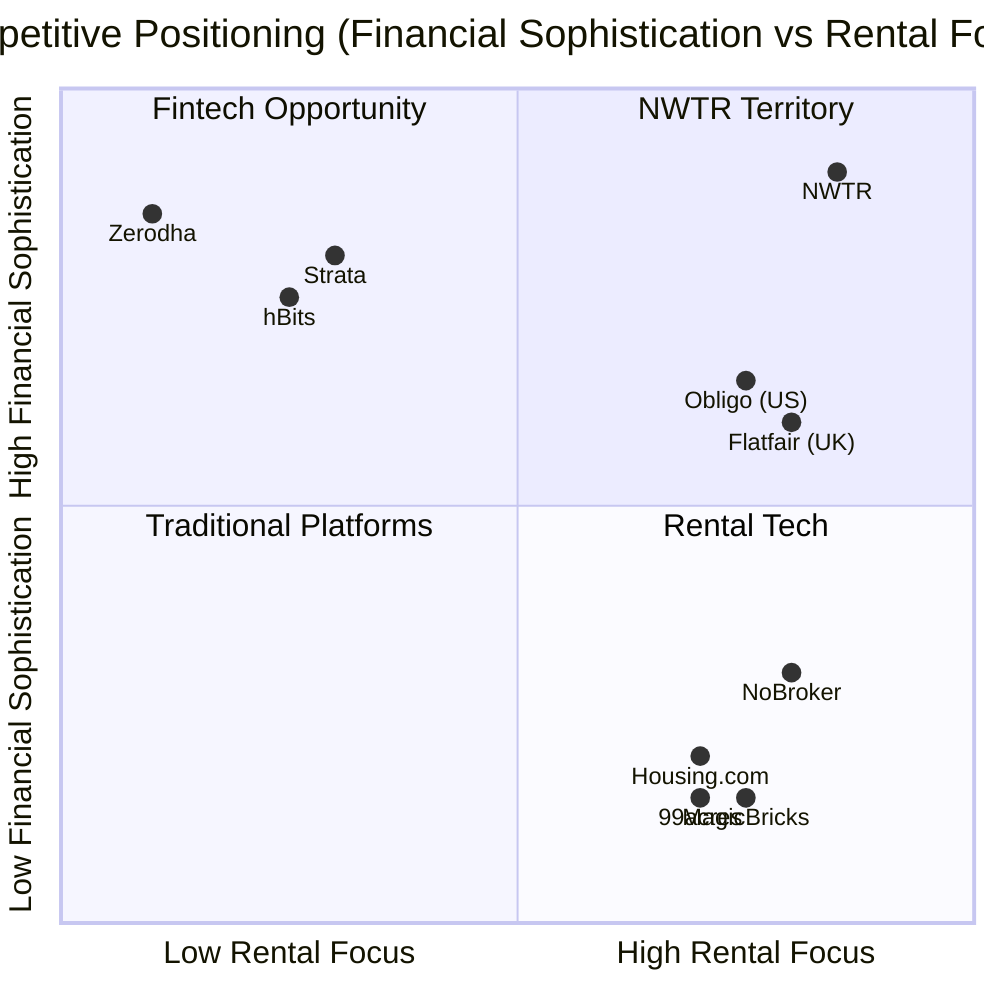
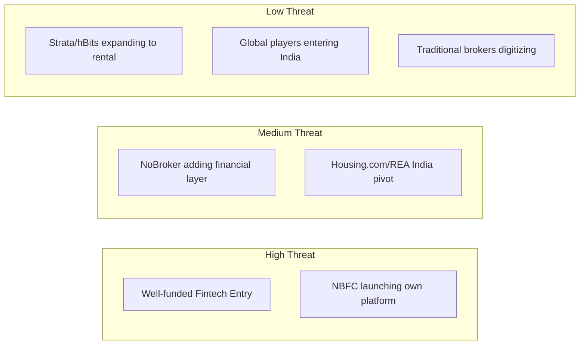

# Competitor Analysis

## TL;DR

NWTR operates in a "blue ocean" — no direct competitor offers a deposit-based zero-rent model in India. The competitive landscape includes adjacent players in rental platforms (NoBroker, Housing.com), fractional ownership (Strata, hBits), and global deposit alternatives (Flatfair, Obligo). NWTR's moat is structural: NBFC licensing creates an 18-month regulatory barrier, trust with HNI deposits compounds over 2-3 years, and the two-sided marketplace (owners + tenants in same micro-market) generates network effects. The primary competitive threat is not existing players replicating the model, but rather a well-funded fintech (Paytm, PhonePe, Zerodha) leveraging existing HNI trust to launch a similar offering. Counter-strategy: establish category dominance in Bangalore before competitors recognize the opportunity.

---

## 1. Competitive Landscape Map

### 1.1 Positioning Matrix



### 1.2 Competitor Categories

| Category | Players | Threat to NWTR | Overlap |
|----------|---------|---------------|---------|
| **Direct competitors** | None (category creation) | — | — |
| **Rental platforms (adjacent)** | NoBroker, Housing.com, MagicBricks, 99acres | Medium | User base, property supply |
| **Fractional ownership** | Strata, hBits, PropertyShare | Low | HNI audience, investment framing |
| **Deposit alternatives (global)** | Flatfair, Deposify, Rhino, Obligo | Low (no India presence) | Concept validation |
| **Fintechs (potential entrants)** | Paytm, PhonePe, Zerodha, CRED | High (if they enter) | HNI trust, tech, capital |
| **Banks/NBFCs** | HDFC, Bajaj Finance, LIC HFL | Medium | NBFC license, deposits |
| **Property management** | NestAway, Colive, Zolo | Low | Operations overlap |

---

## 2. Direct Competitors: None (Category Creation)

### 2.1 Why No One Has Done This

| Barrier | Explanation |
|---------|-------------|
| Regulatory complexity | Requires NBFC understanding + real estate knowledge + tech |
| Trust challenge | Convincing HNIs to deposit ₹50L+ with a new entity |
| Capital requirements | ₹10Cr NOF for NBFC license |
| Two-sided marketplace cold start | Need both owners and tenants in same micro-market |
| Interdisciplinary team | Finance + real estate + compliance + tech (rare combination) |
| Cultural insight | Understanding Indian deposit norms and HNI psychology |
| Risk of CIS classification | Deters pure fintech players |

### 2.2 Category Creation Advantage

Being first in a new category provides:
1. **Naming rights**: "NWTR" becomes synonymous with deposit-for-rent
2. **SEO dominance**: Own all search terms before competitors
3. **Media narrative**: Story of innovation, not imitation
4. **Regulatory shaping**: Opportunity to influence norms (proactive engagement)
5. **Pricing power**: No benchmark to anchor against
6. **Talent attraction**: Visionary narrative attracts top talent

---

## 3. Adjacent Competitors: Rental Platforms

### 3.1 NoBroker

| Parameter | Details |
|-----------|---------|
| **Founded** | 2014 |
| **Valuation** | $1.1B (2022 round) |
| **Model** | Brokerage-free rental/sale marketplace + services |
| **Revenue** | Subscription plans (₹999-₹4,999), packers/movers, home loans |
| **Users** | 30M+ registered users |
| **Funding** | $426M total (Tiger Global, General Atlantic) |
| **Cities** | Bangalore, Mumbai, Delhi, Hyderabad, Pune, Chennai |

**Strengths**:
- Massive user base and brand recognition in target segment
- Existing supply of premium properties
- Trust established with property transactions
- Strong tech platform and data

**Weaknesses**:
- No financial services license or expertise
- Revenue model is transactional (one-time), not annuity
- Brand associated with "saving brokerage" not "financial sophistication"
- Would need 18-24 months to build NBFC capability

**Threat level**: **Medium** — could partner rather than compete, or launch copycat in 24+ months.

**NWTR counter**: Move fast in Bangalore; position as premium (NoBroker = mass market); potential partnership for supply acquisition.

### 3.2 Housing.com (REA India)

| Parameter | Details |
|-----------|---------|
| **Founded** | 2012 (relaunched under REA India) |
| **Parent** | REA Group (News Corp) |
| **Model** | Listing platform + lead generation |
| **Revenue** | Listing fees from brokers/developers |
| **Differentiator** | Data-rich platform, developer focus |

**Strengths**: Deep property data, developer relationships, corporate backing.
**Weaknesses**: Lead-gen model, no tenant relationship, no financial services.
**Threat level**: **Low** — different business model entirely.

### 3.3 MagicBricks / 99acres

| Parameter | MagicBricks | 99acres |
|-----------|-------------|---------|
| Parent | Times Group | Info Edge |
| Model | Classified listings | Classified listings |
| Revenue | Listing fees | Listing fees + services |
| Differentiator | Media group distribution | Largest database |

**Threat level**: **Low** — classified models with no financial services ambition.

---

## 4. Alternate Model Competitors: Fractional Ownership

### 4.1 Strata

| Parameter | Details |
|-----------|---------|
| **Founded** | 2019 |
| **Model** | Fractional ownership of commercial real estate |
| **Minimum investment** | ₹25L |
| **Target** | HNIs, NRIs |
| **Returns** | 8-10% (rental yield + appreciation) |
| **SEBI status** | Registered as SM REIT (2024 framework) |

**Overlap with NWTR**: Same HNI audience, investment framing, NRI channel.
**Key difference**: Strata = ownership (illiquid, 3-5 year lock-in); NWTR = tenancy (liquid, 1-year, get deposit back).
**Threat level**: **Low** — complementary rather than competitive.

### 4.2 hBits

| Parameter | Details |
|-----------|---------|
| **Founded** | 2018 |
| **Model** | Fractional ownership (commercial + residential) |
| **Minimum investment** | ₹25L |
| **Returns** | 7-9% yield |
| **Differentiator** | Technology-first, transparent dashboard |

**Overlap with NWTR**: HNI audience, yield-focused messaging.
**Key difference**: Ownership vs. tenancy model; different regulatory framework.
**Threat level**: **Low**.

### 4.3 Comparison: Fractional vs. NWTR

| Parameter | Fractional (Strata/hBits) | NWTR |
|-----------|--------------------------|------|
| Investor gets | Fractional ownership | Housing + deposit return |
| Lock-in period | 3-5 years | 1 year |
| Liquidity | Low (secondary market emerging) | High (deposit returned at term) |
| Returns | 8-10% (rental + appreciation) | 7-8% (yield on deposit) |
| Minimum investment | ₹25L | ₹25L+ (deposit) |
| Regulatory framework | SM REIT (SEBI) | NBFC (RBI) |
| Target audience | Pure investors | Tenants who invest |
| Housing benefit | None | Yes (live in property) |

---

## 5. Global Parallels

### 5.1 Flatfair (UK)

| Parameter | Details |
|-----------|---------|
| **Founded** | 2017, London |
| **Model** | Deposit replacement (membership fee instead of deposit) |
| **How it works** | Tenant pays non-refundable fee (1 week's rent); no deposit; end-of-tenancy claims charged to tenant |
| **Funding** | $10M+ |
| **Relevance to NWTR** | Validates deposit-alternative demand; different model (fee vs. investment) |

**Key insight**: Flatfair proves tenants want deposit alternatives. But their model (non-refundable fee) is inferior to NWTR (get money back with returns).

### 5.2 Obligo (US)

| Parameter | Details |
|-----------|---------|
| **Founded** | 2017, New York |
| **Model** | Deposit-free renting via billing-based security (credit-linked guarantee) |
| **How it works** | Tenant's bank account is authorized (not charged); owner is guaranteed |
| **Funding** | $50M+ |
| **Partners** | Major US landlords, AvalonBay |
| **Relevance** | Validates that HNI tenants prefer keeping deposits invested elsewhere |

**Key insight**: Obligo proves that affluent tenants want their capital working, not locked in deposits. NWTR takes this further: the deposit itself is the investment vehicle.

### 5.3 Rhino (US)

| Parameter | Details |
|-----------|---------|
| **Founded** | 2017, New York |
| **Model** | Security deposit insurance (tenant pays small monthly premium instead of deposit) |
| **How it works** | Insurer covers landlord claims; tenant keeps cash |
| **Funding** | $95M+ |
| **Relevance** | Insurance-based deposit alternative |

### 5.4 Zero Deposit (UK)

| Parameter | Details |
|-----------|---------|
| **Founded** | 2014, London |
| **Model** | Deposit replacement insurance product |
| **Relevance** | UK-specific, validates concept |

### 5.5 Global Parallel Comparison

| Player | Market | Deposit Alternative | Tenant Gets | Owner Gets | NWTR Differentiator |
|--------|--------|--------------------|-----------|-----------|--------------------|
| Flatfair | UK | Membership fee (non-refundable) | No deposit required | Claims protection | NWTR: refundable + returns |
| Obligo | US | Bank authorization (not charged) | Capital stays free | Guarantee | NWTR: structured investment |
| Rhino | US | Monthly insurance premium | No deposit required | Insurance coverage | NWTR: no premium, get returns |
| Zero Deposit | UK | Insurance product | No deposit required | Insurance | NWTR: investment, not insurance |
| **NWTR** | **India** | **Investment deposit to NBFC** | **Zero rent + deposit back** | **Guaranteed monthly income** | **Category-defining model** |

---

## 6. Per-Competitor Deep Analysis

### 6.1 Threat Assessment Matrix



### 6.2 Potential Fintech Entrants (Highest Threat)

| Entrant | Why They Could | Why They Probably Won't | Timeline to Launch |
|---------|---------------|------------------------|-------------------|
| **CRED** | HNI audience, trust, brand | Distracted (many verticals), no RE expertise | 18-24 months |
| **Zerodha** | Financial sophistication, HNI trust | Pure investment focus, no RE operations | 24+ months |
| **PhonePe** | Scale, Walmart backing, financial license | Mass market focus, not HNI | 24+ months |
| **Paytm** | Financial services infra, user base | Regulatory challenges, restructuring | 30+ months |
| **Bajaj Finance** | NBFC license, HNI relationships | Existing model works, RE not priority | 12-18 months |

### 6.3 Most Likely Competitive Response

| Timeline | What Happens | NWTR Response |
|----------|-------------|---------------|
| Month 0-12 | No one notices (sub-200 properties) | Execute fast, build trust |
| Month 12-18 | Media coverage triggers awareness | Establish brand, lock in supply |
| Month 18-24 | NoBroker/CRED explores concept | Be at 500+ properties, own NBFC license |
| Month 24-36 | First copycat launches | Network effects, trust moat, data advantage |
| Month 36+ | Market has 2-3 players | Market leader with 60%+ share |

---

## 7. NWTR's Competitive Moat

### 7.1 Moat Components

```mermaid
graph TD
    A[NWTR Competitive Moat] --> B[Regulatory Moat]
    A --> C[Trust Moat]
    A --> D[Network Effects]
    A --> E[Data Moat]
    A --> F[Brand Moat]
    
    B --> B1[NBFC license: 18-month barrier]
    B --> B2[SEBI structural clarity: legal opinions]
    B --> B3[Compliance infrastructure: built over years]
    
    C --> C1[Track record: every month of payouts builds trust]
    C --> C2[Audit trail: Big 4, certifications]
    C --> C3[Zero incidents: safety record]
    
    D --> D1[Two-sided: owners + tenants in same locality]
    D --> D2[Density: 20+ properties in Koramangala > 200 scattered]
    D --> D3[Referral loops: HNI networks are tight]
    
    E --> E1[Property valuation models: improved with each transaction]
    E --> E2[Tenant behavior data: exit patterns, renewal rates]
    E --> E3[Yield optimization: portfolio management intelligence]
    
    F --> F1[Category = Brand: "NWTR model" becomes industry term]
    F --> F2[Premium positioning: not for everyone]
    F --> F3[Media narrative: innovation story]
    
    style A fill:#2563eb,color:#fff
```

### 7.2 Moat Durability Assessment

| Moat | Strength Today | Strength Year 3 | Replicability |
|------|---------------|-----------------|---------------|
| NBFC license | Strong | Very Strong | 18-month lag |
| Trust with HNIs | Weak (new) | Very Strong | 2-3 year lag |
| Network effects | Weak (cold start) | Strong | 12-18 month lag |
| Data advantage | None | Strong | Proportional to scale |
| Brand recognition | None | Strong | Cannot be replicated |
| Regulatory relationships | Building | Strong | Relationship-based |

### 7.3 Defensibility Timeline

| Month | Properties | Moat Strength | Can Competitor Catch Up? |
|-------|-----------|---------------|--------------------------|
| 6 | 50 | Minimal | Yes easily |
| 12 | 200 | Emerging | Yes with effort |
| 18 | 400 | Moderate | Possible but expensive |
| 24 | 700 | Strong | Very difficult |
| 36 | 1,500 | Very Strong | Practically impossible in same market |

---

## 8. Potential Competitive Responses & Counter-Strategies

### 8.1 If NoBroker Launches Similar Product

| Their Move | Our Counter |
|-----------|-------------|
| Announce deposit-to-rent feature | PR: "We pioneered this; they're copying" |
| Offer lower deposit requirement (50%) | Maintain 70% for yield math; position as "safer" |
| Leverage existing user base | Deep Bangalore density; HNI-specific brand |
| Undercut on fees | Compete on trust, not price |
| Partner with large NBFC | Our own license + established track record |

### 8.2 If CRED/Zerodha Enters

| Their Move | Our Counter |
|-----------|-------------|
| Launch with existing HNI audience | Deeper real estate expertise; property operations |
| Offer higher yields (subsidized) | Sustainability narrative; regulatory compliance |
| Brand trust (existing) | Specialize: "We ONLY do deposit-based renting" |
| Technology superiority | Match on tech; differentiate on operations |

### 8.3 If Bank/NBFC Launches Direct

| Their Move | Our Counter |
|-----------|-------------|
| Leverage existing deposits infrastructure | Technology + UX superiority; marketplace dynamics |
| Trust from banking brand | Agility; focus; category expertise |
| Lower cost of capital | Platform value-add beyond yield (property ops) |
| Branch network for onboarding | Digital-first for tech HNIs; hybrid for others |

---

## 9. Blue Ocean Positioning

### 9.1 Value Innovation Canvas

| Factor | Traditional Rental | NoBroker | Fractional RE | **NWTR** |
|--------|-------------------|----------|---------------|----------|
| Monthly rent payment | High | High | N/A | **Zero** |
| Deposit locked (dead money) | High | High | N/A | **Invested (earning)** |
| Owner vacancy risk | High | Medium | Low | **Zero** |
| Owner yield | Low (3-4%) | Low (3-4%) | Medium (8-10%) | **Medium (4.5% guaranteed)** |
| Tenant capital efficiency | Low | Low | Medium | **High** |
| Regulatory clarity | High | High | Medium | **Medium (building)** |
| Liquidity | Medium (11 months) | Medium | Low (3-5 years) | **High (12 months)** |
| Trust requirement | Low (standard) | Low | Medium | **High (deposit size)** |
| Technology experience | Low | High | Medium | **High** |
| Financial sophistication | Low | Low | High | **High** |

### 9.2 NWTR's Unique Position

NWTR doesn't compete on the same axes as existing players:
- Not a rental platform (NoBroker, Housing.com compete here)
- Not an investment product (Strata, hBits compete here)
- Not a deposit replacement (Flatfair, Rhino compete here)
- **It's a financial structure that eliminates rent** — a new category entirely

### 9.3 Category Ownership Strategy

| Action | Timeline | Purpose |
|--------|----------|---------|
| Coin and own terminology ("deposit-based zero-rent") | Pre-launch | Define the narrative |
| Publish thought leadership (Medium, LinkedIn, podcasts) | Month 1+ | Establish expertise |
| Industry body formation ("Deposit Innovation Alliance") | Year 2 | Shape regulation |
| Academic research partnership (IIM/ISB) | Year 2 | Credibility |
| Annual "State of Deposits" report | Year 1+ | Data authority |

---

## Cross-References

- [India Market Fit](./india-market-fit.md) — Market context for competitive dynamics
- [Revenue Model](./revenue-model.md) — Economic model competitors must replicate
- [Risk Analysis](./risk-analysis.md) — Competitive entry as a risk factor
- [Trust & Compliance Strategy](./trust-compliance-strategy.md) — Trust moat architecture
- [HNI Persona Analysis](./hni-persona-analysis.md) — Target customer preferences
