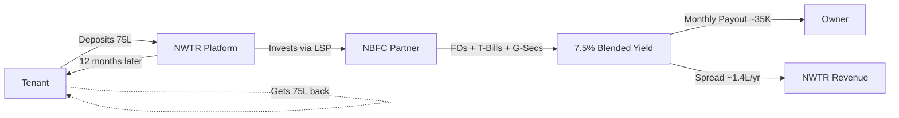

# NWTR — Executive Summary

---
title: Executive Summary
version: 1.0
audience: Investors, Board, Leadership Team
last-updated: 2026-05-21
status: draft
related-docs:
  - "./business-model.md"
  - "./market-opportunity.md"
  - "./product-vision.md"
  - "../01-product/prd.md"
---

## TL;DR

NWTR ("New Way To Rent") eliminates monthly rent for premium tenants by converting large security deposits into yield-generating instruments. Owners receive guaranteed monthly payouts from investment returns; tenants get their full deposit back after 12 months. NWTR captures the spread — a capital-light, recurring-revenue proptech-fintech hybrid targeting India's ₹30,000 Cr+ premium rental market.

---

## Elevator Pitches

### 30-Second Pitch

> India's premium tenants burn ₹2-5 lakh monthly on rent that builds zero wealth. NWTR flips this: tenants deposit 70-80% of property value, live rent-free for a year, and get every rupee back. The deposit is invested in FDs, T-Bills, and G-Secs through our NBFC partner — generating 7-8% blended yield. Owners get guaranteed monthly payouts. NWTR earns the spread. Zero rent burn. Zero vacancy anxiety. Capital-efficient, regulation-friendly, and targeting a ₹30,000 Cr TAM.

### 2-Minute Pitch

India's premium rental market has a three-sided trust deficit:

**Tenants** earning ₹50L+ annually spend ₹24-60L/year on rent — dead money that builds no equity, offers no returns, and creates no lasting financial benefit. With property prices making homeownership inaccessible even for high earners, the opportunity cost is staggering.

**Owners** face chronic vacancy anxiety, payment defaults, and tenant management overhead. Even in premium markets, owners lose 2-4 months of income per year to vacancy cycles and negotiations.

**The system** has no mechanism to convert the enormous pools of security deposits (sitting idle at 0% return) into productive, yield-generating capital.

NWTR solves all three simultaneously:

1. Tenants deposit 70-80% of property value (₹70-80L on a ₹1 Cr property) and live rent-free for 12 months
2. Deposits are invested through our NBFC partner in a blended portfolio of FDs (6.25%), Corporate Bonds (7.5-9%), and Government Securities (7.1%)
3. The yield (~₹5.6L/year on ₹75L) funds guaranteed monthly owner payouts (~₹35,000/month)
4. NWTR retains the spread (~₹1.4L/year per property) as gross margin

At 500 properties, this generates ₹7 Cr/year in gross revenue with 25%+ operating margins and zero inventory risk.

### 5-Minute Pitch

*(Extends the 2-minute pitch with the following sections)*

**Why This Works Now:**
- Indian rental market at USD 2.8B (2025), growing 4.2-7.4% CAGR
- Rents rising 14% YoY in metros — rent burn pain is acute and accelerating
- RBI rate stability provides predictable yield environment (repo rate 6.25%, Feb 2025)
- Digital-native NBFC infrastructure enables same-day deposit deployment
- UPI/NACH mandates make owner payouts frictionless and automated
- India has 30M+ HNI households (Credit Suisse, 2024) — our TAM is enormous and underserved

**Category Creation:**
No global competitor operates this model. NoBroker (USD 1.1B valuation) digitized brokerage elimination. NWTR digitizes rent elimination. We are not a marketplace — we are a financial product wrapped in a real estate experience.

**Unit Economics at Scale (1,000 properties):**

| Metric | Value |
|--------|-------|
| Avg. Property Value | ₹1 Cr |
| Avg. Deposit | ₹75L |
| Total AUM | ₹750 Cr |
| Annual Yield (7.5% blended) | ₹56.25 Cr |
| Annual Owner Payouts | ₹42 Cr |
| Gross Revenue (Spread) | ₹14.25 Cr |
| Operating Costs (30%) | ₹4.3 Cr |
| Net Revenue | ₹9.95 Cr |

---

## Problem Statement

### For Tenants: The Rent Burn Crisis

India's premium tenants — HNIs, NRIs, senior executives, successful entrepreneurs — spend ₹24-60 lakh annually on rent. This represents:

- **Zero wealth creation** — rent payments build no equity, earn no returns, create no asset
- **Opportunity cost** — ₹50L/year in rent = ₹4.3 Cr lost over 10 years (at 8% compounding)
- **Psychological burden** — despite high net worth, tenants feel perpetually "stuck" paying someone else's EMI
- **No alternatives** — property prices in metros (₹1-3 Cr for 2-3 BHK) make purchase irrational for mobile professionals

### For Owners: Vacancy Anxiety and Yield Compression

Premium property owners face:

- **2-4 month vacancy cycles** between tenants (₹4-10L annual income loss)
- **Rental yield compression** — Mumbai yields at 2.5-3.5%, Bangalore at 3-4%
- **Tenant management overhead** — maintenance disputes, late payments, property damage
- **Trust deficit** — no reliable mechanism for guaranteed monthly income
- **NRI distance penalty** — absentee owners lose 15-30% of potential yield to management friction

### Systemic Trust Deficit

The Indian rental market lacks institutional infrastructure:

- No standardized deposit protection schemes (unlike UK's DPS or Australia's bond boards)
- No yield-generation from idle security deposits (₹5-8 lakh typical deposits earning 0%)
- No guaranteed payout mechanisms for owners
- Fragmented, broker-dependent discovery and transaction processes

---

## Solution: Deposit-Based Living

NWTR introduces **Deposit-Based Living** — a financial innovation where large security deposits replace monthly rent, creating value for all three parties simultaneously.

**Three-Party Value Creation:**

| Party | Current Pain | NWTR Benefit |
|-------|-------------|--------------|
| Tenant | ₹3-5L/month rent burn | Zero rent, full deposit return, wealth preservation |
| Owner | Vacancy + defaults | Guaranteed monthly income, zero management |
| NWTR | — | Capital-light spread revenue, recurring, scalable |

---

## Market Opportunity

### TAM / SAM / SOM

| Segment | Estimate | Methodology |
|---------|----------|-------------|
| **TAM** | ₹30,000-50,000 Cr | Total premium rental deposit pool in India (properties ₹50L+, top 8 metros) |
| **SAM (5-Year)** | ₹1,500-2,500 Cr | Addressable deposit pool in Phase 1-3 cities (BLR, HYD, PUN, MUM) |
| **SOM (Year 3)** | ₹300-500 Cr | Achievable AUM with 400-650 properties at ₹75L avg. deposit |

### Key Market Data

- Indian residential rental market: USD 2.8B (2025)
- CAGR: 4.2-7.4% (conservative to aggressive)
- Premium segment (₹50K+ rent/month): ~15% of market = USD 420M
- YoY rent increase in metros: 14% (2024-2025)
- HNI households in target metros: ~8M (top quintile by income)

> Cross-reference: [Market Opportunity Deep-Dive](./market-opportunity.md)

---

## Unit Economics Snapshot

**Base Case: ₹1 Cr Property, ₹75L Deposit**

| Component | Annual | Monthly |
|-----------|--------|---------|
| Gross Yield (7.5% on ₹75L) | ₹5,62,500 | ₹46,875 |
| Owner Payout (5.6%) | ₹4,20,000 | ₹35,000 |
| **NWTR Gross Margin** | **₹1,42,500** | **₹11,875** |
| NWTR Margin % | 25.3% | — |

**Sensitivity:**

| Yield Scenario | Owner Payout | NWTR Margin | Viability |
|----------------|-------------|-------------|-----------|
| 6.5% (bear) | ₹35,000/mo | ₹83,750/yr | Tight but viable |
| 7.5% (base) | ₹35,000/mo | ₹1,42,500/yr | Healthy |
| 8.5% (bull) | ₹35,000/mo | ₹2,17,500/yr | Strong |
| 6.0% (stress) | ₹30,000/mo | ₹87,500/yr | Minimum viable |

> Cross-reference: [Business Model Details](./business-model.md)

---

## Why Now

### Macro Tailwinds

1. **Rent inflation at peak** — 14% YoY increases in Bangalore, Hyderabad, Pune make alternative models attractive
2. **Interest rate stability** — RBI repo rate at 6.25% (Feb 2025), providing predictable yield environment for 12-18 months
3. **Digital NBFC infrastructure** — Account Aggregator framework, instant KYC, digital fixed deposit APIs make deployment frictionless
4. **UPI + NACH maturity** — Automated recurring payouts with 99.7% success rates
5. **HNI population growth** — India adding 6,000 HNIs/year to the $1M+ net worth pool (Knight Frank, 2025)

### Behavioral Shifts

1. **Subscription economy normalization** — premium consumers comfortable with large upfront deposits (club memberships, luxury car subscriptions)
2. **NRI digital confidence** — 70% of NRI property transactions now digital-first
3. **Post-COVID flexibility premium** — 45% of HNI professionals prefer rental flexibility over home ownership
4. **Wealth preservation consciousness** — rising financial literacy driving demand for "money should work" products

### Competitive Vacuum

- NoBroker ($1.1B): Eliminated brokers, but monetizes transactions — not yield
- MagicBricks/99acres: Listing portals with zero financial innovation
- Nestaway/Stanza: Budget co-living — opposite market segment
- **No player** occupies the deposit-backed, zero-rent premium living space

---

## Team Positioning Requirements

### Critical Hires (Phase 1)

| Role | Why Critical | Ideal Background |
|------|-------------|-----------------|
| **CEO/Founder** | Vision, fundraising, regulatory navigation | NBFC/fintech + real estate ops |
| **CTO** | Platform architecture, security, compliance | Fintech platform (Razorpay, CRED-type) |
| **Head of Compliance** | SEBI/RBI navigation, NBFC partner management | 10+ years in financial services regulation |
| **Head of Partnerships** | NBFC relationship, bank tie-ups | Banking/NBFC business development |
| **Head of Product** | Premium UX, trust-building design | Consumer fintech (CRED, Jupiter, Fi) |
| **Head of Operations** | Property onboarding, tenant matching | PropTech ops (NoBroker, Housing) |

### Advisory Board Needs

- Former SEBI/RBI official (regulatory credibility)
- NBFC CEO or Board Member (partnership acceleration)
- Premium real estate developer executive (supply-side credibility)
- Fintech founder with successful exit (investor confidence)

---

## Funding Thesis

### Seed Round: ₹3-5 Cr

**Use of Funds:**
- Platform MVP development (40%)
- NBFC partnership and legal structuring (20%)
- First 20 properties (operations + marketing) (25%)
- Regulatory advisory and compliance (15%)

**Milestones to Unlock Series A:**
- 20 live properties with successful 6-month payout track record
- NBFC LSP agreement executed
- Regulatory opinion letter confirming non-CIS classification
- ₹15+ Cr AUM deployed

### Series A: ₹25-40 Cr (Target: Month 15-18)

**Use of Funds:**
- Scale to 200 properties across Bangalore + Hyderabad (40%)
- Technology platform buildout (25%)
- Team expansion to 50+ (20%)
- Regulatory infrastructure and NBFC-ICC license application (15%)

**Why This is a Venture-Scale Opportunity:**

1. **AUM-driven revenue** — scales without proportional cost increase
2. **Network effects** — more properties → more tenants → faster matching → higher utilization
3. **Regulatory moat** — compliance complexity creates 18-24 month barrier to entry
4. **Category creation** — first-mover in deposit-based living globally
5. **Multiple expansion paths** — commercial, NRI management, insurance, credit products

### Comparable Valuations

| Company | Valuation | Revenue Multiple | Stage |
|---------|-----------|-----------------|-------|
| NoBroker | $1.1B | ~40x ARR | Growth |
| CRED | $6.4B | ~100x ARR | Late Growth |
| Zerodha | $3.6B | ~15x Net Revenue | Profitable |
| **NWTR (implied)** | **₹100-150 Cr** | **30-50x projected ARR** | **Seed** |

---

## Key Risks and Mitigations

| Risk | Severity | Mitigation |
|------|----------|------------|
| SEBI CIS classification | Critical | LSP model (NBFC owns deposits), legal opinion, regulatory engagement |
| Interest rate decline | High | Diversified portfolio, dynamic owner payout adjustment, rate floors in contracts |
| Tenant default on deposit return | Medium | Escrow structure, insurance layer, NBFC credit backing |
| Slow supply-side acquisition | Medium | RM-driven model, NRI targeting, premium positioning |
| Regulatory change | Medium | Diversified structure, active policy engagement, multiple legal opinions |

> Cross-reference: [Business Model — Risk Analysis](./business-model.md)

---

## Document Suite Navigation

| Document | Purpose |
|----------|---------|
| [Executive Summary](./executive-summary.md) | This document — high-level overview |
| [Business Model](./business-model.md) | Detailed economics, fund flows, and scenarios |
| [Product Vision](./product-vision.md) | Platform roadmap, modules, and principles |
| [Brand Positioning](./brand-positioning.md) | Brand identity, tone, and visual direction |
| [Market Opportunity](./market-opportunity.md) | Market sizing, timing, and growth vectors |

---

*NWTR — Transforming dead rent into preserved wealth.*
