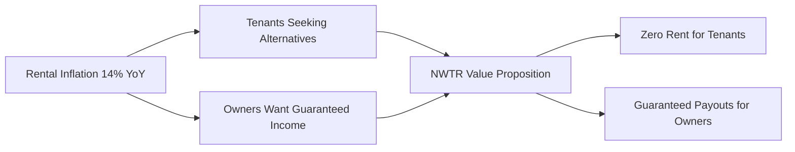
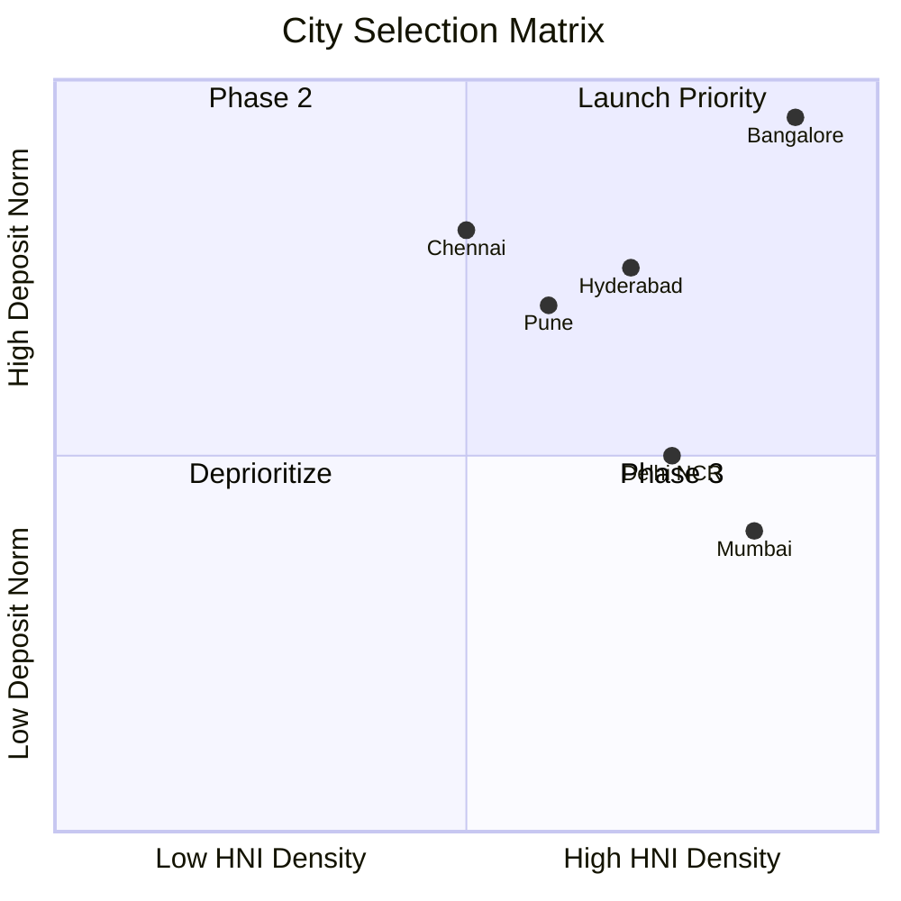
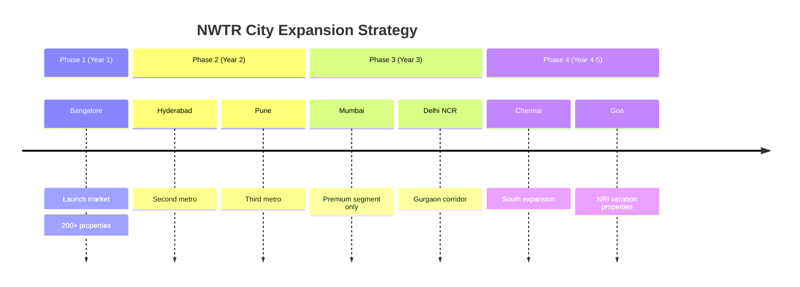
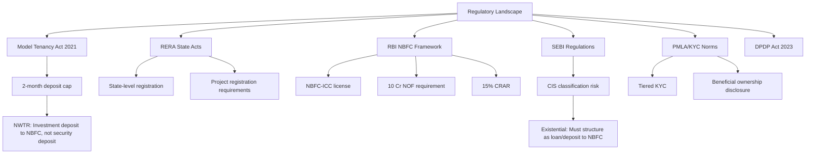
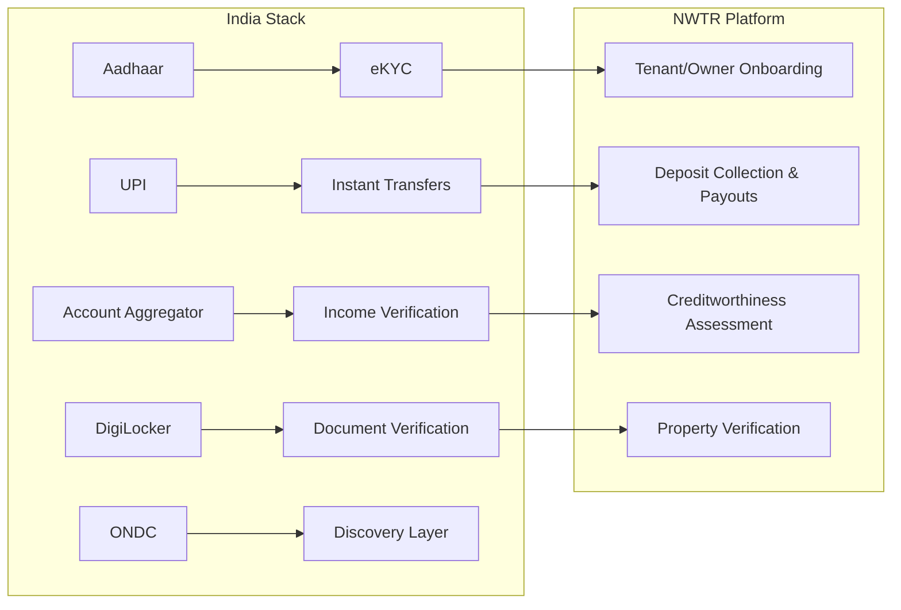
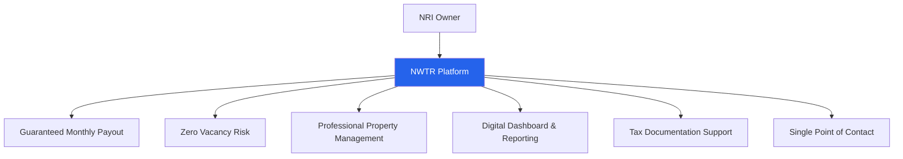
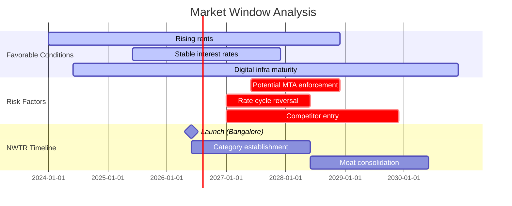

# India Market Fit Analysis

## TL;DR

India presents a uniquely favorable market for NWTR's deposit-based zero-rent model due to a cultural norm of large security deposits (10-24 months' rent), rapidly rising rental costs (14% YoY), a mature digital financial infrastructure (UPI, eKYC, Account Aggregator), and a growing HNI population with significant idle capital. Bangalore is the optimal launch city with the highest traditional deposit norms, densest tech-HNI population, and strongest rental yields (4.45%) among Indian metros. The NRI corridor (18-20% of property transactions) provides an additional high-value acquisition channel. Market timing is favorable: post-pandemic rental surge, RBI rate stabilization, and NBFC regulatory maturity create a 2-3 year window for category creation.

---

## 1. Why India Specifically

### 1.1 Cultural Deposit Norms

India is one of the few global markets where tenants routinely pay 10-24 months' rent as security deposit upfront. This cultural norm—unique to India, parts of the Middle East, and select Asian markets—makes NWTR's model intuitively understandable to the target audience.

| Market | Typical Security Deposit | Cultural Context |
|--------|-------------------------|------------------|
| India (Bangalore) | 10-12 months' rent | Deeply entrenched norm, especially in South India |
| India (Mumbai) | 3-6 months' rent | Lower deposits but higher absolute values |
| UK | 5-6 weeks' rent | Government-capped, deposit protection schemes |
| US | 1-2 months' rent | State-regulated maximums |
| Germany | 3 months' cold rent | Deposited in savings account by law |
| Middle East | 1-4 cheques annually | Post-dated cheque culture |

**Key insight**: Indian tenants are already conditioned to lock up large capital sums for housing. NWTR doesn't require a behavioral shift—it amplifies existing behavior with a better financial outcome.

### 1.2 Rising Rental Costs

- National rental index grew 14% YoY (2024-2025)
- Bangalore residential rents up 18-22% in premium localities (Whitefield, Koramangala, Indiranagar)
- Supply-demand mismatch in metros: 30% shortfall in quality rental housing
- Work-from-office mandates driving renewed urban migration

### 1.3 Digital Adoption Tailwinds

India's digital financial infrastructure is among the most advanced globally, enabling NWTR to operate with minimal friction:

| Infrastructure | Penetration | NWTR Application |
|---------------|-------------|------------------|
| UPI | 300M+ active users | Instant deposit transfers, payout disbursement |
| Aadhaar eKYC | 1.4B enrollments | Instant identity verification, CKYC compliance |
| Account Aggregator | 1.1B consented accounts | Income verification, creditworthiness assessment |
| DigiLocker | 150M+ users | Document verification (property papers, identity) |
| ONDC | Emerging | Future distribution channel |

### 1.4 Financial Market Maturity

- NBFC regulatory framework is well-established (RBI oversight since 1964, modernized 2014-2023)
- Fixed deposit infrastructure offers 6.25-7.5% guaranteed returns
- Government securities market (G-Sec) accessible to NBFCs at 7.1%
- Corporate AAA bond market provides 7.5-8% yields
- Interest rate environment stabilizing after 2023-2024 tightening cycle

---

## 2. Bangalore as Ideal Launch Market

### 2.1 Why Bangalore First

### 2.2 Bangalore Market Characteristics

| Metric | Value | Implication |
|--------|-------|-------------|
| Average security deposit | 10-12 months' rent | Highest in India; aligns perfectly with NWTR model |
| Average premium rent | ₹40,000-₹1,50,000/month | Deposit pool of ₹5L-₹18L per property |
| Rental yield | 4.45% | Owners motivated by higher returns via NWTR |
| Tech employee concentration | 25L+ IT professionals | Target tenant demographic |
| Startup ecosystem | 3rd largest in Asia | Founder/HNI persona density |
| NRI connection | 30%+ of premium properties NRI-owned | Dual-channel acquisition |
| RERA compliance | Karnataka RERA operational since 2017 | Regulatory clarity |

### 2.3 Bangalore Micro-Market Analysis

| Locality | Avg. Rent (3BHK) | Traditional Deposit | NWTR Deposit (70%) | Target Segment |
|----------|-------------------|--------------------|--------------------|----------------|
| Koramangala | ₹80,000-₹1,20,000 | 10 months | ₹56L-₹84L | Tech executives |
| Indiranagar | ₹70,000-₹1,50,000 | 10 months | ₹49L-₹1.05Cr | Senior professionals |
| Whitefield | ₹40,000-₹80,000 | 10 months | ₹28L-₹56L | IT professionals |
| HSR Layout | ₹50,000-₹1,00,000 | 10 months | ₹35L-₹70L | Startup founders |
| Jayanagar | ₹35,000-₹70,000 | 10 months | ₹24.5L-₹49L | DINK couples |
| Sadashivanagar | ₹1,00,000-₹3,00,000 | 10-12 months | ₹70L-₹2.1Cr | Ultra-HNI |

---

## 3. City-by-City Expansion Analysis

### 3.1 Expansion Roadmap

### 3.2 City Comparison Matrix

| Parameter | Bangalore | Hyderabad | Pune | Mumbai | Delhi NCR |
|-----------|-----------|-----------|------|--------|-----------|
| **Deposit norm** | 10-12 months | 6-10 months | 6-10 months | 3-6 months | 3-6 months |
| **Avg. premium rent** | ₹60K-₹1.5L | ₹40K-₹1L | ₹35K-₹80K | ₹80K-₹3L | ₹50K-₹2L |
| **Rental yield** | 4.45% | 3.8-4.2% | 3.5-4.0% | 3.15-4.15% | 2.8-3.5% |
| **HNI density** | Very High | High | High | Very High | Very High |
| **NRI ownership** | 30%+ | 20-25% | 15-20% | 25-30% | 20-25% |
| **Regulatory clarity** | High | High | Medium | High | Medium |
| **NWTR fit score** | 9.5/10 | 8.0/10 | 7.5/10 | 7.0/10 | 6.5/10 |
| **Launch priority** | 1 | 2 | 3 | 4 | 5 |

### 3.3 Hyderabad (Phase 2 Priority)

- Growing tech corridor (HITEC City, Gachibowli, Financial District)
- Deposit norms closer to Bangalore (6-10 months)
- Lower property values = lower entry barrier for tenants
- Telangana RERA operational and proactive
- Amazon, Google, Microsoft mega-campuses driving demand

### 3.4 Pune (Phase 2)

- Strong IT/ITES presence (Hinjewadi, Kharadi, Magarpatta)
- Young professional demographic aligns with DINK persona
- Growing startup ecosystem
- Proximity to Mumbai enables dual-city operations

### 3.5 Mumbai (Phase 3)

- Highest absolute property values (1BHK in Bandra: ₹3-5Cr)
- Lower deposit norms (3-6 months) require model adaptation
- Ultra-premium segment viable (₹1Cr+ deposits for luxury properties)
- Leave-and-license regime vs. rental agreement nuances
- Highest concentration of financial services professionals

### 3.6 Delhi NCR (Phase 3)

- Focus on Gurgaon (Golf Course Road, DLF Phase 5)
- Mixed regulatory environment across state borders
- Strong NRI corridor (US/Canada diaspora)
- Higher tenant default risk historically

---

## 4. Regulatory Environment

### 4.1 Key Regulatory Frameworks

### 4.2 Model Tenancy Act (MTA) 2021

The MTA caps security deposits at 2 months' rent for residential properties. NWTR's structural defense:

1. **Not a security deposit**: NWTR's deposit is an "investment deposit" placed with a licensed NBFC
2. **Third-party custody**: Funds go to NBFC partner, not landlord or NWTR
3. **Investment purpose**: Structured as a term deposit yielding returns, not idle security
4. **Voluntary opt-in**: Tenant chooses to invest this amount (above 2-month legal minimum)
5. **Refundable with returns**: Principal guaranteed, unlike traditional deposits

### 4.3 RERA Compliance

| State | RERA Status | Key Provisions | NWTR Impact |
|-------|-------------|----------------|-------------|
| Karnataka | Active, proactive | Agent registration, project registration | Must register as facilitator |
| Telangana | Active | Standard provisions | Low complexity |
| Maharashtra | Active, strict | Carpet area mandates, escrow requirements | Higher compliance cost |
| Delhi | Active, inconsistent enforcement | NCT-specific rules | Moderate complexity |
| Haryana | Active | Gurgaon-specific provisions | Adjacent to Delhi ops |

### 4.4 NBFC Infrastructure

India's NBFC ecosystem provides the foundational rails for NWTR:

- 9,500+ registered NBFCs (as of 2025)
- Clear regulatory framework under RBI
- NBFC-ICC (Investment and Credit Company) license fits NWTR's model
- Scale-based regulation (Base Layer → Middle Layer → Upper Layer → Top Layer)
- Digital lending guidelines (2022) provide clarity on platform models

---

## 5. Cultural Factors

### 5.1 Indians' Relationship with Property

Property ownership is culturally sacrosanct in India:

- **Emotional**: Property = security, status, family legacy
- **Financial**: 77% of household wealth in real estate (vs. 35% in US)
- **Aspirational**: Homeownership viewed as life milestone
- **Generational**: Properties passed down; family disputes common
- **Investment**: Real estate is default "safe" investment for middle class

**NWTR insight**: Owners are emotionally attached but financially frustrated (low yields, tenant issues, maintenance). NWTR separates the emotional ownership from operational burden.

### 5.2 Gold vs. Real Estate Paradigm

| Parameter | Gold | Real Estate | NWTR Model |
|-----------|------|-------------|------------|
| Liquidity | High | Low | Medium (1-year lock-in) |
| Returns | 8-12% (volatile) | 3-5% rental + appreciation | 7-8% (predictable) |
| Emotional value | High (cultural) | Very High | Ties to real estate |
| Minimum investment | ₹5,000 | ₹50L+ | ₹25L+ (deposits) |
| Active management | None | High | None (NWTR manages) |
| Taxation | LTCG after 2 years | Complex (multiple heads) | Interest income |

### 5.3 Trust Dynamics in Indian Financial Services

Indian HNIs require:
1. **Brand familiarity** — Association with known entities (banks, corporates)
2. **Regulatory backing** — "RBI-regulated" carries enormous trust signal
3. **Personal relationships** — Relationship manager model is essential
4. **Track record** — Minimum 2-3 years before mainstream HNI adoption
5. **Peer validation** — "My CA recommended it" or "XYZ uncle uses it"
6. **Physical presence** — Office in premium location signals legitimacy

---

## 6. Digital Readiness

### 6.1 India Stack for NWTR

### 6.2 Digital Infrastructure Maturity

| Layer | Technology | Maturity | NWTR Leverage |
|-------|-----------|----------|---------------|
| Identity | Aadhaar + PAN | Production-grade | Video KYC, CKYC |
| Payments | UPI 2.0, IMPS, NEFT | Production-grade | Instant deposit movement |
| Data | Account Aggregator | Growing (50M+ consents) | Income proof, bank statements |
| Documents | DigiLocker, CERSAI | Production-grade | Property ownership, liens |
| Credit | Bureau (CIBIL, Experian) | Production-grade | Default risk scoring |
| Contracts | eSign (Aadhaar-based) | Production-grade | Digital agreement execution |

### 6.3 UPI Adoption & Implications

- 14B+ transactions/month (2025)
- ₹20L+ Cr monthly transaction value
- Mandate API enables recurring collections
- UPI Autopay for owner payouts (scheduled disbursement)
- Real-time settlement reduces float management complexity

---

## 7. NRI Opportunity

### 7.1 NRI Market Size

| Parameter | Value |
|-----------|-------|
| Indian diaspora population | 32M+ |
| Annual remittances to India | $125B+ (2025) |
| NRI share in property transactions | 18-20% |
| NRI property investment annually | $15-20B |
| Preferred cities | Bangalore (35%), Mumbai (25%), Hyderabad (15%) |
| Primary corridors | US (35%), UAE/Gulf (30%), UK (15%), Singapore (10%) |

### 7.2 NRI Pain Points (Owner Persona)

1. **Distance management**: Cannot personally oversee property
2. **Tenant disputes**: Resolution requires physical presence
3. **Rental yield**: Low returns (3-4%) on high-value assets
4. **Vacancy risk**: Properties lie empty for months between tenants
5. **Maintenance**: No reliable party to maintain property
6. **Repatriation**: Complex tax implications on rental income
7. **Trust deficit**: Reliance on local agents with misaligned incentives

### 7.3 NRI Value Proposition

### 7.4 NRI Acquisition Strategy

| Channel | Cost | Conversion | Timeline |
|---------|------|-----------|----------|
| NRI WhatsApp communities | Low | Medium (trust-based) | 3-6 months |
| Bangalore property exhibitions (US/Dubai) | High | High | 1-3 months |
| NRI wealth managers / CAs | Medium | Very High | 1-2 months |
| LinkedIn (tech professionals) | Medium | Low | 6-12 months |
| Indian embassy community events | Low | Low | 6-12 months |
| NRI-focused media (TheBetterIndia, YourStory) | Medium | Medium | 3-6 months |

---

## 8. Market Timing Indicators

### 8.1 Why Now (2026)

| Signal | Status | Implication |
|--------|--------|-------------|
| Post-pandemic rental surge | Rents up 35-50% since 2021 | Tenants desperate for alternatives |
| RBI rate stabilization | Repo at 6.0-6.5% | Predictable yield environment |
| NBFC digital lending guidelines | Mature (2022+) | Clear regulatory path |
| Account Aggregator maturity | 50M+ consents | Seamless income verification |
| GenZ entering workforce | 2024-2026 cohort | Digital-native, subscription-minded |
| Work-from-office mandates | Accelerating 2025-2026 | Urban rental demand spike |
| Real estate price plateau | 2024-2025 cooling | Owners open to yield alternatives |
| VC interest in proptech | Reviving post-2023 correction | Funding environment favorable |

### 8.2 Window of Opportunity

### 8.3 First-Mover Advantage Components

1. **NBFC license moat**: 12-18 month head start on regulatory approval
2. **Trust accumulation**: Early track record compounds credibility
3. **Network effects**: Owner and tenant liquidity in same market
4. **Data advantage**: Property valuation, tenant behavior, yield optimization
5. **Brand positioning**: "NWTR = zero-rent living" before competitors can define the category

---

## 9. Key Assumptions & Validation Needed

| Assumption | Confidence | Validation Method |
|-----------|------------|-------------------|
| HNIs will deposit 70-80% of property value | Medium | Pilot with 50 properties |
| NBFC structure avoids CIS classification | High | Legal opinion + SEBI informal guidance |
| 7-8% blended yield is sustainable | High | Historical data, diversified portfolio |
| Bangalore deposits remain at 10-month norm | High | Market data, no regulatory change signals |
| Digital onboarding sufficient for HNIs | Medium | Hybrid model with RM support |
| NRIs will trust Indian proptech platform | Medium | Partnership with NRI-trusted brands |

---

## Cross-References

- [Risk Analysis](./risk-analysis.md) — Detailed regulatory and financial risk assessment
- [HNI Persona Analysis](./hni-persona-analysis.md) — Target customer deep-dive
- [Revenue Model](./revenue-model.md) — Financial projections and unit economics
- [Trust & Compliance Strategy](./trust-compliance-strategy.md) — Regulatory structure and trust architecture
- [Competitor Analysis](./competitor-analysis.md) — Competitive landscape and positioning
