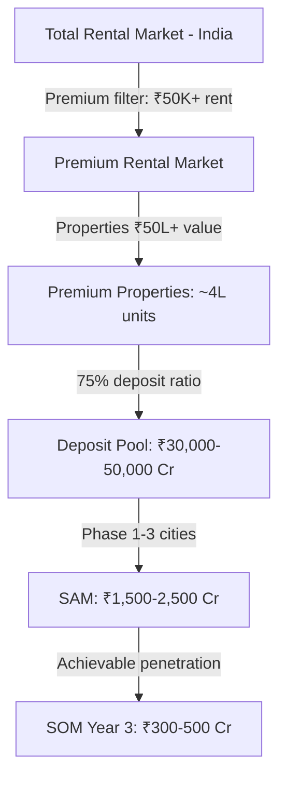
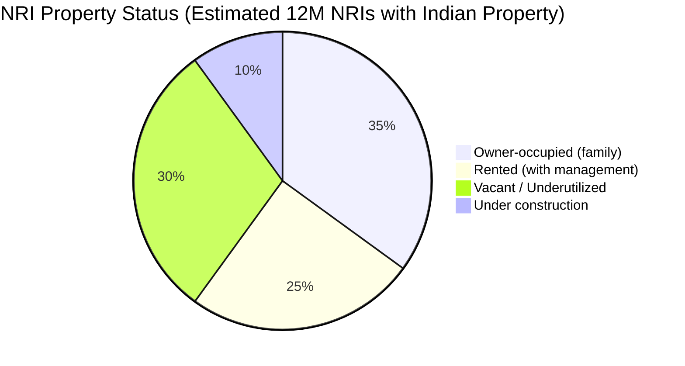
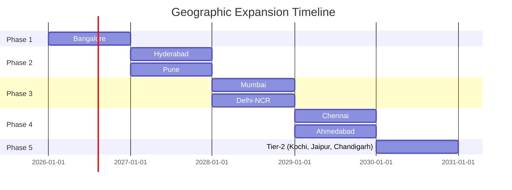

# NWTR — Market Opportunity

---
title: Market Opportunity & Sizing
version: 1.0
audience: Investors, Strategy Team, Board
last-updated: 2026-05-21
status: draft
related-docs:
  - "./executive-summary.md"
  - "./india-market-fit.md"
  - "./hni-persona-analysis.md"
  - "./competitor-analysis.md"
---

## TL;DR

India's residential rental market is USD 2.8B (2025), growing at 4.2-7.4% CAGR. The premium segment (₹50K+ rent/month) represents ~₹42,000 Cr annually. NWTR targets the security deposit pool within this segment — estimated at ₹30,000-50,000 Cr across India's top 8 metros. With HNI households growing 6,000+/year, NRI investment at USD 13.1B, and rental inflation at 14% YoY, the market timing is optimal. NWTR's serviceable opportunity in Year 5 is ₹3,000 Cr AUM across 4 cities.

---

## Total Addressable Market Calculation

### Methodology

NWTR's TAM is calculated as the **total security deposit pool** in premium residential rentals across India's top metros — not the rental revenue pool.

### TAM Build-Up

| Parameter | Value | Source |
|-----------|-------|--------|
| Total rental households in India | ~2.1 Cr (21M) | Census 2011 + NHB extrapolation |
| Urban rental households | ~1.2 Cr (12M) | NSSO Housing Survey |
| Premium segment (₹50K+ rent/month) | ~6-8 lakh (600K-800K) | PropEquity, IIFL Real Estate |
| Average property value (premium) | ₹75L-1.5 Cr | JLL India Residential Report |
| Target deposit ratio | 70-80% of property value | NWTR model requirement |
| Average deposit per property | ₹75L | Base case assumption |
| **Total Deposit Pool (TAM)** | **₹30,000-50,000 Cr** | Bottom-up calculation |

### TAM Validation (Top-Down)

| Approach | Estimate | Methodology |
|----------|----------|-------------|
| Deposit pool approach | ₹30,000-50,000 Cr | 6L premium units × ₹75L avg. deposit |
| Revenue addressable | ₹600-1,000 Cr/year | TAM × 2% average spread |
| Comparable market proxy | ₹40,000 Cr | NoBroker's implied TAM × premium multiplier |
| Property value approach | ₹45,000 Cr | ₹6L Cr premium property value × 7.5% deposit |

---

## Indian Residential Rental Market

### Market Size and Growth

| Metric | 2023 | 2024 | 2025 | 2030 (Projected) |
|--------|------|------|------|-------------------|
| Market size (USD B) | 2.4 | 2.6 | 2.8 | 4.0-5.2 |
| Market size (₹ Cr) | 20,000 | 21,700 | 23,400 | 33,500-43,500 |
| YoY growth | 5.8% | 8.3% | 7.7% | 4.2-7.4% CAGR |
| Rental inflation (metros) | 11% | 14% | 12% (est.) | 8-10% (normalized) |

### Rental Market Segmentation

| Segment | Monthly Rent | % of Market | Property Value | NWTR Relevance |
|---------|-------------|-------------|----------------|----------------|
| Budget | <₹15K | 45% | <₹25L | Not applicable |
| Mid-market | ₹15K-₹50K | 35% | ₹25L-₹75L | Future (deposit financing) |
| Premium | ₹50K-₹1.5L | 15% | ₹75L-₹2 Cr | Primary target |
| Ultra-premium | >₹1.5L | 5% | >₹2 Cr | Secondary target |

### Key Market Dynamics

1. **Supply-demand imbalance:** Vacancy rates in premium segments below 5% in BLR, HYD, PUN
2. **Rent escalation:** Premium rents rising 12-16% YoY (vs. 6-8% historically)
3. **Ownership affordability gap:** Premium property prices growing faster than incomes
4. **Tenancy duration extending:** Average premium tenancy now 2.5-3 years (up from 1.5-2 years)
5. **Formalization trend:** Organized rental growing at 15% vs. 5% for unorganized

---

## HNI Renter Population

### Definition

For NWTR purposes, an HNI renter is defined as:
- Annual household income >₹50L, OR
- Net worth >₹5 Cr, OR
- Currently paying >₹50K/month rent, OR
- NRI with Indian property or relocation intent

### Metro-Wise HNI Renter Estimates

| Metro | HNI Households | Estimated HNI Renters | Avg. Premium Rent | Avg. Property Value | NWTR Priority |
|-------|---------------|----------------------|-------------------|--------------------|----|
| **Bangalore** | 3.2L | 85,000 | ₹65,000 | ₹1.1 Cr | Phase 1 |
| **Mumbai** | 5.8L | 1,20,000 | ₹1,20,000 | ₹2.5 Cr | Phase 3 |
| **Hyderabad** | 2.4L | 60,000 | ₹55,000 | ₹90L | Phase 2 |
| **Delhi-NCR** | 4.5L | 95,000 | ₹80,000 | ₹1.5 Cr | Phase 3 |
| **Pune** | 1.8L | 48,000 | ₹50,000 | ₹80L | Phase 2 |
| **Chennai** | 1.6L | 38,000 | ₹45,000 | ₹75L | Phase 4 |
| **Ahmedabad** | 1.2L | 25,000 | ₹40,000 | ₹65L | Phase 4 |
| **Kolkata** | 1.0L | 18,000 | ₹35,000 | ₹55L | Phase 5 |
| **Total** | 21.5L | ~4,89,000 | — | — | — |

*Sources: Knight Frank India Wealth Report 2025, PropEquity, RBI Household Finance Committee*

### Why Bangalore First

| Factor | Bangalore | Mumbai | Delhi |
|--------|-----------|--------|-------|
| Rent-to-property-value ratio | 3.5-4.5% | 2.5-3.5% | 3-4% |
| Tech industry concentration | Highest | High | Medium |
| HNI renter density | Very High | Highest | High |
| Average property value | ₹1.1 Cr | ₹2.5 Cr | ₹1.5 Cr |
| NWTR deposit feasibility | Optimal (₹77-88L) | Stretched (₹1.75-2 Cr) | Moderate (₹1.05-1.2 Cr) |
| NRI population | Very High (US tech returnees) | High (finance/consulting) | Medium |
| Rental market formalization | Advanced | Advanced | Developing |
| Regulatory friendliness | Pro-startup | Complex | Bureaucratic |

**Bangalore wins on:** Deposit feasibility (affordable enough for HNIs to commit ₹75L-1 Cr), tech-sector density (professionals who understand financial products), NRI return flow, and regulatory environment.

---

## NRI Investment Flows

### Market Size

| Metric | Value | Source |
|--------|-------|--------|
| NRI real estate investment (2024) | USD 13.1B | CBRE India |
| NRI share of luxury residential | 25-30% | Knight Frank |
| NRIs owning Indian property | ~12M | MEA + industry estimates |
| NRI property lying vacant | ~40% | Industry surveys |
| Average NRI property value | ₹1.2-2 Cr | JLL India |

### NRI Opportunity for NWTR

**NWTR value for NRIs:**
- 30% of NRI properties are vacant or underutilized = ~3.6M properties
- Average value: ₹1.2 Cr → potential deposit pool: ₹3,24,000 Cr (massive)
- NRIs face acute management challenges: distance, trust, tenant quality
- NWTR solves all three: guaranteed income, zero management, premium tenants

### NRI-Specific TAM

| Segment | Properties | Deposit Pool | NWTR Addressable |
|---------|-----------|-------------|------------------|
| NRI vacant premium properties | ~2L (in target metros) | ₹24,000 Cr | ₹2,400 Cr (10% penetration in 5 years) |
| NRI underperforming rentals | ~3L | ₹36,000 Cr | ₹3,600 Cr |
| **Total NRI Addressable** | **~5L** | **₹60,000 Cr** | **₹6,000 Cr** |

---

## Rental Yield Comparison Across Indian Metros

### Current Rental Yields

| City | Avg. Rental Yield | Premium Segment Yield | NWTR Implied Yield (at 75% deposit) | Owner Improvement |
|------|-------------------|----------------------|--------------------------------------|-------------------|
| Mumbai | 2.5-3.0% | 2.0-2.8% | 5.6% (on deposit) | +2.8-3.6% |
| Delhi-NCR | 2.8-3.5% | 2.5-3.2% | 5.6% | +2.4-3.1% |
| Bangalore | 3.5-4.5% | 3.0-4.0% | 5.6% | +1.6-2.6% |
| Hyderabad | 3.5-4.2% | 3.2-3.8% | 5.6% | +1.8-2.4% |
| Pune | 3.0-4.0% | 2.8-3.5% | 5.6% | +2.1-2.8% |
| Chennai | 3.2-4.0% | 3.0-3.5% | 5.6% | +2.1-2.6% |

### Yield Arbitrage Analysis

NWTR works because **investment yield (7.5%) > rental yield (3-4.5%)**. This spread exists because:

1. **Rental yields are compressed** — property prices have risen faster than rents
2. **Investment yields are elevated** — RBI rate cycle and corporate bond spreads favor fixed income
3. **Deposits are larger than 10-month deposits** — 75% of property value (vs. traditional 2-10 months' rent)
4. **Institutional access** — NBFC can access higher-yield instruments than retail depositors

### When Does the Model Break?

| Scenario | Probability (5-year) | Impact | Mitigation |
|----------|---------------------|--------|------------|
| Rental yields rise to 7%+ | Very Low (<5%) | Model unnecessary | Pivot to value-add services |
| Investment yields drop to 5% | Low (15%) | Margin compression | Adjust deposit ratio, owner payout |
| Investment yields drop to 4% | Very Low (5%) | Model unviable | Wind down, return deposits |
| Rental yields = Investment yields | Near Zero | Model irrelevant | Market wouldn't reach this equilibrium |

---

## Security Deposit Pool Estimation

### Current State of Security Deposits in India

| Parameter | Estimate | Source |
|-----------|----------|--------|
| Total security deposits held (all rentals) | ₹3-5 lakh Cr | NSSO + industry extrapolation |
| Premium segment deposits (current 2-10 month model) | ₹40,000-60,000 Cr | PropEquity |
| Deposits earning zero return | ~95% | Industry standard (no formalized deposit investment) |
| Average premium deposit (current) | ₹5-10L | Industry standard |
| NWTR model deposit (proposed) | ₹70-80L | 75% of property value |

### Deposit Pool Under NWTR Model

If NWTR converts 1% of premium rentals to the deposit-based model:

| Penetration | Properties | Total Deposits | Annual Yield Generated | Annual Owner Payouts |
|-------------|-----------|----------------|------------------------|---------------------|
| 0.1% (Year 1) | 600 | ₹450 Cr | ₹33.75 Cr | ₹25.2 Cr |
| 0.5% (Year 3) | 3,000 | ₹2,250 Cr | ₹168.75 Cr | ₹126 Cr |
| 1.0% (Year 5) | 6,000 | ₹4,500 Cr | ₹337.5 Cr | ₹252 Cr |
| 2.0% (Year 7) | 12,000 | ₹9,000 Cr | ₹675 Cr | ₹504 Cr |

---

## Market Timing Analysis — Why 2026

### Macro Convergence

```mermaid
graph TD
    subgraph Demand Drivers
        D1[14% YoY rent inflation]
        D2[HNI growth: 6000+/year]
        D3[Remote work flexibility]
        D4[Ownership unaffordability]
    end

    subgraph Supply Enablers
        S1[NBFC digital infrastructure]
        S2[Account Aggregator framework]
        S3[UPI/NACH maturity at scale]
        S4[Regulatory clarity on LSP model]
    end

    subgraph Market Readiness
        M1[NoBroker proved digital rentals work]
        M2[CRED proved premium fintech appetite]
        M3[Zerodha proved Indian yield-seeking behavior]
        M4[Subscription economy normalized large upfronts]
    end

    D1 --> T[2026: Optimal Window]
    D2 --> T
    D3 --> T
    D4 --> T
    S1 --> T
    S2 --> T
    S3 --> T
    S4 --> T
    M1 --> T
    M2 --> T
    M3 --> T
    M4 --> T
```

### Why Not Earlier (2020-2024)

| Barrier | Status in 2020-2024 | Status in 2026 |
|---------|---------------------|----------------|
| NBFC digital APIs | Limited, manual processes | API-first, real-time deployment |
| Account Aggregator | Nascent, low adoption | Mature, 1.5B+ data pulls |
| UPI/NACH reliability | Growing but inconsistent | 99.7% success rate, ubiquitous |
| Rent inflation severity | Moderate (5-8% YoY) | Severe (12-16% YoY) — demand catalyst |
| HNI digital comfort | Moderate | High (post-COVID digital transformation) |
| Regulatory precedent | No LSP framework clarity | RBI Digital Lending Guidelines (2022) provide framework |
| Market education | "What is deposit-based living?" | NoBroker + CRED trained users on alternative financial models |

### Why Not Later (2028+)

- **First-mover advantage window is now** — once proven, model is replicable in 12-18 months
- **Regulatory moat building takes time** — early entrant shapes the framework
- **Interest rates may decline** — current elevated rates (6.25% repo) maximize the yield spread
- **Competition from banks/NBFCs** — they'll build this themselves once market is validated
- **NoBroker/housing platforms** — could add financial products to existing user base

### Market Timing Score

| Factor | Signal Strength | Direction |
|--------|----------------|-----------|
| Rent affordability crisis | 🔴 Strong negative (for tenants) | Drives demand |
| Interest rate environment | 🟢 Favorable | Supports yield model |
| Digital infrastructure | 🟢 Ready | Enables automation |
| Regulatory clarity | 🟡 Developing | Manageable with LSP |
| Consumer behavior | 🟢 Shifted post-COVID | Large upfronts accepted |
| Competitive vacancy | 🟢 No direct competitor | First-mover opportunity |
| Capital availability | 🟡 Cautious but deploying | Fintech still funded |

---

## Growth Vectors

### Vector 1: Geographic Expansion

| Phase | Cities | Cumulative Properties | Cumulative AUM |
|-------|--------|----------------------|----------------|
| 1 (2026-27) | Bangalore | 200 | ₹150 Cr |
| 2 (2027-28) | + Hyderabad, Pune | 800 | ₹600 Cr |
| 3 (2028-29) | + Mumbai, Delhi | 2,500 | ₹2,000 Cr |
| 4 (2029-30) | + Chennai, Ahmedabad | 5,000 | ₹4,000 Cr |
| 5 (2030-31) | + Tier-2 cities | 8,000 | ₹6,000 Cr |

### Vector 2: Product Expansion

| Product | Target Year | Revenue Impact | TAM Addition |
|---------|------------|----------------|--------------|
| Deposit financing (loan for deposit) | Year 3 | 15% revenue uplift | ₹5,000 Cr |
| Commercial properties | Year 4 | 25% revenue uplift | ₹10,000 Cr |
| NRI property management | Year 3 | 10% revenue uplift | ₹6,000 Cr |
| Premium co-living | Year 4 | 8% revenue uplift | ₹2,000 Cr |
| Insurance products | Year 3 | 5% revenue uplift | Margin enhancement |
| Interior/maintenance marketplace | Year 2 | 3% revenue uplift | Service revenue |

### Vector 3: Tenant Base Expansion

| Segment | Current Requirement | Expansion Path | TAM Impact |
|---------|--------------------|--------------------|------------|
| HNI (₹50L+ income) | Primary target | Core segment, maintain | Baseline |
| Upper-mid (₹25-50L income) | Not targeted | Deposit financing enables participation | +60% TAM |
| NRI (returnees) | Secondary target | Dedicated NRI product | +30% TAM |
| Corporates (employee housing) | Not targeted | B2B bulk deposits for CXOs | +20% TAM |
| Family offices | Not targeted | Multi-property bulk deals | +15% TAM |

### Vector 4: Revenue Model Expansion

**Year 1-2: Pure Spread**
- Yield spread: 85% of revenue
- Platform fees: 15%

**Year 3-4: Financial Services**
- Yield spread: 60%
- Platform fees: 10%
- Insurance commissions: 8%
- Deposit financing referrals: 12%
- Maintenance/services: 10%

**Year 5+: Ecosystem**
- Yield spread: 45%
- Platform fees: 8%
- Financial products (insurance, credit): 20%
- B2B corporate: 12%
- Services marketplace: 10%
- Data/intelligence: 5%

---

## Market Share Capture Model

### Assumptions

| Parameter | Conservative | Base | Aggressive |
|-----------|-------------|------|-----------|
| Addressable premium rental units (metros) | 4,00,000 | 6,00,000 | 8,00,000 |
| NWTR conversion rate Year 5 | 0.5% | 0.7% | 1.0% |
| Properties Year 5 | 2,000 | 4,000 | 8,000 |
| Average deposit | ₹70L | ₹75L | ₹80L |
| AUM Year 5 | ₹1,400 Cr | ₹3,000 Cr | ₹6,400 Cr |
| Revenue Year 5 | ₹28 Cr | ₹67 Cr | ₹145 Cr |

### Market Share Progression

| Year | Properties | Market Share (of premium rentals) | AUM |
|------|-----------|-----------------------------------|-----|
| Year 1 | 50 | 0.008% | ₹37.5 Cr |
| Year 2 | 200 | 0.033% | ₹150 Cr |
| Year 3 | 600 | 0.1% | ₹450 Cr |
| Year 4 | 1,500 | 0.25% | ₹1,125 Cr |
| Year 5 | 4,000 | 0.67% | ₹3,000 Cr |
| Year 7 | 12,000 | 2.0% | ₹9,000 Cr |
| Year 10 | 30,000 | 5.0% | ₹22,500 Cr |

### Why 5% Market Share is Achievable (10-Year)

1. **Category creation advantage** — first mover defines the standard
2. **Network effects** — more properties attract more tenants, which attract more owners
3. **Switching costs** — once in the NWTR ecosystem, financial relationships are sticky
4. **Regulatory moat** — compliance complexity limits competitors
5. **Brand trust accumulation** — years of zero-missed-payouts builds institutional trust
6. **AUM advantage** — larger pools access higher-yield instruments (compounding advantage)

---

## Comparable Market Analysis

### Global Proptech Valuations

| Company | Country | Model | Valuation | Revenue Multiple | Relevance to NWTR |
|---------|---------|-------|-----------|-----------------|-------------------|
| NoBroker | India | Brokerage-free marketplace | $1.1B | ~40x ARR | Same market, different model |
| Lemonade | US | Insurtech (deposit analogy) | $1.4B | ~8x ARR | Financial product in property |
| Roofstock | US | SFR investment platform | $1.9B | ~25x AUM | Property investment via platform |
| Fundrise | US | Real estate crowdfunding | $1.7B | ~15x AUM | AUM-based proptech valuation |
| Housing.com | India | Listing portal | $400M | ~20x ARR | Indian proptech benchmark |

### Indian Fintech Valuations (AUM-Based)

| Company | AUM | Valuation | Val/AUM Ratio | Implied NWTR Val (₹3,000 Cr AUM) |
|---------|-----|-----------|---------------|-----------------------------------|
| Zerodha | ₹4.5L Cr | ₹30,000 Cr | 0.067x | ₹200 Cr |
| Groww | ₹1.2L Cr | ₹18,000 Cr | 0.15x | ₹450 Cr |
| MF Utilities | ₹35L Cr | ₹5,000 Cr | 0.014x | ₹42 Cr |
| **Average (relevant)** | — | — | **0.05-0.15x** | **₹150-450 Cr** |

### Implied NWTR Valuation Range (Year 5)

| Method | Implied Valuation | Rationale |
|--------|-------------------|-----------|
| Revenue multiple (30x ARR) | ₹2,010 Cr | High-growth fintech with AUM moat |
| AUM multiple (0.1x) | ₹300 Cr | Conservative AUM-based |
| Comparable (NoBroker at similar stage) | ₹500-1,000 Cr | Indian proptech precedent |
| **Realistic range** | **₹500-2,000 Cr** | Depends on growth rate + margins |

---

## Risk-Adjusted Market Size

### Bear Case (₹1,400 Cr AUM by Year 5)

- Only Bangalore + Hyderabad operational
- Deposit ratio at 70% (lower than optimal)
- Interest rates decline 100 bps
- Regulatory uncertainty limits expansion
- 2,000 properties

### Base Case (₹3,000 Cr AUM by Year 5)

- 4 cities operational (BLR, HYD, PUN, MUM)
- 75% deposit ratio maintained
- Rates stable or modestly declining (50 bps)
- Clear regulatory path
- 4,000 properties

### Bull Case (₹6,400 Cr AUM by Year 5)

- 5+ cities operational
- 80% deposit ratio in premium segment
- Rates stable, strong bond market
- Own NBFC license by Year 4
- Deposit financing extends to upper-middle
- 8,000 properties

---

## Key Takeaways for Investors

1. **₹30,000-50,000 Cr TAM** in premium rental deposits — largely untapped
2. **Category creation** — no direct competitor globally, first-mover advantage significant
3. **Market timing optimal** — rent inflation acute, digital infrastructure ready, rates favorable
4. **Capital-efficient growth** — AUM-driven model with minimal inventory/capex
5. **Multiple expansion vectors** — geographic, product, segment, revenue model
6. **Defensible at scale** — regulatory moat + AUM advantage + brand trust compound over time
7. **Clear path to ₹3,000 Cr AUM** in 5 years with <1% market penetration
8. **Valuation upside** — comparable to NoBroker's trajectory but with stronger unit economics

---

## Document Cross-References

- [Executive Summary](./executive-summary.md) — Elevator pitches and investment thesis
- [Business Model](./business-model.md) — Unit economics and fund flow details
- [Product Vision](./product-vision.md) — Platform that captures this market
- [Brand Positioning](./brand-positioning.md) — Premium positioning for HNI audiences

---

*NWTR — Capturing India's ₹30,000 Cr premium deposit opportunity.*
