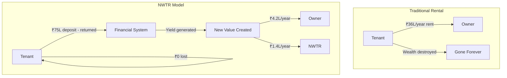
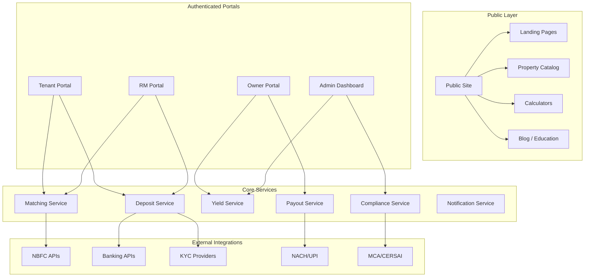
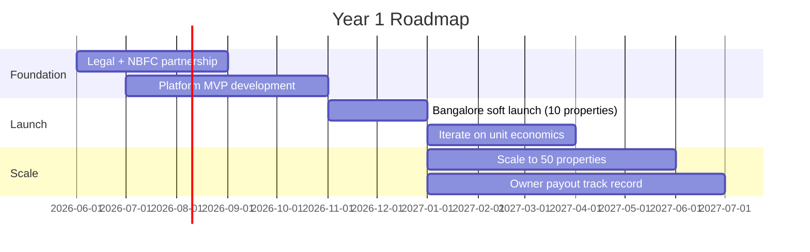

# NWTR — Product Vision

---
title: Product Vision & Platform Roadmap
version: 1.0
audience: Product Team, Engineering, Investors
last-updated: 2026-05-21
status: draft
related-docs:
  - "./executive-summary.md"
  - "../01-product/prd.md"
  - "../03-ux-ui/ux-strategy.md"
  - "./market-opportunity.md"
---

## TL;DR

NWTR's product is a trust-first, compliance-embedded fintech platform that orchestrates the deposit-based living lifecycle — from property discovery to deposit deployment to automated owner payouts. The platform evolves from a high-touch RM-assisted MVP (Year 1) to a self-serve, AI-native marketplace (Year 5) that manages ₹3,000+ Cr in AUM with institutional-grade security and premium UX.

---

## North Star Vision (5-Year)

> **By 2031, NWTR is the default way India's premium professionals live — a financial operating system for rental living that eliminates rent burn, guarantees owner income, and manages ₹10,000 Cr+ in deposits across 15,000 properties in 8 Indian metros.**

### Vision Pillars

1. **Rent elimination becomes normal** — HNI tenants view deposit-based living as the obvious financial choice
2. **Owner income is guaranteed** — property owners treat NWTR payouts like FD interest: predictable, automated, trustworthy
3. **Platform intelligence** — AI-driven matching, yield optimization, and proactive portfolio management
4. **Ecosystem expansion** — adjacent services (insurance, maintenance, interiors, credit) monetize the relationship
5. **Regulatory leadership** — NWTR shapes the regulatory framework for deposit-based living in India

---

## The "Why" — Transforming Dead Rent into Wealth Preservation

### The Philosophical Shift

Traditional rental creates a **zero-sum** dynamic: tenant's loss is owner's gain. NWTR creates a **positive-sum** dynamic: the financial system generates value (yield) that neither party could access independently.

### Why This Matters

- **For society:** ₹5-8 lakh Cr in security deposits sit idle in India. NWTR is the first product that activates this dead capital.
- **For tenants:** Converts the most regressive recurring expense (rent) into a capital-preservation mechanism.
- **For owners:** Converts unreliable rental income into guaranteed, passive, automated payouts.
- **For the financial system:** Creates a new asset class (rental deposit securities) with sovereign-equivalent risk profile.

---

## Product Principles

### 1. Trust-First

Every design decision asks: "Does this increase or decrease trust?"

- Full deposit amount visible and tracked at all times
- NBFC partner prominently displayed (institutional credibility)
- Owner payout history transparent and auditable
- Exit terms crystal clear from Day 0
- No hidden fees, no buried clauses

### 2. Premium-Only

We serve the top 5% — and everything reflects that.

- Properties ₹50L+ value only (no budget segment)
- White-glove RM experience for onboarding
- Design language: minimal, confident, no visual clutter
- Content tone: intelligent, never condescending
- Zero tolerance for broken flows or slow responses

### 3. AI-Native

Intelligence embedded at every layer, not bolted on.

- AI-powered property-tenant matching (lifestyle, commute, preferences)
- Yield optimization via ML portfolio models
- Predictive maintenance and owner communication
- Document generation (agreements, compliance filings)
- Anomaly detection in fund flows

### 4. Compliance-Embedded

Regulation is architecture, not afterthought.

- Every transaction auditable end-to-end
- KYC/AML flows native to onboarding (not bolt-on gates)
- NBFC reporting automated and real-time
- Escrow reconciliation continuous (not periodic)
- Regulatory change monitoring with automated impact assessment

---

## Platform Architecture Overview

---

## Platform Modules

### Module 1: Public Site

**Purpose:** Attract, educate, and convert premium audiences.

| Feature | Description | Priority |
|---------|-------------|----------|
| Property catalog | Curated premium properties with high-quality imagery | P0 |
| Savings calculator | Interactive tool showing rent-vs-deposit comparison | P0 |
| Trust signals | NBFC partner details, regulatory compliance badges | P0 |
| Educational content | How it works, FAQ, financial literacy articles | P1 |
| NRI landing pages | Geo-targeted content for NRI investors | P1 |
| Owner yield calculator | Shows guaranteed monthly income for listed properties | P1 |
| Referral engine | Premium referral program for existing users | P2 |

### Module 2: Tenant Portal

**Purpose:** End-to-end tenant lifecycle management.

| Feature | Description | Priority |
|---------|-------------|----------|
| Property search & match | AI-driven matching based on preferences, commute, lifestyle | P0 |
| Digital KYC | Aadhaar + PAN + bank verification in <5 minutes | P0 |
| Deposit tracker | Real-time view of deposit status (in transit, deployed, accruing) | P0 |
| Agreement management | Digital signing, storage, and retrieval | P0 |
| Exit management | 60-day notice flow, deposit return tracking | P0 |
| Maintenance requests | Ticketing system for property issues | P1 |
| Renewal flow | Simplified re-enrollment for continuing tenants | P1 |
| Financial dashboard | Personal savings from rent elimination, opportunity cost view | P2 |

### Module 3: Owner Portal

**Purpose:** Transparent, zero-effort income management.

| Feature | Description | Priority |
|---------|-------------|----------|
| Payout dashboard | Monthly income tracking, history, projections | P0 |
| Property listing | Onboard properties with RM assistance | P0 |
| Yield reports | Quarterly investment performance reports | P0 |
| NACH management | Mandate setup, bank account changes | P1 |
| Tax documents | Annual TDS certificates, Form 26AS integration | P1 |
| Multi-property view | Portfolio overview for owners with 2+ properties | P1 |
| NRI dashboard | Forex conversion, repatriation tracking | P2 |

### Module 4: RM (Relationship Manager) Portal

**Purpose:** High-touch sales and relationship management tooling.

| Feature | Description | Priority |
|---------|-------------|----------|
| Lead management | CRM with property-tenant matching pipeline | P0 |
| Property onboarding | Guided workflow for new property intake | P0 |
| Tenant qualification | Deposit capacity assessment, financial scoring | P0 |
| Agreement generation | Auto-populated contract templates | P0 |
| Commission tracker | RM earnings, targets, and payout schedules | P1 |
| Activity logging | Site visits, calls, negotiations tracked | P1 |
| Analytics | Conversion rates, pipeline velocity, portfolio health | P2 |

### Module 5: Admin Dashboard

**Purpose:** Operations, compliance, and financial management.

| Feature | Description | Priority |
|---------|-------------|----------|
| Fund flow monitor | Real-time view of all deposits, payouts, yields | P0 |
| Compliance dashboard | KYC status, AML flags, regulatory filings | P0 |
| NBFC reconciliation | Automated matching of expected vs. actual yields | P0 |
| Escalation management | Owner/tenant issues requiring intervention | P0 |
| Reporting suite | Investor reports, regulatory filings, board packs | P1 |
| Risk monitoring | Rate sensitivity, concentration risk, early exit tracking | P1 |
| System health | Uptime, API latency, error rates | P1 |

---

## Platform Evolution Roadmap

### Year 1: MVP — Trust & Prove (Target: 50 Properties)

**Key deliverables:**
- Functional tenant and owner portals (web-first)
- Manual RM-assisted onboarding with digital agreement signing
- Escrow + NBFC deposit pipeline (semi-automated)
- NACH payout system (automated)
- Basic admin dashboard for fund flow monitoring
- 6-month payout track record for investor confidence

**Success criteria:**
- 50 active properties, zero missed owner payouts
- Tenant NPS > 70, Owner NPS > 80
- Unit economics validated (actual yield within ±0.5% of model)
- NBFC partnership operating smoothly
- Regulatory opinion letter obtained

### Year 2: Scale — Automate & Expand (Target: 200 Properties)

**Key deliverables:**
- Self-serve tenant onboarding (minimal RM touch)
- Automated deposit deployment (T+1 with no manual intervention)
- Mobile apps (iOS + Android) for tenant and owner
- Hyderabad and Pune expansion
- AI matching engine v1
- Portfolio rebalancing automation
- Owner referral program
- NRI-specific onboarding flow

**Success criteria:**
- 200 properties across 3 cities
- 70% of onboarding automated (no RM intervention)
- CAC reduced by 40% (from ₹1.2L to ₹72K)
- Renewal rate > 50%
- Series A raised on demonstrated unit economics

### Year 3: Intelligence — AI-Native Platform (Target: 600 Properties)

**Key deliverables:**
- AI-powered yield optimization (ML portfolio allocation)
- Predictive tenant-property matching (lifestyle fit scoring)
- Dynamic pricing engine (deposit ratio based on property/area risk)
- Owner acquisition via AI-targeted outreach
- Mumbai expansion
- Insurance product integration
- Deposit financing product (for near-HNI tenants)
- NBFC-ICC license application

**Success criteria:**
- 600 properties, ₹450 Cr AUM
- AI matching reduces time-to-fill from 45 to 15 days
- Yield optimization adds 20-40 bps above manual allocation
- Deposit financing extends TAM by 30%
- EBITDA positive at company level

### Year 4: Ecosystem — Beyond Living (Target: 1,500 Properties)

**Key deliverables:**
- Commercial property segment (office spaces, co-working)
- Premium maintenance + interiors marketplace
- Owner wealth management advisory
- Delhi-NCR expansion
- NBFC-ICC license operational (direct deposit management)
- Credit scoring based on deposit history
- White-label partnerships with premium developers

**Success criteria:**
- 1,500 properties, ₹1,125 Cr AUM
- Commercial segment contributing 15% of revenue
- Own NBFC license operational (margin improvement)
- Series B/C raised at ₹500+ Cr valuation
- Platform handles 95% of operations without human intervention

### Year 5: Dominance — Category Leader (Target: 4,000 Properties)

**Key deliverables:**
- Full ecosystem (living + working + managing + financing)
- NRI property management vertical
- Co-living premium segment
- Tier-2 city expansion (Ahmedabad, Chennai, Kolkata)
- API-first platform (developer ecosystem for PropTech builders)
- International blueprint (Dubai, Singapore — research phase)
- IPO readiness

**Success criteria:**
- 4,000+ properties, ₹3,000+ Cr AUM
- Category recognition ("deposit-based living" is a known term)
- ₹67 Cr total revenue, ₹38 Cr EBITDA
- Top 3 PropTech in India by AUM managed
- Clear path to IPO (Year 6-7)

---

## Competitive Positioning Matrix

| Dimension | NoBroker | MagicBricks | Nestaway | NWTR |
|-----------|----------|-------------|----------|------|
| **Core value** | No brokerage | Property listing | Managed rentals | Zero rent |
| **Revenue model** | Subscriptions + services | Advertising + listing fees | Rent margin (10-15%) | Yield spread |
| **Target segment** | Mass market | All segments | Budget/mid | Premium HNI |
| **Financial innovation** | None | None | None | Deposit-to-yield |
| **Owner proposition** | Tenant discovery | Visibility | Management | Guaranteed income |
| **Tenant proposition** | Cost savings (brokerage) | Choice | Convenience | Wealth preservation |
| **Moat** | Network effects | Brand/traffic | Operations | Regulatory + financial |
| **Scalability** | High (marketplace) | High (listing) | Low (operational) | High (AUM-driven) |
| **Valuation logic** | GMV multiple | Traffic/revenue | Revenue multiple | AUM + revenue |

### Why NWTR is Not Comparable to Existing Players

NWTR is **not** a rental marketplace (NoBroker), a listing portal (MagicBricks), or a managed living company (Nestaway). It is a **financial product** — closer to a wealth management platform than a real estate portal. The correct comparables are:

- **Zerodha** — democratized investing for retail → NWTR democratizes yield for rental deposits
- **CRED** — financialized credit card payments → NWTR financializes security deposits
- **Jupiter/Fi** — neo-banking for millennials → NWTR is neo-rental for HNIs

---

## Future Expansion Vectors

### Vector 1: Commercial Properties (Year 4)

- Office spaces for startups and SMEs (₹50L-5 Cr deposits)
- Co-working premium seats (deposit-based membership)
- Retail spaces in premium malls
- Estimated TAM addition: ₹10,000 Cr

### Vector 2: NRI Property Management (Year 3-4)

- Full lifecycle: tenant finding → deposit management → maintenance → yield
- 12M+ NRIs with Indian property, most earning sub-optimal yields
- Additional services: tenant verification, property inspection, renovation management
- Revenue: 8-12% of rental value as management fee + yield spread

### Vector 3: Co-Living Premium (Year 4-5)

- Deposit-based co-living for young professionals (₹20-40L deposits)
- Shared premium apartments in tech corridors
- Community + networking as value-add
- Lower per-unit economics but higher density

### Vector 4: Deposit Financing (Year 3)

- Partner with banks/NBFCs to offer deposit loans to near-HNI tenants
- Tenant borrows deposit amount, pays interest (8-10%) instead of rent (savings still significant)
- NWTR earns referral fee + larger deposit pool
- Extends TAM from HNI-only to upper-middle income

### Vector 5: Insurance & Credit Products (Year 3-5)

- Property insurance (referral/embedded)
- Rent guarantee insurance for owners (before NWTR transition)
- Deposit protection insurance (trust-building layer)
- Credit scoring based on deposit + payout history

---

## Success Metrics and KPIs

### North Star Metric

**AUM Under Management** — total deposit capital deployed and generating yield.

### Primary KPIs

| Category | Metric | Year 1 Target | Year 3 Target | Year 5 Target |
|----------|--------|---------------|---------------|---------------|
| **Growth** | Active Properties | 50 | 600 | 4,000 |
| **Growth** | AUM (₹ Cr) | 37.5 | 450 | 3,000 |
| **Growth** | New Properties/Month | 5 | 25 | 80 |
| **Financial** | Gross Revenue | ₹96L | ₹10.55 Cr | ₹67 Cr |
| **Financial** | Net Margin | 16.7% | 48.3% | 56.7% |
| **Financial** | CAC | ₹1.2L | ₹72K | ₹45K |
| **Quality** | Owner NPS | 80+ | 85+ | 85+ |
| **Quality** | Tenant NPS | 70+ | 75+ | 80+ |
| **Quality** | Missed Payouts | 0 | 0 | 0 |
| **Efficiency** | Time to Fill (days) | 45 | 15 | 7 |
| **Efficiency** | Onboarding Time (days) | 14 | 5 | 2 |
| **Retention** | Renewal Rate | 40% | 55% | 65% |
| **Retention** | Owner Churn | <10% | <5% | <3% |

### Operational Health Metrics

| Metric | Description | Alert Threshold |
|--------|-------------|-----------------|
| Yield variance | Actual vs. projected blended yield | >±30 bps |
| Payout success rate | % of owner payouts on-time | <99% |
| Deposit deployment time | Hours from escrow receipt to NBFC investment | >48 hours |
| Escrow reconciliation | Unmatched transactions | >0 for 24 hours |
| KYC completion rate | % of started KYCs completed | <85% |
| Agreement turnaround | Days from match to signed agreement | >7 days |
| Early exit rate | % of tenants exiting before term | >8% |

---

## Document Cross-References

- [Executive Summary](./executive-summary.md) — Elevator pitches and funding thesis
- [Business Model](./business-model.md) — Unit economics and fund flows
- [Market Opportunity](./market-opportunity.md) — Market sizing and growth vectors
- [Brand Positioning](./brand-positioning.md) — Premium identity and messaging

---

*NWTR — Building the financial operating system for premium rental living.*
