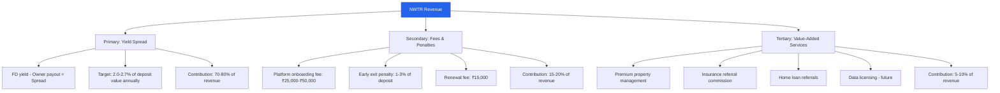
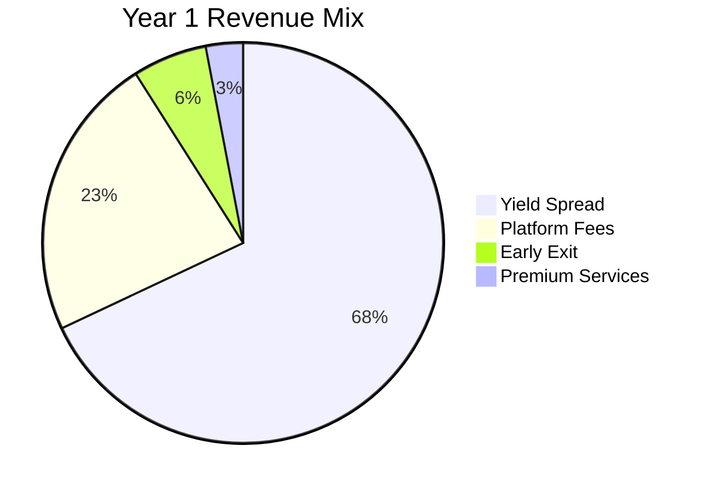
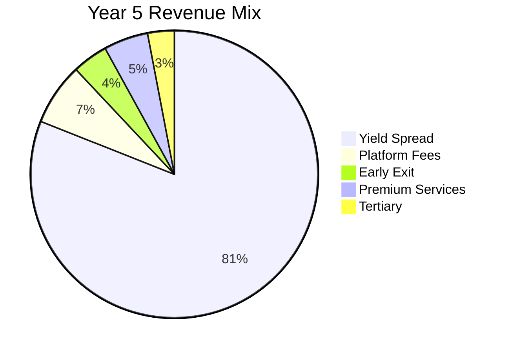

# Revenue Model & Unit Economics

## TL;DR

NWTR's primary revenue is the yield spread between investment returns (7-8% blended from FDs, G-Secs, corporate bonds) and owner payouts (4-5%). At scale (500+ properties, ₹375Cr AUM), NWTR generates ₹7.5-10Cr annual revenue at 55-65% gross margins. Secondary revenues (platform fees, early exit penalties, premium services) contribute 15-20% of total revenue. Unit economics turn positive at ~150 properties; full break-even at ~200 properties (Month 18-24). LTV:CAC ratio reaches 5:1 by Year 3 as trust compounds and referral rates increase. The model is capital-efficient (negative working capital from deposits) but margin-sensitive to interest rate movements.

---

## 1. Revenue Architecture

### 1.1 Revenue Streams Overview

### 1.2 Primary Revenue: Yield Spread (Detailed Calculation)

**Per-property economics (₹75L average deposit)**:

| Parameter | Value | Notes |
|-----------|-------|-------|
| Average property value | ₹1.07 Cr | Premium Bangalore 3BHK |
| Deposit (70% of value) | ₹75,00,000 | Tenant investment |
| Blended investment yield | 7.2% | Diversified fixed-income |
| Annual yield generated | ₹5,40,000 | On ₹75L deposit |
| Owner payout (4.5% equivalent) | ₹3,37,500 | ₹28,125/month to owner |
| **NWTR gross spread** | **₹2,02,500/year** | **2.7% of deposit** |
| NBFC revenue share (Phase 1: 30%) | ₹60,750 | Eliminated with own license |
| **NWTR net spread (Phase 1)** | **₹1,41,750/year** | **1.89% of deposit** |
| **NWTR net spread (Phase 2: own NBFC)** | **₹2,02,500/year** | **2.7% of deposit** |

### 1.3 Yield Stack Composition

| Instrument | Allocation | Current Yield | Weighted Yield | Risk |
|-----------|-----------|---------------|----------------|------|
| Bank FDs (Top 5 banks) | 35% | 6.25% | 2.19% | Minimal |
| G-Sec (5-7 year maturity) | 25% | 7.10% | 1.78% | Sovereign |
| AAA Corporate Bonds | 20% | 7.50% | 1.50% | Low |
| T-Bills (91-364 day) | 10% | 6.50% | 0.65% | Sovereign |
| AA+ Corporate Bonds | 10% | 8.00% | 0.80% | Low-Medium |
| **Blended Portfolio** | **100%** | — | **6.92%** | **Low** |

**Conservative blended yield**: 6.9-7.2% (used 7.2% for projections).

### 1.4 Owner Payout Calculation

Owner payout is positioned as superior to traditional rental yield:

| City | Traditional Rental Yield | NWTR Owner Payout | Premium to Owner |
|------|-------------------------|-------------------|------------------|
| Bangalore | 4.45% | 4.5% on deposit (≈5.4% on property value*) | +0.95% vs rent |
| Hyderabad | 3.8% | 4.5% on deposit | +1.5% vs rent |
| Mumbai | 3.15% | 4.0% on deposit | +0.85% vs rent |
| Pune | 3.5% | 4.5% on deposit | +1.0% vs rent |

*Note: Deposit is 70% of property value, so 4.5% on 70% = 3.15% on full property value. Owner receives guaranteed, zero-effort income vs. variable rent with vacancy and maintenance costs.

---

## 2. Secondary Revenue Streams

### 2.1 Platform Fees

| Fee Type | Amount | When Charged | Revenue/Year (200 properties) |
|----------|--------|-------------|-------------------------------|
| Onboarding fee (tenant) | ₹25,000-₹50,000 | At signing | ₹50L-₹1Cr (one-time, new properties) |
| Onboarding fee (owner) | ₹15,000-₹25,000 | At listing | ₹30L-₹50L (one-time) |
| Annual renewal fee | ₹15,000 | At 12-month renewal | ₹30L (recurring) |
| Property switch fee | ₹10,000 | If tenant changes property | ₹5-10L |

### 2.2 Early Exit Penalties

| Exit Timeline | Penalty | Rationale |
|--------------|---------|-----------|
| 0-3 months | 3% of deposit | High re-deployment cost |
| 3-6 months | 2% of deposit | Moderate cost |
| 6-9 months | 1.5% of deposit | Lower cost |
| 9-12 months | 1% of deposit | Minimal cost |
| At maturity (12 months) | 0% | Full term completed |

**Estimated annual early exit revenue**: 10-15% of tenants exit early → ₹20-30L at 200 properties.

### 2.3 Premium Services

| Service | Monthly Fee | Target Penetration | Annual Revenue (200 properties) |
|---------|-------------|-------------------|-------------------------------|
| Property management (maintenance, repairs) | ₹3,000-₹8,000 | 30% of properties | ₹14-38L |
| Concierge services (move-in, furnishing) | ₹5,000-₹15,000 (one-time) | 50% of new tenants | ₹5-15L |
| Insurance bundle (contents + liability) | ₹500-₹1,500/month | 40% of tenants | ₹5-14L |
| Premium dashboard + analytics (owners) | ₹1,000/month | 25% of owners | ₹6L |

---

## 3. Tertiary Revenue (Year 3+)

### 3.1 Future Revenue Opportunities

| Stream | Revenue Model | Estimated Annual | Timeline |
|--------|--------------|-----------------|----------|
| Home loan referral | Commission from banks (0.5-1% of loan) | ₹50L-₹1Cr | Year 2 |
| Insurance referral | Commission (15-25% of premium) | ₹10-20L | Year 2 |
| Interior design partnerships | Referral fee (5-8% of project) | ₹15-30L | Year 2 |
| Data licensing (anonymized market data) | Subscription from RE firms | ₹25-50L | Year 3 |
| White-label platform (other cities/countries) | SaaS licensing | ₹1-2Cr | Year 4 |

---

## 4. Revenue Projections (Year 1-5)

### 4.1 Growth Assumptions

| Parameter | Year 1 | Year 2 | Year 3 | Year 4 | Year 5 |
|-----------|--------|--------|--------|--------|--------|
| Properties (cumulative) | 200 | 600 | 1,500 | 3,500 | 7,000 |
| New properties added | 200 | 400 | 900 | 2,000 | 3,500 |
| Average deposit/property | ₹60L | ₹65L | ₹70L | ₹72L | ₹75L |
| Total AUM | ₹120 Cr | ₹390 Cr | ₹1,050 Cr | ₹2,520 Cr | ₹5,250 Cr |
| Blended yield | 7.0% | 7.1% | 7.2% | 7.1% | 7.0% |
| Owner payout rate | 4.5% | 4.5% | 4.5% | 4.4% | 4.3% |
| Net spread (post-NBFC share) | 1.7% | 2.0% | 2.5% | 2.7% | 2.7% |
| Cities | 1 | 2 | 4 | 5 | 6 |
| NBFC model | LSP (partner) | LSP → Own license | Own NBFC | Own NBFC | Own NBFC |

### 4.2 Revenue Projections

| Revenue Stream | Year 1 | Year 2 | Year 3 | Year 4 | Year 5 |
|---------------|--------|--------|--------|--------|--------|
| Yield spread | ₹2.04 Cr | ₹7.80 Cr | ₹26.25 Cr | ₹68.04 Cr | ₹141.75 Cr |
| Platform fees (onboarding) | ₹0.70 Cr | ₹1.40 Cr | ₹3.15 Cr | ₹7.00 Cr | ₹12.25 Cr |
| Early exit penalties | ₹0.18 Cr | ₹0.54 Cr | ₹1.35 Cr | ₹3.15 Cr | ₹6.30 Cr |
| Premium services | ₹0.10 Cr | ₹0.50 Cr | ₹1.50 Cr | ₹4.00 Cr | ₹8.00 Cr |
| Tertiary revenue | — | ₹0.25 Cr | ₹1.00 Cr | ₹3.00 Cr | ₹6.00 Cr |
| **Total Revenue** | **₹3.02 Cr** | **₹10.49 Cr** | **₹33.25 Cr** | **₹85.19 Cr** | **₹174.30 Cr** |

### 4.3 Revenue Composition Evolution

---

## 5. Cost Structure

### 5.1 Cost Breakdown

| Cost Category | Year 1 | Year 2 | Year 3 | Year 4 | Year 5 |
|--------------|--------|--------|--------|--------|--------|
| **Technology** | ₹1.50 Cr | ₹2.50 Cr | ₹4.00 Cr | ₹6.00 Cr | ₹9.00 Cr |
| Platform development | ₹0.80 Cr | ₹1.20 Cr | ₹1.80 Cr | ₹2.50 Cr | ₹3.50 Cr |
| Infrastructure (cloud, security) | ₹0.30 Cr | ₹0.60 Cr | ₹1.00 Cr | ₹1.50 Cr | ₹2.50 Cr |
| Data & analytics | ₹0.20 Cr | ₹0.40 Cr | ₹0.70 Cr | ₹1.00 Cr | ₹1.50 Cr |
| Cybersecurity | ₹0.20 Cr | ₹0.30 Cr | ₹0.50 Cr | ₹1.00 Cr | ₹1.50 Cr |
| **Operations** | ₹1.80 Cr | ₹3.50 Cr | ₹7.00 Cr | ₹14.00 Cr | ₹24.00 Cr |
| Team (salaries + benefits) | ₹1.20 Cr | ₹2.50 Cr | ₹5.00 Cr | ₹10.00 Cr | ₹17.00 Cr |
| Office & admin | ₹0.30 Cr | ₹0.50 Cr | ₹1.00 Cr | ₹2.00 Cr | ₹3.50 Cr |
| Property operations (verification, inspection) | ₹0.30 Cr | ₹0.50 Cr | ₹1.00 Cr | ₹2.00 Cr | ₹3.50 Cr |
| **Compliance & Legal** | ₹0.80 Cr | ₹1.20 Cr | ₹2.00 Cr | ₹3.00 Cr | ₹4.50 Cr |
| NBFC license/partnership costs | ₹0.30 Cr | ₹0.50 Cr | ₹0.80 Cr | ₹1.00 Cr | ₹1.50 Cr |
| Legal retainers + compliance | ₹0.30 Cr | ₹0.40 Cr | ₹0.70 Cr | ₹1.00 Cr | ₹1.50 Cr |
| Audit & certifications | ₹0.20 Cr | ₹0.30 Cr | ₹0.50 Cr | ₹1.00 Cr | ₹1.50 Cr |
| **Marketing & Sales** | ₹2.00 Cr | ₹4.00 Cr | ₹8.00 Cr | ₹15.00 Cr | ₹22.00 Cr |
| Brand building | ₹0.80 Cr | ₹1.50 Cr | ₹3.00 Cr | ₹5.00 Cr | ₹7.00 Cr |
| Performance marketing | ₹0.50 Cr | ₹1.00 Cr | ₹2.00 Cr | ₹4.00 Cr | ₹6.00 Cr |
| Sales team + commissions | ₹0.50 Cr | ₹1.00 Cr | ₹2.00 Cr | ₹4.00 Cr | ₹6.00 Cr |
| Events & partnerships | ₹0.20 Cr | ₹0.50 Cr | ₹1.00 Cr | ₹2.00 Cr | ₹3.00 Cr |
| **Insurance & Reserves** | ₹0.30 Cr | ₹0.60 Cr | ₹1.50 Cr | ₹3.00 Cr | ₹5.50 Cr |
| **Total Costs** | **₹6.40 Cr** | **₹11.80 Cr** | **₹22.50 Cr** | **₹41.00 Cr** | **₹65.00 Cr** |

### 5.2 P&L Summary

| Metric | Year 1 | Year 2 | Year 3 | Year 4 | Year 5 |
|--------|--------|--------|--------|--------|--------|
| Revenue | ₹3.02 Cr | ₹10.49 Cr | ₹33.25 Cr | ₹85.19 Cr | ₹174.30 Cr |
| Total costs | ₹6.40 Cr | ₹11.80 Cr | ₹22.50 Cr | ₹41.00 Cr | ₹65.00 Cr |
| **EBITDA** | **-₹3.38 Cr** | **-₹1.31 Cr** | **₹10.75 Cr** | **₹44.19 Cr** | **₹109.30 Cr** |
| EBITDA margin | -112% | -12% | 32% | 52% | 63% |
| Cumulative P&L | -₹3.38 Cr | -₹4.69 Cr | ₹6.06 Cr | ₹50.25 Cr | ₹159.55 Cr |

---

## 6. Unit Economics

### 6.1 Per-Property Economics (Steady State)

| Metric | Phase 1 (LSP) | Phase 2 (Own NBFC) |
|--------|---------------|-------------------|
| Average deposit | ₹65L | ₹75L |
| Annual yield generated | ₹4.55L | ₹5.40L |
| Owner payout | ₹2.93L | ₹3.38L |
| Gross spread | ₹1.63L | ₹2.03L |
| NBFC revenue share | ₹0.49L (30%) | ₹0 (own) |
| Net spread revenue | ₹1.14L | ₹2.03L |
| Platform fee revenue (amortized) | ₹0.30L | ₹0.30L |
| **Total revenue per property** | **₹1.44L/year** | **₹2.33L/year** |
| Cost per property (at 500 properties) | ₹1.05L | ₹0.90L |
| **Contribution margin per property** | **₹0.39L** | **₹1.43L** |
| Contribution margin % | 27% | 61% |

### 6.2 Scale Effects

| Scale (Properties) | Revenue/Property | Cost/Property | Margin | Status |
|-------------------|-----------------|---------------|--------|--------|
| 10 | ₹1.44L | ₹6.40L | -₹4.96L | Heavy loss (investment phase) |
| 50 | ₹1.44L | ₹3.20L | -₹1.76L | Loss (building) |
| 100 | ₹1.44L | ₹1.80L | -₹0.36L | Near break-even |
| 150 | ₹1.44L | ₹1.47L | -₹0.03L | Break-even |
| 200 | ₹1.44L | ₹1.20L | +₹0.24L | Profitable |
| 500 | ₹1.80L | ₹1.05L | +₹0.75L | Healthy margins |
| 1,000 | ₹2.10L | ₹0.85L | +₹1.25L | Strong unit economics |

### 6.3 Break-Even Analysis

| Scenario | Properties Needed | Timeline | Key Assumption |
|----------|------------------|----------|----------------|
| Optimistic | 120 properties | Month 14 | Low marketing spend, high referral |
| Base case | 180 properties | Month 20 | Moderate growth, standard costs |
| Conservative | 250 properties | Month 26 | Higher costs, slower growth |
| Pessimistic | 350 properties | Month 32 | Yield compression + slow growth |

---

## 7. Margin Analysis: Interest Rate Sensitivity

### 7.1 Margin at Different Rate Environments

| Rate Environment | Blended Yield | Owner Payout | NWTR Spread | Margin Viability |
|-----------------|---------------|--------------|-------------|------------------|
| Rising (+100 bps) | 8.2% | 4.5% (fixed) | 3.7% | Highly profitable |
| Current | 7.2% | 4.5% | 2.7% | Profitable |
| Flat (-50 bps) | 6.7% | 4.5% | 2.2% | Viable |
| Falling (-100 bps) | 6.2% | 4.2% (adjusted) | 2.0% | Tight but viable |
| Falling (-200 bps) | 5.2% | 3.5% (adjusted) | 1.7% | Marginal |
| Crisis (-300 bps) | 4.2% | 3.0% (floor) | 1.2% | Requires scale |

### 7.2 Owner Payout Adjustment Mechanism

- Fixed payout: Applied for first 12 months (contractual)
- Floating payout: From Year 2 renewals, linked to "NWTR Benchmark Rate" (repo + 150 bps - 200 bps spread)
- Floor guarantee: Owner always receives minimum 3% (absolute floor)
- Upside sharing: If yield exceeds 8%, 50% of excess shared with owner

---

## 8. Revenue Per Property Metrics

### 8.1 Revenue Waterfall (Per ₹75L Deposit)

| Line Item | Amount (Annual) | % of Deposit |
|-----------|----------------|--------------|
| Gross yield generated | ₹5,40,000 | 7.20% |
| Less: Owner payout | (₹3,37,500) | 4.50% |
| = Gross spread | ₹2,02,500 | 2.70% |
| Less: NBFC share (Phase 1 only) | (₹60,750) | 0.81% |
| = Net yield revenue | ₹1,41,750 | 1.89% |
| Plus: Onboarding fee (amortized) | ₹37,500 | 0.50% |
| Plus: Insurance/services commission | ₹12,000 | 0.16% |
| = **Total revenue per property** | **₹1,91,250** | **2.55%** |

---

## 9. LTV/CAC Analysis

### 9.1 Tenant LTV/CAC

| Parameter | Year 1 | Year 2 | Year 3 (Mature) |
|-----------|--------|--------|-----------------|
| Average tenure | 1.2 years | 1.5 years | 2.0 years |
| Revenue per tenant/year | ₹1.44L | ₹1.80L | ₹2.10L |
| **Lifetime Value (LTV)** | **₹1.73L** | **₹2.70L** | **₹4.20L** |
| CAC (marketing + sales) | ₹1.20L | ₹0.90L | ₹0.70L |
| **LTV:CAC Ratio** | **1.4:1** | **3.0:1** | **6.0:1** |

### 9.2 Owner LTV/CAC

| Parameter | Year 1 | Year 2 | Year 3 (Mature) |
|-----------|--------|--------|-----------------|
| Average tenure on platform | 2 years | 3 years | 4+ years |
| Revenue per owner/year | ₹0.50L | ₹0.60L | ₹0.70L |
| **Lifetime Value (LTV)** | **₹1.00L** | **₹1.80L** | **₹2.80L** |
| CAC (marketing + relationship) | ₹0.60L | ₹0.45L | ₹0.35L |
| **LTV:CAC Ratio** | **1.7:1** | **4.0:1** | **8.0:1** |

### 9.3 CAC Reduction Drivers

| Driver | Year 1 CAC | Year 3 CAC | Reduction |
|--------|-----------|-----------|-----------|
| Referrals (30% of new tenants by Y3) | ₹0 CAC on referrals | — | -30% blended |
| Brand awareness (organic inbound) | 10% organic | 35% organic | -25% blended |
| Relationship manager efficiency | 5 closings/month | 12 closings/month | -50% per-deal cost |
| Content marketing compounding | Low ROI initially | High ROI (SEO, PR) | -20% blended |

---

## 10. Funding & Capital Requirements

### 10.1 Capital Allocation

| Use of Funds | Seed (₹5 Cr) | Series A (₹25 Cr) | Series B (₹100 Cr) |
|-------------|--------------|-------------------|--------------------|
| Technology platform | 30% | 20% | 15% |
| NBFC license capital (NOF) | — | 40% (₹10 Cr) | 20% (additional capital) |
| Marketing & sales | 25% | 20% | 30% |
| Operations & team | 30% | 15% | 20% |
| Compliance & legal | 10% | 5% | 5% |
| Reserve | 5% | — | 10% |
| **Timeline** | **Pre-launch** | **Month 6-12** | **Month 18-24** |

### 10.2 Key Investor Metrics (Year 5 Target)

| Metric | Target |
|--------|--------|
| AUM | ₹5,250 Cr |
| Revenue | ₹174 Cr |
| EBITDA | ₹109 Cr |
| EBITDA Margin | 63% |
| Properties | 7,000 |
| Cities | 6 |
| Revenue CAGR (Y1-Y5) | 175% |
| LTV:CAC (blended) | 5:1+ |

---

## Cross-References

- [Risk Analysis](./risk-analysis.md) — Financial risk stress tests
- [India Market Fit](./india-market-fit.md) — Market size and yield environment
- [Trust & Compliance Strategy](./trust-compliance-strategy.md) — Compliance cost drivers
- [Competitor Analysis](./competitor-analysis.md) — Competitive pricing context
- [HNI Persona Analysis](./hni-persona-analysis.md) — Customer acquisition channels and willingness to pay
