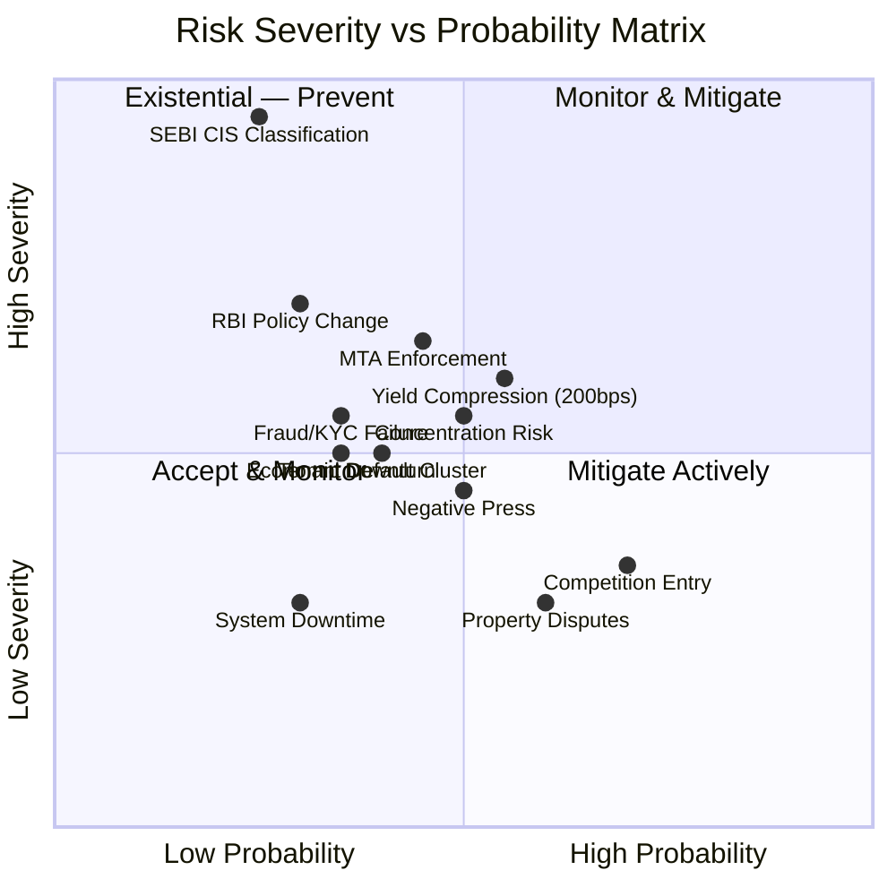
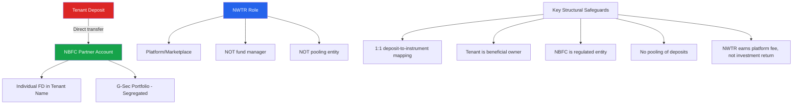
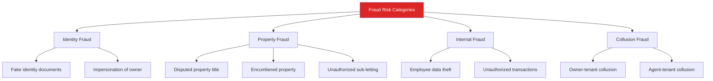
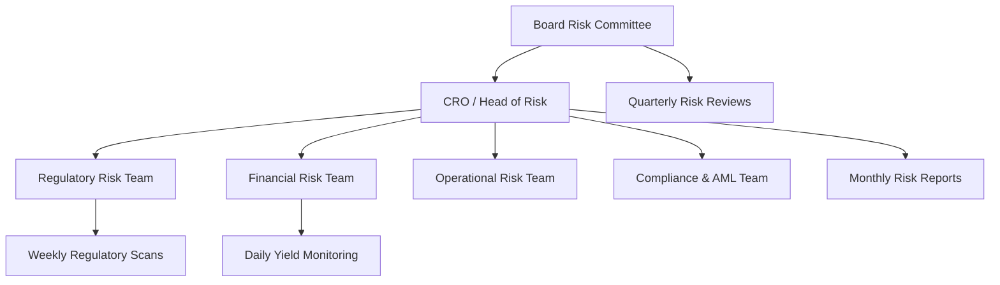

# Risk Analysis & Mitigation Framework

## TL;DR

NWTR operates at the intersection of real estate, financial services, and technology—each carrying distinct risk profiles. The existential risk is SEBI classifying NWTR's model as a Collective Investment Scheme (CIS), which would require registration and fundamentally alter operations. This is mitigated through careful NBFC partnership structuring where deposits flow directly to a licensed entity. Secondary risks include yield compression (mitigated by diversified fixed-income portfolio), tenant default on deposit commitment (mitigated by stringent KYC and partial collateral), and regulatory change (mitigated by proactive engagement and structural flexibility). Stress testing shows the model remains viable even under a 200bps rate drop, 10% simultaneous tenant exits, and 6-month regulatory freeze scenarios.

---

## 1. Risk Matrix Overview

## 2. Risk Classification

| Risk ID | Category | Risk | Severity | Probability | Risk Score | Priority |
|---------|----------|------|----------|-------------|------------|----------|
| R-01 | Regulatory | SEBI CIS classification | Critical | Low | Existential | P0 |
| R-02 | Regulatory | RBI NBFC policy change | High | Low-Medium | High | P1 |
| R-03 | Regulatory | MTA deposit cap enforcement | High | Medium | High | P1 |
| R-04 | Regulatory | RERA non-compliance | Medium | Low | Medium | P2 |
| R-05 | Financial | Yield compression (sustained) | High | Medium | High | P1 |
| R-06 | Financial | Interest rate crash | High | Low | Medium | P1 |
| R-07 | Financial | Tenant default cluster | Medium | Medium | Medium | P2 |
| R-08 | Financial | Concentration risk | Medium | Medium | Medium | P2 |
| R-09 | Operational | Fraud (internal/external) | High | Low-Medium | High | P1 |
| R-10 | Operational | KYC/AML failure | High | Low | Medium | P2 |
| R-11 | Operational | Property disputes | Medium | Medium | Medium | P2 |
| R-12 | Operational | System downtime | Medium | Low | Low | P3 |
| R-13 | Market | Competition entry | Medium | High | Medium | P2 |
| R-14 | Market | Economic downturn | High | Low-Medium | Medium | P2 |
| R-15 | Market | Regulatory environment change | High | Medium | High | P1 |
| R-16 | Reputational | Deposit safety perception | High | Medium | High | P1 |
| R-17 | Reputational | Negative media coverage | Medium | Medium | Medium | P2 |

---

## 3. Regulatory Risks (P0-P1)

### 3.1 SEBI CIS Classification (R-01) — EXISTENTIAL

**Risk**: SEBI classifies NWTR's deposit-investment model as a Collective Investment Scheme under Section 11AA of the SEBI Act, 1992.

**CIS characteristics** (all four must be present):
1. Contributions pooled and utilized for a scheme ✗ (deposits go to NBFC individually)
2. Contributions managed on behalf of investors ✗ (NBFC manages, not NWTR)
3. Returns promised from the scheme ✗ (returns from NBFC FD, not scheme)
4. Investors don't have day-to-day control ✓ (partially applicable)

**Mitigation Architecture**:

**Mitigation Actions**:
1. Obtain formal legal opinion from 2+ top-tier law firms (AZB, Cyril Amarchand, Trilegal)
2. Structure deposits as individual term deposits in tenant's name (not pooled)
3. NWTR's revenue characterized as "platform fee" not "investment management fee"
4. Seek SEBI informal guidance letter pre-launch
5. Maintain NBFC as the deposit-accepting entity (RBI-regulated, not SEBI-regulated)
6. Document that tenant retains beneficial ownership of deposit at all times

**Residual Risk**: Low (with proper structuring), but consequences if triggered are catastrophic.

### 3.2 RBI NBFC Policy Change (R-02)

**Risk**: RBI tightens NBFC deposit acceptance norms, increases NOF requirements, or restricts digital lending partnerships.

**Recent regulatory signals**:
- Scale-based regulation (2023) — increases compliance for growing NBFCs
- Digital lending guidelines (2022) — restricts FLDG and first-loss guarantees
- Microfinance norms revision (2024) — shows willingness to intervene

**Mitigation**:
| Action | Timeline | Owner |
|--------|----------|-------|
| Multi-NBFC partnership strategy | Pre-launch | Legal/Partnerships |
| Maintain own NBFC license application pipeline | Year 1 | Regulatory Affairs |
| Ensure compliance with current AND proposed norms | Ongoing | Compliance |
| Regulatory relationship building (RBI regional offices) | Ongoing | CEO/Legal |
| Buffer capital beyond minimum NOF requirements | Ongoing | CFO |

### 3.3 Model Tenancy Act Enforcement (R-03)

**Risk**: State government enforces MTA's 2-month deposit cap strictly, treating NWTR deposits as "security deposits" regardless of structural arguments.

**Current status**: MTA is a model law; states must adopt individually. Karnataka has NOT adopted MTA as of 2026.

**Defense layers**:
1. **Structural**: Deposit goes to NBFC, not landlord — it is an "investment," not "security"
2. **Legal**: Separate agreement stack (rental agreement with 2-month deposit + voluntary investment agreement with NBFC)
3. **Jurisdictional**: NBFC deposits regulated by RBI, not state tenancy law
4. **Precedent**: No enforcement action against similar structures
5. **Political**: Real estate lobby opposes MTA deposit caps

### 3.4 RERA Compliance (R-04)

**Risk**: RERA authorities require NWTR to register as a real estate agent, imposing restrictions on fees and operations.

**Mitigation**: Proactive registration as facilitator; maintain compliance with agent disclosure norms; separate real estate facilitation from financial intermediation in legal structure.

---

## 4. Financial Risks

### 4.1 Yield Compression (R-05)

**Risk**: Blended yield drops below 6% due to RBI rate cuts, reducing spread to unsustainable levels.

**Current yield stack**:
| Instrument | Allocation | Yield | Weighted Contribution |
|-----------|-----------|-------|----------------------|
| Bank FDs (AAA) | 40% | 6.25% | 2.50% |
| G-Sec (5-7 year) | 25% | 7.10% | 1.78% |
| Corporate AAA Bonds | 20% | 7.50% | 1.50% |
| T-Bills (91/364 day) | 15% | 6.50% | 0.98% |
| **Blended** | **100%** | — | **6.76%** |

**Stress scenarios**:

| Scenario | Rate Drop | Blended Yield | Owner Payout | NWTR Spread | Viable? |
|----------|-----------|---------------|--------------|-------------|---------|
| Base case | 0 bps | 7.2% | 4.5% | 2.7% | ✅ Yes |
| Mild compression | -100 bps | 6.2% | 4.5% | 1.7% | ✅ Yes (tight) |
| Severe compression | -200 bps | 5.2% | 4.5% | 0.7% | ⚠️ Marginal |
| Extreme | -300 bps | 4.2% | 4.5% | -0.3% | ❌ No |

**Mitigation**:
1. Dynamic owner payout adjustment (linked to benchmark rate)
2. Longer-duration instruments to lock rates (5-7 year G-Sec)
3. Minimum guaranteed payout with variable upside sharing
4. Diversification into higher-yield corporate bonds (within risk limits)
5. Platform fee component (fixed ₹ amount) reduces yield dependency
6. Scale economies reduce per-property cost, preserving margin

### 4.2 Interest Rate Crash (R-06)

**Risk**: RBI cuts rates aggressively (300+ bps) in response to economic crisis, compressing all fixed-income yields below 5%.

**Historical context**: Last major rate crash was 2020 (repo from 5.15% to 4.0%). Recovery took 2+ years.

**Mitigation**:
- Rate-linked owner payout agreements (floating payout tied to repo + spread)
- Portfolio duration management (ladder strategy)
- Interest rate derivatives (futures, swaps) for hedging when scale permits
- Minimum 30% allocation to longer-duration instruments
- Reserve fund built from excess spread in high-rate environments

### 4.3 Tenant Default / Early Exit (R-07)

**Risk**: Tenant requests early deposit withdrawal before 12-month term, or abandons property causing operational costs.

**Default scenarios**:
| Scenario | Probability | Financial Impact | Recovery |
|----------|-------------|-----------------|----------|
| Early exit (with notice) | 15% annually | Low (early exit fee covers costs) | 100% |
| Property abandonment | 2% annually | Medium (1-2 month vacancy cost) | 90% |
| Dispute over deposit return | 5% annually | Low-Medium (legal costs) | 95% |
| Death/incapacitation | 0.1% annually | Low (insurance covers) | 100% |

**Mitigation**:
1. Early exit penalty (1-3% of deposit) covers re-deployment costs
2. 30-day notice period contractually required
3. Deposit remains with NBFC (no NWTR counterparty risk)
4. Property damage covered by separate security deposit (2 months per MTA)
5. Term life insurance on deposit (nominee receives principal)

### 4.4 Concentration Risk (R-08)

**Risk**: Over-reliance on single NBFC partner, single geography, or single property segment.

**Mitigation matrix**:
| Dimension | Concentration Limit | Current | Target (Year 3) |
|-----------|-------------------|---------|-----------------|
| Single NBFC partner | <60% of deposits | 100% (launch) | <40% |
| Single city | <50% of properties | 100% (launch) | <45% |
| Single property value band | <40% of portfolio | TBD | <35% |
| Single owner (multiple properties) | <5% of portfolio | TBD | <3% |
| Single instrument type | <50% of yield portfolio | 40% FD | <40% |

---

## 5. Operational Risks

### 5.1 Fraud Risk (R-09)

**Controls**:
| Fraud Type | Prevention | Detection | Response |
|-----------|-----------|-----------|----------|
| Identity fraud | Video KYC, Aadhaar biometric, PAN verification | Anomaly detection on onboarding patterns | Immediate freeze, STR filing |
| Property fraud | Title search (20-year), CERSAI check, physical verification | Periodic re-verification, neighbor confirmation | Legal action, deposit freeze |
| Internal fraud | Segregation of duties, 4-eye principle, access controls | Audit trails, transaction monitoring, whistleblower | Immediate termination, FIR |
| Collusion | Independent property valuation, market rate checks | Pattern analysis (same agent, rapid turnover) | Contract termination, blacklist |

### 5.2 KYC/AML Failure (R-10)

**Risk**: Failure to identify high-risk customers, resulting in PMLA violations, RBI penalties, or criminal liability.

**Framework**:
- Tiered KYC (Basic → Full → Enhanced) based on deposit value
- CKYC integration for standardized verification
- PEP (Politically Exposed Person) screening
- Sanctions list screening (UN, OFAC, EU)
- Ongoing transaction monitoring
- Suspicious Transaction Reporting (STR) to FIU-IND

| Deposit Value | KYC Tier | Requirements |
|--------------|----------|--------------|
| < ₹25 Lakh | Full KYC | Aadhaar + PAN + Video KYC + Bank verification |
| ₹25L - ₹1 Cr | Enhanced KYC | Full KYC + Income proof + Net worth declaration + Source of funds |
| > ₹1 Cr | Super Enhanced | Enhanced + CA certificate + ITR (3 years) + Physical verification |

### 5.3 Property Disputes (R-11)

**Risk**: Property ownership disputes, encumbrances, or legal challenges emerge after tenant moves in.

**Prevention**:
1. 20-year title search by empanelled lawyers
2. CERSAI (Central Registry) check for registered charges
3. Encumbrance Certificate (EC) from sub-registrar
4. Revenue records verification (khata, tax receipts)
5. Physical inspection and neighbor verification
6. Owner identity verification against property records

### 5.4 System Downtime (R-12)

**Risk**: Platform unavailability during critical operations (deposit processing, payout disbursement).

**SLA targets**:
- Platform availability: 99.9% (8.76 hours downtime/year max)
- Payment processing: 99.95%
- Data recovery: RPO < 1 hour, RTO < 4 hours

---

## 6. Market Risks

### 6.1 Competition Entry (R-13)

**Risk**: Well-funded competitor (NoBroker, Housing.com) launches similar product leveraging existing user base.

**Time-to-replicate analysis**:
| Component | Time for Competitor | NWTR Head Start |
|-----------|-------------------|-----------------|
| NBFC license/partnership | 12-18 months | In progress |
| Trust with HNI deposits | 24-36 months | Year 1 track record |
| Technology platform | 6-12 months | Comparable |
| Property network | 12-18 months | Bangalore-first depth |
| Regulatory structure | 6-12 months | Legal opinions obtained |

**Counter-strategy**: Speed to market, depth in Bangalore, brand association with trust/safety, exclusive NBFC partnerships, owner lock-in through superior experience.

### 6.2 Economic Downturn (R-14)

**Risk**: Recession reduces HNI appetite for large deposits, increases default risk, and compresses yields.

**Counter-cyclical advantages**:
- In downturns, traditional rents still rise (supply shortage)
- FD/G-Sec yields remain stable (or rise if RBI holds rates)
- HNIs seek safe, guaranteed returns during uncertainty
- NWTR's model offers certainty vs. market volatility

### 6.3 Regulatory Environment Shift (R-15)

**Risk**: New government policy explicitly targets or restricts deposit-based rental models.

**Monitoring**:
- Track all MTA adoption bills in state assemblies
- Monitor RBI circulars on NBFC deposit acceptance
- Engage with RERA authorities proactively
- Industry body membership (FICCI, CII real estate committees)
- Regulatory affairs team with former bureaucrats as advisors

---

## 7. Reputational Risks

### 7.1 Deposit Safety Perception (R-16)

**Risk**: Public perception that "depositing ₹50L-₹1Cr with a startup is unsafe," amplified by any negative incident.

**Trust architecture** (detailed in [Trust & Compliance Strategy](./trust-compliance-strategy.md)):
1. Deposits held by RBI-regulated NBFC (not NWTR)
2. Individual FDs in tenant's name (visible in bank statement)
3. Deposit insurance (DICGC covers ₹5L per depositor per bank)
4. Additional private insurance wrap for amounts above ₹5L
5. Real-time dashboard showing deposit status and accrued interest
6. Quarterly third-party audit reports (Big 4 firm)

### 7.2 Negative Media Coverage (R-17)

**Risk**: Investigative journalism, social media virality, or customer complaints create negative narrative.

**Mitigation**:
- Proactive PR strategy (thought leadership, transparency reports)
- Rapid response team for customer complaints
- Ombudsman mechanism for dispute resolution
- Regular media briefings on deposit safety and returns
- Customer testimonial pipeline
- Legal team for defamatory content

---

## 8. Insurance & Hedging

### 8.1 Insurance Coverage

| Risk | Insurance Product | Provider | Coverage |
|------|------------------|----------|----------|
| Deposit loss (bank failure) | DICGC | Government | ₹5L per depositor |
| Deposit loss (above ₹5L) | Fidelity guarantee | Private insurer | Up to deposit value |
| Professional indemnity | E&O insurance | ICICI Lombard / Bajaj | ₹10Cr per incident |
| Cyber risk | Cyber liability | Specialist insurer | ₹5Cr |
| Directors & Officers | D&O liability | HDFC ERGO | ₹25Cr |
| Property damage | Fire/natural calamity | Standard | Replacement value |
| Key person | Key man insurance | Life insurer | ₹10Cr |

### 8.2 Financial Hedging

| Risk | Hedging Instrument | Availability | Cost |
|------|-------------------|--------------|------|
| Interest rate drop | Interest Rate Futures (IRF) | NSE/BSE | 15-30 bps |
| Duration mismatch | Interest Rate Swaps | OTC (banks) | 20-40 bps |
| Credit spread widening | Credit Default Swaps | Limited in India | N/A currently |
| Inflation erosion | Inflation-indexed bonds (IIB) | RBI auction | Market-linked |

---

## 9. Stress Test Scenarios

### 9.1 Scenario 1: Rate Drop 200 bps

**Assumptions**: RBI cuts repo by 200 bps over 12 months; all instrument yields compress proportionally.

| Parameter | Base Case | Stress Case | Impact |
|-----------|-----------|-------------|--------|
| Blended yield | 7.2% | 5.2% | -200 bps |
| Owner payout | 4.5% | 3.5% (adjusted) | -100 bps |
| NWTR spread | 2.7% | 1.7% | -100 bps |
| Revenue per ₹1Cr deposit | ₹2.7L/year | ₹1.7L/year | -37% |
| Break-even properties | 150 | 240 | +60% |

**Response plan**: Activate rate-linked payout adjustment clause; shift portfolio to longer-duration instruments; increase platform fee component; accelerate scale to reduce per-unit costs.

### 9.2 Scenario 2: 10% Tenant Default Cluster

**Assumptions**: 10% of tenants (20 out of 200) request early exit simultaneously due to economic shock.

| Parameter | Base Case | Stress Case | Impact |
|-----------|-----------|-------------|--------|
| Properties under management | 200 | 180 (immediate) | -10% |
| Early exit fees collected | — | ₹40L (avg ₹2L × 20) | Positive cash |
| Vacancy period | — | 2 months avg | ₹8L opportunity cost |
| Re-deployment time | — | 45-60 days | Temporary revenue gap |
| Net financial impact | — | -₹15L (one-time) | Manageable |

**Response plan**: Deploy waitlisted tenants; retain early exit fees; accelerate marketing for affected properties; no impact on existing owner payouts (NBFC FDs continue independently).

### 9.3 Scenario 3: Regulatory Freeze (6 months)

**Assumptions**: SEBI or RBI issues show-cause notice; operations pause for new deposits while existing deposits continue.

| Parameter | Base Case | Stress Case | Impact |
|-----------|-----------|-------------|--------|
| New onboarding | Continuing | Frozen 6 months | Zero growth |
| Existing deposits | Active | Continue (NBFC-held) | No impact |
| Owner payouts | Continuing | Continue (yield accruing) | No impact |
| Revenue | Growing | Flat (existing book only) | -50% vs. plan |
| Burn rate | ₹30L/month | ₹30L/month (reduced marketing) | 12-month runway |
| Resolution | — | Legal response + restructuring | 6-12 month process |

**Response plan**: Engage senior counsel immediately; file response within 21 days; continue servicing existing portfolio; reduce growth spend; communicate transparently with existing customers; prepare alternative structure if needed.

### 9.4 Scenario 4: Combined Stress (Worst Case)

**Assumptions**: Rate drop 150 bps + 5% tenant default + negative media coverage simultaneously.

| Metric | Impact | Survivability |
|--------|--------|---------------|
| Revenue reduction | -45% vs plan | Viable with cost cuts |
| Cash runway | 8 months at reduced burn | Requires bridge funding |
| Customer confidence | Moderate drop | Manageable with communication |
| NBFC partnership | Stable (deposits are safe) | Unaffected |
| Recovery timeline | 12-18 months | Achievable |

---

## 10. Risk Governance Framework

### 10.1 Risk Committee Structure

### 10.2 Risk Appetite Statement

| Dimension | Appetite | Limit |
|-----------|----------|-------|
| Regulatory non-compliance | Zero tolerance | No operations without legal clearance |
| Single counterparty exposure | Conservative | <40% of total deposits with one NBFC |
| Portfolio duration mismatch | Moderate | Max 2-year average duration |
| Operational loss | Conservative | <0.5% of AUM annually |
| Customer complaint rate | Low | <2% of active customers |
| Fraud loss | Zero tolerance | <0.01% of transaction volume |

### 10.3 Escalation Matrix

| Risk Level | Indicator | Escalation To | Response Time |
|-----------|-----------|---------------|---------------|
| Green | Within appetite | Team lead | Weekly review |
| Amber | Approaching limit | CRO | 48 hours |
| Red | Limit breached | CEO + Board | 24 hours |
| Black | Existential threat | Full Board + Legal | Immediate |

---

## Cross-References

- [Trust & Compliance Strategy](./trust-compliance-strategy.md) — Detailed compliance and trust architecture
- [India Market Fit](./india-market-fit.md) — Regulatory environment context
- [Revenue Model](./revenue-model.md) — Financial assumptions underlying stress tests
- [Competitor Analysis](./competitor-analysis.md) — Competitive threat assessment
