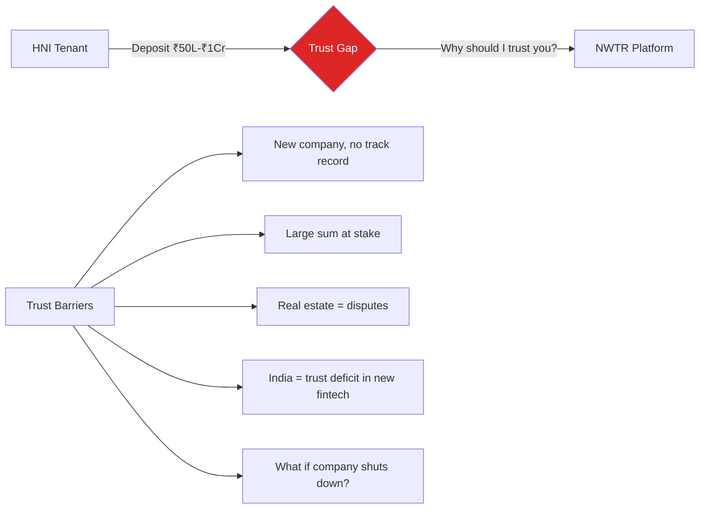
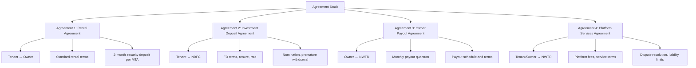
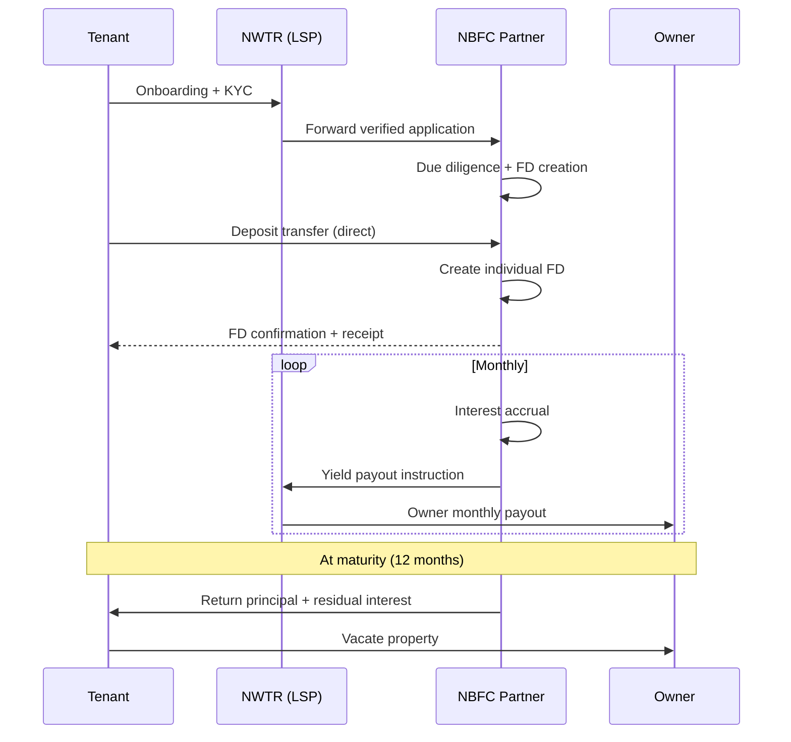
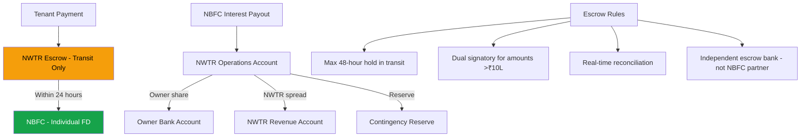
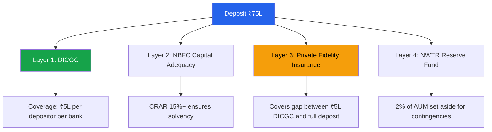
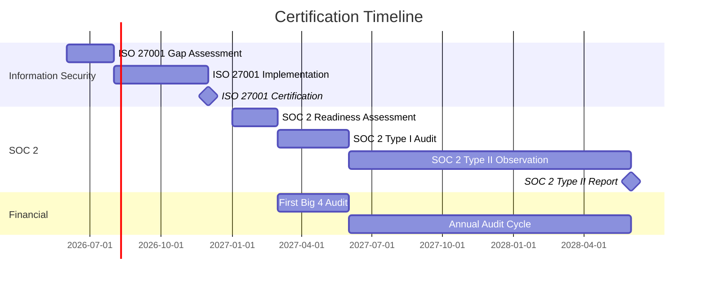

# Trust & Compliance Strategy

## TL;DR

NWTR's core challenge is convincing HNIs to deposit ₹50L-₹1Cr+ with a new platform. The trust architecture is built on five pillars: (1) RBI-regulated NBFC custodianship of deposits, (2) per-property segregated accounts with individual FDs in tenant's name, (3) tripartite legal agreements with institutional escrow, (4) real-time transparency dashboard showing deposit status and yield, and (5) third-party audit and certification (Big 4 audit, ISO 27001, SOC 2). Phase 1 operates as a Loan Service Provider (LSP) model under an NBFC partner, transitioning to own NBFC-ICC license by Year 2-3. Compliance spans RBI (NBFC norms), SEBI (CIS avoidance), RERA (agent registration), PMLA (AML/KYC), and DPDP Act (data protection).

---

## 1. Trust Architecture

### 1.1 The Trust Problem

### 1.2 Trust Pillars

```mermaid
graph TD
    A[NWTR Trust Architecture] --> B[Pillar 1: Institutional Custody]
    A --> C[Pillar 2: Segregated Accounts]
    A --> D[Pillar 3: Legal Framework]
    A --> E[Pillar 4: Transparency]
    A --> F[Pillar 5: Third-Party Validation]
    
    B --> B1[RBI-regulated NBFC holds deposits]
    B --> B2[DICGC insurance up to ₹5L]
    B --> B3[Additional private insurance]
    
    C --> C1[Individual FD per tenant]
    C --> C2[Tenant is beneficial owner]
    C --> C3[No pooling of deposits]
    
    D --> D1[Tripartite agreement]
    D --> D2[Institutional escrow]
    D --> D3[Arbitration clause]
    
    E --> E1[Real-time deposit dashboard]
    E --> E2[Monthly yield statements]
    E --> E3[Quarterly audit reports]
    
    F --> F1[Big 4 audit]
    F --> F2[ISO 27001 certification]
    F --> F3[SOC 2 Type II]
    
    style A fill:#2563eb,color:#fff
```

### 1.3 Pillar 1: Institutional Custody

**Principle**: Tenant's money never touches NWTR's accounts.

| Flow Step | What Happens | Who Holds Funds | Regulatory Oversight |
|-----------|-------------|-----------------|---------------------|
| 1. Tenant initiates deposit | Instruction given | Tenant's bank | Banking regulation |
| 2. Transfer to NBFC | Direct bank transfer | NBFC partner | RBI NBFC norms |
| 3. FD creation | Individual FD in tenant's name | NBFC | RBI deposit norms |
| 4. FD matures / early withdrawal | Principal + interest returned | NBFC → Tenant | RBI + contract |

**NWTR's role**: Platform facilitator, NOT custodian. NWTR never holds, manages, or has signing authority over tenant deposits.

**Bankruptcy protection**: If NWTR shuts down, deposits remain with NBFC in tenant's name. NBFC's obligation to tenant is independent of NWTR's existence.

### 1.4 Pillar 2: Per-Property Segregated Accounts

**Design choice**: Individual FDs per tenant vs. pooled fund approach.

| Parameter | Individual FD (Chosen) | Pooled Fund | Rationale |
|-----------|----------------------|-------------|-----------|
| CIS risk | Minimal | High | No pooling = no CIS |
| Tenant visibility | Full (own FD statement) | Opaque | Trust building |
| Operational complexity | Higher | Lower | Worth the complexity |
| Yield optimization | Lower (no portfolio effect) | Higher | Accept trade-off |
| Regulatory clarity | Clear | Ambiguous | Risk reduction |
| Bankruptcy protection | Strong (individual asset) | Weak (pooled claims) | Investor confidence |

### 1.5 Pillar 3: Legal Agreement Framework

**Tripartite structure**:

### 1.6 Pillar 4: Transparency Infrastructure

**Real-time tenant dashboard**:
- Live FD status (active, maturity date, current value)
- Accrued interest calculator
- NBFC partner details and RBI registration number
- Insurance coverage confirmation
- Document vault (agreements, FD receipts, insurance certificates)
- Payout history to owner (visibility into where yield goes)

**Owner dashboard**:
- Monthly payout history and upcoming schedule
- Property occupancy status
- Tenant profile (anonymized relevant details)
- Yield performance vs. traditional rental
- Tax documentation (TDS certificates, Form 16A)

### 1.7 Pillar 5: Third-Party Validation

| Certification | Purpose | Timeline | Cost |
|--------------|---------|----------|------|
| Big 4 financial audit | Validate deposit safety and fund flows | Annually from Year 1 | ₹15-25L/year |
| ISO 27001 | Information security management | Year 1 (6-month process) | ₹8-12L |
| SOC 2 Type II | Security, availability, confidentiality controls | Year 2 (12-month observation) | ₹20-30L |
| CISA-certified tech audit | Platform security assessment | Annually | ₹5-8L |
| Legal compliance certificate | Regulatory adherence confirmation | Quarterly | ₹3-5L/quarter |

---

## 2. NBFC Partnership Structure

### 2.1 Phase 1: LSP (Loan Service Provider) Model

**LSP model advantages**:
- No NBFC license required for NWTR initially
- NBFC partner provides regulatory cover
- Lower compliance burden in Year 1
- Faster time to market (3-6 months vs. 18-24 months for own license)

**LSP model constraints**:
- Revenue share with NBFC partner (25-40% of spread)
- Dependent on partner's risk appetite
- Limited control over deposit terms
- Must comply with RBI's digital lending guidelines for LSPs

### 2.2 Phase 2: Own NBFC-ICC License (Year 2-3)

| Requirement | Details | NWTR Readiness |
|------------|---------|----------------|
| Net Owned Funds (NOF) | ₹10 Cr minimum | Series A allocation |
| CRAR | 15% minimum | Capital structure designed for 20%+ |
| Promoter track record | Clean, no criminal cases | Verified |
| Business plan | Detailed 5-year plan | This document suite |
| IT infrastructure | As per RBI IT guidelines | Cloud-first architecture |
| Compliance officer | Qualified appointment | Budgeted in hiring plan |
| Application timeline | 12-18 months from filing | File in Month 6 |

### 2.3 NBFC Partner Selection Criteria

| Criterion | Weight | Minimum Threshold |
|----------|--------|-------------------|
| RBI registration (active, compliant) | Must-have | Valid NBFC-ICC or NBFC-D |
| AUM size | 20% | >₹500 Cr |
| Deposit acceptance capability | Must-have | Public deposit accepting |
| Technology integration capability | 15% | API-first, real-time |
| Geographic presence (Bangalore) | 10% | Physical office |
| Compliance track record | 20% | Zero RBI penalties (3 years) |
| Financial health (CRAR, NPA) | 20% | CRAR >18%, GNPA <3% |
| Cultural fit and responsiveness | 15% | Startup-friendly |

---

## 3. Escrow Account Design

### 3.1 Architecture Decision

**Chosen approach**: Individual FDs per tenant (not pooled escrow).

However, an operational escrow is needed for:
- Transit funds (before FD creation, 24-48 hour window)
- Owner payout staging (monthly disbursement)
- Platform fee collection
- Early exit processing

### 3.2 Escrow Structure

### 3.3 Escrow Controls

| Control | Description | Frequency |
|---------|-------------|-----------|
| Reconciliation | Transit account vs FD creation | Daily (automated) |
| Aging check | No funds >48 hours in transit | Real-time alert |
| Dual authorization | Large transactions (>₹10L) | Per transaction |
| Independent audit | Escrow account review | Monthly |
| Regulatory reporting | RBI returns on deposit status | Quarterly |

---

## 4. Regulatory Compliance Matrix

### 4.1 Comprehensive Compliance Map

| Regulator | Regulation | Applicability | Compliance Status | Owner |
|-----------|-----------|---------------|-------------------|-------|
| RBI | NBFC Master Directions | Phase 1: Via partner; Phase 2: Direct | In progress | Legal |
| RBI | Digital Lending Guidelines 2022 | LSP registration, disclosure norms | Planned | Compliance |
| RBI | KYC Master Direction 2016 (amended) | Full KYC for deposit acceptance | Planned | Operations |
| SEBI | CIS Regulations 1999 | Must NOT be classified as CIS | Active monitoring | Legal (external) |
| SEBI | Investment Advisers Regulations | If providing investment advice | May apply | Legal |
| RERA | State RERA Acts | Agent registration | Planned | Legal |
| FIU-IND | PMLA 2002 | STR reporting, record maintenance | Planned | Compliance |
| MeitY | DPDP Act 2023 | Data protection, consent management | Planned | Tech/Legal |
| MeitY | IT Act 2000 (Sec 43A) | Data security practices | Active | Tech |
| GSTN | GST Act | Service tax on platform fees | Active | Finance |
| CBDT | Income Tax Act | TDS on interest, rent | Active | Finance |

### 4.2 RBI Compliance (Priority 1)

**As LSP (Phase 1)**:
- Register as LSP with NBFC partner
- Follow digital lending guidelines (pricing disclosure, data access limits)
- No access to borrower's bank account
- Grievance redressal officer appointment
- Data localization (India servers only)
- Cooling-off period for digital loans (if applicable)

**As NBFC-ICC (Phase 2)**:
- Maintain NOF ≥ ₹10 Cr at all times
- CRAR ≥ 15%
- Asset classification and provisioning norms
- Fair practice code implementation
- Corporate governance norms (independent directors, audit committee)
- Annual RBI returns (NBS-1 to NBS-7)
- Quarterly ALM statements

### 4.3 SEBI Compliance (Priority 0 — Existential)

**CIS avoidance architecture**:

| CIS Criterion (SEBI Act Sec 11AA) | NWTR Structure | CIS? |
|-----------------------------------|----------------|------|
| Contributions pooled | Individual FDs, no pooling | ✗ No |
| Contributions used for scheme | NBFC creates individual instruments | ✗ No |
| Property managed on behalf of investors | NBFC manages (not NWTR) | ✗ No |
| Returns from scheme | Returns from individual FD (NBFC) | ✗ No |
| Investor lacks day-to-day control | Tenant can break FD anytime | ✗ No |

**Documentation requirements**:
1. Legal opinion from 2+ top-tier firms
2. SEBI informal guidance (if obtainable)
3. Structural audit by independent counsel annually
4. Board-level CIS risk review quarterly

### 4.4 PMLA/AML Compliance

```mermaid
graph TD
    A[AML Framework] --> B[Customer Due Diligence]
    A --> C[Transaction Monitoring]
    A --> D[Reporting Obligations]
    A --> E[Record Keeping]
    
    B --> B1[Identity verification - Aadhaar/PAN]
    B --> B2[Address verification]
    B --> B3[Source of funds verification]
    B --> B4[Beneficial ownership identification]
    B --> B5[PEP screening]
    B --> B6[Sanctions screening]
    
    C --> C1[Threshold-based alerts >₹10L]
    C --> C2[Pattern-based detection]
    C --> C3[Structuring detection]
    C --> C4[Velocity checks]
    
    D --> D1[CTR - Cash Transaction Reports]
    D --> D2[STR - Suspicious Transaction Reports]
    D --> D3[Filing to FIU-IND within 7 days]
    
    E --> E1[5-year record retention]
    E --> E2[Audit trail maintenance]
    E --> E3[Correspondence preservation]
```

### 4.5 DPDP Act 2023 Compliance

| Requirement | Implementation | Timeline |
|------------|---------------|----------|
| Consent management | Granular consent framework (collection, processing, sharing) | Pre-launch |
| Data Principal rights | Self-service portal (access, correction, erasure, portability) | Pre-launch |
| Data fiduciary obligations | DPO appointment, DPIA for high-risk processing | Pre-launch |
| Cross-border transfer | India-first data storage; limited transfer with consent | Pre-launch |
| Breach notification | 72-hour notification to DPB and data principals | Process established |
| Children's data | N/A (18+ customers only) | N/A |
| Significant data fiduciary | May apply at scale (>1M data principals) | Year 2-3 |

---

## 5. KYC/AML Framework

### 5.1 Tiered Verification

| Tier | Deposit Range | Verification Steps | Timeline |
|------|--------------|-------------------|----------|
| **Standard** | ₹10L - ₹25L | Aadhaar eKYC + PAN + Video KYC + Bank account verification | 24 hours |
| **Enhanced** | ₹25L - ₹1Cr | Standard + Income proof (ITR/salary slips) + Source of funds declaration + Employment verification | 48-72 hours |
| **Premium** | > ₹1Cr | Enhanced + CA-certified net worth + ITR (3 years) + Physical address verification + Enhanced source of funds (supporting documents) | 5-7 days |

### 5.2 Ongoing Monitoring

| Check | Frequency | Threshold |
|-------|-----------|-----------|
| Sanctions list re-screening | Quarterly | All customers |
| PEP status update | Annually | All customers |
| Transaction pattern review | Monthly | Flagged accounts |
| Source of funds re-verification | At renewal (12 months) | Enhanced/Premium tier |
| Adverse media monitoring | Weekly (automated) | All customers |

---

## 6. Audit Trail & Reporting

### 6.1 Audit Requirements

| Audit Type | Frequency | Auditor | Scope |
|-----------|-----------|---------|-------|
| Financial audit | Annual | Big 4 (Deloitte/PwC/EY/KPMG) | Full financial statements |
| Deposit reconciliation | Monthly | Internal audit + NBFC confirmation | 100% deposits verified |
| Compliance audit | Quarterly | External compliance firm | RBI, SEBI, PMLA adherence |
| IT security audit | Annual | CERT-IN empanelled auditor | VAPT, code review, infrastructure |
| Process audit | Semi-annual | Internal audit | SOPs, controls, exceptions |

### 6.2 Regulatory Reporting Calendar

| Report | Regulator | Frequency | Due Date |
|--------|-----------|-----------|----------|
| NBS-1 to NBS-7 | RBI | Annual | 30 days from year-end |
| ALM statement | RBI | Quarterly | 15 days from quarter-end |
| CTR | FIU-IND | Monthly | 15th of following month |
| STR | FIU-IND | As required | Within 7 days of detection |
| RERA returns | State RERA | Annual | As per state timeline |
| GST returns | GSTN | Monthly | 20th of following month |
| TDS returns | CBDT | Quarterly | 31st of following month |

---

## 7. Insurance Wrap

### 7.1 Deposit Protection Architecture

### 7.2 Insurance Products

| Coverage | Insurer Type | Premium (estimated) | Trigger |
|----------|-------------|--------------------| --------|
| Deposit fidelity guarantee | General insurer | 0.15-0.25% of coverage | NBFC default/fraud |
| Professional indemnity (E&O) | Specialty insurer | ₹5-8L/year for ₹10Cr cover | NWTR negligence claim |
| Cyber liability | Specialty insurer | ₹3-5L/year for ₹5Cr cover | Data breach, fraud |
| Crime/employee fidelity | General insurer | ₹2-3L/year | Internal fraud |
| D&O liability | Specialty insurer | ₹8-12L/year for ₹25Cr cover | Director/officer suits |

---

## 8. Dispute Resolution Mechanism

### 8.1 Escalation Ladder

| Level | Handler | SLA | Scope |
|-------|---------|-----|-------|
| L1 | Customer support | 24 hours response | Service queries, information |
| L2 | Relationship manager | 48 hours resolution | Payout delays, document issues |
| L3 | Grievance officer | 7 days resolution | Formal complaints |
| L4 | Internal ombudsman | 15 days resolution | Unresolved grievances |
| L5 | External mediator | 30 days | Failed internal resolution |
| L6 | Arbitration (SIAC/MCIA) | 90 days | Legal disputes |
| L7 | Court (last resort) | Variable | Fundamental rights issues |

### 8.2 Common Dispute Scenarios

| Scenario | Resolution Path | Liability |
|----------|----------------|-----------|
| Tenant wants early exit | Process per agreement terms; apply exit fee; return deposit from NBFC | NBFC returns deposit |
| Owner disputes payout amount | Reference agreement terms; escalate to finance | NWTR per agreement |
| Property damage dispute | Independent assessment; deduct from 2-month security deposit (not NWTR deposit) | Tenant (from security deposit) |
| NBFC delays deposit return | NWTR intervenes with NBFC; escalate to RBI ombudsman if needed | NBFC |
| Yield lower than expected | No guarantee of specific yield; reference agreement language | N/A (market risk) |

---

## 9. Trust-Building Communication Strategy

### 9.1 Transparency Reports

| Report | Audience | Frequency | Content |
|--------|----------|-----------|---------|
| Deposit Safety Report | All customers | Quarterly | Total deposits, NBFC health, insurance status |
| Yield Performance Report | All customers | Monthly | Actual vs expected yield, market context |
| Compliance Certificate | Customers + investors | Quarterly | Regulatory adherence confirmation |
| Annual Trust Report | Public (on website) | Annual | Full transparency on operations, safety, returns |

### 9.2 Trust Signals (Pre-Launch)

| Signal | Implementation | Impact |
|--------|---------------|--------|
| NBFC partnership announcement | Co-branded press release | "RBI-regulated partner" |
| Legal opinion publication | Summary on website (redacted) | "Top law firm validates structure" |
| Founder credibility | LinkedIn, media interviews, speaking at FICCI/CII | "Known, credible team" |
| Advisory board | Ex-RBI, ex-SEBI, industry veterans | "Institutional oversight" |
| Office in premium location | Indiranagar/Koramangala office | "They're real and accessible" |
| Beta testimonials | First 10 HNI customers | "People like me trust them" |

### 9.3 Ongoing Trust Maintenance

- Monthly email: "Your deposit status" with FD confirmation from NBFC
- Quarterly video: CEO transparency update (YouTube/website)
- Annual event: "NWTR Trust Summit" for customers and prospects
- Always-available: Real-time dashboard with deposit and yield status
- Crisis playbook: Pre-drafted communications for 10 crisis scenarios

---

## 10. Third-Party Certifications

### 10.1 Certification Roadmap

### 10.2 Certification Value Proposition

| Certification | Trust Signal to Customer | Effort | Priority |
|--------------|------------------------|--------|----------|
| ISO 27001 | "Bank-grade data security" | 6 months | High (Year 1) |
| SOC 2 Type II | "Independently verified controls" | 12 months observation | High (Year 2) |
| Big 4 financial audit | "Same auditor as top banks" | Annual | Critical (Year 1) |
| PCI DSS | "Payment data is secure" | 3-6 months | Medium (if card payments) |
| CERT-IN compliance | "Government-certified security" | Ongoing | Medium |

---

## Cross-References

- [Risk Analysis](./risk-analysis.md) — Comprehensive risk assessment and stress tests
- [Revenue Model](./revenue-model.md) — Financial structure and compliance costs
- [HNI Persona Analysis](./hni-persona-analysis.md) — Trust expectations by persona
- [India Market Fit](./india-market-fit.md) — Regulatory environment context
- [Competitor Analysis](./competitor-analysis.md) — Competitive trust positioning
