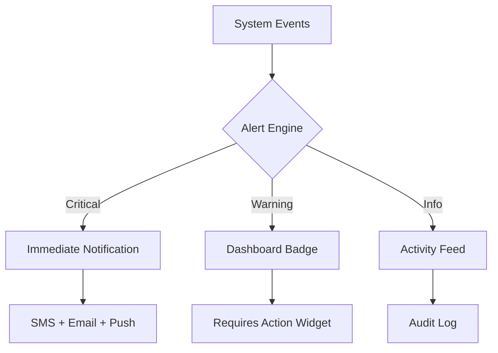
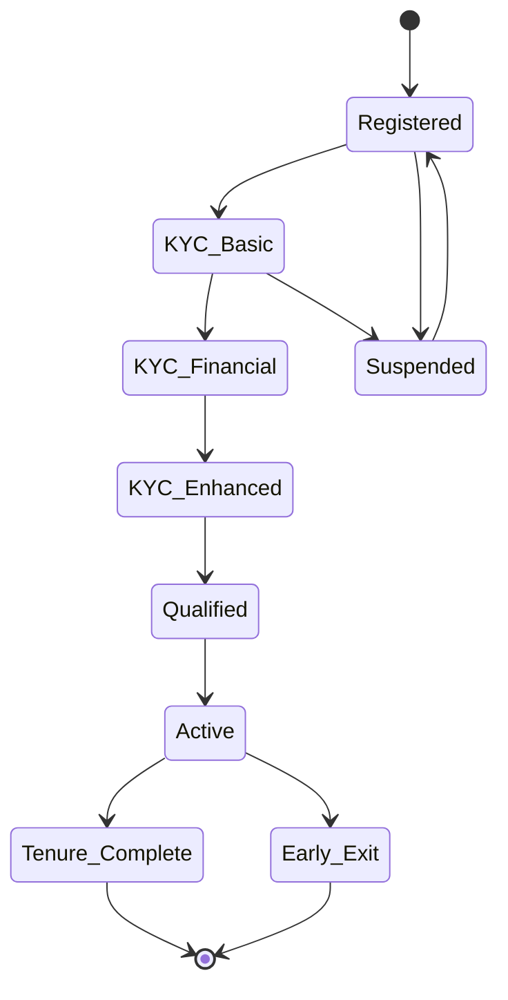
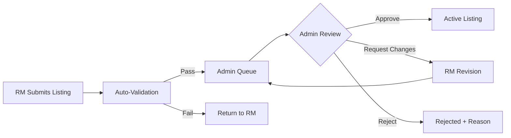
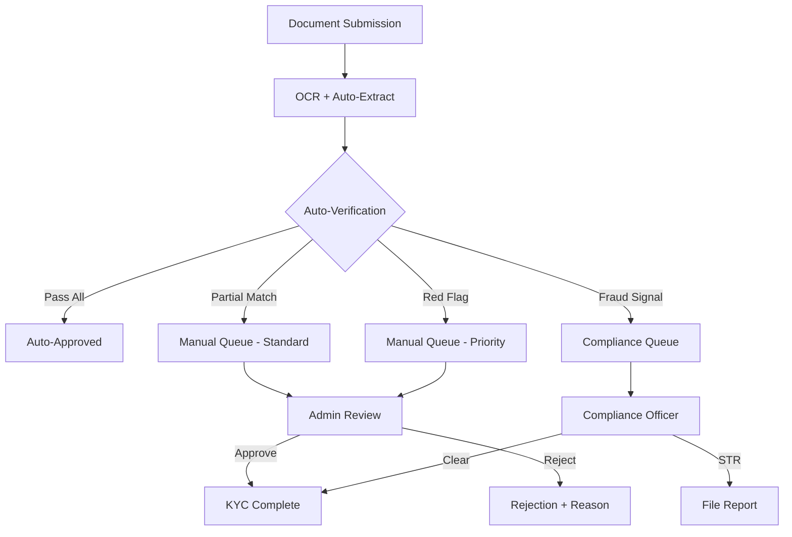
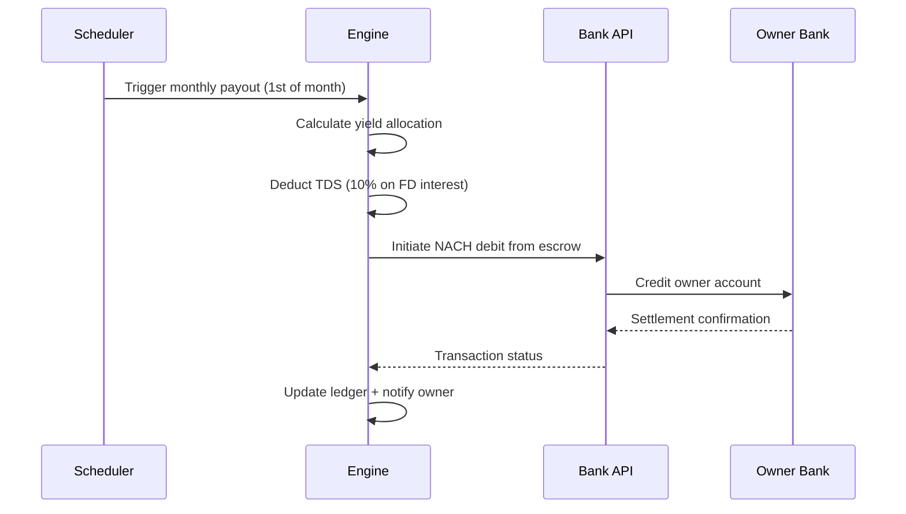
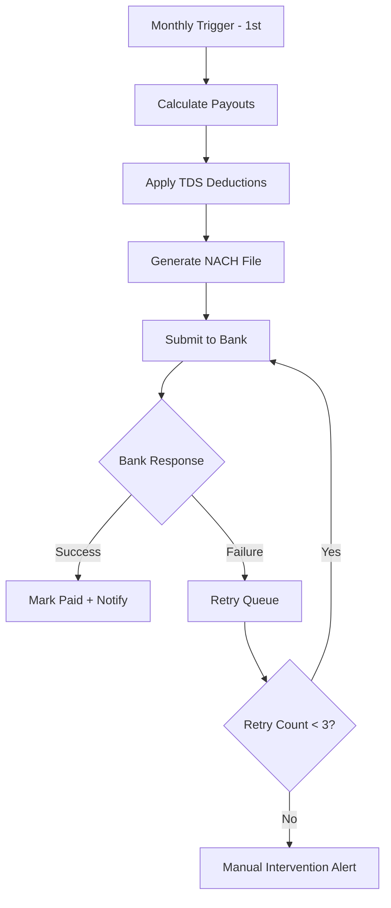
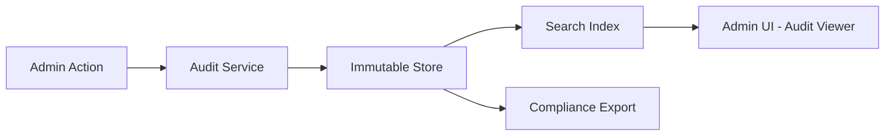

# Admin Portal Requirements

---
title: Admin Portal Requirements
version: 1.0
audience: Engineering, Product, Operations
last-updated: 2026-05-21
status: draft
related-docs:
  - "./prd.md"
  - "../02-technical/rbac-model.md"
  - "./rm-workflow.md"
---

## TL;DR

The NWTR Admin Portal is the centralized command center for platform operations — managing users, properties, KYC reviews, transactions, compliance, payouts, agreements, and analytics. It serves Admin and Super Admin roles with tiered access controls, real-time dashboards, and comprehensive audit trails. The portal must handle regulatory reporting (RBI/NBFC compliance), AML monitoring, and financial reconciliation while maintaining sub-second response times for critical operations.

---

## 1. Dashboard Overview

### 1.1 Key Metrics Panel

The landing dashboard presents a real-time operational snapshot:

| Metric Category | Indicators | Refresh Rate |
|----------------|-----------|--------------|
| Financial | Total AUM, Monthly yield, Payout pending | Real-time |
| Users | Active tenants, Active owners, Pending KYC | 5 min |
| Properties | Active listings, Matched, Vacant | 5 min |
| Compliance | Open AML alerts, STR filings pending | Real-time |
| Operations | Pending approvals, Escalations, SLA breaches | Real-time |

### 1.2 Alert System

**Critical Alerts:**
- Payout failure (NACH rejection)
- KYC fraud detection trigger
- AML threshold breach (₹10L+ single transaction, ₹50L+ monthly aggregate)
- Escrow account balance mismatch
- Investment maturity without renewal instruction

**Warning Alerts:**
- KYC documents expiring within 30 days
- SLA breach approaching (KYC review > 24 hours)
- Owner payout delay > 1 business day
- Property verification incomplete > 7 days

### 1.3 Pending Actions Queue

Prioritized task list with assignment and SLA tracking:

| Priority | Action Type | SLA | Escalation |
|----------|------------|-----|-----------|
| P0 | AML alert review | 4 hours | Super Admin |
| P1 | KYC Enhanced review | 24 hours | Senior Admin |
| P2 | Property approval | 48 hours | Admin Lead |
| P3 | Listing edits | 72 hours | Assigned RM |

---

## 2. User Management

### 2.1 Tenant Management

**Capabilities:**
- View and search all tenant profiles (with filters: status, city, deposit range, KYC tier)
- Override KYC status with documented reason and supervisor approval
- Initiate deposit refund process
- Freeze/unfreeze tenant account
- View communication history and support tickets
- Export tenant data (DPDP Act compliant, masked PII)

### 2.2 Owner Management

**Capabilities:**
- View and search all owner profiles
- Approve/reject owner onboarding
- Override payout schedules (with documented reason)
- Manage NACH mandate status
- View property portfolio per owner
- Initiate owner offboarding

### 2.3 RM (Relationship Manager) Management

| Function | Description |
|----------|-------------|
| Assignment | Auto-assign or manual assign tenants/owners to RMs |
| Territory | Define geographic zones per RM |
| Performance | Track conversions, SLA adherence, NPS |
| Escalation | Reassign on SLA breach or complaint |
| Access Control | Restrict data visibility to assigned portfolio |

### 2.4 Admin Management (Super Admin Only)

- Create/deactivate admin accounts
- Assign granular permissions (RBAC matrix)
- View admin activity logs
- Enforce 2FA enrollment
- IP whitelist management

---

## 3. Property Management

### 3.1 Listing Approval Workflow

**Auto-Validation Checks:**
- Minimum photo count (8 interior + 4 exterior)
- Photo quality score (resolution ≥ 1080p, no blur detection)
- Complete address with geocoding verification
- Property value within market range (±20% of circle rate)
- Owner KYC completion status
- No duplicate listing (address + owner hash)

### 3.2 Verification Status Tracking

| Verification Step | Responsible | Data Source |
|------------------|-------------|------------|
| Ownership proof | Admin | Document review |
| Encumbrance certificate | Admin | Sub-registrar API |
| RERA registration | Auto | RERA state portal |
| Physical inspection | RM | Field report + photos |
| Valuation assessment | Admin | Registered valuer report |
| Legal clearance | Legal team | Title search report |

### 3.3 Deactivation Rules

- Owner request → immediate delist (if no active tenant)
- Compliance violation → freeze + investigation
- Market dormancy → auto-archive after 90 days inactive
- Tenant match → status change to "Matched"

---

## 4. KYC Management

### 4.1 Review Queue Architecture

### 4.2 Review Interface Requirements

- Side-by-side document viewer (uploaded vs extracted data)
- Cross-reference panel (PAN-Aadhaar name match, address consistency)
- Previous rejection history
- Credit score summary (CIBIL/CRIF band, not raw score)
- One-click approval with checklist confirmation
- Bulk operations for batch processing

### 4.3 Re-verification Triggers

| Trigger | Action | Timeline |
|---------|--------|----------|
| Annual renewal | Aadhaar re-verification | 30 days before expiry |
| Address change | Re-verify current address | Immediate |
| Income change (self-declared) | Re-check financial KYC | 7 days |
| Regulatory mandate | Batch re-verification | As per circular |
| Fraud report on linked entity | Enhanced review | Immediate |

---

## 5. Transaction Management

### 5.1 Deposit Tracking

| Field | Description |
|-------|-------------|
| Transaction ID | Unique system-generated |
| Tenant | Linked tenant profile |
| Property | Linked property |
| Amount | Deposit value (₹) |
| Status | Initiated / In-transit / Confirmed / Invested / Maturing / Returned |
| Bank Reference | UTR number |
| Timestamp | IST with millisecond precision |

### 5.2 Investment Portfolio View

- Per-deposit instrument allocation breakdown
- Current NAV and accrued yield
- Maturity schedule calendar
- Reinvestment decisions pending
- NBFC partner API health status

### 5.3 Payout Management

### 5.4 Refund Processing

- Full refund at tenure completion (T+3 business days)
- Early exit refund (penalty deduction + T+7 business days)
- Partial refund on property defect claim (dispute resolution)
- Admin override refund (documented, dual approval required)

---

## 6. Compliance Monitoring

### 6.1 AML Framework

**Rule Engine Parameters:**
- Single transaction ≥ ₹10,00,000 → Flag
- Monthly aggregate ≥ ₹50,00,000 → Flag
- Multiple deposits from same source in 24h → Flag
- PEP (Politically Exposed Person) match → Enhanced monitoring
- Adverse media match → Review
- Unusual pattern (deposit + immediate exit request) → Investigate

### 6.2 Suspicious Transaction Reporting (STR)

| Step | Actor | Timeline |
|------|-------|----------|
| Detection | System/Admin | Real-time |
| Investigation | Compliance Officer | 48 hours |
| Decision | MLRO (Money Laundering Reporting Officer) | 24 hours |
| Filing | MLRO | Within 7 days of suspicion |
| Submission | System | FIU-IND portal upload |

### 6.3 Regulatory Reporting

- Monthly CKYC uploads to CERSAI
- Quarterly NBFC returns assistance
- Annual compliance certificate data
- Ad-hoc RBI inspection data preparation

---

## 7. Payout Engine Management

### 7.1 Schedule Configuration

### 7.2 Manual Triggers

- Ad-hoc payout (e.g., owner hardship, early partial)
- Requires dual Admin approval
- Documented reason mandatory
- Reflected in reconciliation separately

### 7.3 Reconciliation

| Frequency | Scope | Output |
|-----------|-------|--------|
| Daily | Bank statement vs ledger | Exception report |
| Weekly | Investment NAV vs expected yield | Variance report |
| Monthly | Full P&L per property | Financial statement |
| Quarterly | Regulatory compliance check | Compliance report |

---

## 8. Agreement Management

### 8.1 Template Management

- Tripartite agreement base template (Tenant-Owner-NWTR)
- State-specific stamp duty variations
- Custom clause library (early exit, maintenance, escalation)
- Version control with diff viewer
- Legal team approval workflow for template changes

### 8.2 Signing Status Tracker

| Status | Description |
|--------|-------------|
| Draft | Template populated with party details |
| Pending Stamp | Awaiting e-stamp procurement |
| Stamped | E-stamp affixed, awaiting signatures |
| Partial Sign | 1 or 2 of 3 parties signed |
| Fully Executed | All parties signed, legally binding |
| Amended | Post-execution amendment recorded |
| Terminated | Early termination processed |

### 8.3 Amendment Workflow

- Party requests amendment via platform
- Legal review of proposed change
- All parties must consent (e-sign)
- Supplementary agreement generated
- Original remains on record, amendment linked

---

## 9. Analytics & Reporting

### 9.1 Business Metrics Dashboard

| Metric | Formula | Target |
|--------|---------|--------|
| Conversion Rate | Active Tenants / Registered Users | ≥ 8% |
| Average Deposit Size | Sum(Deposits) / Count(Active) | ₹50L+ |
| Owner Retention | Re-listed / Total Completed | ≥ 70% |
| Time to Match | Median(Listing Active → Matched) | ≤ 30 days |
| NPS (Tenant) | Standard NPS survey | ≥ 50 |
| NPS (Owner) | Standard NPS survey | ≥ 60 |

### 9.2 Compliance Reports

- KYC completion rates by tier and timeframe
- AML alert resolution time distribution
- STR filing log with status
- DPDP data access request log

### 9.3 Financial Reports

- Monthly yield report (per instrument type)
- TDS deduction summary (Form 26Q data)
- Escrow account statement
- NBFC investment summary
- Revenue recognition report

---

## 10. Configuration

### 10.1 System Settings

| Setting | Default | Range |
|---------|---------|-------|
| KYC Auto-Approval Threshold | 95% match | 90-100% |
| Payout Day | 1st of month | 1-5 |
| NACH Retry Attempts | 3 | 1-5 |
| Document Retention Period | 8 years | As per regulation |
| Session Timeout | 30 minutes | 15-60 min |
| 2FA Enforcement | Mandatory | Cannot disable |

### 10.2 Fee Structures

- Platform fee configuration (% of yield or fixed)
- Early exit penalty schedule (month-wise %)
- Processing fee for deposit transfer
- Late payout compensation rate

### 10.3 Investment Parameters

| Parameter | Value | Adjustable By |
|-----------|-------|--------------|
| FD Allocation % | 60% | Super Admin |
| T-Bill Allocation % | 25% | Super Admin |
| G-Sec Allocation % | 15% | Super Admin |
| Minimum FD Tenure | 6 months | Super Admin |
| Auto-Reinvest | Enabled | Super Admin |

---

## 11. Audit Trail Viewer

### 11.1 Logged Events

Every administrative action generates an immutable audit record:

**Captured Fields:**
- Timestamp (UTC + IST)
- Actor (admin ID, name, role)
- Action (CRUD operation type)
- Target (entity type + ID)
- Before state (JSON snapshot)
- After state (JSON snapshot)
- IP address and device fingerprint
- Session ID

### 11.2 Search & Filter

- Date range picker
- Actor filter (specific admin)
- Action type filter (create, update, delete, approve, reject)
- Entity type filter (user, property, KYC, transaction, payout)
- Free-text search across change payloads
- Export to CSV/PDF for compliance

### 11.3 Retention & Immutability

- Minimum 8-year retention (RBI requirement)
- Write-once storage (no delete capability)
- Cryptographic hash chain for tamper detection
- Quarterly integrity verification job

---

## Cross-References

- [Tenant Journey](./tenant-journey.md) — Lifecycle stages managed via this portal
- [Owner Journey](./owner-journey.md) — Owner onboarding and payout management
- [KYC Flow](./kyc-flow.md) — Detailed KYC tier architecture
- [Transaction Flow](./transaction-flow.md) — Full transaction lifecycle
- [Escrow & Deposit Logic](./escrow-deposit-logic.md) — Investment and payout engine
- [Verification Flow](./verification-flow.md) — Document verification integrations

---

## Access Control Matrix

| Feature | Super Admin | Admin | Compliance Officer | RM |
|---------|:-----------:|:-----:|:-----------------:|:--:|
| User CRUD | ✓ | ✓ | View | Own portfolio |
| Property Approve | ✓ | ✓ | — | Submit |
| KYC Override | ✓ | ✓ | ✓ | — |
| Transaction Refund | ✓ | Initiate | — | — |
| AML Review | ✓ | — | ✓ | — |
| System Config | ✓ | View | — | — |
| Audit Viewer | ✓ | Own actions | ✓ | — |
| Reports Export | ✓ | ✓ | Compliance only | — |

---

## Non-Functional Requirements

| Requirement | Target |
|-------------|--------|
| Page Load Time | < 2 seconds (P95) |
| Search Response | < 500ms |
| Concurrent Admins | 50+ |
| Uptime | 99.9% |
| Data Encryption | AES-256 at rest, TLS 1.3 in transit |
| Backup RPO | 1 hour |
| Backup RTO | 4 hours |
| Accessibility | WCAG 2.1 AA |
