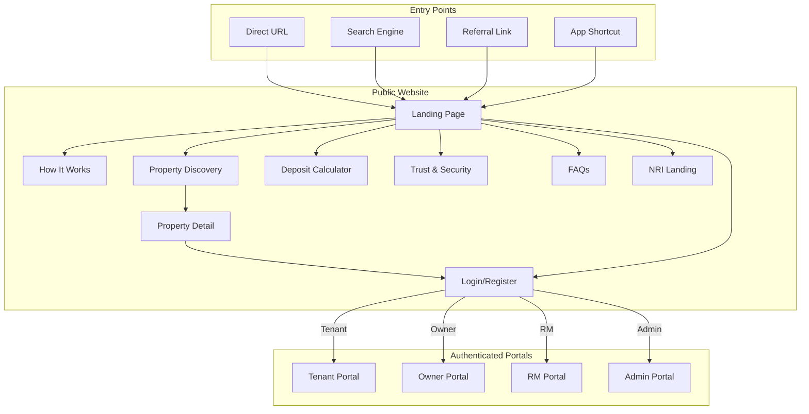
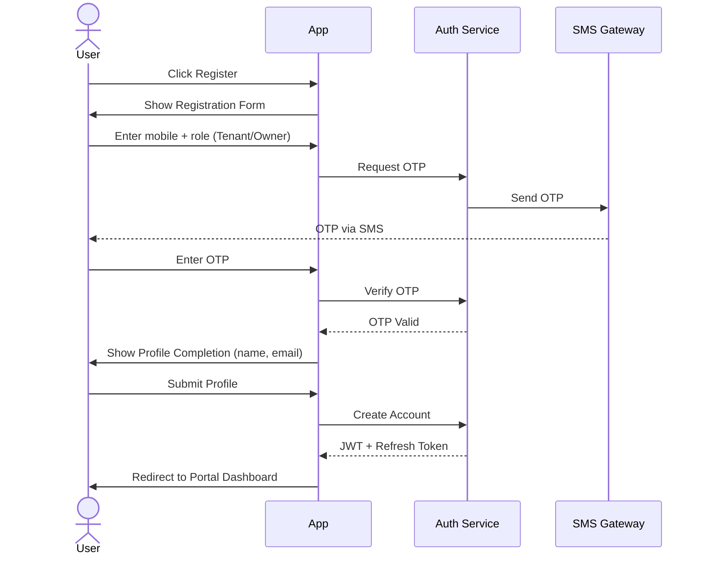
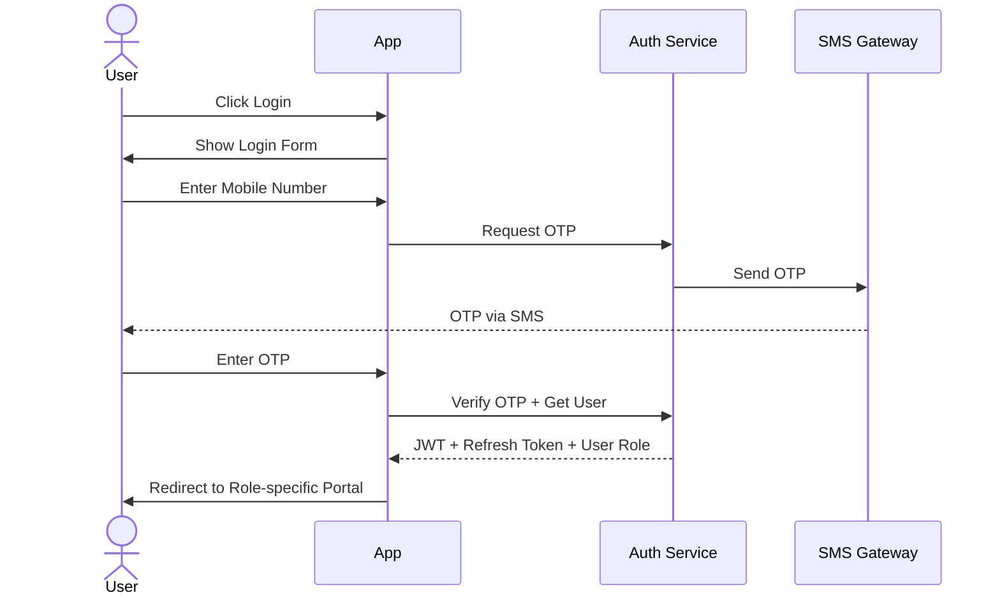
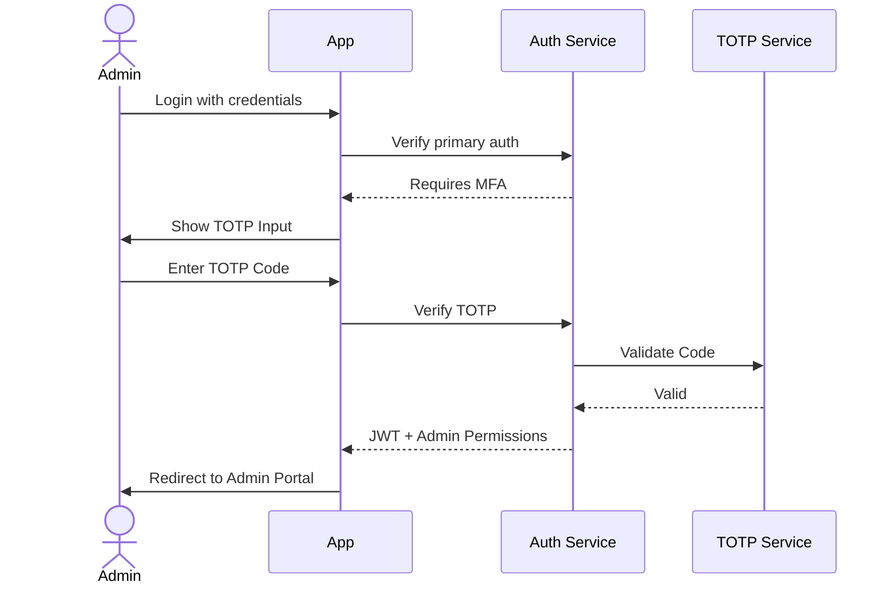
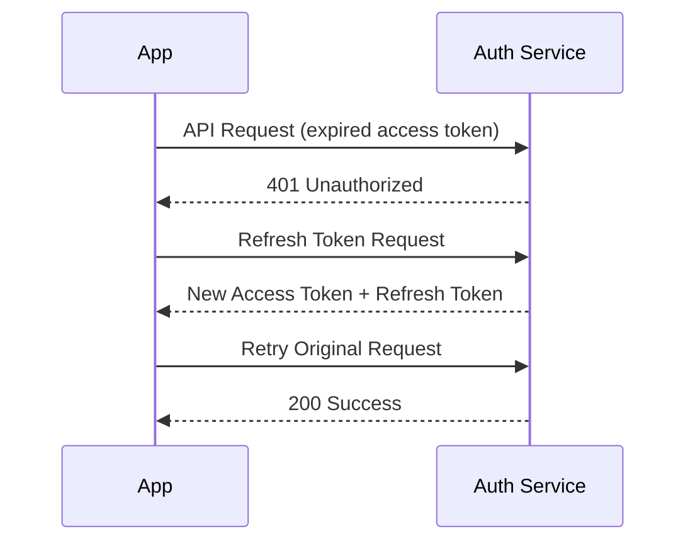

# Application Flow — NWTR

## TL;DR

Complete navigation architecture for all 5 NWTR portals, including information architecture, authentication flows, cross-portal navigation, and deep-linking strategy. This document maps every screen and transition in the platform.

---

## 1. Complete Application Navigation Map



---

## 2. Public Website Information Architecture

```mermaid
graph TD
    PW[nwtr.in] --> HOME[/ Home]
    PW --> HIW[/how-it-works]
    PW --> PROPS[/properties]
    PW --> CALC[/calculator]
    PW --> TRUST[/trust-security]
    PW --> FAQ[/faqs]
    PW --> NRI[/nri]
    PW --> BLOG[/blog]
    PW --> ABOUT[/about]
    PW --> CONTACT[/contact]
    PW --> TERMS[/terms]
    PW --> PRIVACY[/privacy]
    PW --> AUTH[/auth]

    PROPS --> PLIST[/properties?city=bangalore&bhk=3]
    PROPS --> PDETAIL[/properties/:slug]
    PDETAIL --> VISIT[/properties/:slug/schedule-visit]

    AUTH --> ALOGIN[/auth/login]
    AUTH --> AREG[/auth/register]
    AUTH --> AFORGOT[/auth/forgot-password]
    AUTH --> AVERIFY[/auth/verify-otp]

    BLOG --> BPOST[/blog/:slug]

    HIW --> HIWTENANT[/how-it-works/tenants]
    HIW --> HIWOWNER[/how-it-works/owners]
```

### URL Structure

| Page | URL Pattern | SEO |
|------|-------------|-----|
| Home | `/` | Indexed |
| Properties List | `/properties?city=&bhk=&deposit_min=&deposit_max=` | Indexed (canonical) |
| Property Detail | `/properties/bangalore/koramangala/3bhk-azure-heights-abc123` | Indexed |
| Calculator | `/calculator` | Indexed |
| How It Works | `/how-it-works` | Indexed |
| Auth | `/auth/login`, `/auth/register` | No-index |

---

## 3. Tenant Portal Information Architecture

```mermaid
graph TD
    TP[/tenant] --> TDASH[/tenant/dashboard]
    TP --> TBROWSE[/tenant/properties]
    TP --> TKYC[/tenant/kyc]
    TP --> TAGREE[/tenant/agreements]
    TP --> TDOCS[/tenant/documents]
    TP --> TCOMM[/tenant/messages]
    TP --> TPROFILE[/tenant/profile]
    TP --> TEXIT[/tenant/exit]

    TDASH --> TDASH_ACTIVE[/tenant/dashboard/tenancy/:id]
    TDASH --> TDASH_DEPOSIT[/tenant/dashboard/deposit-status]

    TBROWSE --> TBDETAIL[/tenant/properties/:id]
    TBDETAIL --> TBVISIT[/tenant/properties/:id/schedule-visit]
    TBDETAIL --> TBSIM[/tenant/properties/:id/simulate]

    TKYC --> TKYC1[/tenant/kyc/basic]
    TKYC --> TKYC2[/tenant/kyc/enhanced]
    TKYC --> TKYC3[/tenant/kyc/full]
    TKYC --> TKYCSTATUS[/tenant/kyc/status]

    TAGREE --> TAGREE_VIEW[/tenant/agreements/:id]
    TAGREE --> TAGREE_SIGN[/tenant/agreements/:id/sign]

    TP --> TDEPOSIT[/tenant/deposit]
    TDEPOSIT --> TDEP_TRANSFER[/tenant/deposit/transfer/:agreement_id]
    TDEPOSIT --> TDEP_STATUS[/tenant/deposit/status/:id]

    TEXIT --> TEXIT_INIT[/tenant/exit/initiate]
    TEXIT --> TEXIT_STATUS[/tenant/exit/status/:id]
    TEXIT --> TEXIT_HANDOVER[/tenant/exit/handover/:id]
```

### Tenant Portal Navigation

| Section | Access Level | KYC Required |
|---------|-------------|--------------|
| Dashboard | All authenticated | None |
| Browse Properties | All authenticated | None |
| Property Detail | All authenticated | None |
| Deposit Simulator | All authenticated | None |
| Schedule Visit | KYC Tier 2+ | Enhanced |
| Agreements | KYC Tier 3 | Full |
| Deposit Transfer | KYC Tier 3 + Agreement signed | Full |
| Exit | Active tenancy | Full |
| Messages | All authenticated | None |
| Documents | All authenticated | None |
| Profile | All authenticated | None |

---

## 4. Owner Portal Information Architecture

```mermaid
graph TD
    OP[/owner] --> ODASH[/owner/dashboard]
    OP --> OLIST[/owner/properties]
    OP --> OKYC[/owner/kyc]
    OP --> OPAY[/owner/payouts]
    OP --> OAGREE[/owner/agreements]
    OP --> OCOMM[/owner/messages]
    OP --> OPROFILE[/owner/profile]

    ODASH --> ODASH_PROP[/owner/dashboard/property/:id]
    ODASH --> ODASH_EARN[/owner/dashboard/earnings]

    OLIST --> OLIST_NEW[/owner/properties/new]
    OLIST --> OLIST_EDIT[/owner/properties/:id/edit]
    OLIST --> OLIST_VIEW[/owner/properties/:id]
    OLIST_VIEW --> OLIST_VISITS[/owner/properties/:id/visits]
    OLIST_VIEW --> OLIST_INTEREST[/owner/properties/:id/interested]

    OKYC --> OKYC_ID[/owner/kyc/identity]
    OKYC --> OKYC_OWN[/owner/kyc/ownership]
    OKYC --> OKYC_BANK[/owner/kyc/bank]
    OKYC --> OKYC_STATUS[/owner/kyc/status]

    OPAY --> OPAY_SCHEDULE[/owner/payouts/schedule]
    OPAY --> OPAY_HISTORY[/owner/payouts/history]
    OPAY --> OPAY_REPORTS[/owner/payouts/reports]

    OAGREE --> OAGREE_VIEW[/owner/agreements/:id]
    OAGREE --> OAGREE_SIGN[/owner/agreements/:id/sign]
```

---

## 5. RM Portal Information Architecture

```mermaid
graph TD
    RM[/rm] --> RMDASH[/rm/dashboard]
    RM --> RMLEADS[/rm/leads]
    RM --> RMVISITS[/rm/visits]
    RM --> RMDEALS[/rm/deals]
    RM --> RMPERF[/rm/performance]
    RM --> RMCOMM[/rm/communications]
    RM --> RMPROFILE[/rm/profile]

    RMDASH --> RMDASH_TODAY[/rm/dashboard/today]
    RMDASH --> RMDASH_TASKS[/rm/dashboard/tasks]

    RMLEADS --> RMLEADS_VIEW[/rm/leads/:id]
    RMLEADS_VIEW --> RMLEADS_KYC[/rm/leads/:id/kyc-status]
    RMLEADS_VIEW --> RMLEADS_DOCS[/rm/leads/:id/documents]
    RMLEADS_VIEW --> RMLEADS_NOTES[/rm/leads/:id/notes]
    RMLEADS_VIEW --> RMLEADS_COMM[/rm/leads/:id/communication]

    RMVISITS --> RMVISITS_CAL[/rm/visits/calendar]
    RMVISITS --> RMVISITS_DETAIL[/rm/visits/:id]

    RMDEALS --> RMDEALS_PIPE[/rm/deals/pipeline]
    RMDEALS --> RMDEALS_VIEW[/rm/deals/:id]
    RMDEALS_VIEW --> RMDEALS_TIMELINE[/rm/deals/:id/timeline]

    RMPERF --> RMPERF_METRICS[/rm/performance/metrics]
    RMPERF --> RMPERF_LEADER[/rm/performance/leaderboard]
    RMPERF --> RMPERF_COMMIS[/rm/performance/commission]
```

---

## 6. Admin Portal Information Architecture

```mermaid
graph TD
    AD[/admin] --> ADDASH[/admin/dashboard]
    AD --> ADKYC[/admin/kyc]
    AD --> ADTXN[/admin/transactions]
    AD --> ADCOMP[/admin/compliance]
    AD --> ADUSERS[/admin/users]
    AD --> ADPAY[/admin/payouts]
    AD --> ADAGREE[/admin/agreements]
    AD --> ADPROP[/admin/properties]
    AD --> ADANALYTICS[/admin/analytics]
    AD --> ADCONFIG[/admin/config]
    AD --> ADAUDIT[/admin/audit]
    AD --> ADPARTNER[/admin/partners]

    ADKYC --> ADKYC_QUEUE[/admin/kyc/queue]
    ADKYC --> ADKYC_REVIEW[/admin/kyc/:id/review]
    ADKYC --> ADKYC_HISTORY[/admin/kyc/history]

    ADTXN --> ADTXN_DEPOSITS[/admin/transactions/deposits]
    ADTXN --> ADTXN_PAYOUTS[/admin/transactions/payouts]
    ADTXN --> ADTXN_REFUNDS[/admin/transactions/refunds]
    ADTXN --> ADTXN_DETAIL[/admin/transactions/:id]

    ADUSERS --> ADUSERS_LIST[/admin/users?role=&status=]
    ADUSERS --> ADUSERS_DETAIL[/admin/users/:id]
    ADUSERS --> ADUSERS_ROLES[/admin/users/roles]

    ADPAY --> ADPAY_SCHEDULE[/admin/payouts/schedule]
    ADPAY --> ADPAY_APPROVE[/admin/payouts/approve]
    ADPAY --> ADPAY_RECONCILE[/admin/payouts/reconcile]

    ADCONFIG --> ADCONFIG_FLAGS[/admin/config/feature-flags]
    ADCONFIG --> ADCONFIG_THRESH[/admin/config/thresholds]
    ADCONFIG --> ADCONFIG_NOTIF[/admin/config/notifications]
```

---

## 7. Authentication Flows

### 7.1 Registration Flow



### 7.2 Login Flow



### 7.3 MFA Flow (Admin/Super Admin)



### 7.4 Token Refresh Flow



---

## 8. Cross-Portal Navigation Points

| From | To | Trigger | Auth Required |
|------|----|---------|---------------|
| Public Website | Tenant Portal | Login as Tenant | Yes |
| Public Website | Owner Portal | Login as Owner | Yes |
| Tenant Portal | Public Website | Logo click, "Browse More" | No |
| Owner Portal | Public Website | Logo click | No |
| RM Portal | Tenant view | "View as Tenant" (read-only) | RM auth |
| RM Portal | Owner view | "View as Owner" (read-only) | RM auth |
| Admin Portal | Any user profile | User management drill-down | Admin auth |
| Admin Portal | Transaction detail | Transaction monitoring | Admin auth |

### Role Switching

- Users with multiple roles (e.g., an owner who is also a tenant) see a role switcher in the nav
- Role switch preserves session but changes portal context
- Each role has independent KYC and profile data

---

## 9. Deep-Linking Strategy

### URL Schema

| Pattern | Example | Use Case |
|---------|---------|----------|
| Property share | `nwtr.in/p/abc123` | WhatsApp/social sharing |
| Calculator result | `nwtr.in/calc?v=5000000&t=12` | Shareable simulation |
| Referral | `nwtr.in/r/USER_CODE` | Referral tracking |
| Agreement | `nwtr.in/tenant/agreements/AGR123` | Email notification link |
| KYC resume | `nwtr.in/tenant/kyc?step=2` | SMS reminder link |
| Visit confirm | `nwtr.in/visit/VISIT_ID/confirm` | WhatsApp confirmation |
| Payout detail | `nwtr.in/owner/payouts/PAY123` | Payout notification |

### Deep-Link Behavior

1. **Unauthenticated user**: Redirect to login, store intended URL, redirect back after auth
2. **Wrong role**: Show "access denied" with option to switch role (if multi-role)
3. **Expired/invalid link**: Show friendly error with navigation to relevant section
4. **Mobile app (future)**: Universal links with app detection

### UTM Tracking

All marketing links include UTM parameters:
- `utm_source`: Channel (google, facebook, whatsapp, referral)
- `utm_medium`: Type (cpc, organic, social, email)
- `utm_campaign`: Campaign name
- `utm_content`: Variant (for A/B testing)

---

## 10. Navigation Components

### Global Header (Public)

| Element | Behavior |
|---------|----------|
| Logo | → Home |
| Properties | → /properties |
| How It Works | → /how-it-works |
| Calculator | → /calculator |
| For Owners | → /how-it-works/owners |
| Login/Register | → /auth/login or /auth/register |

### Portal Sidebar (Authenticated)

| Section | Tenant | Owner | RM | Admin |
|---------|--------|-------|-----|-------|
| Dashboard | ✓ | ✓ | ✓ | ✓ |
| Properties/Leads | Browse | My Listings | Leads | Properties |
| KYC | My KYC | My KYC | — | KYC Queue |
| Agreements | My Agreements | My Agreements | Deals | All Agreements |
| Financial | Deposit | Payouts | Performance | Transactions |
| Messages | ✓ | ✓ | Communications | — |
| Documents | ✓ | ✓ | — | Audit Logs |
| Profile | ✓ | ✓ | ✓ | Users |
| Settings | ✓ | ✓ | ✓ | Config |

---

## Cross-References

- Feature Specifications: [docs/01-product/feature-specifications.md](./feature-specifications.md)
- UX Flows: [docs/01-product/ux-flows.md](./ux-flows.md)
- User Stories: [docs/01-product/user-stories.md](./user-stories.md)
