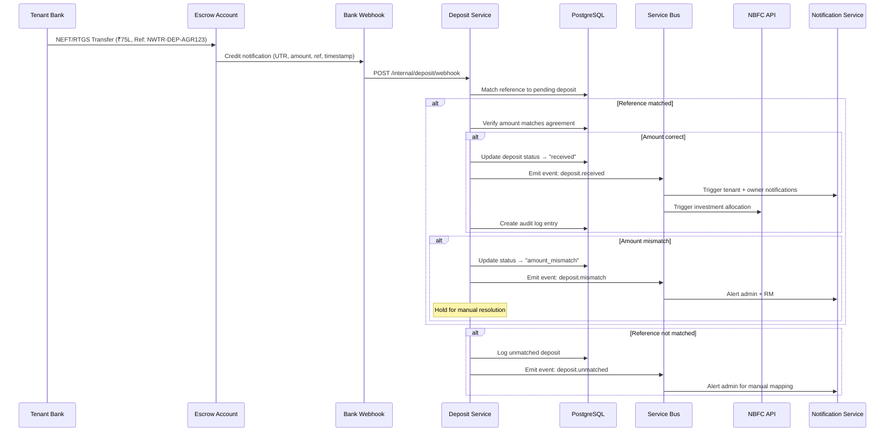
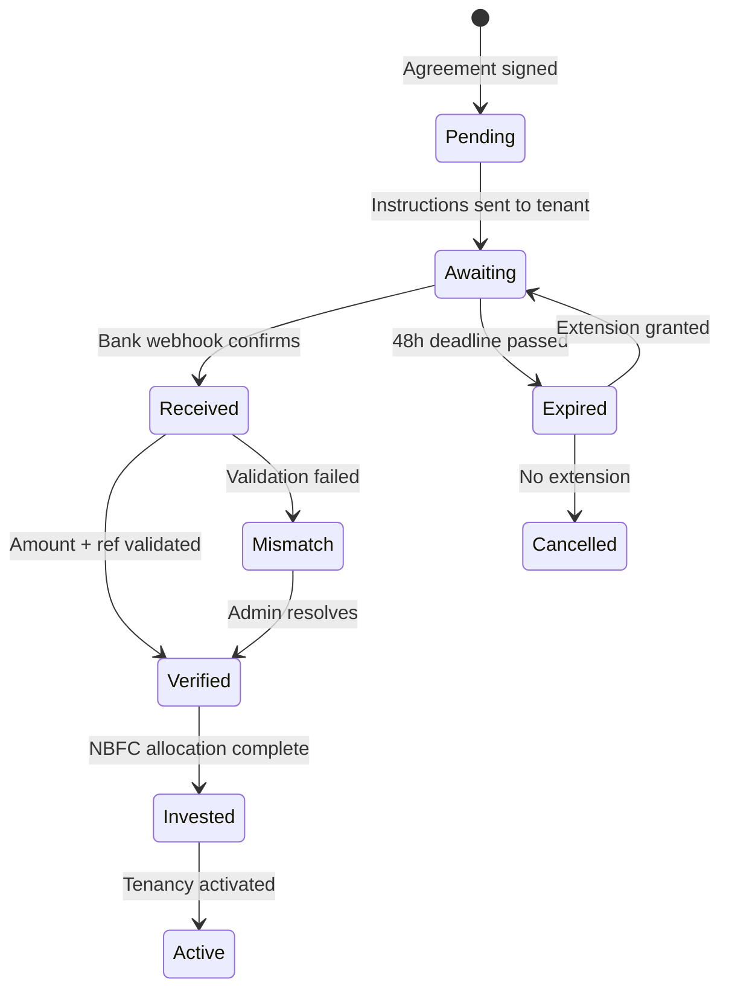
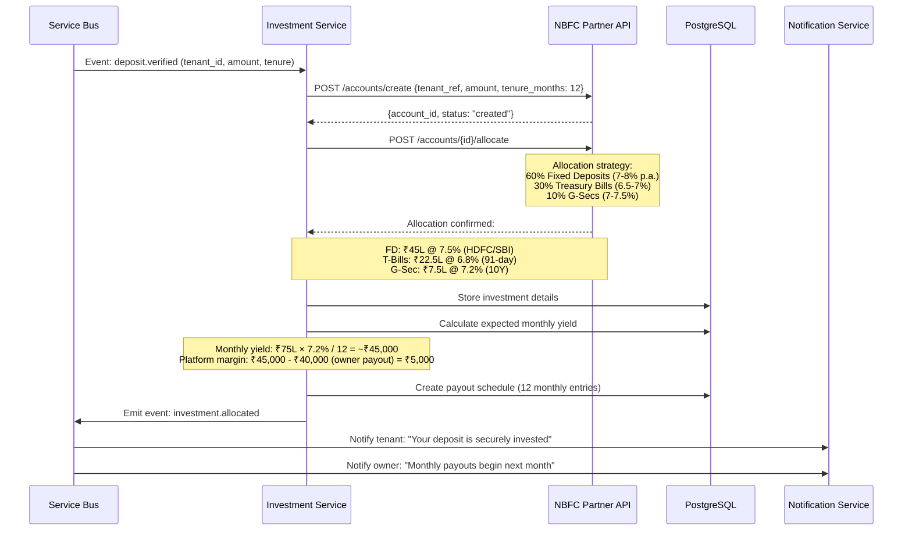
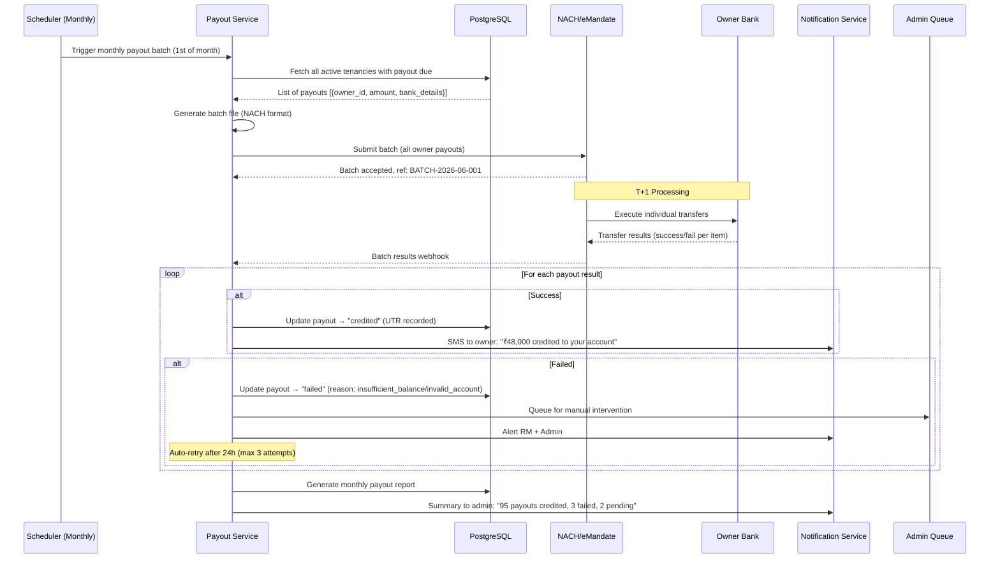
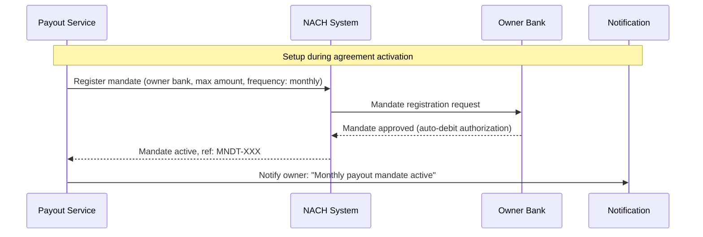
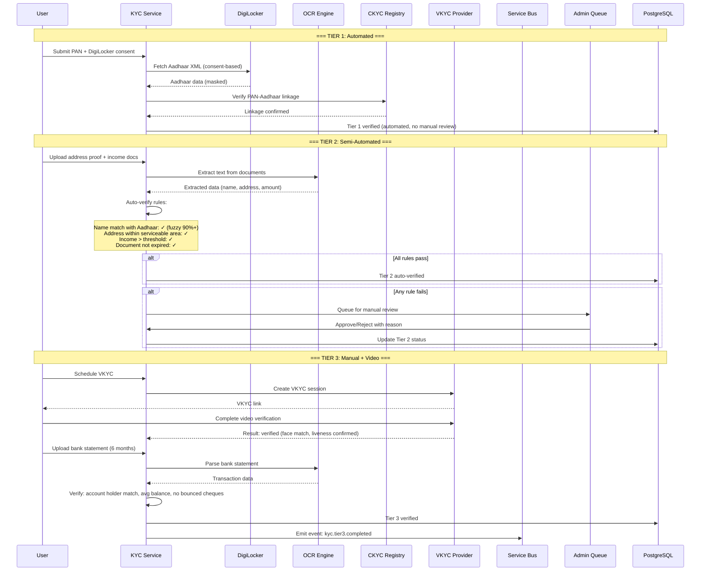
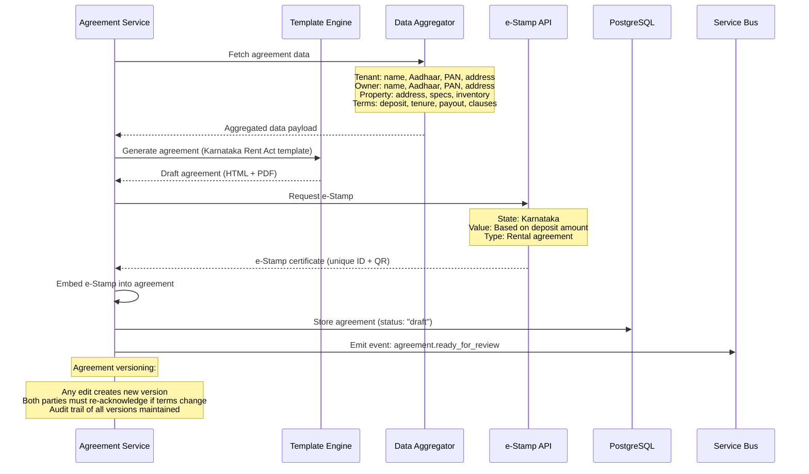
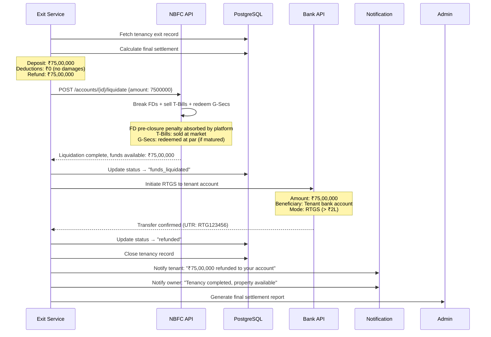
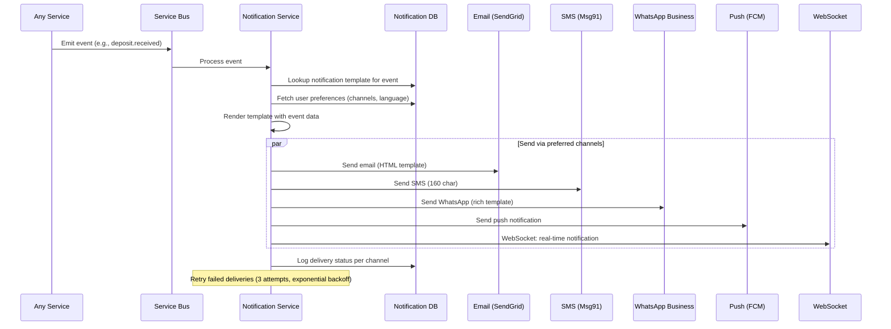
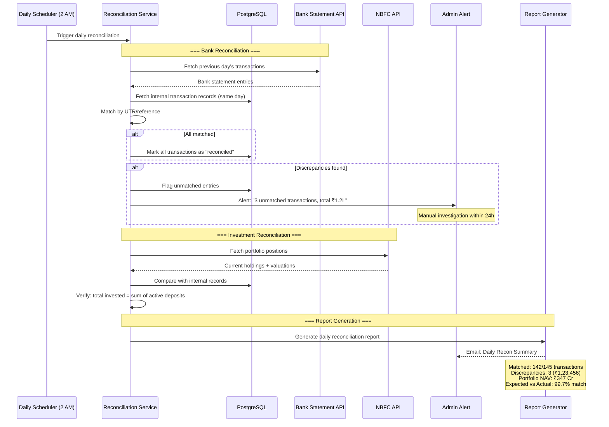

# Backend Workflows — NWTR

## TL;DR

Server-side process documentation for all critical backend workflows in NWTR. Covers deposit management, investment allocation, payout scheduling, KYC orchestration, agreement generation, refund processing, notifications, and reconciliation. Each workflow includes sequence diagrams, error handling, and retry strategies.

---

## 1. Deposit Collection Workflow



### Escrow Account Management

| Aspect | Detail |
|--------|--------|
| Account Type | Current account with escrow mandate |
| Bank Partner | Scheduled commercial bank (ICICI/HDFC/SBI) |
| Reconciliation | T+1 automated, daily manual review |
| Segregation | One pooled escrow, tracked per tenant internally |
| Audit | Daily balance reconciliation with DB records |

### Deposit States



---

## 2. Investment Allocation Workflow



### Investment Allocation Rules

| Rule | Constraint |
|------|-----------|
| Instrument eligibility | Only sovereign/quasi-sovereign (FD in scheduled banks, T-Bills, G-Secs) |
| Diversification | No single instrument > 60% of deposit |
| Liquidity | At least 20% in instruments with < 91-day maturity |
| Tenure matching | Investment maturity aligned to tenancy end date |
| Reinvestment | Auto-reinvest maturing T-Bills until tenure end |
| Minimum yield | Combined portfolio yield must exceed owner payout + platform margin |

---

## 3. Payout Scheduling Workflow



### NACH Mandate Setup



---

## 4. KYC Verification Workflow



### KYC SLA Matrix

| Tier | Auto-verify | Manual Review SLA | Rejection Re-attempt |
|------|-------------|-------------------|---------------------|
| Tier 1 | 95% (real-time) | 24h (if auto fails) | Immediate |
| Tier 2 | 60% (within 5min) | 48h | Within 7 days |
| Tier 3 | 30% (VKYC pass-through) | 72h | Within 14 days |

---

## 5. Agreement Generation Workflow



### Agreement Template Variables

| Category | Variables |
|----------|-----------|
| Parties | tenant_name, tenant_aadhaar, owner_name, owner_aadhaar |
| Property | address, area_sqft, bhk, floor, society_name |
| Financial | deposit_amount, monthly_payout, tenure_months |
| Dates | start_date, end_date, notice_period_days |
| Legal | jurisdiction, dispute_resolution, governing_law |
| Exit | early_exit_penalty, refund_timeline_days |

---

## 6. Deposit Return Workflow



### Settlement Calculation

| Component | Formula |
|-----------|---------|
| Base refund | Original deposit amount |
| Damage deduction | Inspection report amount (if any) |
| Early exit penalty | 2% of deposit (if before tenure end) |
| Pending utilities | Outstanding bills transferred to tenant |
| Final refund | Base - damages - penalty - utilities |

---

## 7. Notification Orchestration



### Notification Priority Matrix

| Priority | Channels | Examples |
|----------|----------|----------|
| Critical | SMS + WhatsApp + Push + InApp | Deposit received, payout credited, agreement ready |
| High | WhatsApp + Push + InApp + Email | KYC approved, visit confirmed, exit initiated |
| Medium | Push + InApp + Email | New property match, maintenance update |
| Low | InApp + Email (digest) | Tips, blog posts, feature updates |

### Template Management

| Template | Variables | Channels |
|----------|-----------|----------|
| deposit_received | {amount, property_name} | SMS, WhatsApp, Email, Push |
| payout_credited | {amount, month, utr} | SMS, WhatsApp |
| kyc_approved | {tier, next_step} | Push, Email |
| visit_reminder | {property, date, time, rm_name, rm_phone} | WhatsApp, SMS |
| agreement_ready | {property, counterparty} | Email, Push |
| exit_refund | {amount, bank_last4} | SMS, WhatsApp, Email |

---

## 8. Reconciliation Workflow



### Reconciliation Types

| Type | Frequency | Tolerance | Escalation |
|------|-----------|-----------|------------|
| Bank statement vs internal | Daily (T+1) | ₹0 (exact match) | Immediate if > ₹10,000 |
| NBFC holdings vs records | Weekly | 0.1% variance | 48h resolution window |
| Payout batch vs credited | Daily (T+2) | ₹0 (exact match) | Same-day for failures |
| Platform fee collection | Monthly | ₹100 | Month-end adjustment |

---

## 9. Audit Log Generation

### Audit Events

| Event Category | Examples | Retention |
|----------------|----------|-----------|
| Authentication | Login, logout, failed attempts, MFA | 2 years |
| Data Access | PII viewed, document downloaded, export | 7 years |
| Data Mutation | Profile update, KYC submission, status change | 7 years |
| Financial | Deposit, payout, refund, fee | 10 years |
| Admin Action | User management, config change, approval | 10 years |
| System | Service start/stop, deployment, error | 1 year |

### Audit Log Schema

```
{
  "event_id": "uuid",
  "timestamp": "ISO 8601",
  "service": "deposit-service",
  "action": "deposit.verified",
  "actor": {
    "user_id": "uuid",
    "role": "system",
    "ip_address": "masked",
    "session_id": "uuid"
  },
  "resource": {
    "type": "deposit",
    "id": "DEP-001",
    "tenant_id": "uuid"
  },
  "changes": {
    "before": {"status": "received"},
    "after": {"status": "verified"}
  },
  "metadata": {
    "correlation_id": "uuid",
    "environment": "production"
  }
}
```

### Immutability

- Audit logs written to append-only table (no UPDATE/DELETE permissions)
- Daily hash chain for tamper detection
- Replicated to separate audit database (read-only access for auditors)
- Azure Immutable Blob Storage for long-term archival

---

## Cross-References

- Technical Requirements: [docs/01-product/trd.md](./trd.md)
- UX Flows: [docs/01-product/ux-flows.md](./ux-flows.md)
- RM Workflow: [docs/01-product/rm-workflow.md](./rm-workflow.md)
