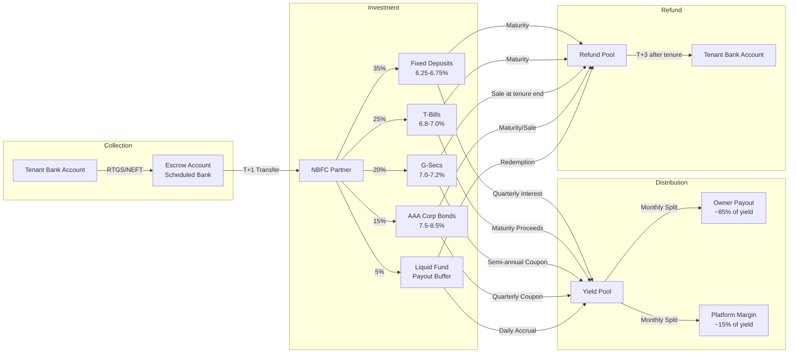
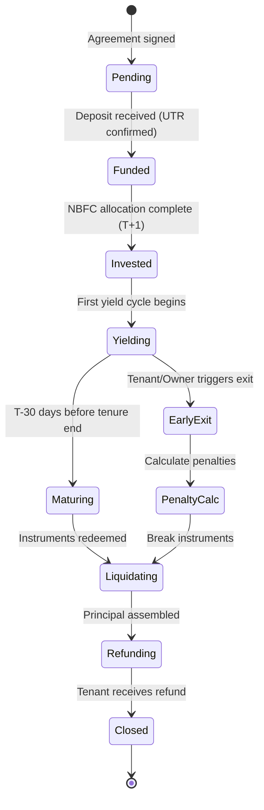
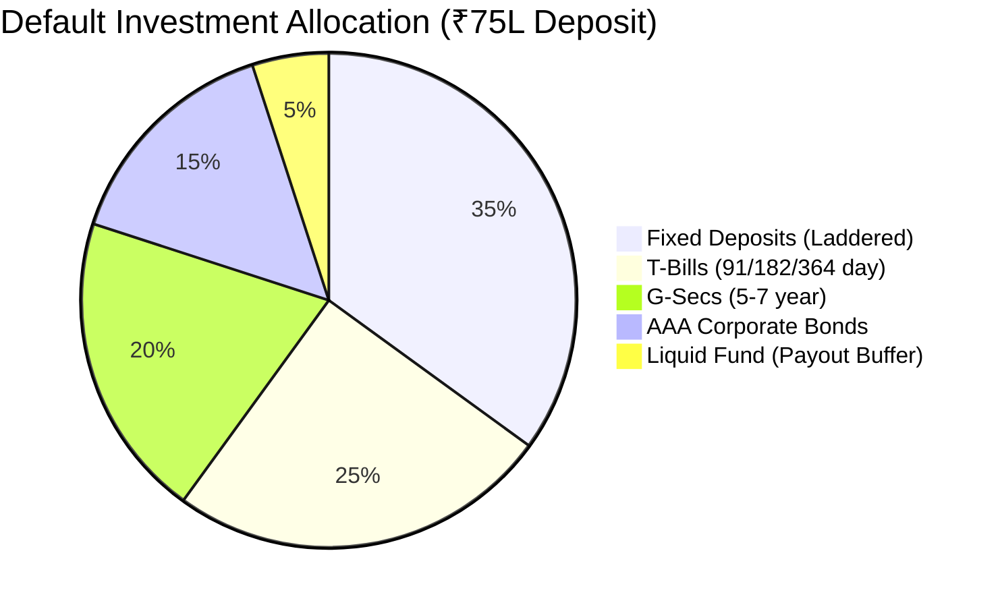
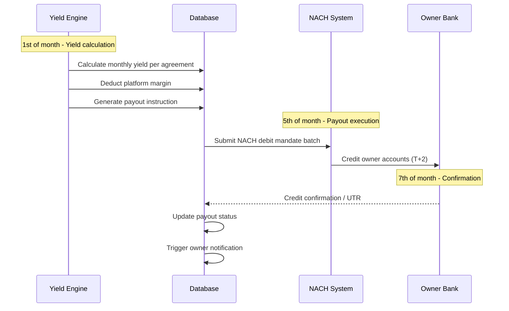
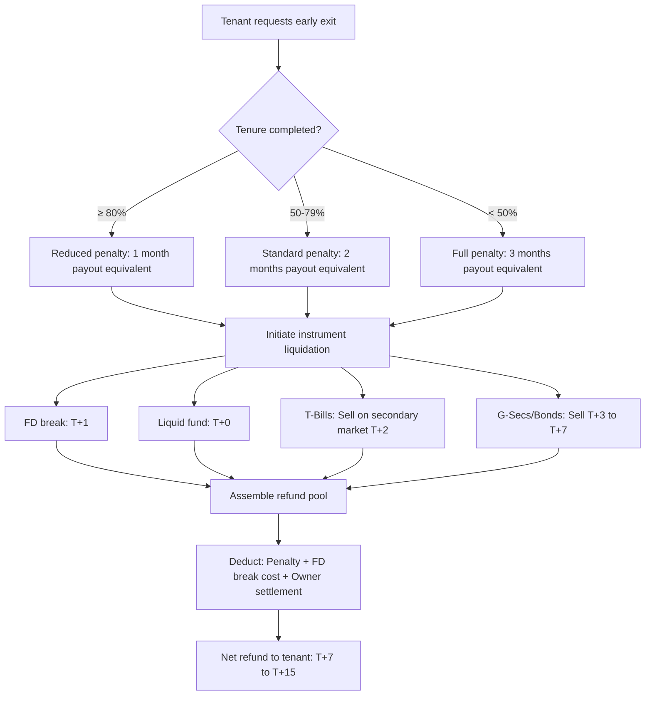
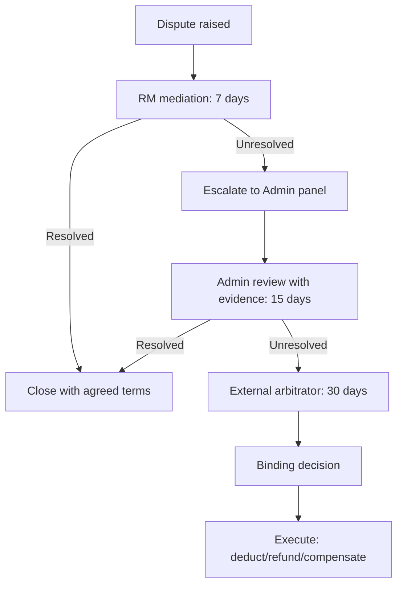
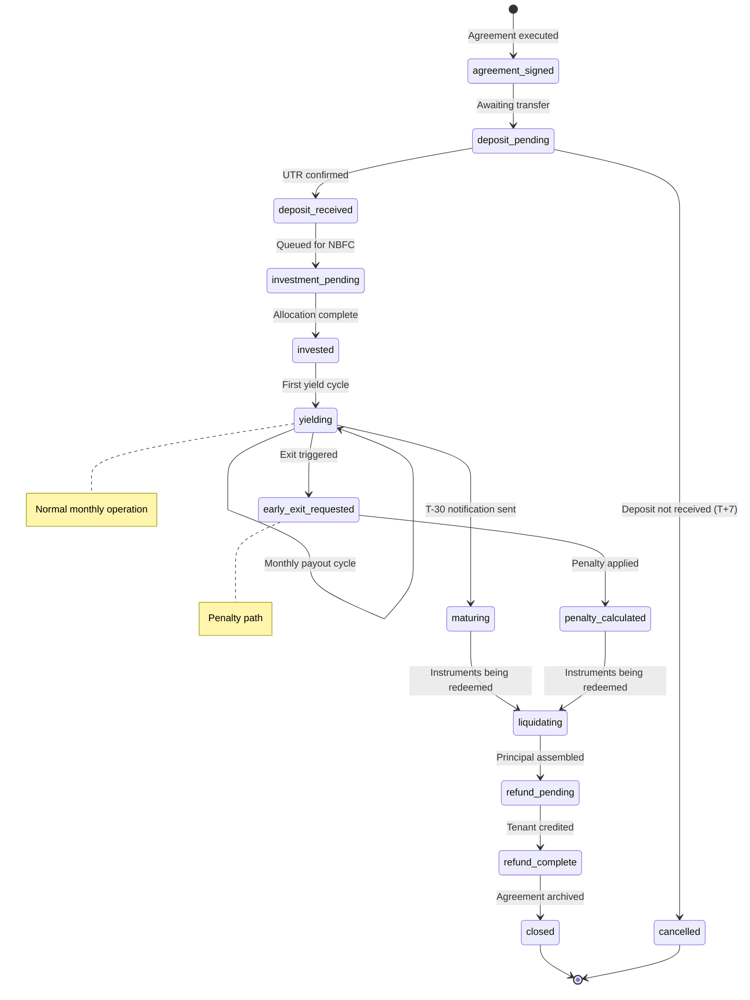

# Escrow & Deposit Logic

## TL;DR

NWTR's financial engine converts tenant deposits (70-80% of property value) into yield-generating instruments via an NBFC partner, then distributes monthly payouts to property owners while retaining a platform spread. Each deposit is held in a segregated escrow account, invested in a laddered portfolio of FDs, T-Bills, G-Secs, and AAA corporate bonds yielding 7-8% blended returns. Owners receive ~5.6% annualized payouts; NWTR retains ~1.5-2% net margin. At tenure end, the full principal is returned to the tenant. This document specifies the complete calculation engine, investment allocation strategy, payout mechanics, early exit penalties, and reconciliation framework.

---

## 1. Fund Flow Architecture



---

## 2. Deposit Calculation Engine

### 2.1 Core Formula

```
Monthly Owner Payout = (Deposit Amount × Blended Yield Rate) / 12

Platform Monthly Margin = Monthly Yield Generated - Monthly Owner Payout

Effective Tenant Cost = 0 (deposit returned at tenure end, net of TDS on interest)
```

### 2.2 Deposit Ratio Analysis

| Deposit Ratio | Property Value ₹1 Cr | Deposit Amount | Annual Yield @7.5% | Monthly Available | Owner Payout (Market Rent ₹35K) | NWTR Margin/Month |
|:---:|:---:|:---:|:---:|:---:|:---:|:---:|
| 50% | ₹1,00,00,000 | ₹50,00,000 | ₹3,75,000 | ₹31,250 | ₹31,250 | ₹0 (NOT VIABLE) |
| 60% | ₹1,00,00,000 | ₹60,00,000 | ₹4,50,000 | ₹37,500 | ₹35,000 | ₹2,500 |
| 70% | ₹1,00,00,000 | ₹70,00,000 | ₹5,25,000 | ₹43,750 | ₹35,000 | ₹8,750 |
| 75% | ₹1,00,00,000 | ₹75,00,000 | ₹5,62,500 | ₹46,875 | ₹35,000 | ₹11,875 |
| 80% | ₹1,00,00,000 | ₹80,00,000 | ₹6,00,000 | ₹50,000 | ₹35,000 | ₹15,000 |

**Conclusion**: Minimum viable deposit ratio is 70%. Recommended default: 75%.

### 2.3 Yield Gap Sensitivity

```
Break-even Yield Rate = (Annual Owner Payout / Deposit Amount) × 100

At 70% deposit, ₹35K/month payout:
Break-even = (₹4,20,000 / ₹70,00,000) × 100 = 6.0%

Current blended portfolio yield: 7.3-7.8%
Safety margin: 130-180 bps
```

### 2.4 Multi-Scenario Unit Economics

| Scenario | Deposit | Yield | Owner Payout | NWTR Margin/yr | Margin % |
|:---|:---:|:---:|:---:|:---:|:---:|
| Conservative (₹50L, 7.0%) | ₹50,00,000 | ₹3,50,000 | ₹3,00,000 | ₹50,000 | 1.0% |
| Standard (₹75L, 7.5%) | ₹75,00,000 | ₹5,62,500 | ₹4,20,000 | ₹1,42,500 | 1.9% |
| Premium (₹1Cr, 7.8%) | ₹1,00,00,000 | ₹7,80,000 | ₹5,40,000 | ₹2,40,000 | 2.4% |
| Ultra-Premium (₹1.5Cr, 8.0%) | ₹1,50,00,000 | ₹12,00,000 | ₹7,20,000 | ₹4,80,000 | 3.2% |

---

## 3. Escrow Account Management

### 3.1 Account Structure

NWTR uses **per-agreement segregated escrow accounts** (not pooled) for regulatory clarity:

- Each tenant-owner agreement maps to one escrow sub-account
- Master escrow account held with scheduled bank partner (HDFC/ICICI/Axis)
- Sub-account ledger maintained by NBFC partner
- Real-time balance visibility via banking API integration

### 3.2 Why Per-Agreement Segregation

| Factor | Pooled Model | Per-Agreement Model |
|:---|:---|:---|
| SEBI CIS Risk | HIGH — resembles collective investment | LOW — individual deposits, no pooling |
| Audit Trail | Complex attribution | Clear 1:1 mapping |
| Refund Speed | Requires unwinding | Direct return from sub-account |
| Regulatory Defensibility | Weak | Strong |
| Operational Complexity | Lower | Higher (mitigated by automation) |

### 3.3 Account Lifecycle



### 3.4 Reconciliation Schedule

| Frequency | Action | Tolerance |
|:---|:---|:---:|
| Daily | Escrow balance vs ledger balance | ₹0 (exact match) |
| Weekly | Investment portfolio mark-to-market | ±0.5% |
| Monthly | Yield accrual vs payout obligations | ±₹100 per account |
| Quarterly | Full audit reconciliation (CA-certified) | ₹0 |
| Annually | Statutory audit + NBFC compliance report | ₹0 |

---

## 4. Investment Allocation Strategy

### 4.1 Portfolio Construction



### 4.2 Laddered FD Strategy

To ensure liquidity for monthly payouts while maximizing yield:

| Tranche | Amount (of FD allocation) | Tenure | Rate | Purpose |
|:---|:---:|:---:|:---:|:---|
| Monthly Payout FDs | 30% | 3-month rolling | 5.75% | Monthly payout source |
| Medium FDs | 40% | 6-month | 6.25% | Semi-annual rebalance |
| Long FDs | 30% | 12-month | 6.75% | Yield maximization |

### 4.3 Liquidity Waterfall (for monthly payouts)

```
Priority 1: Liquid Fund accrual (covers ~1 month payout)
Priority 2: Maturing 3-month FD tranche
Priority 3: T-Bill maturity proceeds
Priority 4: G-Sec/Corp Bond coupon payments
Priority 5: Break short-term FD (last resort)
```

### 4.4 Rebalancing Triggers

- Interest rate change >50 bps: Review allocation within 7 days
- Credit downgrade of any holding: Immediate exit, reallocate to FD
- Liquidity shortfall projected: Increase liquid fund to 10%
- Tenure extension: Shift to longer-duration instruments

---

## 5. Payout Scheduling

### 5.1 Monthly Payout Calendar



### 5.2 Payout Calculation

```
Gross Monthly Yield = Sum of all instrument yields accrued in month
TDS Deduction = Gross Yield × 10% (Section 194A, if applicable)
Net Available = Gross Monthly Yield - TDS
Owner Payout = Net Available × Owner Share Ratio (typically 85%)
Platform Margin = Net Available × Platform Share Ratio (typically 15%)
```

### 5.3 First Month Pro-Rata

If the agreement starts mid-month:

```
Pro-rata Payout = (Monthly Payout / Days in Month) × Remaining Days
Example: Agreement starts 15th March, Monthly payout = ₹35,000
Pro-rata = (₹35,000 / 31) × 17 = ₹19,194
```

### 5.4 Failed Payout Handling

| Attempt | Timing | Action |
|:---:|:---|:---|
| 1st | 5th of month | Standard NACH debit |
| 2nd | 8th of month | Retry with same mandate |
| 3rd | 12th of month | Manual NEFT transfer |
| Escalation | 15th of month | RM contact + alternate account request |

---

## 6. Early Exit Handling

### 6.1 Tenant-Initiated Early Exit



### 6.2 Penalty Calculation

```
Penalty Amount = Monthly Owner Payout × Penalty Multiplier

Penalty Multiplier:
  - Exit at 0-6 months: 3×
  - Exit at 6-9 months: 2×
  - Exit at 9-11 months: 1×
  - Exit at 11-12 months: 0× (natural tenure end)

Additional Costs (deducted from refund):
  - FD premature closure penalty: 0.5-1% of FD amount
  - Bond/G-Sec sell spread: 0.1-0.3%
  - Processing fee: ₹5,000 flat
```

### 6.3 Owner-Initiated Early Exit

Owners may request early termination (e.g., property sale). In this case:

- Owner must provide 60-day notice
- Tenant receives full deposit refund (no penalty to tenant)
- Owner forfeits 2 months of payout as compensation to NWTR
- NWTR facilitates tenant relocation via RM

### 6.4 Force Majeure

Events qualifying for zero-penalty exit for both parties:
- Natural disaster rendering property uninhabitable
- Government acquisition/demolition order
- Death of tenant/owner (estate settlement)
- Court order

---

## 7. Deposit Refund at Tenure End

### 7.1 Maturity Notification Timeline

| Days Before Tenure End | Action | Recipient |
|:---:|:---|:---|
| T-60 | Tenure end reminder + renewal option | Tenant + Owner |
| T-30 | Confirm exit or renewal intent | Tenant |
| T-30 | Begin instrument maturity alignment | NBFC |
| T-15 | Property inspection scheduling | RM |
| T-7 | Final refund calculation shared | Tenant |
| T-0 | Tenure ends, property handover | Tenant + Owner |
| T+3 | Refund initiated (after inspection clearance) | Tenant |
| T+7 | Refund credited to tenant account | Tenant |

### 7.2 Refund Calculation

```
Gross Refund = Original Deposit Amount
Deductions:
  - Property damage (per inspection report, capped at ₹2L without arbitration)
  - Unpaid utilities (verified via bills)
  - Pending maintenance charges
  - Any applicable TDS on interest component

Net Refund = Gross Refund - Deductions
Surplus (if any) = Accrued yield beyond owner payout obligations → credited to tenant
```

### 7.3 Renewal Flow

If both parties agree to extend:
- New agreement for extended tenure (fresh 12 months)
- No liquidation required — instruments roll over
- Deposit ratio may be renegotiated (owner can request increase)
- Platform margin terms remain unchanged

---

## 8. Dispute Resolution

### 8.1 Dispute Categories

| Category | Typical Claim | Resolution Path |
|:---|:---|:---|
| Property Damage | Owner claims ₹X for repairs | Photo evidence → RM mediation → Arbitration |
| Utility Arrears | Owner claims unpaid bills | Bill verification → Auto-deduct from refund |
| Early Exit Penalty | Tenant disputes penalty amount | Formula verification → Compliance review |
| Payout Shortfall | Owner reports missed/short payout | NACH trace → Bank confirmation → Correction |
| Deposit Return Delay | Tenant claims delayed refund | SLA check → Penalty to NWTR if breached |

### 8.2 Reserve Fund

NWTR maintains a dispute resolution reserve:
- Funded at 0.5% of total AUM
- Covers interim payouts during dispute resolution
- Replenished from penalty collections
- At 500 properties (₹375 Cr AUM): Reserve = ₹1.875 Cr

### 8.3 Arbitration Workflow



---

## 9. Risk Scenarios & Safeguards

### 9.1 Interest Rate Drop Mid-Tenure

| Scenario | Impact | Mitigation |
|:---|:---|:---|
| 50 bps drop | Margin compressed but viable | Absorb from platform margin |
| 100 bps drop | Margin near zero | Activate yield reserve (funded from good months) |
| 200 bps drop | Payout obligation exceeds yield | Invoke agreement clause: reduce owner payout by shortfall %, capped at 15% reduction |

### 9.2 NBFC Partner Failure

- Deposits are in segregated escrow (not on NBFC balance sheet)
- FDs held with scheduled banks (DICGC coverage ₹5L per bank)
- Multi-bank strategy: No single bank holds >30% of any deposit
- Backup NBFC partner on standby (pre-signed MOU)
- Regulatory requirement: NBFC must maintain 15% CRAR

### 9.3 Simultaneous Exit Stress Test

```
Scenario: 20% of tenants (100 of 500) request early exit simultaneously

Total liquidation required: 100 × ₹75L = ₹75 Cr
Liquid fund available immediately: 5% × ₹375 Cr = ₹18.75 Cr
3-month FD maturing within 30 days: ~₹15 Cr
T-Bill secondary market sale (T+2): ~₹25 Cr
Total available within 15 days: ~₹58.75 Cr

Shortfall: ₹16.25 Cr (covered by breaking 6-month FDs, T+1)
Result: All exits honored within 15-day SLA ✓
```

---

## 10. State Machine — Deposit Lifecycle



---

## 11. Reconciliation Engine

### 11.1 Daily Reconciliation

```
For each active agreement:
  Assert: Escrow_Ledger_Balance == Sum(Investment_Holdings) + Liquid_Buffer
  Assert: Investment_Holdings == NBFC_Portfolio_Statement
  Assert: Payout_Obligations_MTD <= Projected_Yield_MTD

Tolerance: ₹0 for balance checks, ±₹100 for yield projections
Alert: Any mismatch triggers immediate investigation + admin notification
```

### 11.2 Monthly Reconciliation Report

| Check | Source A | Source B | Action on Mismatch |
|:---|:---|:---|:---|
| Deposit principal | Platform DB | Bank statement | Freeze account, investigate |
| Investment value | NBFC statement | Platform calculation | Mark for review |
| Yield received | Bank credits | Expected yield | Adjust next payout |
| Owner payouts | NACH confirmations | Payout schedule | Retry/escalate |
| Platform margin | Revenue ledger | Yield - payouts | Finance review |

### 11.3 Automated Alerts

- Balance mismatch > ₹0: CRITICAL (immediate)
- Yield shortfall > 10% of expected: WARNING (within 4 hours)
- Payout failure: HIGH (retry + RM notification within 1 hour)
- Instrument maturity not reinvested within T+2: WARNING
- Reconciliation not completed by 10 AM: ESCALATE to finance head

---

## 12. Tax Implications

### 12.1 TDS Framework

| Component | Section | Rate | Deductor |
|:---|:---|:---:|:---|
| FD Interest | 194A | 10% | Bank |
| Corporate Bond Interest | 193 | 10% | Issuer |
| G-Sec Interest | Exempt from TDS | 0% | — |
| T-Bill Discount | Short-term capital gains | As applicable | Self-assessment |

### 12.2 Tax Pass-Through

- TDS on FD interest is deducted at source (bank level)
- NWTR's yield calculations use post-TDS amounts for owner payout
- Tenant receives Form 26AS credit for any TDS deducted on their deposit's earnings
- Annual tax statement provided to all parties (tenant, owner, platform)

---

## Cross-References

| Topic | Document |
|:---|:---|
| Complete transaction states and error handling | [Transaction Flow](./transaction-flow.md) |
| Backend service implementation | [Backend Workflows](./backend-workflows.md) |
| Database tables for deposits/escrow | [Database Schema](../02-technical/database-schema.md) |
| Business model and revenue projections | [Business Model](../00-executive/business-model.md) |
| Revenue streams breakdown | [Revenue Model](../00-executive/revenue-model.md) |
| Risk scenarios (yield, regulatory) | [Risk Analysis](../00-executive/risk-analysis.md) |
| KYC requirements before deposit | [KYC Flow](./kyc-flow.md) |
| API endpoints for deposit operations | [API Contracts](../02-technical/api-contracts.md) |
