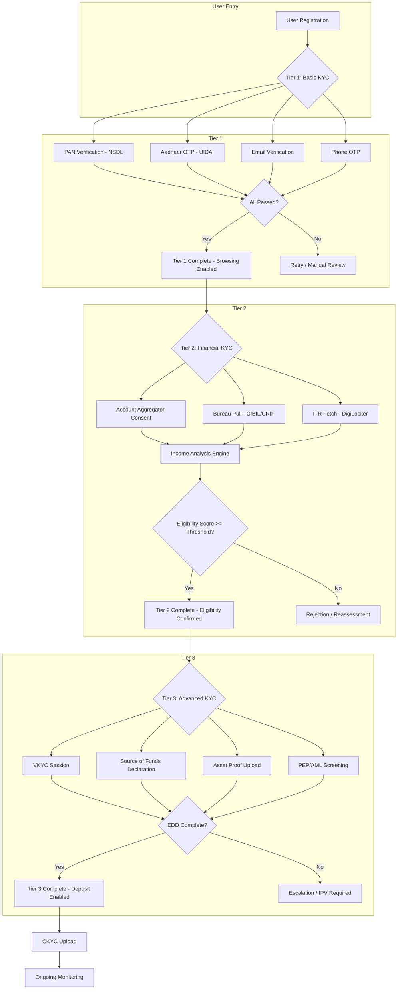
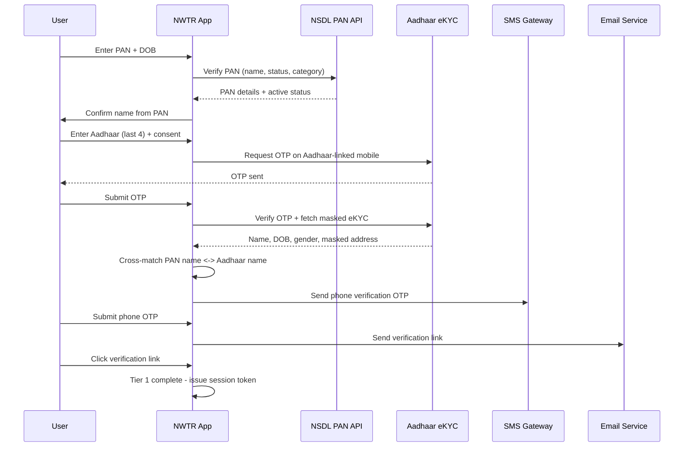
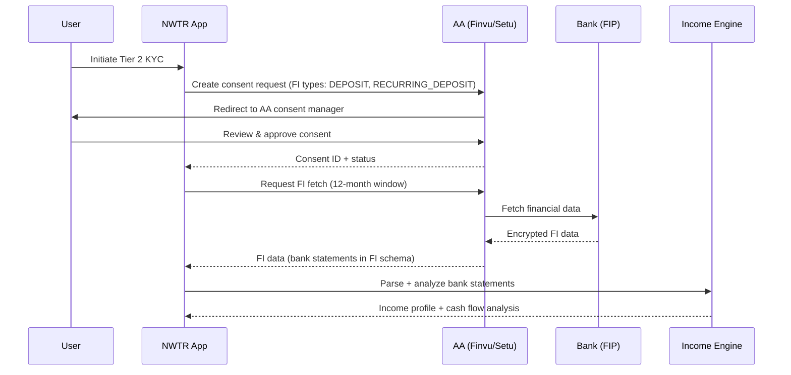
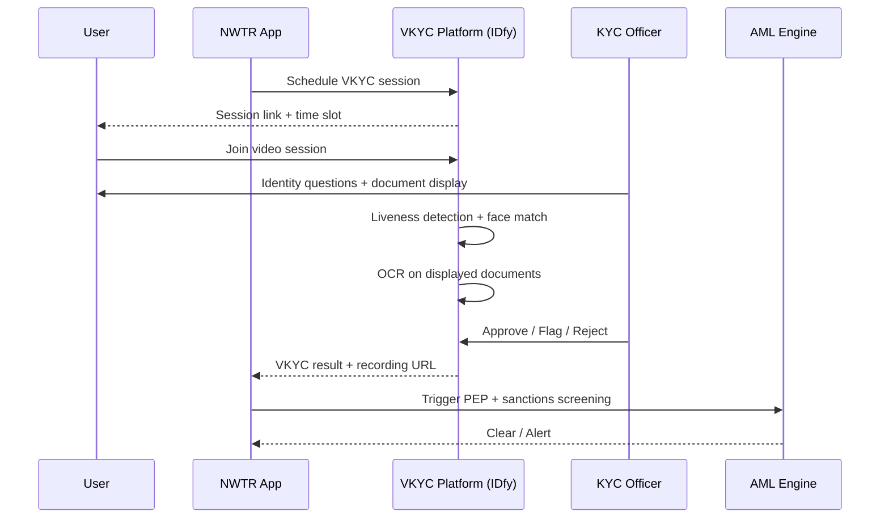
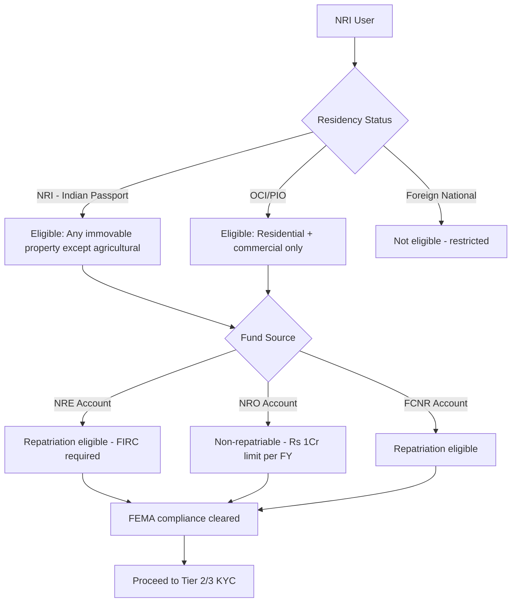
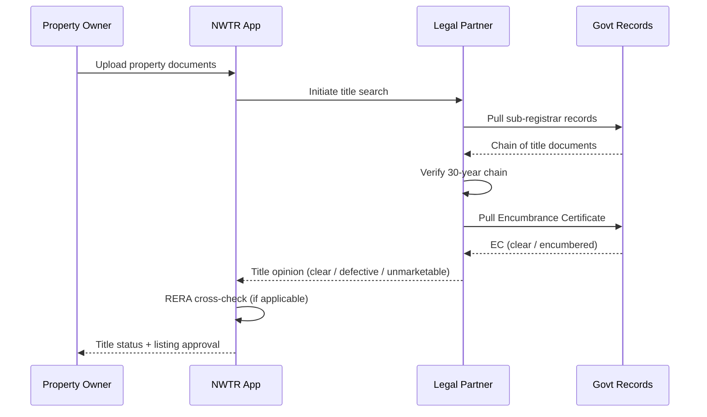
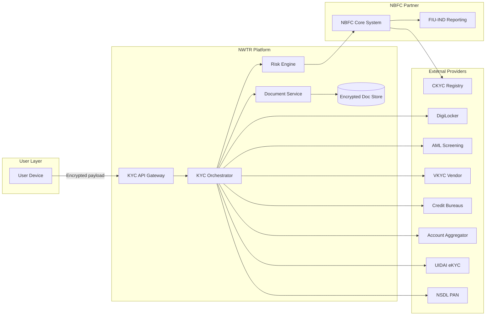

# KYC Flow

## TL;DR

NWTR implements a three-tiered progressive KYC system calibrated to the risk profile of each user action. Tier 1 (Basic) enables platform browsing with PAN + Aadhaar + contact verification. Tier 2 (Financial) unlocks eligibility assessment via Account Aggregator data, bureau pulls, and income analysis. Tier 3 (Advanced) gates deposit commitment (Rs 50L+) behind VKYC, source-of-funds documentation, and enhanced due diligence. The system integrates with CKYC, DigiLocker, and the AA framework while maintaining full compliance with PMLA Rules 2005, RBI Master Direction on KYC (2016, as amended), RBI Digital Lending Guidelines (2022), and the DPDP Act 2023.

---

## KYC Architecture Overview

---

## Tier 1: Basic KYC

**Purpose:** Gate platform access and property browsing. Establish identity without financial intrusion.

**Regulatory Basis:** RBI Master Direction on KYC, Section 3 (Customer Identification Procedure); PMLA Rules 2005, Rule 9(1).

### Required Documents & Data Points

| Field | Source | Verification Method |
|-------|--------|-------------------|
| PAN | User input | NSDL/UTI Infrastructure API |
| Aadhaar (last 4 digits only) | User input + OTP | UIDAI eKYC (masked) |
| Mobile Number | User input | OTP via SMS gateway |
| Email Address | User input | Verification link / OTP |
| Full Name | Auto-fetched from PAN | Cross-matched with Aadhaar |

### Verification Flow

### API Integrations

| API | Provider | Purpose | SLA |
|-----|----------|---------|-----|
| PAN Verification | NSDL (via Karza/IDfy) | Validate PAN, fetch name, check active status | 200ms p95 |
| Aadhaar eKYC | UIDAI (via ASA - DigiLocker/Karza) | OTP-based identity verification | 500ms p95 |
| PAN-Aadhaar Linkage | Income Tax e-filing API | Confirm linkage status (mandatory post-2023) | 300ms p95 |
| SMS OTP | Gupshup/MSG91 | Phone number verification | 100ms p95 |
| Email Verification | SendGrid/AWS SES | Email ownership confirmation | <1s |

### Auto-Approval Criteria

Tier 1 is auto-approved when ALL conditions are met:
- PAN status is "Active" and category matches (Individual / HUF)
- Aadhaar OTP verification successful
- PAN-Aadhaar linkage confirmed
- Name fuzzy match score >= 85% between PAN and Aadhaar records
- Phone OTP verified within 10 minutes
- Email verified within 24 hours
- No existing account with same PAN (dedup check)

**Time to Complete:** < 5 minutes (real-time, all API-driven)

**Failure Handling:** See [Failure & Retry Flows](#failure--retry-flows)

---

## Tier 2: Financial KYC

**Purpose:** Assess financial capacity and determine deposit eligibility. Estimate net worth and income stability.

**Regulatory Basis:** RBI Digital Lending Guidelines (2022), Para 5 (Income verification); RBI Master Direction on KYC, Section 16 (Customer Due Diligence).

### Required Data

| Data Point | Source | Method |
|-----------|--------|--------|
| Bank Statements (12 months) | Account Aggregator / Manual Upload | AA FIP consent / PDF parse |
| Income Tax Returns (2 years) | DigiLocker / Manual Upload | ITR-V fetch / PDF parse |
| Credit Score + Report | CIBIL / CRIF / Experian | Bureau pull via NBFC partnership |
| Employment / Business Proof | User declaration | Cross-referenced with bank data |

### Account Aggregator Integration

**Supported AAs:** Finvu, Setu (OneMoney), CAMS FinServ, NADL

**FI Types Requested:**
- `DEPOSIT` - Savings/current account statements
- `RECURRING_DEPOSIT` - RD maturity patterns
- `TERM_DEPOSIT` - FD holdings (net worth signal)
- `MUTUAL_FUNDS` - MF portfolio via CAMS/KFintech
- `INSURANCE_POLICIES` - Insurance holdings

### Credit Bureau Integration

| Bureau | API Provider | Data Retrieved |
|--------|-------------|----------------|
| TransUnion CIBIL | Direct API (NBFC license) | Score, report, DPD history, enquiry count |
| CRIF High Mark | Direct API | Score, microfinance exposure |
| Experian | Direct API | Score, fraud indicators |

**Bureau Pull Rules:**
- Minimum CIBIL score for eligibility: 700 (configurable)
- Hard inquiry via NBFC partner entity (not NWTR directly)
- Bureau data cached for 30 days per RBI norms
- User consent captured explicitly pre-pull (Digital Lending Guidelines)

### Income Analysis Engine

The engine processes AA data and ITR to produce:

| Output | Methodology |
|--------|-------------|
| Monthly Net Income | Average of 12-month credits minus debits, excluding transfers |
| Income Stability Score | Coefficient of variation of monthly income |
| Debt-to-Income Ratio | Total EMI obligations / Monthly net income |
| Net Worth Estimate | FDs + MFs + Insurance surrender + declared assets - liabilities |
| Deposit Capacity | Max recommended deposit (net worth * 0.6, income * 36) |

### Eligibility Thresholds

| Deposit Range | Min CIBIL | Min Annual Income | Max DTI | Additional |
|--------------|-----------|-------------------|---------|------------|
| Rs 50L - Rs 75L | 700 | Rs 25L | 50% | 2yr+ income history |
| Rs 75L - Rs 1Cr | 720 | Rs 40L | 45% | 3yr+ income history |
| Rs 1Cr - Rs 1.5Cr | 750 | Rs 60L | 40% | EDD required (Tier 3) |
| Rs 1.5Cr+ | 750 | Rs 80L | 35% | EDD + Board approval |

**Time to Complete:**
- With Account Aggregator: 15-30 minutes
- Manual upload + OCR parsing: 2-3 business days

---

## Tier 3: Advanced KYC

**Purpose:** Enhanced due diligence for high-value deposits. Source of funds verification and regulatory compliance for transactions exceeding Rs 50L.

**Regulatory Basis:** PMLA Rules 2005, Rule 9(1B) (Enhanced Due Diligence); RBI Master Direction Section 18 (Wire Transfers); RBI Circular on VKYC (January 2020, as amended).

### Video KYC (VKYC)

Per RBI norms (Circular DOR.AML.REC.No.42/14.06.001/2024-25), VKYC is conducted as:

| Parameter | Requirement |
|-----------|-------------|
| Duration | Minimum 3 minutes, recorded |
| Agent | Trained KYC officer (NBFC employee) |
| Liveness | AI-driven liveness detection (blink, head turn, random code display) |
| Document Display | User holds original PAN + Aadhaar to camera |
| Geo-location | Captured and logged |
| Randomized Questions | Name, DOB, address, PAN number, purpose of deposit |
| Storage | Encrypted recording retained for 8 years per PMLA |

**VKYC Vendor Integration:** IDfy / HyperVerge / Digio

### Source of Funds Documentation

Mandatory for all Tier 3 deposits per PMLA Section 12:

| Source Type | Acceptable Proof |
|------------|-----------------|
| Salary / Business Income | ITR + Form 16 / P&L statements |
| Property Sale | Sale deed + capital gains computation |
| Investment Redemption | Redemption statement + DEMAT holding |
| Gift / Inheritance | Gift deed / Will probate + donor's ITR |
| NRI Remittance | FIRC (Foreign Inward Remittance Certificate) |
| Loan Proceeds | Sanction letter + disbursement proof |

### Enhanced Due Diligence (EDD) for Rs 1Cr+

| Check | Method | Provider |
|-------|--------|----------|
| PEP Screening | Name + DOB match against PEP database | Dow Jones Risk & Compliance / Refinitiv World-Check |
| Sanctions Screening | OFAC, UN, EU, India MHA lists | Same as above |
| Adverse Media | NLP-based negative news screening | Dow Jones / ComplyAdvantage |
| UBO Identification | For HUF/Trust/Company accounts | Manual + MCA records |
| Net Worth Certificate | CA-certified net worth statement | User-provided + CA verification |

### In-Person Verification (IPV)

Offered as alternative to VKYC or when VKYC fails:
- Conducted at NBFC partner branch or user's location (for Rs 1Cr+)
- Agent equipped with biometric device for Aadhaar verification
- Original document inspection
- Geo-tagged photo with timestamp

**Time to Complete:** 1-3 business days

---

## NRI-Specific KYC Module

**Regulatory Basis:** FEMA (Acquisition and Transfer of Immovable Property in India) Regulations 2018; RBI Master Direction on KYC, Section 6 (Non-face-to-face customers).

### Additional Requirements for NRI Tenants

| Document | Verification Method |
|----------|-------------------|
| Valid Passport | OCR + MRZ validation (machine-readable zone) |
| Valid Visa / OCI Card | Visa type validation (employment/residence) |
| Overseas Address Proof | Utility bill / bank statement from country of residence |
| NRE/NRO Account Statement | Account Aggregator or manual (12 months) |
| PIO/OCI Status | Ministry of External Affairs database check |
| FEMA Declaration | Self-declaration of eligible property types |

### FEMA Compliance Checks

### NRI VKYC Adaptations
- Time zone-aware scheduling (IST + user's local time)
- Passport-based face match (in addition to Aadhaar)
- Overseas address verified via geo-IP + declared address
- Consul attestation accepted for documents not available digitally

---

## Owner KYC Flow

**Purpose:** Verify property ownership, title clarity, and owner identity before listing.

### Owner Identity Verification

Follows same Tier 1 flow as tenants, plus:

| Check | Source | Method |
|-------|--------|--------|
| Property Ownership | Sub-registrar records | Title search via legal partner |
| Encumbrance Certificate | State registration dept | EC for 30 years |
| RERA Registration | State RERA website | API / scrape verification |
| Property Tax Receipts | Municipal corporation | Latest receipt upload |
| Society NOC | Housing society (if applicable) | Digital / physical letter |
| OC / CC | Municipal authority | Occupancy / Completion certificate |

### Title Verification Flow

---

## Document Management

### Storage Architecture

| Aspect | Implementation |
|--------|---------------|
| At-rest Encryption | AES-256 (AWS KMS / Azure Key Vault) |
| In-transit Encryption | TLS 1.3 mandatory |
| Storage Location | India-only (AWS Mumbai / Azure Central India) per DPDP Act |
| Access Control | Role-based, need-to-know, audit-logged |
| Document Format | Original preserved + OCR-extracted structured data |

### Retention Policy (DPDP Act 2023 Compliant)

| Document Type | Retention Period | Basis |
|--------------|-----------------|-------|
| KYC Records | 5 years post-relationship end | PMLA Rules, Rule 4 |
| VKYC Recordings | 8 years | RBI VKYC Circular |
| Transaction Records | 5 years from transaction date | PMLA Section 12 |
| Consent Records | Lifetime of consent + 3 years | DPDP Act, Section 6 |
| Bureau Reports | 30 days (then purged) | Bureau terms + minimization |

### Right to Erasure (DPDP Act Section 12)

- Users can request data erasure post-relationship termination
- PMLA retention obligations override erasure requests during retention period
- Post-retention: automated purge pipeline with audit trail
- Erasure confirmation issued within 30 days of eligible request

---

## Failure & Retry Flows

### Tier 1 Failures

| Failure | Cause | Recovery |
|---------|-------|----------|
| PAN Invalid | Incorrect input / deactivated PAN | Prompt re-entry, max 3 attempts |
| Aadhaar OTP Fail | Wrong OTP / expired | Resend OTP (max 3/day per UIDAI) |
| PAN-Aadhaar Mismatch | Name mismatch > 15% | Manual review queue, support contact |
| PAN-Aadhaar Linkage Fail | Not linked | Block with instructions to link on IT portal |
| Duplicate PAN | Existing account | Redirect to login / account recovery |

### Tier 2 Failures

| Failure | Cause | Recovery |
|---------|-------|----------|
| AA Consent Denied | User rejected consent | Offer manual upload path |
| Bureau Pull Fail | Thin file / technical error | Retry after 24h, offer alternative bureau |
| Low Credit Score | Score < 700 | Inform user, suggest co-applicant option |
| Income Insufficient | Below threshold | Suggest lower deposit amount |
| DTI Too High | Excessive EMI obligations | Inform, allow after 6-month re-check |

### Tier 3 Failures

| Failure | Cause | Recovery |
|---------|-------|----------|
| VKYC Liveness Fail | Spoofing detected / poor lighting | Reschedule (max 3 attempts) |
| VKYC Document Mismatch | Photo doesn't match | Escalate to IPV |
| Source of Funds Unclear | Insufficient documentation | Request additional docs (7-day window) |
| PEP/Sanctions Hit | Name match in watchlist | Auto-escalate to compliance officer |
| EDD Incomplete | Missing CA certificate | 14-day deadline, then application closed |

### Cooldown & Lockout Policy

- Tier 1: 3 failed attempts → 24h cooldown → manual review required
- Tier 2: 2 rejections in 90 days → 180-day lockout
- Tier 3: VKYC failure 3x → mandatory IPV (no VKYC option)
- AML/PEP hit: Permanent hold until compliance officer clearance

---

## Compliance Monitoring

### Ongoing Transaction Monitoring

| Trigger | Threshold | Action |
|---------|-----------|--------|
| Single Deposit | > Rs 10L | Auto-flagged for review |
| Cumulative (30 days) | > Rs 50L | Enhanced monitoring |
| Pattern Change | Deviation > 2 std dev from profile | Alert to compliance |
| Cross-border Transfer | Any NRI deposit | FEMA compliance re-check |
| Refund/Withdrawal | > Rs 25L single | Source verification |

### Re-KYC Triggers

Per RBI Master Direction Section 38:

| Customer Category | Re-KYC Frequency | Trigger Events |
|------------------|------------------|----------------|
| High Risk (Rs 1Cr+) | Every 2 years | Address change, PEP status change |
| Medium Risk (Rs 50L-1Cr) | Every 5 years | Document expiry, adverse media |
| Low Risk (<Rs 50L) | Every 10 years | PAN deactivation, death of co-applicant |
| NRI | Every 2 years | Visa expiry, residency status change |

### SAR (Suspicious Activity Report) Filing

- Filed with FIU-IND (Financial Intelligence Unit) within 7 days of detection
- Categories: structuring, unusual source, PEP transactions, sanctions evasion
- Tipping-off prohibition: user NOT informed of SAR filing (PMLA Section 66)
- Internal escalation: Compliance Officer → MLRO → Board Audit Committee

---

## Data Flow Diagram

---

## API Contract Summary

### Internal KYC Service Endpoints

| Endpoint | Method | Purpose | Auth |
|----------|--------|---------|------|
| `/kyc/v1/tier1/initiate` | POST | Start Tier 1 verification | JWT (user) |
| `/kyc/v1/tier1/verify-pan` | POST | Submit PAN for verification | JWT (user) |
| `/kyc/v1/tier1/aadhaar-otp` | POST | Request Aadhaar OTP | JWT (user) |
| `/kyc/v1/tier1/aadhaar-verify` | POST | Verify Aadhaar OTP | JWT (user) |
| `/kyc/v1/tier2/aa-consent` | POST | Create AA consent request | JWT (user) |
| `/kyc/v1/tier2/aa-callback` | POST | AA data fetch callback | mTLS (AA) |
| `/kyc/v1/tier2/bureau-pull` | POST | Initiate bureau check | JWT (service) |
| `/kyc/v1/tier2/eligibility` | GET | Fetch eligibility result | JWT (user) |
| `/kyc/v1/tier3/vkyc-schedule` | POST | Schedule VKYC session | JWT (user) |
| `/kyc/v1/tier3/vkyc-callback` | POST | VKYC result webhook | mTLS (vendor) |
| `/kyc/v1/tier3/sof-upload` | POST | Upload source of funds docs | JWT (user) |
| `/kyc/v1/tier3/edd-status` | GET | EDD completion status | JWT (user) |
| `/kyc/v1/status` | GET | Overall KYC status | JWT (user) |
| `/kyc/v1/admin/review-queue` | GET | Pending manual reviews | JWT (admin) |
| `/kyc/v1/admin/approve` | POST | Approve/reject KYC | JWT (admin) |
| `/kyc/v1/compliance/re-kyc` | POST | Trigger re-KYC for user | JWT (system) |
| `/kyc/v1/compliance/sar` | POST | File SAR with FIU-IND | JWT (compliance) |

### Webhook Events

| Event | Payload | Subscriber |
|-------|---------|-----------|
| `kyc.tier1.completed` | `{userId, tier, timestamp}` | User Service, Notification |
| `kyc.tier2.completed` | `{userId, eligibility, depositCapacity}` | Matching Engine |
| `kyc.tier3.completed` | `{userId, depositApproved, limit}` | Payment Service |
| `kyc.failed` | `{userId, tier, reason, retryEligible}` | Notification, Support |
| `kyc.rekyc.triggered` | `{userId, reason, deadline}` | User Service |
| `kyc.aml.alert` | `{userId, alertType, severity}` | Compliance Dashboard |

### Error Codes

| Code | Meaning | HTTP Status |
|------|---------|-------------|
| `KYC_001` | PAN verification failed | 422 |
| `KYC_002` | Aadhaar OTP expired | 422 |
| `KYC_003` | PAN-Aadhaar name mismatch | 409 |
| `KYC_004` | Bureau pull failed (technical) | 503 |
| `KYC_005` | AA consent rejected by user | 400 |
| `KYC_006` | Credit score below threshold | 422 |
| `KYC_007` | VKYC liveness check failed | 422 |
| `KYC_008` | PEP/Sanctions match found | 403 |
| `KYC_009` | Document retention lock (cannot erase) | 409 |
| `KYC_010` | Re-KYC overdue (account restricted) | 403 |

---

## Appendix: Regulatory References

| Regulation | Relevance |
|-----------|-----------|
| PMLA 2002 (as amended 2023) | Customer due diligence, record keeping, SAR filing |
| PMLA Rules 2005, Rule 9 | KYC procedure, CDD, EDD requirements |
| RBI Master Direction on KYC (2016, updated 2024) | KYC process, re-KYC frequency, CKYC |
| RBI Circular on Video KYC (Jan 2020) | VKYC norms, recording requirements |
| RBI Digital Lending Guidelines (Aug 2022) | Consent, data minimization, bureau pull disclosure |
| DPDP Act 2023 | Data processing, consent, retention, right to erasure |
| FEMA Regulations 2018 | NRI property acquisition, fund repatriation |
| IT Act 2000, Section 43A | Reasonable security practices for sensitive data |
| RBI Account Aggregator Framework (2021) | AA consent flow, FI data standards |
| SEBI KYC Norms (for MF/DEMAT verification) | Cross-reference investor identity |
