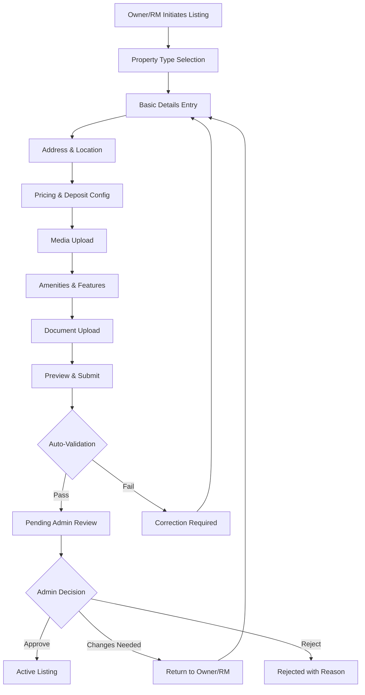
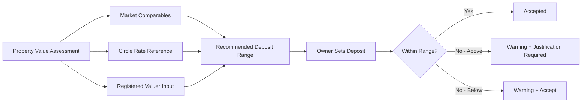
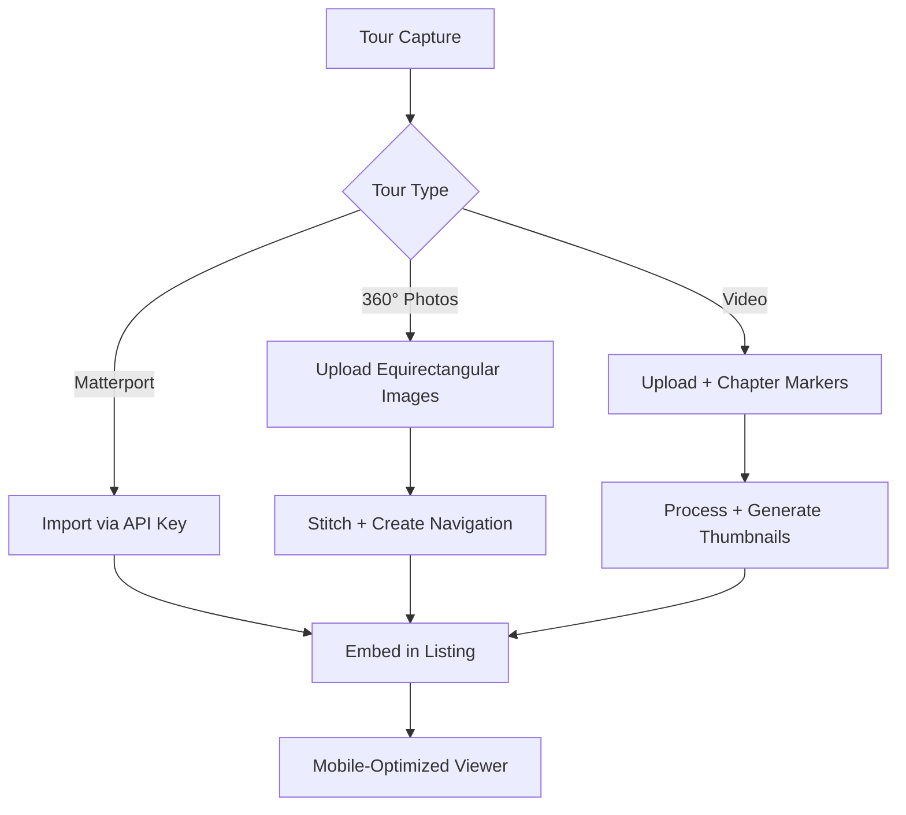
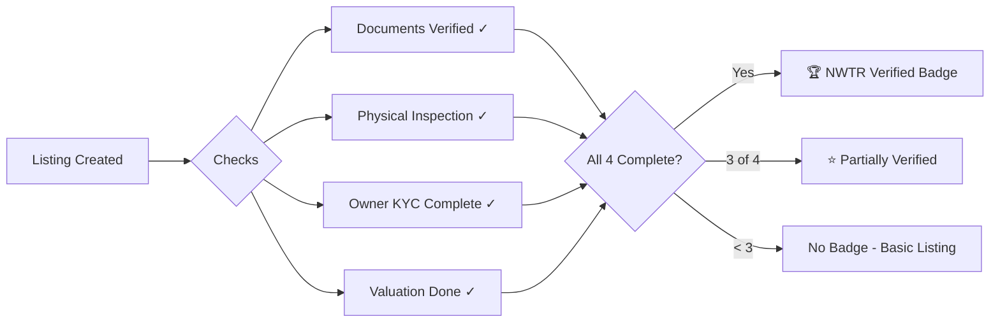
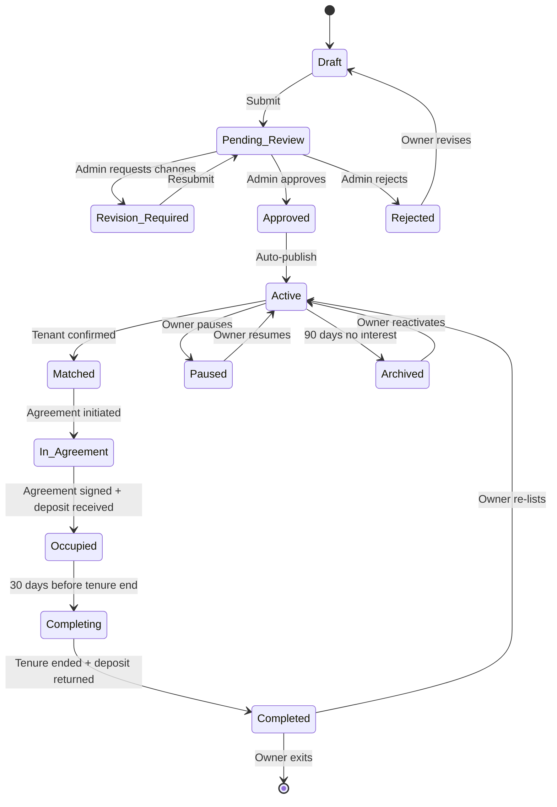
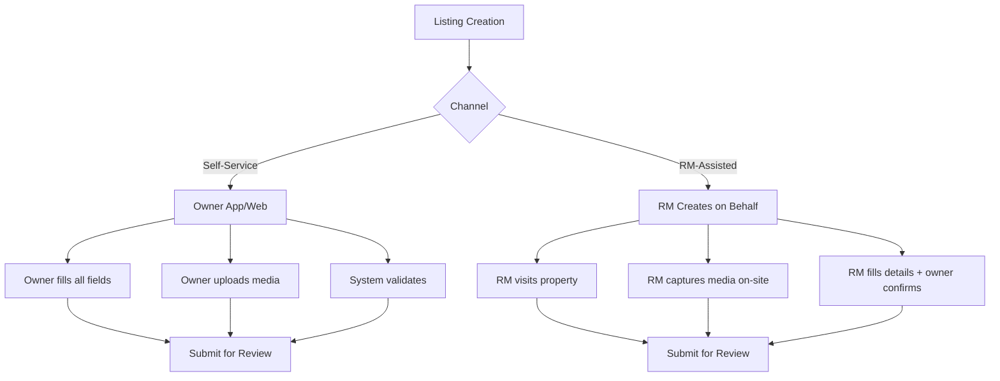

# Listing Portal Requirements

---
title: Listing Portal Requirements
version: 1.0
audience: Engineering, Product, Design
last-updated: 2026-05-21
status: draft
related-docs:
  - "./prd.md"
  - "./owner-journey.md"
  - "../02-technical/api-contracts.md"
---

## TL;DR

The NWTR Listing Portal enables property owners and RMs to create, manage, and optimize property listings for the deposit-based rental model. It supports apartment, villa, penthouse, and independent house categories with stringent quality standards for media, verification badges, and automated pricing recommendations. The portal serves dual workflows — owner self-service and RM-assisted — with a lifecycle from draft through completion.

---

## 1. Property Listing Creation Flow

### 1.1 Data Collection Steps

| Step | Required Fields | Optional Fields |
|------|----------------|-----------------|
| Basic Details | Property type, BHK, built-up area, floor, total floors, age | Carpet area, super built-up, facing |
| Address | Full address, city, locality, pincode, GPS coordinates | Landmark, society name |
| Pricing | Expected deposit (system-suggested), property value basis | Negotiable flag, minimum acceptable |
| Media | 8 interior + 4 exterior photos (min) | Video walkthrough, 360° tour |
| Amenities | Parking, water supply, power backup | Pool, gym, club, garden |
| Documents | Ownership proof, tax receipts | RERA certificate, society NOC |

---

## 2. Property Categorization

### 2.1 Property Types

| Type | Sub-categories | Typical Deposit Range |
|------|---------------|----------------------|
| Apartment | 1/2/3/4 BHK, Studio, Duplex | ₹25L – ₹2Cr |
| Villa | Independent, Row, Twin | ₹80L – ₹5Cr |
| Penthouse | Simplex, Duplex | ₹1Cr – ₹8Cr |
| Independent House | Single floor, Multi-floor | ₹50L – ₹4Cr |

### 2.2 Furnishing Status

- Fully Furnished (inventory checklist required)
- Semi-Furnished (specify inclusions)
- Unfurnished

### 2.3 Availability Status

- Immediate (ready for move-in within 7 days)
- Scheduled (specific date, max 60 days out)
- Under Preparation (renovation/repair in progress)

---

## 3. Pricing and Deposit Configuration

### 3.1 Deposit Calculation Engine

### 3.2 Pricing Parameters

| Parameter | Logic |
|-----------|-------|
| Base Deposit | Property value × 70-80% |
| Minimum Deposit | ₹20,00,000 (platform minimum) |
| Maximum Deposit | ₹10,00,00,000 (regulatory/risk cap) |
| Suggested Range | ±5% of algorithm-computed optimal |
| Owner Override | Allowed within ±15% of suggested |

### 3.3 Yield Estimation Display

For owner transparency, show estimated monthly payout:
- Conservative estimate (current FD rate - 50bps)
- Expected estimate (blended portfolio yield)
- Optimistic estimate (current G-Sec + FD blend)

---

## 4. Photo/Video Upload Requirements

### 4.1 Minimum Quality Standards

| Criteria | Requirement | Validation |
|----------|-------------|-----------|
| Resolution | Minimum 1920×1080 (Full HD) | Server-side check |
| Format | JPEG, PNG, HEIC, WebP | File header validation |
| File Size | 500KB – 15MB per image | Hard limit |
| Blur Detection | Score < 0.3 on Laplacian variance | ML model |
| Lighting | No extreme over/under exposure | Histogram analysis |
| Watermark | No agent/broker watermarks | OCR detection |
| Orientation | Auto-correct via EXIF | Server-side |

### 4.2 Mandatory Photo Set

| Category | Minimum Count | Subjects |
|----------|--------------|----------|
| Exterior | 4 | Building facade, entrance, parking, neighborhood |
| Living Areas | 3 | Living room (multiple angles), dining |
| Kitchen | 2 | Full kitchen, appliances |
| Bedrooms | 1 per bedroom | Each bedroom, attached bath |
| Bathrooms | 1 per bathroom | Fixtures, fittings |
| Balcony/Terrace | 1 per | View, space |
| Additional | Optional | Study, servant quarters, garden |

### 4.3 Video Requirements

| Parameter | Specification |
|-----------|--------------|
| Duration | 60-180 seconds |
| Resolution | Minimum 1080p |
| Format | MP4, MOV |
| File Size | Max 500MB |
| Content | Walkthrough covering all rooms |
| Stability | Gyro-stabilized or tripod |

---

## 5. Virtual Tour Integration

### 5.1 Supported Platforms

- Matterport 3D tours (iframe embed)
- Custom 360° photo tours (hotspot navigation)
- Video walkthroughs with timestamp chapters

### 5.2 Virtual Tour Requirements

### 5.3 Tour Quality Metrics

- Minimum 8 viewpoints per tour
- Each room must have at least 1 viewpoint
- Loading time < 3 seconds on 4G
- Mobile gyroscope support for immersive viewing

---

## 6. Amenity and Feature Tagging

### 6.1 Amenity Categories

| Category | Tags |
|----------|------|
| Security | CCTV, Guard, Intercom, Biometric, Gated |
| Parking | Covered, Open, Visitor, EV Charging |
| Recreation | Pool, Gym, Clubhouse, Tennis, Basketball |
| Convenience | Lift, Power Backup, Water Purifier, Gas Pipeline |
| Green | Garden, Terrace Garden, Rainwater Harvesting, Solar |
| Children | Play Area, Creche, School Nearby |
| Pet | Pet-Friendly, Dog Park, Pet Grooming |

### 6.2 Unique Selling Points (USPs)

Owner/RM can highlight up to 5 USPs from a curated list:
- Lake view / City view / Garden view
- Corner unit / No common walls
- Vastu-compliant
- Recently renovated
- Smart home enabled
- Premium branded fittings

### 6.3 Nearby Facilities (Auto-populated via Maps API)

| Facility | Data Source | Display |
|----------|------------|---------|
| Schools | Google Places | Name + distance |
| Hospitals | Google Places | Name + distance |
| Metro/Bus | BMTC/Metro API | Station + walk time |
| Shopping | Google Places | Mall/Market + distance |
| IT Parks | Custom DB | Name + drive time |
| Airport | Calculated | Drive time (peak/off-peak) |

---

## 7. Location and Neighborhood Data

### 7.1 Location Verification

- GPS coordinates captured during property visit (RM app)
- Cross-referenced with entered address via geocoding
- Tolerance: 100m radius match required
- Satellite imagery overlay for boundary verification

### 7.2 Neighborhood Score

| Dimension | Weight | Data Source |
|-----------|--------|------------|
| Safety | 25% | Crime statistics, gated community status |
| Connectivity | 25% | Public transport, road quality, traffic |
| Social Infrastructure | 20% | Schools, hospitals, markets |
| Green Cover | 15% | Parks, open spaces, air quality |
| Lifestyle | 15% | Restaurants, entertainment, nightlife |

### 7.3 Locality Insights

- Average property values (last 12 months)
- Price trend (appreciating/stable/declining)
- Rental yield benchmark for the area
- Upcoming infrastructure projects
- Demographic profile (families, professionals, students)

---

## 8. Verification Badge System

### 8.1 Badge Tiers

| Badge | Criteria | Display Priority |
|-------|----------|-----------------|
| NWTR Verified | All 4 checks + no disputes | Top of search, gold border |
| Owner Verified | Owner KYC + Docs verified | Silver indicator |
| Inspected | Physical inspection complete | Blue indicator |
| New | Listed within 7 days | "New" tag |
| Premium | Paid promotion by owner | Highlighted card |

### 8.2 Badge Revocation

- Owner KYC expires → downgrade to Inspected
- Tenant complaint substantiated → remove all badges pending review
- Document discrepancy found → immediate removal + investigation

---

## 9. Listing Lifecycle

### 9.1 Lifecycle Transitions

| From | To | Trigger | Auto/Manual |
|------|----|---------|-------------|
| Draft | Pending Review | Owner submits | Manual |
| Pending Review | Approved | Admin approves | Manual |
| Approved | Active | System publishes | Auto (immediate) |
| Active | Matched | Tenant confirms intent | Manual (tenant) |
| Matched | In Agreement | Agreement draft created | Auto |
| In Agreement | Occupied | All signatures + deposit cleared | Auto |
| Occupied | Completing | T-30 days to tenure end | Auto |
| Completing | Completed | Tenure end + deposit returned | Auto |

---

## 10. Search and Discovery Algorithm

### 10.1 Ranking Factors

| Factor | Weight | Rationale |
|--------|--------|-----------|
| Relevance Match | 30% | Location, BHK, budget alignment |
| Verification Level | 20% | Higher badge = higher trust |
| Listing Quality | 15% | Photo count, description, completeness |
| Recency | 15% | Newer listings get initial boost |
| Engagement | 10% | Views, saves, inquiries |
| Owner Response Rate | 10% | Active owners rewarded |

### 10.2 Search Filters

| Filter | Type | Options |
|--------|------|---------|
| Location | Multi-select + radius | Locality, sub-area, pin code |
| Budget (Deposit) | Range slider | ₹20L – ₹10Cr |
| Property Type | Multi-select | Apartment, Villa, Penthouse, House |
| BHK | Multi-select | 1, 2, 3, 4, 5+ |
| Furnishing | Multi-select | Full, Semi, Unfurnished |
| Available From | Date picker | Immediate, 30 days, 60 days |
| Verified Only | Toggle | Show only NWTR Verified |
| Amenities | Multi-select chips | Pool, Gym, Parking, etc. |

### 10.3 Personalization

- User browsing history influences ranking
- Saved searches generate alerts on new matches
- Collaborative filtering ("Similar users also viewed")
- Location preference learning from session behavior

---

## 11. Premium Listing Features

### 11.1 Paid Enhancements

| Feature | Price | Duration | Benefit |
|---------|-------|----------|---------|
| Spotlight | ₹2,999 | 7 days | Top of search results |
| Featured | ₹1,499 | 14 days | Highlighted card in feed |
| Virtual Staging | ₹9,999 | Permanent | AI-furnished empty rooms |
| Professional Photography | ₹4,999 | Permanent | NWTR photographer visit |
| Video Walkthrough | ₹7,999 | Permanent | Professional video |

### 11.2 Organic Boost Mechanics

Free actions that improve listing visibility:
- Complete all optional fields (+10% boost)
- Add video walkthrough (+15% boost)
- Respond to inquiries within 1 hour (+10% boost)
- Maintain 4.5+ rating from past tenants (+20% boost)
- Accept virtual tour requests (+5% boost)

---

## 12. Owner Self-Service vs RM-Assisted Listing

### 12.1 Channel Comparison

### 12.2 Self-Service Guardrails

| Guardrail | Purpose |
|-----------|---------|
| Guided wizard with progress bar | Reduce abandonment |
| Field-level validation with helpful errors | Prevent rejection |
| Photo quality check with re-upload prompt | Maintain standards |
| Deposit range suggestion with explanation | Realistic pricing |
| Save draft at any point | Flexibility |
| Completion reminder notifications | Nudge to finish |

### 12.3 RM-Assisted Benefits

- Professional photography during site visit
- Accurate measurements and floor plan sketch
- Neighborhood knowledge for better descriptions
- Higher first-time approval rate (85% vs 60% self-service)
- Owner only confirms final listing (reduced effort)

---

## Cross-References

- [Admin Portal](./admin-portal-requirements.md) — Listing approval and management
- [Owner Journey](./owner-journey.md) — Full owner lifecycle including listing
- [Verification Flow](./verification-flow.md) — Property document verification
- [Escrow & Deposit Logic](./escrow-deposit-logic.md) — Deposit calculation details

---

## Technical Requirements

| Requirement | Specification |
|-------------|--------------|
| Image Processing | < 5 seconds per image (resize, quality check, thumbnail) |
| Search Latency | < 200ms for filtered queries |
| Listing Page Load | < 1.5 seconds (above-the-fold) |
| Image CDN | Multi-region, WebP auto-conversion, lazy loading |
| Concurrent Listings | Support 10,000+ active listings |
| Mobile Responsiveness | Full functionality on iOS/Android browsers |
| Offline Draft | Save progress locally, sync when online |
| Accessibility | WCAG 2.1 AA for all listing pages |
