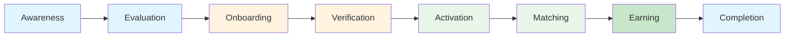
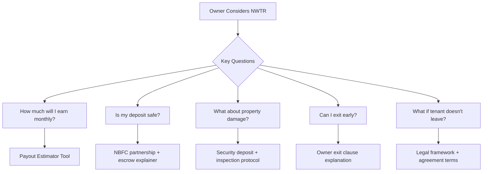
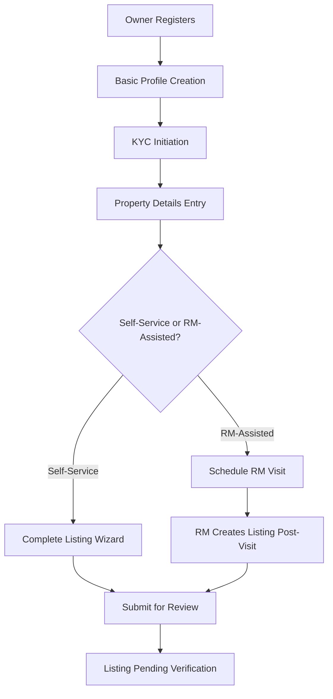
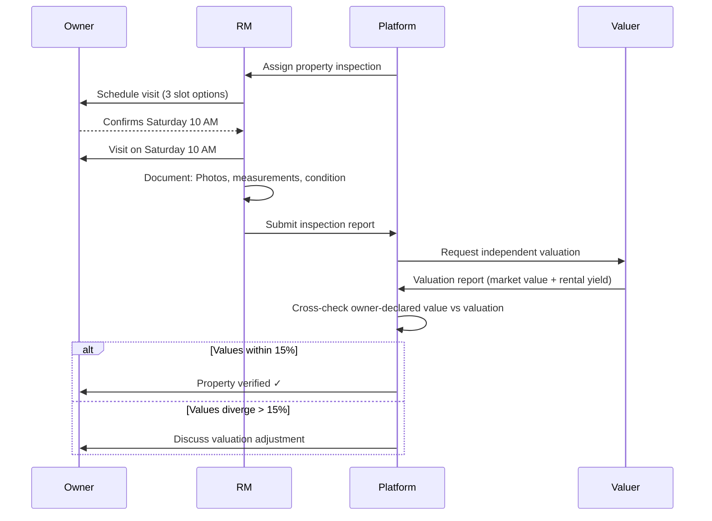
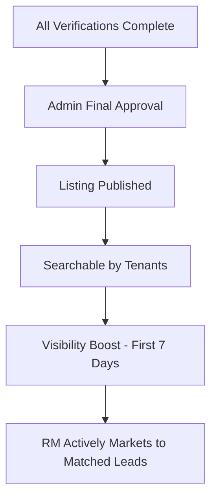
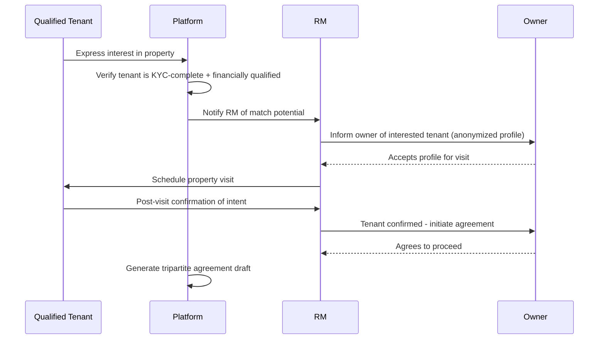
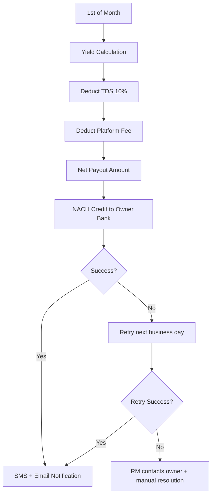
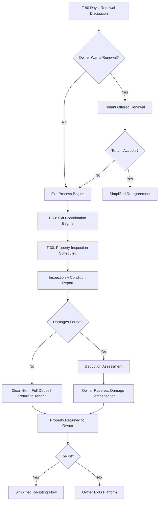
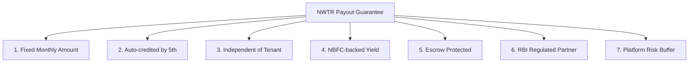

# Owner Journey

---
title: Owner Journey — End-to-End Experience Map
version: 1.0
audience: Product, Design, Marketing, Operations
last-updated: 2026-05-21
status: draft
related-docs:
  - "./prd.md"
  - "./escrow-deposit-logic.md"
  - "./rm-workflow.md"
  - "../00-executive/revenue-model.md"
---

## TL;DR

The NWTR owner journey covers 8 stages from awareness to completion — guiding property owners through understanding the deposit-yield model, onboarding their property, getting matched with qualified tenants, receiving guaranteed monthly payouts, and managing tenure end. Owners are primarily motivated by hassle-free income without tenant default risk. Target: Bangalore property owners with vacant premium properties seeking reliable, hands-off rental income.

---

## End-to-End Journey Map

---

## Stage 1: Awareness

### 1.1 Discovery Channels

| Channel | Strategy | Target Segment |
|---------|----------|----------------|
| Property management communities | Partnerships with existing services | Active landlords |
| Real estate agent network | RM-to-agent referral incentive | Multiple property owners |
| LinkedIn (owner persona ads) | "Earn without tenant hassles" messaging | Professional landlords |
| NRI property forums | "Manage your India property remotely" | NRI owners |
| Word of mouth (existing owners) | ₹50K referral bonus per successful match | Warm referrals |
| CA/Wealth advisor channel | Yield comparison for idle property | HNI owners |
| Residential society partnerships | Society-level awareness sessions | Gated communities |

### 1.2 Key Value Proposition for Owners

| Traditional Rental | NWTR Model |
|-------------------|------------|
| Tenant default risk | Guaranteed monthly payout |
| Vacancy periods (avg 2-3 months) | Quick matching (< 30 days avg) |
| Rent negotiation hassle | Fixed payout for 12 months |
| Legal disputes on eviction | Clean exit at tenure end |
| 10-month deposit (idle in bank) | Deposit invested, yield generates payout |
| Monthly rent collection effort | Auto-credit to bank account (NACH) |
| Tenant quality uncertainty | Pre-qualified, KYC-verified tenants only |

### 1.3 Initial Hook

> "Your property generates income. Your deposit generates the rent. Zero collection effort. Zero default risk."

---

## Stage 2: Evaluation

### 2.1 Owner Decision Factors

### 2.2 Payout Estimation Tool

| Input | Source |
|-------|--------|
| Property market value | Owner self-declares + system validates |
| Expected deposit % | 70-80% (system suggests optimal) |
| Current yield rates | Live rates from NBFC partner |

**Output Display:**
- Monthly payout estimate (conservative / expected / optimistic)
- Annual yield comparison vs traditional rent
- Net yield after TDS and platform fee
- Comparison chart: NWTR payout vs market rent

### 2.3 Trust-Building Content

- Video testimonial from existing owners
- NBFC partner explainer (brand + regulatory backing)
- Legal framework walkthrough (tripartite agreement)
- "Your money's journey" infographic
- FAQ: 40+ owner-specific questions answered
- One-on-one consultation booking with RM

---

## Stage 3: Onboarding

### 3.1 Owner Registration Flow

### 3.2 Owner KYC Requirements

| Document | Purpose | Mandatory |
|----------|---------|-----------|
| PAN Card | Tax identity, TDS compliance | Yes |
| Aadhaar | Identity + address | Yes |
| Property ownership proof | Title deed / sale deed / allotment letter | Yes |
| Latest property tax receipt | Confirms ownership + no dues | Yes |
| Bank account proof | Payout destination (cancelled cheque/passbook) | Yes |
| NACH mandate form | Auto-credit authorization | Yes |
| Society NOC | Permission to list (if applicable) | Conditional |
| Power of Attorney | If NRI with local representative | Conditional |

### 3.3 Property Document Submission

| Document | Verification Against |
|----------|---------------------|
| Sale deed / Title deed | Sub-registrar records |
| Encumbrance certificate (last 15 years) | Sub-registrar portal |
| Property tax paid receipt (current year) | Municipal corporation |
| RERA registration (if applicable) | State RERA portal |
| Society NOC / Share certificate | Society verification |
| Building plan approval | Municipal records |
| Occupancy certificate | Builder / Authority |

---

## Stage 4: Verification

### 4.1 Property Inspection

### 4.2 Legal Clearance Checklist

| Check | Status Needed | Red Flag |
|-------|--------------|----------|
| Clear title | No disputes/litigation | Active court case |
| No encumbrance | Clean EC for 15 years | Mortgage/lien |
| No pending dues | Tax + maintenance clear | Outstanding amounts |
| Valid occupation | Legally habitable | Unauthorized construction |
| No tenant in possession | Vacant or outgoing tenant | Sitting tenant |
| RERA compliance | Registered (if applicable) | Non-compliant project |

### 4.3 Valuation Process

| Method | Weight | Source |
|--------|--------|--------|
| Registered valuer assessment | 40% | Panel valuer report |
| Circle rate reference | 20% | State government |
| Comparable transactions | 30% | Registration data (last 6 months) |
| Owner declaration | 10% | Self-declared with justification |

---

## Stage 5: Activation

### 5.1 Listing Goes Live

### 5.2 Deposit Terms Configuration

| Parameter | Set By | Constraints |
|-----------|--------|------------|
| Deposit amount | Owner (system-suggested) | 70-80% of verified value |
| Minimum tenure | Platform (default) | 12 months (fixed) |
| Preferred tenant profile | Owner (optional) | Family / Professional / Any |
| Move-in readiness | Owner declares | Immediate / Date / After prep |
| Furnishing inclusions | Owner lists | Inventory attached |
| Maintenance responsibility | Agreement defines | Owner: structural / Tenant: minor |

### 5.3 Owner Communication During Wait

- Weekly listing performance report (views, saves, inquiries)
- Market comparison ("Your property vs similar listings")
- Optimization suggestions ("Add video tour for 3x more views")
- RM check-in call every 14 days

---

## Stage 6: Matching

### 6.1 Tenant Matching Process

### 6.2 Owner's Role During Matching

| Activity | Owner Involvement | RM Support |
|----------|-------------------|------------|
| Tenant profile review | Reviews anonymized summary | RM recommends |
| Visit coordination | Provide access (or give keys to RM) | RM manages scheduling |
| Tenant approval | Final go/no-go decision | RM advises |
| Agreement review | Reviews terms, suggests amendments | Legal + RM support |
| NACH mandate setup | One-time bank authorization | RM guides |

### 6.3 Agreement Execution (Owner Perspective)

- Reviews pre-filled tripartite agreement
- Can request limited amendments (approved by legal)
- Signs via Aadhaar e-sign or DSC
- Receives executed copy immediately
- Informed when tenant deposit lands in escrow
- Payout schedule confirmed and shared

---

## Stage 7: Earning

### 7.1 Monthly Payout Mechanics

### 7.2 Owner Dashboard

| Section | Information Displayed |
|---------|---------------------|
| Payout History | Month-wise credits, amount, status |
| Current Month | Expected payout date and amount |
| Investment Summary | How deposit is allocated (FD/T-Bill/G-Sec) |
| Tenure Status | Days remaining, tenant in good standing |
| Documents | Agreement, TDS certificates, bank statements |
| Property Status | Tenant feedback, maintenance requests |
| Tax Summary | Annual TDS deducted, Form 16A download |

### 7.3 Owner-Tenant Communication

| Communication | Channel | Managed By |
|--------------|---------|-----------|
| Maintenance requests | Platform (ticketing) | RM mediates |
| Property access for repair | Platform scheduling | RM coordinates |
| Emergency issues | Direct call + RM notified | Tenant → Owner + RM |
| Lease-related queries | Platform chat | RM responds |
| Payout queries | Dashboard + RM | Finance team |

### 7.4 Mid-Tenure Owner Actions

- View tenant status (in good standing / issues flagged)
- Update bank account details (with verification)
- Download TDS certificates
- Report property issues (if notified by society)
- Opt-in for renewal at T-90 days
- Request property inspection (one mid-tenure allowed)

---

## Stage 8: Completion

### 8.1 Tenure End Process

### 8.2 Property Return

| Step | Timeline | Description |
|------|----------|-------------|
| Pre-exit inspection | T-30 | RM documents property condition |
| Tenant move-out | T-0 | Key handover, meter readings |
| Post-exit verification | T+2 | Final condition vs move-in record |
| Damage assessment | T+3 | If applicable, deduction calculated |
| Property handover | T+5 | Owner receives keys, full access |

### 8.3 Re-Listing Option

- Streamlined process (property already verified)
- Updated photos required if > 90 days since last
- Valuation update if market shift > 10%
- Previous listing data and performance metrics available
- Priority in search results for returning owners

---

## Owner-Specific Concerns and Platform Responses

### Concern Matrix

| Concern | Owner's Fear | NWTR Response |
|---------|-------------|---------------|
| Deposit safety | "What if NWTR goes bankrupt?" | NBFC holds funds, not NWTR. Regulated entity with RBI oversight. |
| Tenant quality | "What if tenant damages property?" | Tiered KYC, financial verification, security clause in agreement |
| Payout reliability | "Will I get paid every month?" | NACH auto-debit from escrow, not dependent on tenant behavior |
| Legal protection | "What if tenant refuses to leave?" | Tripartite agreement with clear exit clause, NWTR enforces |
| Property damage | "Who pays for damages?" | Deducted from tenant deposit before return; owner compensated |
| Market change | "What if interest rates drop?" | Conservative yield estimate; platform absorbs rate risk |
| Tax implications | "How is my income taxed?" | TDS deducted at source; owner receives net + Form 16A |
| Vacancy after tenure | "What if no new tenant found?" | Priority re-listing + RM active marketing guarantee |

---

## Payout Guarantee Communication

### 7-Point Guarantee Framework

| Guarantee Element | Detail |
|-------------------|--------|
| Fixed amount | Determined at agreement signing, unchanged for tenure |
| Payment date | By 5th of each month (or next business day) |
| Independence | Payout not linked to tenant paying anything monthly |
| Source | Generated from yield on invested deposit |
| Protection | Funds in NBFC-managed escrow, not NWTR operating account |
| Regulation | NBFC partner regulated by RBI |
| Buffer | Platform maintains risk reserve for rate fluctuation |

### Communication Cadence

| Timing | Communication | Channel |
|--------|--------------|---------|
| Pre-onboarding | Guarantee explainer video | Website + RM presentation |
| At agreement | Payout schedule in writing | Agreement clause |
| Monthly | Payout confirmation | SMS + Email + Dashboard |
| Quarterly | Yield performance summary | Email + Dashboard |
| Annual | TDS certificate + Annual summary | Dashboard download |

---

## Cross-References

- [Tenant Journey](./tenant-journey.md) — Parallel tenant perspective
- [Admin Portal](./admin-portal-requirements.md) — Owner management features
- [Listing Portal](./listing-portal-requirements.md) — Property listing details
- [Transaction Flow](./transaction-flow.md) — Payout execution mechanics
- [Escrow & Deposit Logic](./escrow-deposit-logic.md) — Investment and yield logic
- [Verification Flow](./verification-flow.md) — Property verification process
- [KYC Flow](./kyc-flow.md) — Owner KYC requirements

---

## Owner Persona Profiles

### Persona 1: The NRI Owner

| Attribute | Detail |
|-----------|--------|
| Profile | Software engineer in US/UK, owns flat in Bangalore |
| Pain | Cannot manage property remotely, unreliable caretakers |
| Need | Completely hands-off income, trustworthy management |
| Delight | Dashboard accessible anywhere, RM handles everything |

### Persona 2: The Retired Couple

| Attribute | Detail |
|-----------|--------|
| Profile | Owns 2nd/3rd property, wants supplemental income |
| Pain | Tenant screening stress, rent collection hassle |
| Need | Reliable monthly income, no confrontation with tenants |
| Delight | Guaranteed payout, NACH auto-credit, zero effort |

### Persona 3: The Investor

| Attribute | Detail |
|-----------|--------|
| Profile | Multiple properties purchased for rental yield |
| Pain | Vacancy, maintenance cost during vacancy, yield optimization |
| Need | Maximum yield, quick occupancy, professional management |
| Delight | Higher net yield than traditional rent, faster matching |
