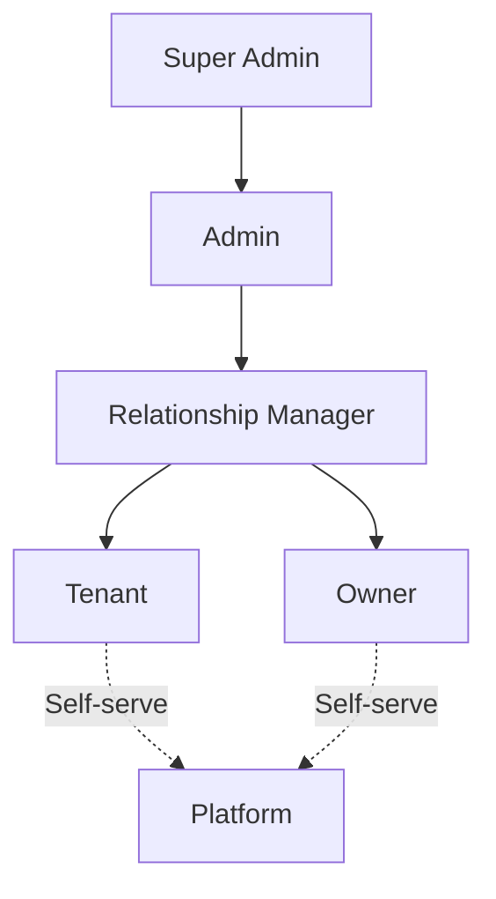
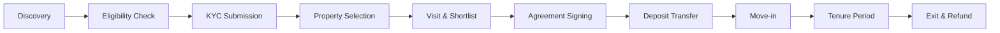
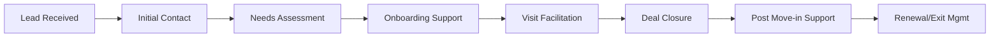

# Product Requirements Document — NWTR

## TL;DR

NWTR ("New Way To Rent") eliminates monthly rent by enabling tenants to deposit 70–80% of a property's value, live rent-free for one year, and receive a full refund at tenure end. NWTR invests the deposit via an NBFC partner in sovereign-grade instruments (FDs, T-Bills, G-Secs), paying property owners monthly from yield. The platform serves 5 user roles across 5 portals, targeting HNI/NRI/wealthy professionals in Bangalore.

---

## 1. Product Overview

| Attribute | Detail |
|-----------|--------|
| Product Name | NWTR — New Way To Rent |
| Category | Proptech-Fintech Platform |
| Target Market | Bangalore (Phase 1), Tier-1 India (Phase 2) |
| Target Users | HNI, NRI, Wealthy Professionals, Premium Property Owners |
| Revenue Model | Spread on investment yield, platform fees, premium services |
| Launch Target | Q3 2026 |

### 1.1 Problem Statement

Indian urban tenants face steep monthly rents (₹50K–₹3L/month for premium properties). Owners face unreliable rental income and tenant churn. The current security deposit (2–3 months rent) provides no returns. NWTR transforms the rental equation by converting idle capital into yield-generating deposits while guaranteeing owners steady monthly income.

### 1.2 Vision

Become India's largest deposit-based rental platform, managing ₹10,000 Cr in deposits within 5 years.

### 1.3 Objectives

1. Enable rent-free living for qualified tenants via large-deposit model
2. Guarantee owners monthly payouts backed by sovereign instruments
3. Achieve regulatory compliance (NBFC, SEBI, RBI frameworks)
4. Deliver a trust-first digital experience for high-value transactions
5. Build a scalable platform supporting 10,000+ active tenancies by Year 2

---

## 2. User Roles & Permissions

| Role | Portal | Key Permissions |
|------|--------|----------------|
| Tenant | Tenant Portal | Browse, simulate, apply, KYC, agreements, dashboard |
| Owner | Owner Portal | List property, KYC, manage agreements, track payouts |
| Relationship Manager | RM Portal | Lead mgmt, onboarding assist, verification, deal tracking |
| Admin | Admin Portal | Compliance, approvals, payouts, KYC verification, analytics |
| Super Admin | Admin Portal | System config, role management, audit, partner management |

---

## 3. Platform Modules

### 3.1 Public Website

| Feature | Description | Priority |
|---------|-------------|----------|
| Landing Page | Premium brand positioning, value proposition | P0 |
| How It Works | Interactive 4-step explainer with animation | P0 |
| Property Discovery | Search/filter premium properties | P0 |
| Deposit Calculator | Real-time deposit & yield simulation | P0 |
| Trust & Security | Compliance, NBFC partner info, insurance | P0 |
| FAQs | Comprehensive Q&A with search | P1 |
| Blog/Resources | Thought leadership, guides | P2 |
| NRI Landing | Tailored experience for NRI audience | P1 |
| Referral Program | Referral landing with tracking | P2 |
| Contact/Support | Multi-channel support access | P1 |

### 3.2 Tenant Portal

| Feature | Description | Priority |
|---------|-------------|----------|
| Property Browse & Filter | Advanced search with map view | P0 |
| Deposit Simulator | Personalized deposit/yield calculator | P0 |
| Eligibility Check | Income, credit, document pre-check | P0 |
| KYC Submission | 3-tier KYC (Basic, Enhanced, Full) | P0 |
| Property Shortlisting | Save, compare, share properties | P1 |
| Visit Scheduling | Book property visits with RM | P0 |
| Agreement Review & Sign | Digital agreement with e-sign | P0 |
| Deposit Transfer | Secure bank transfer with tracking | P0 |
| Tenant Dashboard | Active tenancy status, timeline | P0 |
| Document Vault | All agreements, receipts, KYC docs | P1 |
| Maintenance Requests | Raise and track maintenance issues | P1 |
| Exit Initiation | Refund request with timeline | P0 |
| Communication Hub | Chat with RM, notifications | P1 |
| Renewal Option | Extend tenancy before expiry | P1 |
| Profile Management | Personal info, bank details, preferences | P0 |

### 3.3 Owner Portal

| Feature | Description | Priority |
|---------|-------------|----------|
| Property Listing | Multi-step property submission | P0 |
| Owner KYC | Identity, ownership, bank verification | P0 |
| Listing Dashboard | View/edit property listings | P0 |
| Payout Tracking | Monthly payout history and schedule | P0 |
| Agreement Management | View/sign/manage active agreements | P0 |
| Tenant Matching | View interested tenants | P1 |
| Property Visit Management | Approve/schedule visits | P0 |
| Maintenance Responses | Respond to tenant maintenance requests | P1 |
| Financial Reports | Annual income statements, TDS certs | P1 |
| Communication Hub | Chat with RM, notifications | P1 |
| Profile Management | Personal info, bank details, tax info | P0 |

### 3.4 RM Portal

| Feature | Description | Priority |
|---------|-------------|----------|
| Lead Dashboard | Pipeline view with status tracking | P0 |
| Lead Assignment | Auto-assigned leads with priority | P0 |
| Tenant Onboarding Assist | Guide tenants through KYC/docs | P0 |
| Owner Onboarding Assist | Guide owners through listing/KYC | P0 |
| Visit Coordination | Schedule, confirm, track visits | P0 |
| Deal Tracker | Active deals with stage progression | P0 |
| Document Collection | Request/verify docs from users | P0 |
| KYC Escalation | Flag issues, request re-verification | P1 |
| Performance Dashboard | Targets, commissions, leaderboard | P1 |
| Communication Tools | WhatsApp, call, email templates | P0 |

### 3.5 Admin Portal

| Feature | Description | Priority |
|---------|-------------|----------|
| KYC Verification Queue | Manual review and approval | P0 |
| Transaction Monitoring | All deposit/payout transactions | P0 |
| Compliance Dashboard | Regulatory status, alerts | P0 |
| User Management | CRUD for all user roles | P0 |
| Approval Workflows | Multi-level approval chains | P0 |
| Payout Management | Initiate, approve, reconcile payouts | P0 |
| Agreement Oversight | All agreements with audit trail | P0 |
| Analytics Dashboard | Business metrics, trends, forecasts | P1 |
| Partner Management | NBFC, bank, KYC provider config | P0 |
| System Configuration | Feature flags, rate limits, thresholds | P0 |
| Audit Logs | Complete activity trail | P0 |
| Dispute Resolution | Handle tenant/owner disputes | P1 |
| Reports & Exports | Financial, compliance, operational | P1 |
| Notification Management | Template management, send history | P1 |
| Property Moderation | Approve/reject property listings | P0 |

---

## 4. Core User Journeys

### 4.1 Tenant Journey

### 4.2 Owner Journey

```mermaid
graph LR
    A[Property Listing] --> B[Owner KYC]
    B --> C[Listing Approval]
    C --> D[Tenant Matching]
    D --> E[Visit Coordination]
    E --> F[Agreement Signing]
    F --> G[Deposit Confirmation]
    G --> H[Monthly Payouts]
    H --> I[Tenure Completion]
    I --> J[Deposit Return / Renewal]
```

### 4.3 RM Journey

---

## 5. Feature Priority Matrix

| Priority | Category | Count | Examples |
|----------|----------|-------|----------|
| P0 — Must Have | Core flow enablers | 45 | KYC, deposit, agreements, payouts |
| P1 — Should Have | Experience enhancers | 25 | Advanced search, notifications, reports |
| P2 — Nice to Have | Growth features | 15 | Referrals, blog, community |

---

## 6. MVP Scope (v1.0)

### In Scope

- Public website with property discovery and deposit calculator
- Tenant Portal: eligibility → KYC → agreement → deposit → dashboard → exit
- Owner Portal: listing → KYC → agreement → payout tracking
- RM Portal: lead management, onboarding assist, visit coordination
- Admin Portal: KYC verification, transaction monitoring, payouts, approvals
- Single city: Bangalore
- Single property type: Residential apartments (2BHK, 3BHK, 4BHK)
- Single tenure: 12 months
- Integration: 1 NBFC partner, 1 KYC provider, 1 e-Sign provider

### Out of Scope (v2.0+)

- Multi-city expansion
- Commercial properties
- Flexible tenure (6/18/24 months)
- Secondary market (deposit transfer)
- Insurance marketplace
- Property management services
- Multi-NBFC routing
- International payment support

---

## 7. Non-Functional Requirements

| Requirement | Target | Measurement |
|-------------|--------|-------------|
| Page Load Time | < 2s (P95) | Lighthouse, RUM |
| API Response | < 200ms (P95) | APM |
| Uptime | 99.9% | Monthly SLA |
| Concurrent Users | 5,000 | Load testing |
| Data Encryption | AES-256 at rest, TLS 1.3 in transit | Audit |
| Session Security | JWT + refresh token, 15-min access | Auth logs |
| Disaster Recovery | RPO: 1h, RTO: 4h | DR drills |
| Accessibility | WCAG 2.1 AA | Automated + manual audit |
| Mobile Responsiveness | All portals responsive | Device testing |

---

## 8. Success Metrics & KPIs

| Metric | Target (Year 1) | Measurement |
|--------|-----------------|-------------|
| Active Tenancies | 500 | Platform data |
| Total Deposits Under Management | ₹500 Cr | Financial reports |
| Owner Satisfaction (NPS) | > 50 | Quarterly survey |
| Tenant Satisfaction (NPS) | > 60 | Quarterly survey |
| Average Time to Move-in | < 21 days | Process analytics |
| KYC Completion Rate | > 85% | Funnel analytics |
| Deposit Return SLA Compliance | > 99% | Operations data |
| Monthly Active Users | 10,000 | Analytics |

---

## 9. Constraints & Assumptions

### Constraints

1. Must operate within RBI/SEBI/NBFC regulatory framework
2. Deposit investment limited to sovereign instruments (FDs, T-Bills, G-Secs)
3. Cannot guarantee specific returns; yield varies with market rates
4. KYC must comply with PMLA 2002 and DPDP Act 2023
5. E-sign must be Aadhaar-based (CCA-approved provider)
6. Data must reside in India (data localization)

### Assumptions

1. Target users have ₹50L–₹2Cr liquid capital for deposit
2. NBFC partner provides ≥7% annual yield on sovereign instruments
3. Property owners accept monthly payout (vs lump-sum advance rent)
4. Bangalore market has 10,000+ premium rental properties available
5. Users trust digital agreements and e-sign for high-value transactions
6. RM-assisted model necessary for high-value first transactions

---

## 10. Dependencies

| Dependency | Type | Status | Risk |
|------------|------|--------|------|
| NBFC Partner | Investment management, regulatory compliance | In discussion | High — blocker for core flow |
| Bank API (NEFT/RTGS/IMPS) | Deposit collection, payout disbursement | Available | Medium — integration effort |
| KYC Provider (DigiLocker/CKYC) | Identity verification | Available | Low |
| e-Sign Provider (Leegality/DigiSign) | Agreement execution | Available | Low |
| Credit Bureau (CIBIL/Experian) | Creditworthiness check | Available | Low |
| E-stamp Provider | Stamp duty compliance | State-specific | Medium |
| Payment Gateway | Platform fee collection | Available | Low |
| Azure Cloud | Infrastructure hosting | Available | Low |
| NACH/eMandate | Recurring payout processing | Available | Medium |

---

## Cross-References

- Technical Requirements: [docs/01-product/trd.md](./trd.md)
- Feature Specifications: [docs/01-product/feature-specifications.md](./feature-specifications.md)
- User Stories: [docs/01-product/user-stories.md](./user-stories.md)
- Application Flow: [docs/01-product/app-flow.md](./app-flow.md)
- UX Flows: [docs/01-product/ux-flows.md](./ux-flows.md)
- Backend Workflows: [docs/01-product/backend-workflows.md](./backend-workflows.md)
- RM Workflow: [docs/01-product/rm-workflow.md](./rm-workflow.md)
