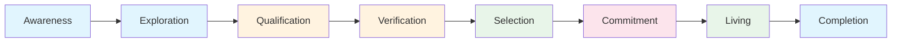
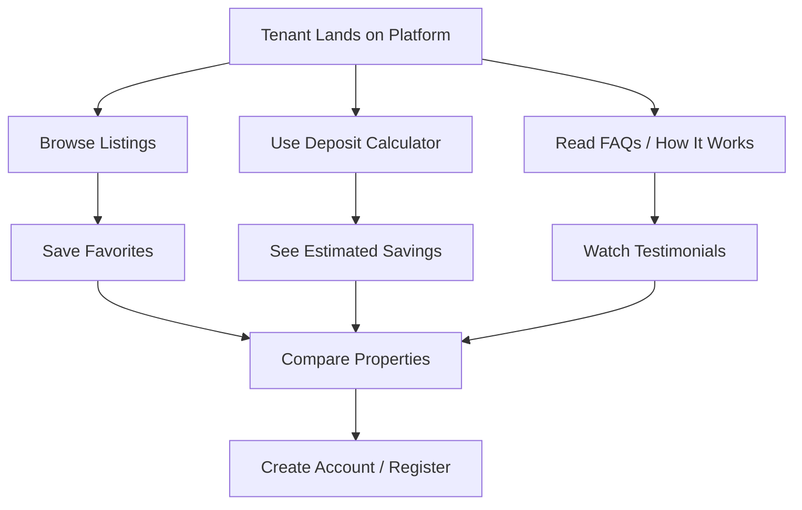
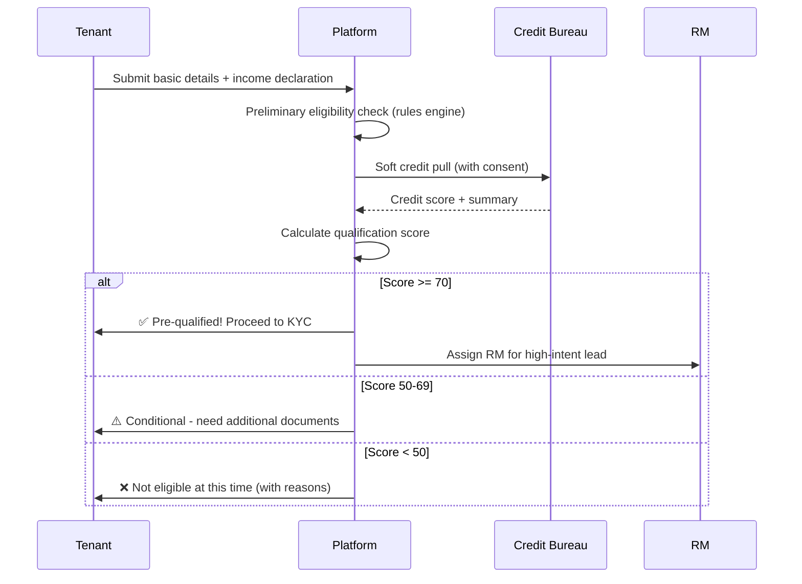
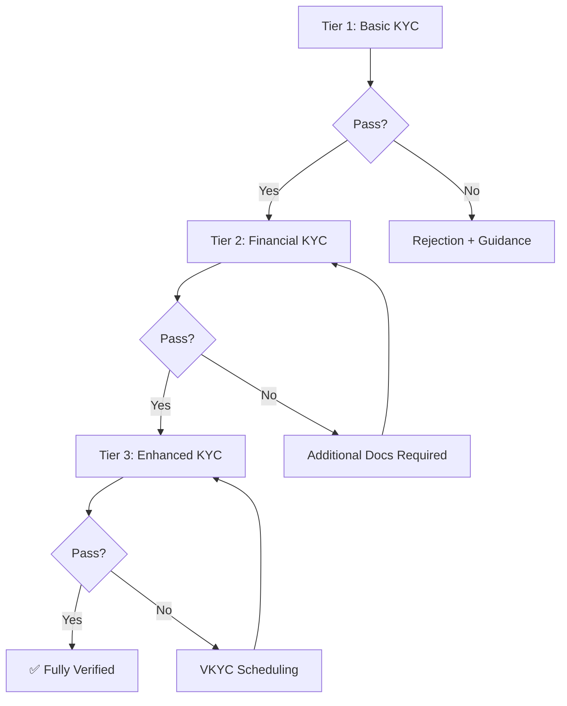
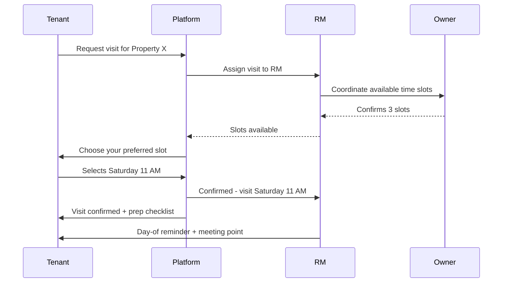
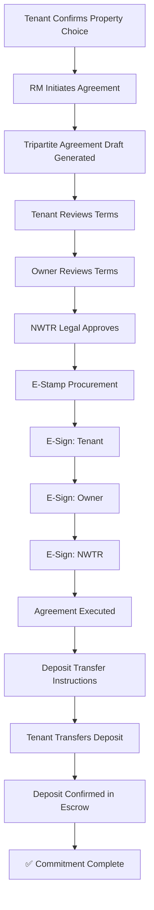
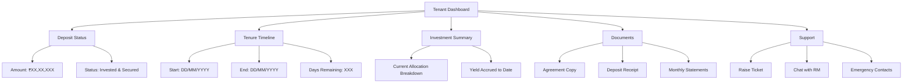
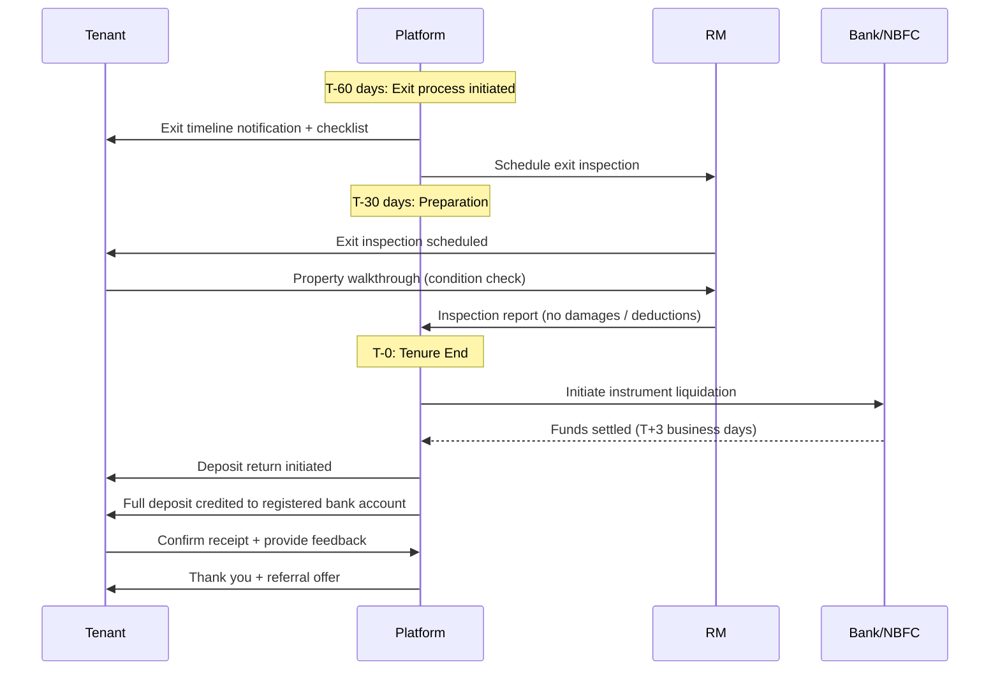
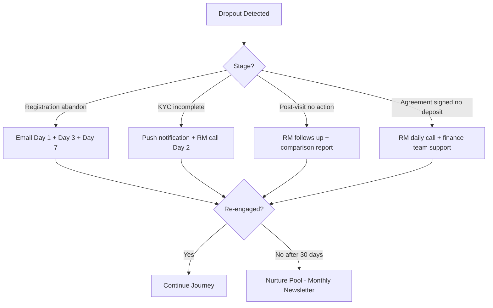

# Tenant Journey

---
title: Tenant Journey — End-to-End Experience Map
version: 1.0
audience: Product, Design, Marketing, Engineering
last-updated: 2026-05-21
status: draft
related-docs:
  - "./prd.md"
  - "./kyc-flow.md"
  - "./escrow-deposit-logic.md"
  - "../03-ux-ui/ux-strategy.md"
  - "../00-executive/hni-persona-analysis.md"
---

## TL;DR

The NWTR tenant journey spans 8 stages from awareness through exit — covering discovery, qualification, KYC, property selection, deposit commitment, the living tenure, and deposit return. This document maps every touchpoint, emotion, channel, pain point, and recovery strategy across the full lifecycle. Target persona: HNI professionals, NRIs, and wealthy individuals in Bangalore seeking an alternative to monthly rent with capital preservation.

---

## End-to-End Journey Map

---

## Stage 1: Awareness

### 1.1 Discovery Channels

| Channel | Strategy | Target Audience |
|---------|----------|-----------------|
| LinkedIn Ads | Thought leadership + case studies | HNI professionals, CXOs |
| Google Search | "Alternative to rent Bangalore", "deposit instead of rent" | Active searchers |
| Referral Program | Existing tenant refers friend (₹25K reward) | Warm network |
| Wealth Manager Partners | Introduced during portfolio review | HNI/UHNI clients |
| NRI Forums | IndiaProperty, NRI communities | NRIs with Bangalore property interest |
| Premium Events | Property expos, startup networking | High-intent HNIs |
| Content Marketing | Blog: "Why pay rent when you can invest?" | SEO-driven organic |

### 1.2 First Impression Touchpoints

- Landing page with deposit calculator ("See how much you save")
- 60-second explainer video on homepage
- Social proof: Testimonials from early tenants
- Trust signals: NBFC partnership, RBI compliance badges
- Comparison table: NWTR vs Traditional Rent vs Buying

### 1.3 Key Message

> "Deposit your capital. Live rent-free. Get it all back."

### 1.4 Success Metrics

| Metric | Target |
|--------|--------|
| Website visits (monthly) | 50,000+ |
| Awareness-to-Registration | 5-8% |
| Cost per qualified lead | < ₹2,000 |
| Brand recall (survey) | > 30% in target segment |

---

## Stage 2: Exploration

### 2.1 Activities

### 2.2 Simulation Tools

| Tool | Purpose | Inputs |
|------|---------|--------|
| Deposit Calculator | Show deposit vs rent savings over 1 year | Monthly rent budget, property value |
| Savings Comparator | Compare NWTR deposit return vs FD/MF | Deposit amount, current FD rate |
| Property Matcher | Suggest properties based on preferences | Location, BHK, budget |
| Eligibility Estimator | Pre-check if likely to qualify | Annual income, existing liabilities |

### 2.3 Content Consumption

- How It Works (3-step visual guide)
- FAQ (30+ questions, categorized)
- Security & Safety ("Where does my money go?")
- Legal Framework ("What protects me?")
- Exit Scenarios ("What if I want to leave early?")

### 2.4 Touchpoints

| Touchpoint | Channel | Purpose |
|------------|---------|---------|
| Website/App browsing | Digital | Self-discovery |
| WhatsApp chatbot | Messaging | Quick answers |
| Email nurture sequence | Email | Education + urgency |
| RM callback request | Phone | High-intent conversion |

---

## Stage 3: Qualification

### 3.1 Eligibility Criteria

| Criterion | Minimum Threshold | Verification Method |
|-----------|------------------|---------------------|
| Annual Income | ₹30,00,000 | ITR / Salary slips |
| CIBIL Score | 700+ | Bureau pull (consent) |
| Age | 21-65 years | Aadhaar/PAN |
| Existing Debt | EMI/NMI ratio < 50% | Bank statements |
| Deposit Source | Legitimate (no cash) | Bank trail |
| Residency | Indian citizen or NRI with valid passport | Document check |

### 3.2 Qualification Flow

### 3.3 Pre-Qualification Communication

- Instant result (< 30 seconds)
- Clear reason if not qualified
- Guidance on how to improve eligibility
- No negative credit impact (soft pull only)
- Option to request RM consultation regardless

---

## Stage 4: Verification (Tiered KYC)

### 4.1 KYC Progression

### 4.2 Tier Details

| Tier | Documents | Timeline | Unlocks |
|------|-----------|----------|---------|
| Basic | PAN + Aadhaar OTP | 2 minutes | Property browsing, saves, calculator |
| Financial | Bank statements + ITR + CIBIL consent | 24-48 hours | Eligibility confirmation, property visits |
| Enhanced | VKYC + asset declaration + source of funds | 3-5 days | Agreement signing, deposit transfer |

### 4.3 Tenant Experience During Verification

- Real-time status tracker (progress bar with milestones)
- Document upload via camera (OCR auto-fill)
- DigiLocker integration (one-tap document fetch)
- RM available via chat for help
- Estimated completion time displayed
- Push notifications on status changes

---

## Stage 5: Selection

### 5.1 Property Discovery

| Feature | Description |
|---------|-------------|
| Smart Search | AI-powered filters + natural language ("3BHK near Koramangala under ₹60L deposit") |
| Map View | Cluster pins with price tooltips |
| Comparison Tool | Side-by-side compare up to 4 properties |
| Neighborhood Score | Safety, connectivity, lifestyle ratings |
| Virtual Tours | 360° and video walkthroughs |
| Save & Shortlist | Heart icon, folder organization |

### 5.2 Property Visit Booking

### 5.3 Visit Experience

- RM accompanies tenant on-site
- Standardized property evaluation checklist
- Photo documentation during visit
- Immediate feedback capture post-visit
- Follow-up within 2 hours with visit summary

### 5.4 Decision Support

- Comparative analysis report (visited properties)
- Yield estimation per property
- Neighborhood deep-dive per shortlisted property
- Existing tenant reviews (if re-listed property)
- Price history and market trends for locality

---

## Stage 6: Commitment

### 6.1 Agreement Flow

### 6.2 Deposit Transfer

| Detail | Specification |
|--------|--------------|
| Method | RTGS/NEFT to designated escrow account |
| Timeline | Within 7 days of agreement execution |
| Acknowledgment | System-generated receipt within 30 minutes |
| Confirmation | T+1 business day (bank reconciliation) |
| Partial Deposit | Not supported (full amount required) |
| Source Verification | Bank trail must match declared source |

### 6.3 Communication at Commitment

- Agreement summary email (key terms highlighted)
- Deposit transfer instructions (step-by-step with screenshots)
- RM available for phone support during transfer
- Confirmation SMS + email on deposit receipt
- Welcome kit preparation triggered

---

## Stage 7: Living

### 7.1 Move-In Process

| Step | Timeline | Support |
|------|----------|---------|
| Key handover coordination | Within 3 days of deposit confirmation | RM facilitates |
| Property condition documentation | Day of move-in | Photo/video + checklist |
| Utility transfer guidance | First week | Help desk support |
| Welcome kit delivery | Day 1 | Physical package |
| Neighborhood guide | Day 1 | Digital document |

### 7.2 Tenant Dashboard (During Tenure)

### 7.3 During-Tenure Services

- Monthly investment summary notification
- Maintenance issue reporting (redirected to owner/society)
- Mid-tenure check-in call from RM (month 6)
- Community events and networking (other NWTR tenants)
- Referral program access ("Refer & Earn")

### 7.4 Tenure Extension

- Notified at T-90 days about renewal option
- Simplified re-qualification (only delta verification)
- Same property or switch to new property
- Deposit rollover (no withdrawal + re-deposit needed)

---

## Stage 8: Completion

### 8.1 Exit Process

### 8.2 Deposit Return Details

| Scenario | Return Amount | Timeline |
|----------|-------------|----------|
| Normal completion (no damage) | 100% of deposit | T+3 to T+5 business days |
| Minor damages (per inspection) | Deposit minus repair cost | T+7 (after owner agreement) |
| Dispute (tenant contests deduction) | Held in escrow during resolution | Up to 30 days |
| Early exit (tenant-initiated) | Deposit minus penalty | T+7 after penalty calculation |

### 8.3 Post-Completion

- NPS survey
- Testimonial request (incentivized)
- Re-engagement for next property (if applicable)
- Alumni community access
- Tax certificate for deposit return (no capital gains as principal return)

---

## Touchpoints and Channels per Stage

| Stage | Primary Channel | Secondary Channels | Ownership |
|-------|----------------|-------------------|-----------|
| Awareness | Digital ads, SEO | Events, Referrals | Marketing |
| Exploration | Website/App | WhatsApp, Email | Product |
| Qualification | App (self-serve) | RM call | Product + Sales |
| Verification | App + DigiLocker | RM assistance | Operations |
| Selection | App + In-person visits | RM coordination | Sales |
| Commitment | App + E-sign | RM + Legal | Legal + Sales |
| Living | Dashboard + RM | Support desk | Customer Success |
| Completion | App + Bank | RM + Finance | Operations |

---

## Emotional Journey Mapping

| Stage | Emotion | Intensity | Key Thought |
|-------|---------|-----------|-------------|
| Awareness | Curiosity | Medium | "Is this real? Sounds too good." |
| Exploration | Excitement | High | "I could actually save all that rent money!" |
| Qualification | Anxiety | High | "Will I qualify? Is my income enough?" |
| Verification | Tedium | Medium | "So many documents... but okay, almost there." |
| Selection | Delight | High | "Found the perfect home!" |
| Commitment | Fear/Nervousness | Very High | "That's a lot of money to transfer. Is it safe?" |
| Living | Satisfaction | High | "Rent-free life is amazing. My money is growing." |
| Completion | Relief/Joy | Very High | "Got my full deposit back! This actually works!" |

---

## Pain Points and Delight Moments

### Pain Points

| Stage | Pain Point | Mitigation |
|-------|-----------|-----------|
| Exploration | "70-80% deposit is intimidating" | Break down savings vs rent paid |
| Qualification | "Credit check feels intrusive" | Explain soft pull, no impact |
| Verification | "Too many documents needed" | DigiLocker, OCR, progressive approach |
| Commitment | "Large fund transfer anxiety" | Escrow trust, NBFC branding, insurance |
| Living | "Who handles maintenance?" | Clear SLA with owner, RM support |
| Completion | "Will I really get my money back?" | Guarantee structure, NBFC backing |

### Delight Moments

| Stage | Delight | Impact |
|-------|---------|--------|
| Exploration | "Deposit calculator shows I save ₹18L/year" | Conversion driver |
| Qualification | "Pre-qualified in 30 seconds!" | Reduces drop-off |
| Selection | "Virtual tour from my couch" | Convenience |
| Commitment | "Deposit confirmed, welcome aboard" | Confidence boost |
| Living | "Monthly statement shows yield accruing" | Trust building |
| Completion | "Full amount back in my account in 3 days" | Advocacy trigger |

---

## Dropout Points and Recovery Strategies

| Dropout Point | Typical Reason | Recovery Strategy |
|--------------|----------------|-------------------|
| Post-awareness (no registration) | Skepticism, unclear value | Retargeting ads with testimonials |
| Post-registration (no KYC) | Effort required, friction | Simplified onboarding email sequence |
| Post-qualification (no property selection) | No matching property, cold feet | RM outreach, new listing alerts |
| Post-visit (no commitment) | Price shock, comparison shopping | Follow-up within 24h, offer alternatives |
| Post-agreement (no deposit) | Fund arrangement delay, fear | RM support, extend timeline (7→14 days) |

### Recovery Automation

---

## Cross-References

- [Owner Journey](./owner-journey.md) — Parallel journey from owner perspective
- [KYC Flow](./kyc-flow.md) — Detailed Stage 4 verification process
- [Verification Flow](./verification-flow.md) — All document verification details
- [Transaction Flow](./transaction-flow.md) — Stage 6 deposit mechanics
- [Escrow & Deposit Logic](./escrow-deposit-logic.md) — Investment and return logic
- [Listing Portal](./listing-portal-requirements.md) — Stage 5 property discovery
