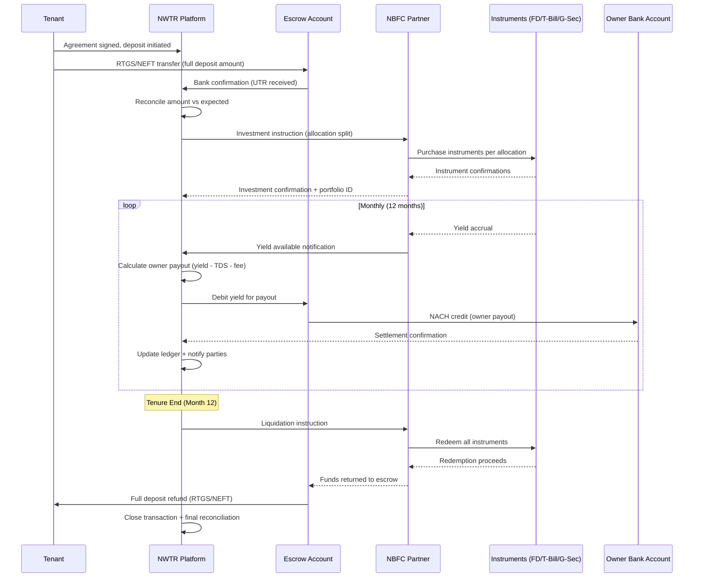
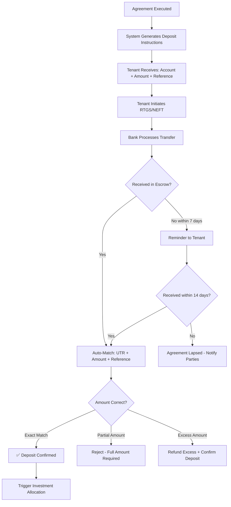
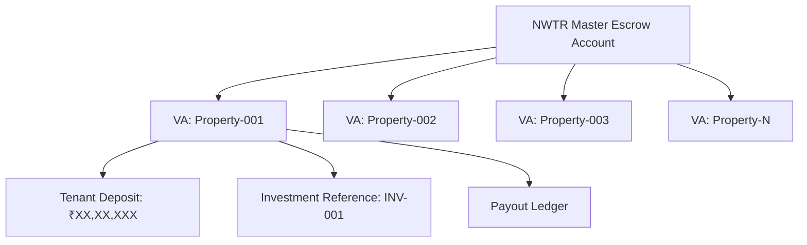
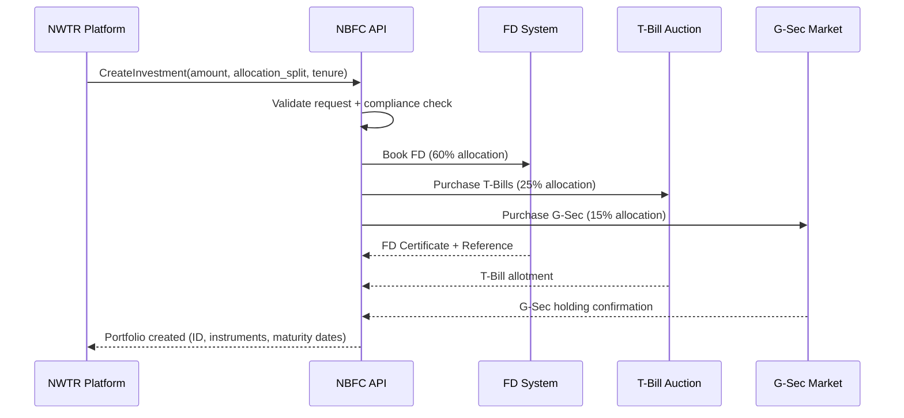
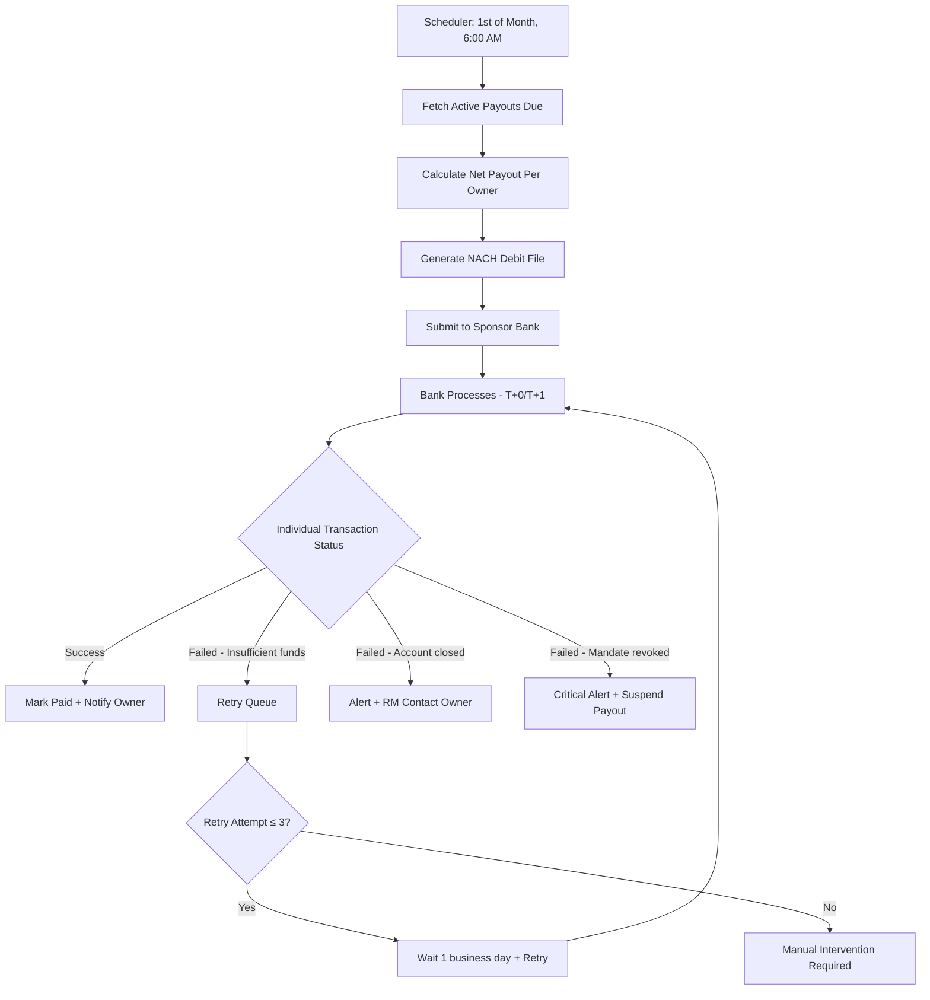
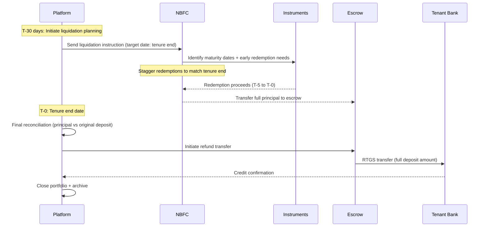
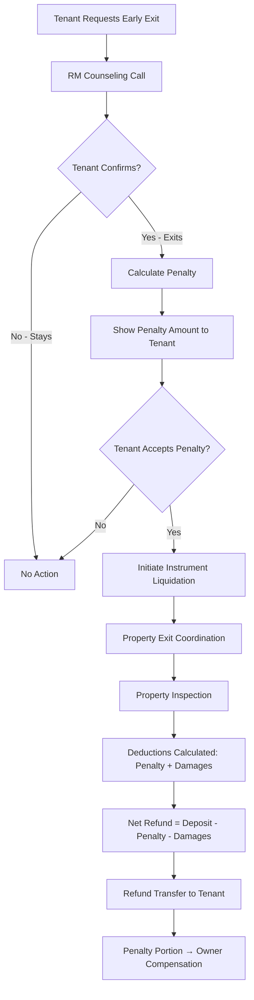
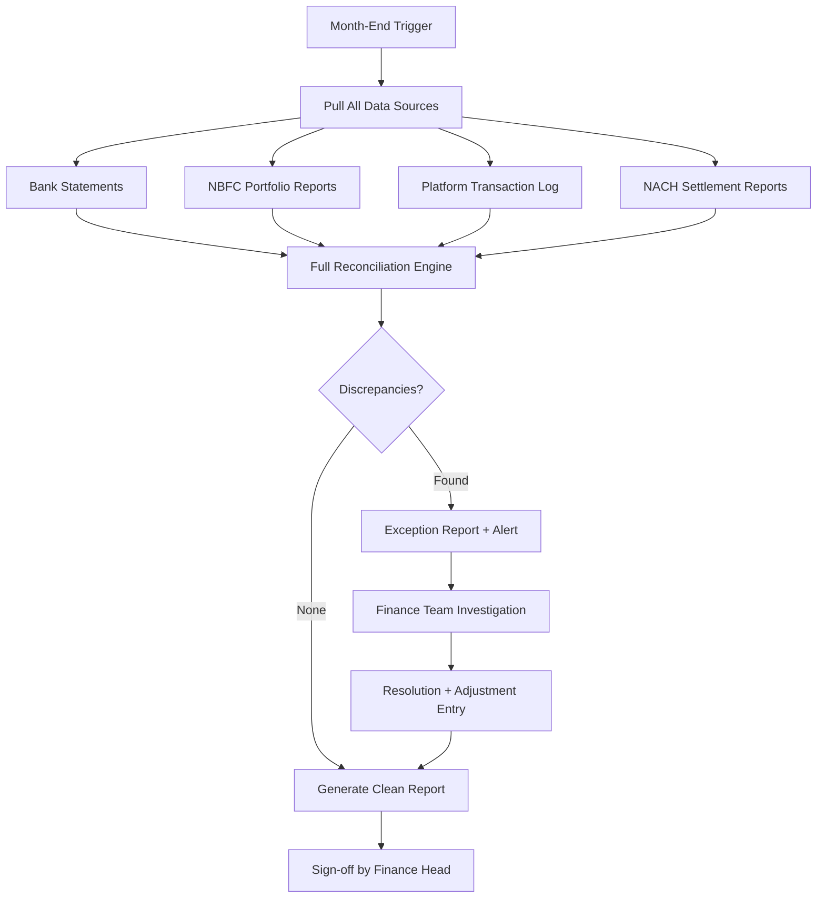
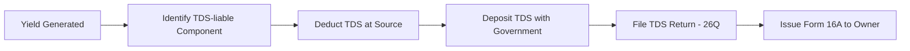
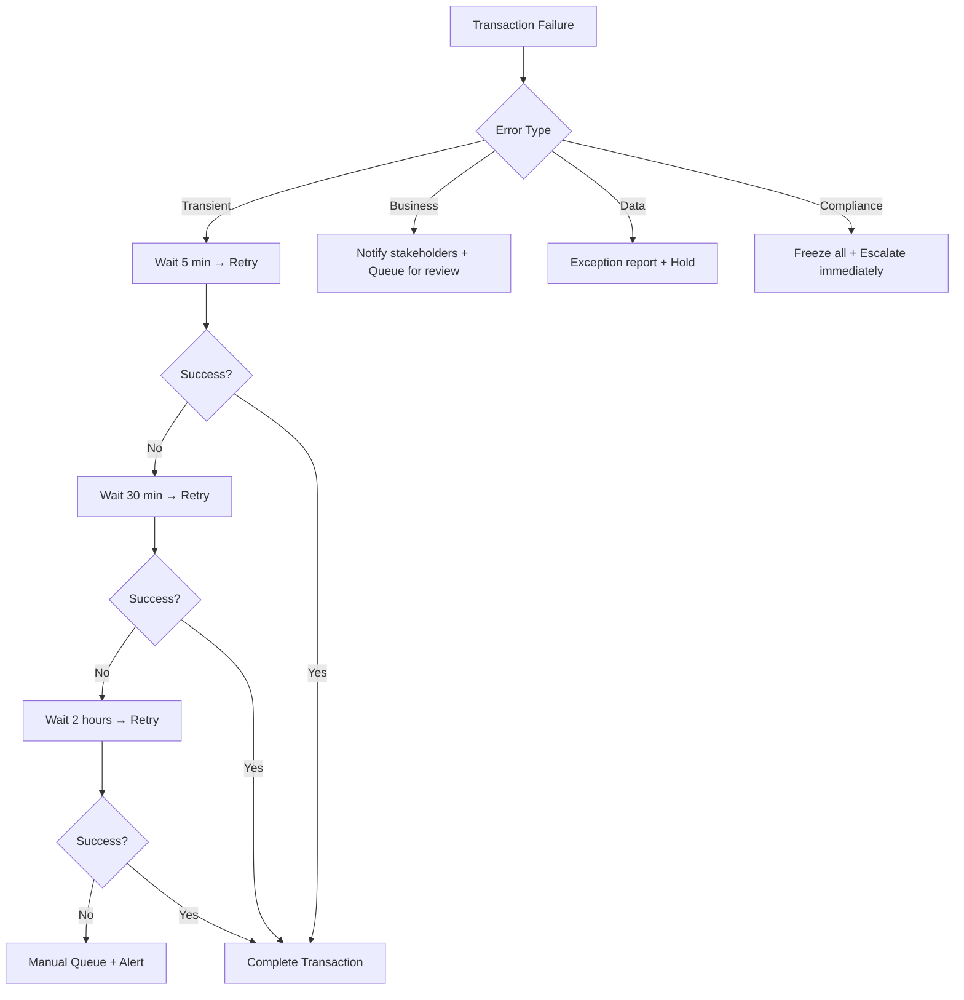

# Transaction Flow

---
title: Transaction Flow — Complete Financial Lifecycle
version: 1.0
audience: Engineering, Finance, Compliance
last-updated: 2026-05-21
status: draft
related-docs:
  - "./escrow-deposit-logic.md"
  - "./backend-workflows.md"
  - "../02-technical/database-schema.md"
  - "../00-executive/business-model.md"
---

## TL;DR

NWTR's transaction flow covers the complete financial lifecycle — from tenant deposit collection through escrow management, NBFC investment, yield accrual, monthly owner payouts via NACH, deposit maturity, and full return. This document details every transaction state, error handling mechanism, reconciliation schedule, tax deduction logic, and audit trail requirement. All financial operations run through a regulated NBFC partner with RBI-compliant escrow management.

---

## Complete Transaction Lifecycle



---

## 1. Deposit Collection

### 1.1 Pre-Deposit Verification Gate

| Check | Must Be True | Blocker If Failed |
|-------|-------------|-------------------|
| Agreement fully executed | All 3 parties signed | Cannot initiate deposit |
| Tenant KYC Tier 3 complete | Enhanced KYC passed | Cannot proceed |
| Source of funds declared | Bank trail documented | Compliance hold |
| Deposit amount matches agreement | Exact amount ± ₹100 | Manual reconciliation |
| Escrow account active | Bank confirmed ready | Platform error |

### 1.2 Deposit Transfer Process



### 1.3 Deposit Acknowledgment

| Communication | Timeline | Channel |
|--------------|----------|---------|
| Transfer detected | Real-time (bank webhook) | Dashboard status update |
| Amount confirmed | T+0 to T+1 business day | SMS + Email + Push |
| Receipt generated | On confirmation | PDF download in dashboard |
| Investment initiated | Within 24 hours of confirmation | Email notification |

### 1.4 Supported Transfer Methods

| Method | Minimum | Maximum | Settlement Time |
|--------|---------|---------|-----------------|
| RTGS | ₹2,00,000 | No limit | Same day (within banking hours) |
| NEFT | ₹1 | No limit | 2 hours (batch processing) |
| IMPS | ₹1 | ₹5,00,000 | Instant |

> Note: Cheque, demand draft, and cash deposits are NOT accepted. Only electronic bank transfers with audit trail.

---

## 2. Escrow Account Creation and Management

### 2.1 Escrow Architecture

| Model | Description | Use Case |
|-------|-------------|----------|
| Per-Property Escrow | Dedicated virtual account per property | Preferred for regulatory clarity |
| Pooled with Segregation | Single escrow with ledger-based segregation | Operational efficiency |
| Hybrid | Per-property virtual accounts under pooled structure | Recommended for Phase 1 |

### 2.2 Bank Partner Requirements

| Requirement | Specification |
|-------------|--------------|
| Bank type | Scheduled commercial bank (RBI Schedule II) |
| Escrow license | Designated escrow management service |
| API capability | Real-time balance, transaction webhooks, NACH origination |
| Reconciliation | Daily automated statement feed (MT940/CSV) |
| Insurance | Deposit insurance (DICGC) up to ₹5L per account |
| Audit | Quarterly concurrent audit by bank |

### 2.3 Virtual Account Structure



---

## 3. Investment Allocation

### 3.1 NBFC API Integration



### 3.2 Allocation Strategy

| Instrument | Allocation | Rationale | Typical Yield |
|-----------|-----------|-----------|---------------|
| Fixed Deposits | 60% | Stable, predictable returns | 7.0-7.5% p.a. |
| Treasury Bills | 25% | Short-term, sovereign guarantee | 6.5-7.0% p.a. |
| Government Securities | 15% | Medium-term, sovereign guarantee | 7.0-7.5% p.a. |

### 3.3 Instrument Purchase Rules

| Rule | Specification |
|------|--------------|
| FD tenor | Laddered: 3-month + 6-month + 12-month tranches |
| T-Bill maturity | 91-day and 182-day (aligned with payout schedule) |
| G-Sec selection | 1-year residual maturity maximum |
| Counterparty | Only scheduled banks / RBI auctions |
| Single issuer limit | Max 25% of total portfolio per bank |
| Rating requirement | Minimum AA+ for FDs, sovereign for T-Bills/G-Sec |

---

## 4. Yield Accrual and Tracking

### 4.1 Yield Computation

| Instrument | Accrual Method | Frequency |
|-----------|---------------|-----------|
| Fixed Deposits | Simple interest, daily accrual | Monthly payout |
| Treasury Bills | Discount to face value, pro-rated | On maturity |
| Government Securities | Coupon accrual, semi-annual payment | On coupon date |

### 4.2 Blended Yield Calculation

```
Monthly Payout = (FD_Yield × 0.60) + (TBill_Yield × 0.25) + (GSec_Yield × 0.15)
                 - TDS_Deduction
                 - Platform_Fee
```

### 4.3 Yield Tracking Dashboard (Internal)

| Metric | Description | Alert Threshold |
|--------|-------------|-----------------|
| Portfolio yield (blended) | Weighted average across instruments | < committed payout rate |
| Instrument maturity schedule | Calendar of upcoming maturities | 7 days before maturity |
| Reinvestment needed | Instruments maturing without instruction | 3 days before maturity |
| Rate movement | Change in benchmark rates | > 50bps in 30 days |
| NAV per portfolio | Daily mark-to-market (for G-Sec) | > 2% deviation |

---

## 5. Monthly Payout Execution

### 5.1 Payout Engine Flow



### 5.2 NACH Mandate Setup

| Parameter | Value |
|-----------|-------|
| Mandate type | Debit (from escrow to owner) |
| Frequency | Monthly |
| Maximum amount | Payout amount + 10% buffer |
| Start date | Agreement execution date |
| End date | Tenure end date + 30 days |
| Sponsor bank | NWTR's escrow bank |
| Destination | Owner's registered bank account |

### 5.3 Payout Calculation Example

| Component | Amount |
|-----------|--------|
| Gross yield (monthly) | ₹58,333 |
| TDS @ 10% on FD interest | -₹3,500 |
| Platform fee (if applicable) | -₹2,917 |
| **Net owner payout** | **₹51,916** |

---

## 6. Deposit Maturity and Return Process

### 6.1 End-of-Tenure Liquidation



### 6.2 Settlement Timeline

| Day | Activity |
|-----|----------|
| T-30 | Liquidation planning initiated |
| T-7 | Final instruments redeemed |
| T-3 | All funds back in escrow, reconciliation |
| T-0 | Tenure ends |
| T+1 | Refund transfer initiated (RTGS) |
| T+2 | Funds in tenant's account |
| T+3 | Confirmation + receipt generated |
| T+5 | Final closure (max SLA) |

---

## 7. Early Exit Transaction Flow

### 7.1 Penalty Structure

| Exit Month | Penalty (% of Annual Yield) | Tenant Receives |
|-----------|----------------------------|-----------------|
| Month 1-3 | 100% (full year yield forfeited) | Deposit - Penalty |
| Month 4-6 | 75% of remaining tenure yield | Deposit - Penalty |
| Month 7-9 | 50% of remaining tenure yield | Deposit - Penalty |
| Month 10-11 | 25% of remaining tenure yield | Deposit - Penalty |
| Month 12 | No penalty | Full deposit |

### 7.2 Early Exit Flow



### 7.3 Penalty Distribution

| Recipient | Share of Penalty |
|-----------|-----------------|
| Owner (compensation for vacancy) | 60% |
| Platform (operational cost) | 25% |
| Reserve fund (risk buffer) | 15% |

---

## 8. Reconciliation

### 8.1 Daily Reconciliation

| Check | Source A | Source B | Tolerance |
|-------|----------|----------|-----------|
| Escrow balance | Bank statement | Platform ledger | ₹0 (exact) |
| Deposits received | Bank credit entries | Expected deposits | Must match UTR |
| Payouts sent | Bank debit entries | Payout instructions | ₹0 (exact) |

### 8.2 Weekly Reconciliation

| Check | Description |
|-------|-------------|
| Investment vs escrow | Total invested + escrow cash = total deposits held |
| Yield accrued | NBFC reported yield vs calculated yield | 
| NACH success rate | Successful payouts / total due |
| Pending transactions | Age of unresolved items (flag > 3 days) |

### 8.3 Monthly Reconciliation



### 8.4 Reconciliation SLAs

| Type | Completion By | Exception Resolution |
|------|--------------|---------------------|
| Daily | 10:00 AM IST (next day) | Same day |
| Weekly | Monday 12:00 PM | 48 hours |
| Monthly | 5th of following month | 7 business days |
| Quarterly | 15th of following quarter | 14 business days |

---

## 9. Tax Deduction (TDS)

### 9.1 TDS Applicability

| Scenario | Section | Rate | Threshold |
|----------|---------|------|-----------|
| FD interest to NWTR (NBFC pays) | 194A | 10% | > ₹40,000 p.a. |
| Platform fee income | 194J | 2% | > ₹30,000 p.a. |
| Owner payout (interest component) | 194A | 10% | > ₹40,000 p.a. |

### 9.2 TDS Flow



### 9.3 TDS Certificates

| Certificate | Issued To | Frequency | Format |
|-------------|-----------|-----------|--------|
| Form 16A | Owner | Quarterly | PDF (downloadable from dashboard) |
| Form 26AS reflection | Owner | Quarterly (auto) | Visible in income tax portal |
| TDS certificate summary | Tenant | Annual | PDF (for records only) |

---

## 10. Audit Trail

### 10.1 Logged Transaction Events

| Event | Data Captured |
|-------|---------------|
| Deposit initiated | Tenant ID, amount, source account, timestamp |
| Deposit received | UTR, actual amount, bank timestamp |
| Investment created | Portfolio ID, instruments, amounts, rates |
| Yield accrued | Instrument-wise yield, date, rate |
| Payout calculated | Gross, TDS, fee, net, owner ID |
| Payout executed | NACH reference, bank timestamp, status |
| Payout failed | Failure reason, retry count, resolution |
| Deposit return initiated | Liquidation instruction, amounts |
| Deposit returned | Transfer reference, amount, tenant confirmation |

### 10.2 Immutability

- All transaction logs written to append-only ledger
- Cryptographic hash of each entry (chain integrity)
- No deletion capability (soft-delete with reason for display purposes)
- Retained for minimum 8 years (Income Tax Act) and 10 years (PMLA)

---

## 11. Error Handling and Retry Mechanisms

### 11.1 Error Categories

| Category | Examples | Handling |
|----------|----------|----------|
| Transient | Network timeout, bank API down | Auto-retry with exponential backoff |
| Business | Insufficient balance, mandate expired | Alert + manual intervention |
| Data | Amount mismatch, invalid account | Reconciliation exception |
| Compliance | AML flag, sanctions match | Freeze + compliance review |

### 11.2 Retry Policy



### 11.3 Circuit Breaker

| Threshold | Action |
|-----------|--------|
| 3 consecutive NACH failures for same owner | Pause owner payouts + RM alert |
| 10% failure rate in batch | Pause batch + investigate |
| Bank API down > 30 minutes | Switch to backup channel |
| NBFC API unresponsive > 1 hour | Alert finance team + manual mode |

---

## Cross-References

- [Escrow & Deposit Logic](./escrow-deposit-logic.md) — Detailed calculation and allocation logic
- [Admin Portal](./admin-portal-requirements.md) — Transaction management interface
- [Tenant Journey](./tenant-journey.md) — Stage 6 (Commitment) and Stage 8 (Completion)
- [Owner Journey](./owner-journey.md) — Stage 7 (Earning) payout experience
- [KYC Flow](./kyc-flow.md) — Pre-transaction verification requirements
- [Verification Flow](./verification-flow.md) — Financial verification for transactions
