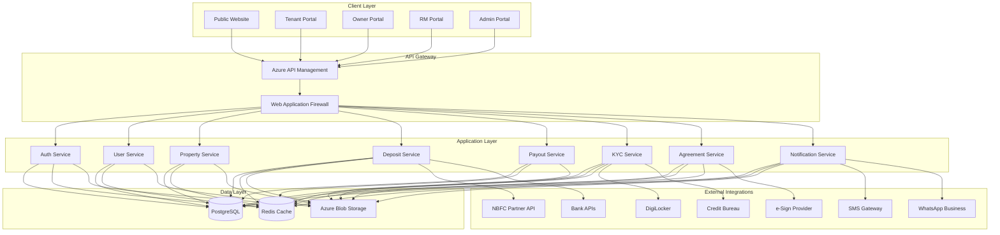
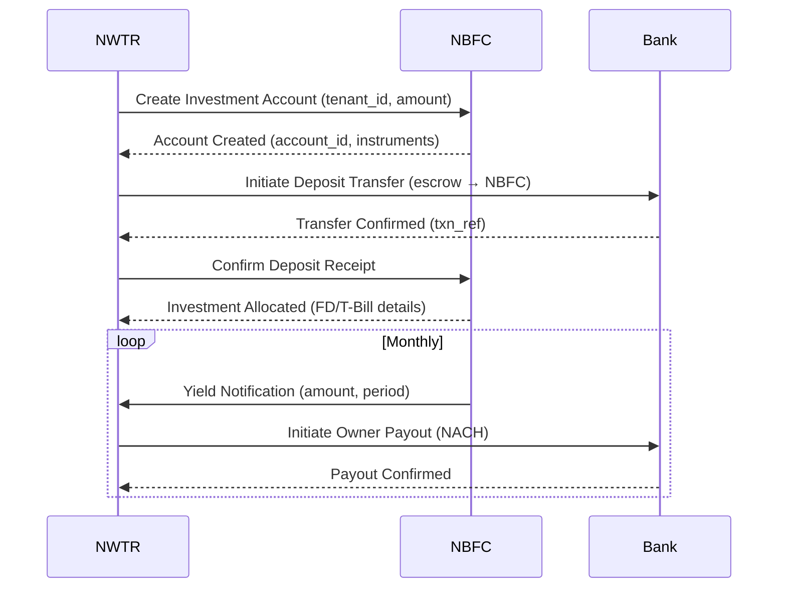
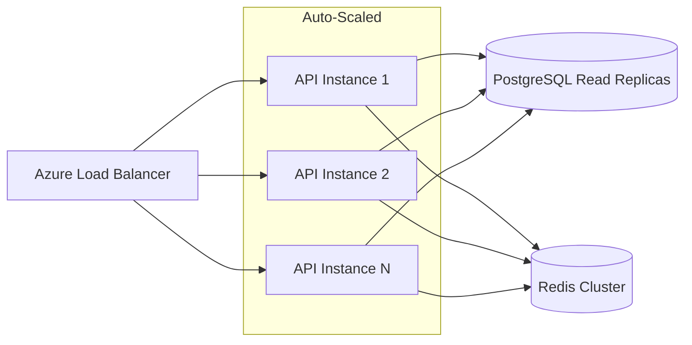
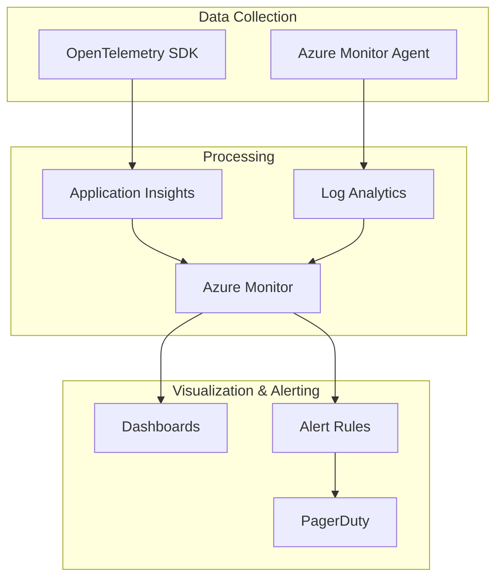

# Technical Requirements Document — NWTR

## TL;DR

NWTR requires a secure, scalable platform handling high-value financial transactions (₹50L–₹2Cr deposits) with regulatory compliance (PMLA, DPDP, RBI). The system integrates with NBFC partners, banks, KYC providers, and e-Sign services. Built on Next.js + NestJS + PostgreSQL + Azure, it must deliver 99.9% uptime, sub-200ms API responses, and bank-grade security for 5,000+ concurrent users.

---

## 1. System Overview & Boundaries

### 1.1 System Boundaries

| Boundary | In Scope | Out of Scope |
|----------|----------|--------------|
| Investment Management | API integration with NBFC | Actual fund management (NBFC responsibility) |
| Banking | Deposit collection, payout disbursement | Core banking operations |
| KYC | Orchestration and verification | Biometric capture (provider handles) |
| Legal | Agreement generation, e-sign orchestration | Legal advisory |
| Property | Listing, matching, discovery | Physical property inspection |

---

## 2. Technology Stack

| Layer | Technology | Rationale |
|-------|-----------|-----------|
| Frontend | Next.js 14+ (App Router) | SSR for SEO, RSC for performance, ISR for property pages |
| Language | TypeScript (strict mode) | Type safety for financial logic, shared types across stack |
| Styling | TailwindCSS + shadcn/ui | Rapid UI development, consistent design system |
| Backend | NestJS | Enterprise patterns (DI, modules, guards), TypeScript native |
| Database | PostgreSQL 16 | ACID compliance for financial data, JSONB for flexible schemas |
| Cache | Redis 7 | Session management, rate limiting, real-time features |
| Search | Azure Cognitive Search | Property search with facets, geo-search |
| File Storage | Azure Blob Storage | KYC documents, property images, agreements |
| Queue | Azure Service Bus | Async workflows, event-driven processing |
| Cloud | Azure (Central India) | Data localization compliance, enterprise SLAs |
| CI/CD | GitHub Actions + Azure DevOps | Automated testing, staged deployments |
| Monitoring | Azure Monitor + Application Insights | APM, logging, alerting |
| IaC | Terraform | Infrastructure reproducibility |

---

## 3. Integration Requirements

### 3.1 NBFC Partner Integration

| Integration | Protocol | Auth | SLA |
|-------------|----------|------|-----|
| NBFC Core API | REST/HTTPS | mTLS + API Key | 99.9% uptime, <500ms |
| Bank (NEFT/RTGS) | REST/HTTPS | OAuth 2.0 + IP whitelist | 99.95% uptime |
| DigiLocker | REST/HTTPS | OAuth 2.0 | 99.5% uptime |
| CKYC Registry | SFTP + REST | Certificate-based | 99% uptime |
| e-Sign (Leegality) | REST/HTTPS | API Key + Webhook | 99.9% uptime |
| Credit Bureau | REST/HTTPS | mTLS | 99.5% uptime |
| SMS (Msg91) | REST/HTTPS | API Key | 99.9% uptime |
| WhatsApp Business | REST/HTTPS | Bearer Token | 99.9% uptime |
| Payment Gateway | REST/HTTPS | API Key + Secret | 99.99% uptime |
| NACH/eMandate | Batch (SFTP) + REST | Certificate | 99.5% uptime |

### 3.2 Integration Error Handling

| Scenario | Strategy |
|----------|----------|
| NBFC API timeout | Retry with exponential backoff (3 attempts), alert admin |
| Bank transfer failure | Hold in pending state, retry after 30min, manual escalation |
| KYC provider down | Queue request, notify user of delay, retry on recovery |
| e-Sign timeout | Preserve session, allow resume within 24h |
| Credit bureau unavailable | Allow conditional approval, flag for manual review |

---

## 4. Data Requirements

### 4.1 Data Classification

| Classification | Examples | Encryption | Retention |
|----------------|----------|-----------|-----------|
| Critical PII | Aadhaar, PAN, bank accounts | AES-256 + field-level | 7 years post-tenure |
| Sensitive PII | Name, address, phone, email | AES-256 at rest | 5 years post-tenure |
| Financial | Deposit amounts, payout records | AES-256 + audit | 10 years (regulatory) |
| Operational | Logs, analytics, sessions | Encrypted at rest | 2 years |
| Public | Property listings, FAQs | Standard | Indefinite |

### 4.2 Data Model (Core Entities)

| Entity | Estimated Volume (Year 1) | Growth Rate |
|--------|---------------------------|-------------|
| Users | 50,000 | 200%/year |
| Properties | 10,000 | 150%/year |
| Deposits | 500 active | 300%/year |
| Transactions | 100,000 | 300%/year |
| KYC Records | 30,000 | 200%/year |
| Agreements | 1,000 | 300%/year |
| Audit Logs | 5,000,000 | 400%/year |

### 4.3 Data Processing Requirements

- Real-time: Transaction status updates, KYC verification results
- Near real-time (< 5min): Payout reconciliation, notification delivery
- Batch: Daily settlement reconciliation, monthly reports, yield calculations
- Analytics: Property demand heatmaps, conversion funnels, churn prediction

---

## 5. Security Requirements

### 5.1 Authentication & Authorization

| Requirement | Implementation |
|-------------|---------------|
| Multi-factor Authentication | OTP (SMS/Email) + optional TOTP for admin |
| Session Management | JWT access (15min) + refresh token (7 days) + secure httpOnly cookies |
| Role-Based Access | RBAC with permission matrices per endpoint |
| API Security | Rate limiting, API key rotation, request signing |
| Admin Access | IP whitelist + MFA + session recording |
| Password Policy | Min 12 chars, complexity rules, breach database check |

### 5.2 Data Security

| Layer | Control |
|-------|---------|
| Transport | TLS 1.3, HSTS, certificate pinning (mobile) |
| Application | Input validation, parameterized queries, CSP headers |
| Storage | AES-256 encryption at rest, field-level for PII |
| Key Management | Azure Key Vault, HSM-backed, auto-rotation |
| Secrets | No secrets in code, environment-based injection |
| Backup | Encrypted backups, geo-redundant, tested restore |

### 5.3 Audit & Compliance

| Control | Requirement |
|---------|-------------|
| Audit Trail | Immutable log of all data access and mutations |
| Access Logging | Who accessed what PII, when, why |
| Data Masking | PII masked in logs, non-prod environments |
| Penetration Testing | Quarterly by CERT-IN empanelled auditor |
| Vulnerability Scanning | Weekly automated scans, <48h critical patch SLA |
| SOC 2 Type II | Target certification by Month 12 |

---

## 6. Performance Requirements

| Metric | Target | Measurement Method |
|--------|--------|--------------------|
| Page Load (FCP) | < 1.5s | Lighthouse CI, RUM |
| Page Load (LCP) | < 2.5s | Core Web Vitals |
| API Response (P50) | < 100ms | APM tracing |
| API Response (P95) | < 200ms | APM tracing |
| API Response (P99) | < 500ms | APM tracing |
| Database Query (P95) | < 50ms | Query analyzer |
| File Upload | < 5s for 10MB | Client-side metrics |
| Search Results | < 300ms | Search service metrics |
| Concurrent Users | 5,000 | Load testing (k6) |
| Throughput | 1,000 requests/sec | Load testing |

---

## 7. Scalability Requirements

### 7.1 Horizontal Scaling

| Component | Scaling Strategy | Trigger |
|-----------|-----------------|---------|
| Frontend | CDN + Edge caching (Azure Front Door) | Automatic |
| API Services | Horizontal pod autoscaling | CPU > 70%, Memory > 80% |
| Database | Read replicas + connection pooling (PgBouncer) | Query latency > 50ms |
| Cache | Redis Cluster with sharding | Memory > 75% |
| Queue | Partition-based scaling | Queue depth > 1000 |
| File Storage | Azure Blob (infinite scale) | N/A |

### 7.2 Data Partitioning Strategy

| Data Type | Strategy | Partition Key |
|-----------|----------|---------------|
| Transactions | Range partitioning by date | created_at (monthly) |
| Audit Logs | Range partitioning by date | timestamp (daily) |
| Properties | No partitioning (Year 1) | N/A |
| Users | No partitioning (Year 1) | N/A |
| Documents | Blob storage with tiered access | Lifecycle policy |

---

## 8. Compliance Requirements

| Regulation | Requirement | Implementation |
|------------|-------------|----------------|
| PMLA 2002 | KYC, transaction monitoring, STR filing | 3-tier KYC, automated monitoring |
| DPDP Act 2023 | Data protection, consent, right to erasure | Consent manager, data lifecycle |
| RBI Guidelines | Payment system regulations | Licensed payment partners |
| SEBI | Investment advisory compliance | NBFC partner handles |
| IT Act 2000 | Electronic signatures, data security | CCA-approved e-sign |
| Data Localization | Store data within India | Azure Central India region |
| RERA | Rental agreement compliance | State-specific templates |
| GST | Service tax on platform fees | Automated GST computation |

---

## 9. Testing Requirements

| Test Type | Coverage Target | Tools | Frequency |
|-----------|----------------|-------|-----------|
| Unit Tests | > 80% line coverage | Jest, Vitest | Every commit |
| Integration Tests | All API endpoints | Supertest, TestContainers | Every PR |
| E2E Tests | Critical user journeys | Playwright | Daily + pre-release |
| Security Tests | OWASP Top 10 | OWASP ZAP, Burp Suite | Weekly |
| Load Tests | Peak traffic simulation | k6, Artillery | Bi-weekly |
| Contract Tests | All integrations | Pact | Every PR |
| Chaos Engineering | Failure injection | Azure Chaos Studio | Monthly |
| Accessibility Tests | WCAG 2.1 AA | axe-core, manual audit | Per sprint |

---

## 10. Monitoring & Observability

### 10.1 Observability Stack

### 10.2 Key Monitoring Metrics

| Category | Metrics | Alert Threshold |
|----------|---------|-----------------|
| Availability | Uptime, health checks | < 99.9% (15min window) |
| Performance | Response time, throughput | P95 > 500ms |
| Errors | 5xx rate, exception rate | > 1% error rate |
| Business | Deposit success rate, KYC completion | < 90% success |
| Security | Failed auth attempts, suspicious patterns | > 10 failures/min |
| Infrastructure | CPU, memory, disk, network | > 85% utilization |
| Integration | Partner API health, latency | > 2s or > 5% errors |
| Queue | Depth, processing time, dead letters | Depth > 5000 |

### 10.3 Logging Standards

| Level | Usage | Retention |
|-------|-------|-----------|
| ERROR | System failures, unhandled exceptions | 1 year |
| WARN | Degraded performance, retry scenarios | 6 months |
| INFO | Business events, state transitions | 3 months |
| DEBUG | Detailed execution flow (non-prod only) | 7 days |

All logs must include: correlation_id, user_id (masked), service_name, timestamp (ISO 8601), environment.

---

## Cross-References

- Product Requirements: [docs/01-product/prd.md](./prd.md)
- Feature Specifications: [docs/01-product/feature-specifications.md](./feature-specifications.md)
- Backend Workflows: [docs/01-product/backend-workflows.md](./backend-workflows.md)
