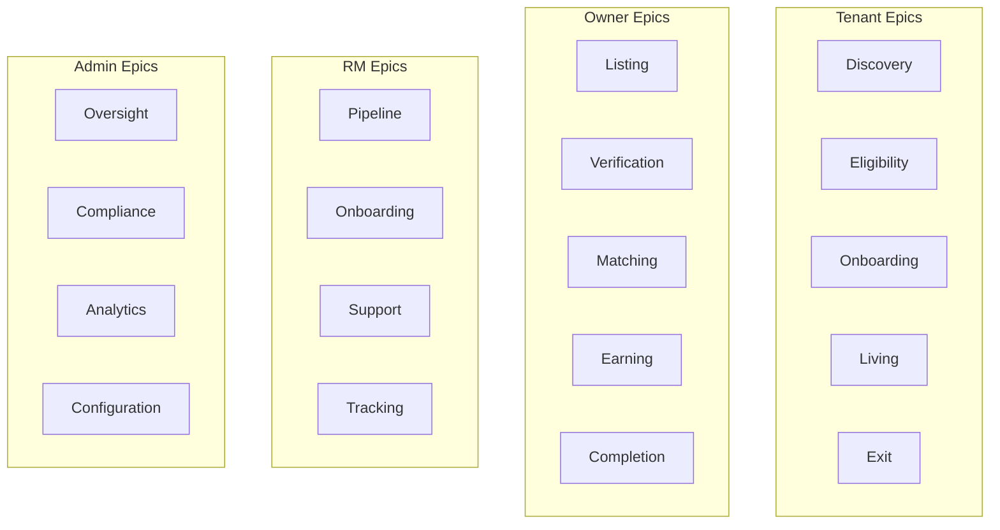

# User Stories — NWTR

## TL;DR

Comprehensive user stories organized by epics across all 4 user roles (Tenant, Owner, RM, Admin). Each story follows the standard format with acceptance criteria and relative sizing (S/M/L/XL). Stories map directly to feature specifications and form the sprint planning backlog.

---

## Epic Structure

---

## 1. Tenant Epics

### Epic T1: Discovery

> Tenants discover NWTR and explore available properties matching their preferences and budget.

#### T1.1 — Browse Properties

| Attribute | Detail |
|-----------|--------|
| Story | As a **tenant**, I want to browse available properties with advanced filters, so that I can find homes matching my location, budget, and preferences. |
| Size | L |
| Priority | P0 |

**Acceptance Criteria:**
- [ ] Filter by location (area/PIN), BHK, deposit range, amenities, availability
- [ ] Map and list view toggle
- [ ] Sort by deposit amount, area, relevance
- [ ] Results show property image, location, BHK, deposit, monthly payout equivalent
- [ ] Pagination with 20 results per page

#### T1.2 — View Property Details

| Attribute | Detail |
|-----------|--------|
| Story | As a **tenant**, I want to see comprehensive property information, so that I can evaluate if a property meets my requirements before visiting. |
| Size | M |
| Priority | P0 |

**Acceptance Criteria:**
- [ ] Photo gallery (5+ images), amenities, floor plan, specs
- [ ] Deposit amount and breakdown clearly shown
- [ ] Location map with nearby landmarks and distances
- [ ] Owner monthly payout amount displayed
- [ ] Similar property recommendations

#### T1.3 — Simulate Deposit

| Attribute | Detail |
|-----------|--------|
| Story | As a **tenant**, I want to simulate my deposit amount and compare savings vs rent, so that I can understand the financial benefit of NWTR. |
| Size | M |
| Priority | P0 |

**Acceptance Criteria:**
- [ ] Input property value or monthly rent equivalent
- [ ] Output: deposit required, total savings over 12 months, owner payout
- [ ] Visual comparison chart vs traditional rent
- [ ] Shareable results link
- [ ] CTA to check eligibility

#### T1.4 — Save & Shortlist

| Attribute | Detail |
|-----------|--------|
| Story | As a **tenant**, I want to save properties to a shortlist, so that I can compare and decide later. |
| Size | S |
| Priority | P1 |

**Acceptance Criteria:**
- [ ] Heart/bookmark icon on property cards and detail pages
- [ ] Shortlist page with all saved properties
- [ ] Remove from shortlist option
- [ ] Compare up to 3 properties side-by-side

---

### Epic T2: Eligibility

> Tenants verify their financial eligibility before investing time in full onboarding.

#### T2.1 — Quick Eligibility Check

| Attribute | Detail |
|-----------|--------|
| Story | As a **tenant**, I want a quick eligibility check, so that I know if I qualify before starting the full KYC process. |
| Size | M |
| Priority | P0 |

**Acceptance Criteria:**
- [ ] Inputs: annual income, employment type, deposit budget
- [ ] Soft credit check with consent
- [ ] Instant result: Eligible / Conditional / Not Eligible
- [ ] Clear explanation for each outcome
- [ ] No impact on credit score

#### T2.2 — Eligibility Document Upload

| Attribute | Detail |
|-----------|--------|
| Story | As a **conditionally eligible tenant**, I want to upload supporting documents, so that I can improve my eligibility status. |
| Size | S |
| Priority | P1 |

**Acceptance Criteria:**
- [ ] Upload income proof, ITR, bank statements
- [ ] Document requirements clearly listed
- [ ] Upload status tracking
- [ ] Review outcome within 48h

---

### Epic T3: Onboarding

> Tenants complete KYC, schedule visits, and formalize agreements.

#### T3.1 — Tier 1 KYC (Basic)

| Attribute | Detail |
|-----------|--------|
| Story | As a **tenant**, I want to complete basic identity verification, so that I can access full property browsing and shortlisting. |
| Size | M |
| Priority | P0 |

**Acceptance Criteria:**
- [ ] PAN verification via DigiLocker/manual entry
- [ ] Aadhaar verification via DigiLocker consent flow
- [ ] Real-time verification status
- [ ] Error handling for mismatched details
- [ ] Completion unlocks enhanced browsing features

#### T3.2 — Tier 2 KYC (Enhanced)

| Attribute | Detail |
|-----------|--------|
| Story | As a **tenant**, I want to submit enhanced KYC documents, so that I can schedule property visits and proceed toward deposit. |
| Size | L |
| Priority | P0 |

**Acceptance Criteria:**
- [ ] Address proof upload (utility bill, bank statement, passport)
- [ ] Income documentation (salary slips, ITR, Form 16)
- [ ] Employment verification (offer letter, company email)
- [ ] Document format validation (PDF/JPG, < 5MB)
- [ ] Status: Pending Review → Approved/Rejected
- [ ] Rejection includes specific reason and re-upload option

#### T3.3 — Tier 3 KYC (Full)

| Attribute | Detail |
|-----------|--------|
| Story | As a **tenant**, I want to complete full video KYC, so that I am authorized to make large deposits on the platform. |
| Size | L |
| Priority | P0 |

**Acceptance Criteria:**
- [ ] Video KYC scheduling and completion
- [ ] Bank statement verification (6 months)
- [ ] Source of funds declaration
- [ ] Biometric verification via Aadhaar
- [ ] Full KYC unlocks deposit transfer capability

#### T3.4 — Schedule Property Visit

| Attribute | Detail |
|-----------|--------|
| Story | As a **tenant**, I want to schedule a property visit, so that I can physically inspect the property before committing. |
| Size | M |
| Priority | P0 |

**Acceptance Criteria:**
- [ ] Select preferred date and time slot
- [ ] RM auto-assigned for the visit
- [ ] Confirmation via SMS, email, WhatsApp
- [ ] Calendar invite generated
- [ ] Reschedule/cancel option (24h notice)

#### T3.5 — Sign Agreement

| Attribute | Detail |
|-----------|--------|
| Story | As a **tenant**, I want to review and digitally sign the agreement, so that my tenancy is legally formalized. |
| Size | XL |
| Priority | P0 |

**Acceptance Criteria:**
- [ ] Agreement preview with highlighted key terms
- [ ] Clause-by-clause acknowledgment
- [ ] Aadhaar e-sign integration
- [ ] E-stamp duty applied automatically
- [ ] Both parties (tenant + owner) must sign
- [ ] Signed copy in Document Vault

#### T3.6 — Transfer Deposit

| Attribute | Detail |
|-----------|--------|
| Story | As a **tenant**, I want to transfer my deposit securely, so that my funds reach the escrow account safely and are tracked. |
| Size | XL |
| Priority | P0 |

**Acceptance Criteria:**
- [ ] Bank details for escrow account displayed
- [ ] Transfer mode options (NEFT/RTGS/IMPS)
- [ ] Real-time status tracking
- [ ] Confirmation at each stage (initiated, received, confirmed)
- [ ] 48h transfer window post-agreement signing
- [ ] Receipt generated on confirmation

---

### Epic T4: Living

> Tenants manage their active tenancy period.

#### T4.1 — View Tenure Dashboard

| Attribute | Detail |
|-----------|--------|
| Story | As a **tenant**, I want to see my tenure progress, so that I know key dates and milestones. |
| Size | M |
| Priority | P0 |

**Acceptance Criteria:**
- [ ] Tenure timeline with start, milestones, end date
- [ ] Days remaining counter
- [ ] Deposit status and current value
- [ ] Key contacts (RM, owner via RM)

#### T4.2 — Raise Maintenance Request

| Attribute | Detail |
|-----------|--------|
| Story | As a **tenant**, I want to raise maintenance requests, so that property issues are tracked and resolved. |
| Size | M |
| Priority | P1 |

**Acceptance Criteria:**
- [ ] Category selection (plumbing, electrical, structural, other)
- [ ] Photo upload for issue documentation
- [ ] Priority assignment (emergency, high, normal)
- [ ] Status tracking (raised → assigned → in-progress → resolved)
- [ ] RM notified for coordination

#### T4.3 — Renewal Decision

| Attribute | Detail |
|-----------|--------|
| Story | As a **tenant**, I want to indicate renewal interest, so that I can extend my tenure before it expires. |
| Size | M |
| Priority | P1 |

**Acceptance Criteria:**
- [ ] Renewal prompt at 90 days before expiry
- [ ] New terms preview (deposit amount may change)
- [ ] Accept/decline with deadline
- [ ] Auto-notify owner and RM

---

### Epic T5: Exit

> Tenants exit gracefully and receive their deposit refund.

#### T5.1 — Initiate Exit

| Attribute | Detail |
|-----------|--------|
| Story | As a **tenant**, I want to initiate exit, so that the deposit return process begins on time. |
| Size | L |
| Priority | P0 |

**Acceptance Criteria:**
- [ ] Exit request with preferred move-out date
- [ ] Timeline displayed: notice → inspection → liquidation → refund
- [ ] Bank account confirmation for refund
- [ ] Early exit terms shown if before tenure end

#### T5.2 — Property Handover

| Attribute | Detail |
|-----------|--------|
| Story | As a **tenant**, I want a clear handover process, so that I meet all obligations and receive my full deposit. |
| Size | M |
| Priority | P0 |

**Acceptance Criteria:**
- [ ] Handover checklist (keys, condition, utilities transfer)
- [ ] RM-assisted inspection scheduling
- [ ] Damage assessment report (if any)
- [ ] Deduction details (if applicable) with dispute option
- [ ] Handover confirmation by both parties

#### T5.3 — Receive Refund

| Attribute | Detail |
|-----------|--------|
| Story | As a **tenant**, I want real-time refund tracking, so that I know exactly when my deposit will be returned. |
| Size | M |
| Priority | P0 |

**Acceptance Criteria:**
- [ ] Refund timeline: liquidation started → funds received → transfer initiated → credited
- [ ] Expected amount with any deductions itemized
- [ ] Bank transfer confirmation
- [ ] Final settlement statement downloadable

---

## 2. Owner Epics

### Epic O1: Listing

#### O1.1 — Create Property Listing

| Attribute | Detail |
|-----------|--------|
| Story | As an **owner**, I want to list my property with photos and details, so that qualified tenants discover it. |
| Size | XL |
| Priority | P0 |

**Acceptance Criteria:**
- [ ] Multi-step: Basic info → Details → Photos → Pricing → Submit
- [ ] Auto-suggest deposit based on property value/location
- [ ] Draft save capability
- [ ] Minimum 5 photos required
- [ ] Preview before submission

#### O1.2 — Edit/Update Listing

| Attribute | Detail |
|-----------|--------|
| Story | As an **owner**, I want to update my listing, so that information stays current and accurate. |
| Size | S |
| Priority | P0 |

**Acceptance Criteria:**
- [ ] Edit all fields except address (requires re-verification)
- [ ] Photo add/remove/reorder
- [ ] Changes reflect within 15 minutes
- [ ] Availability status toggle (available/unavailable)

### Epic O2: Verification

#### O2.1 — Complete Owner KYC

| Attribute | Detail |
|-----------|--------|
| Story | As an **owner**, I want to verify my identity and ownership, so that my listing gets a verified badge. |
| Size | L |
| Priority | P0 |

**Acceptance Criteria:**
- [ ] PAN + Aadhaar verification
- [ ] Property ownership document upload
- [ ] Bank account verification (penny drop)
- [ ] Verified badge displayed on listing after approval

### Epic O3: Matching

#### O3.1 — View Interested Tenants

| Attribute | Detail |
|-----------|--------|
| Story | As an **owner**, I want to see tenants interested in my property, so that I can evaluate potential matches. |
| Size | M |
| Priority | P1 |

**Acceptance Criteria:**
- [ ] List of interested tenants (name, profession, verified status)
- [ ] RM-mediated communication (no direct contact in v1)
- [ ] Accept/decline tenant interest

#### O3.2 — Manage Property Visits

| Attribute | Detail |
|-----------|--------|
| Story | As an **owner**, I want to manage visit requests, so that visits happen at convenient times. |
| Size | M |
| Priority | P0 |

**Acceptance Criteria:**
- [ ] Set available time slots for visits
- [ ] Approve/decline visit requests
- [ ] Confirmation notifications
- [ ] Visit history and feedback

### Epic O4: Earning

#### O4.1 — Track Monthly Payouts

| Attribute | Detail |
|-----------|--------|
| Story | As an **owner**, I want to track my monthly payouts, so that I have financial visibility and can plan accordingly. |
| Size | M |
| Priority | P0 |

**Acceptance Criteria:**
- [ ] Payout calendar with amounts and status
- [ ] Historical payout log
- [ ] Next payout date and amount prominently displayed
- [ ] Bank credit confirmation

#### O4.2 — Download Financial Reports

| Attribute | Detail |
|-----------|--------|
| Story | As an **owner**, I want annual financial reports, so that I can file taxes accurately. |
| Size | M |
| Priority | P1 |

**Acceptance Criteria:**
- [ ] Annual income summary
- [ ] TDS certificate download
- [ ] Monthly breakdown export (CSV/PDF)
- [ ] Financial year selection

### Epic O5: Completion

#### O5.1 — Tenure Completion

| Attribute | Detail |
|-----------|--------|
| Story | As an **owner**, I want a smooth tenure completion, so that the property is returned in good condition. |
| Size | L |
| Priority | P0 |

**Acceptance Criteria:**
- [ ] 90-day advance notification of tenure end
- [ ] Renewal offer option
- [ ] Property inspection coordination
- [ ] Handover confirmation
- [ ] Final payout processed

---

## 3. RM Epics

### Epic R1: Pipeline

#### R1.1 — Receive Auto-Assigned Leads

| Attribute | Detail |
|-----------|--------|
| Story | As an **RM**, I want leads auto-assigned based on geography and capacity, so that I receive relevant leads without manual allocation. |
| Size | L |
| Priority | P0 |

**Acceptance Criteria:**
- [ ] Leads assigned based on area expertise, capacity, performance
- [ ] Notification on new lead assignment
- [ ] Lead details: name, type, property interest, contact info
- [ ] Accept/request-reassignment option

#### R1.2 — Manage Pipeline

| Attribute | Detail |
|-----------|--------|
| Story | As an **RM**, I want a kanban-style pipeline, so that I can visualize and manage all my active leads. |
| Size | L |
| Priority | P0 |

**Acceptance Criteria:**
- [ ] Stages: New → Contacted → Qualified → Active → Closed (Won/Lost)
- [ ] Drag-and-drop stage progression
- [ ] Lead value and priority indicators
- [ ] Stage duration alerts (SLA)
- [ ] Daily task list generated from pipeline

### Epic R2: Onboarding

#### R2.1 — Guide Tenant KYC

| Attribute | Detail |
|-----------|--------|
| Story | As an **RM**, I want tools to assist tenants through KYC, so that completion rates improve and queries are resolved quickly. |
| Size | M |
| Priority | P0 |

**Acceptance Criteria:**
- [ ] View tenant's KYC progress in real-time
- [ ] Send targeted reminders for pending items
- [ ] Upload documents on tenant's behalf (with consent)
- [ ] Escalate to admin for complex cases
- [ ] Notes per interaction

#### R2.2 — Guide Owner Listing

| Attribute | Detail |
|-----------|--------|
| Story | As an **RM**, I want to help owners create quality listings, so that properties attract tenants faster. |
| Size | M |
| Priority | P0 |

**Acceptance Criteria:**
- [ ] View owner's listing draft
- [ ] Suggest improvements (photos, description, pricing)
- [ ] Create listing on owner's behalf (with consent)
- [ ] Quality checklist per listing

### Epic R3: Support

#### R3.1 — Coordinate Property Visits

| Attribute | Detail |
|-----------|--------|
| Story | As an **RM**, I want visit management tools, so that I can efficiently coordinate between tenants and owners. |
| Size | M |
| Priority | P0 |

**Acceptance Criteria:**
- [ ] Calendar view of all visits
- [ ] Auto-send reminders to both parties
- [ ] Visit outcome capture (interested/not/follow-up)
- [ ] Route optimization for multiple visits/day

#### R3.2 — Communication Tools

| Attribute | Detail |
|-----------|--------|
| Story | As an **RM**, I want integrated communication tools, so that I can reach tenants and owners through their preferred channels. |
| Size | L |
| Priority | P0 |

**Acceptance Criteria:**
- [ ] WhatsApp template messages (pre-approved)
- [ ] Email templates for common scenarios
- [ ] Call logging with outcome notes
- [ ] Communication history per lead

### Epic R4: Tracking

#### R4.1 — Track Performance

| Attribute | Detail |
|-----------|--------|
| Story | As an **RM**, I want performance dashboards, so that I can track my targets and optimize my efforts. |
| Size | M |
| Priority | P1 |

**Acceptance Criteria:**
- [ ] Monthly targets: leads contacted, visits done, deals closed
- [ ] Conversion funnel per stage
- [ ] Commission tracker
- [ ] Team leaderboard

---

## 4. Admin Epics

### Epic A1: Oversight

#### A1.1 — Monitor Transactions

| Attribute | Detail |
|-----------|--------|
| Story | As an **admin**, I want real-time transaction monitoring, so that I can catch anomalies and ensure financial integrity. |
| Size | XL |
| Priority | P0 |

**Acceptance Criteria:**
- [ ] Live transaction feed (deposits, payouts, refunds)
- [ ] Filter by type, status, amount range, date
- [ ] Anomaly detection alerts
- [ ] Manual hold/release capability
- [ ] Audit trail per transaction

#### A1.2 — Manage Users

| Attribute | Detail |
|-----------|--------|
| Story | As an **admin**, I want user management tools, so that I can manage accounts, roles, and access across the platform. |
| Size | L |
| Priority | P0 |

**Acceptance Criteria:**
- [ ] User search by name, email, phone, role
- [ ] Role assignment and modification
- [ ] Account disable/enable
- [ ] View user activity log
- [ ] Impersonation for support (with audit trail)

### Epic A2: Compliance

#### A2.1 — KYC Verification Queue

| Attribute | Detail |
|-----------|--------|
| Story | As an **admin**, I want an efficient KYC review queue, so that users are verified within SLA and compliance is maintained. |
| Size | XL |
| Priority | P0 |

**Acceptance Criteria:**
- [ ] Priority-sorted queue with SLA countdown
- [ ] Document viewer with zoom and comparison tools
- [ ] Approve/reject with mandatory reason
- [ ] Auto-approve rules for DigiLocker-verified documents
- [ ] Daily compliance report

#### A2.2 — Regulatory Reporting

| Attribute | Detail |
|-----------|--------|
| Story | As an **admin**, I want automated regulatory reports, so that compliance obligations are met on schedule. |
| Size | L |
| Priority | P0 |

**Acceptance Criteria:**
- [ ] STR generation and filing workflow
- [ ] CTR (Cash Transaction Report) automation
- [ ] PMLA compliance dashboard
- [ ] Regulatory calendar with deadlines
- [ ] Report templates per regulation

### Epic A3: Analytics

#### A3.1 — Business Intelligence

| Attribute | Detail |
|-----------|--------|
| Story | As an **admin**, I want comprehensive analytics, so that leadership can make data-driven decisions. |
| Size | XL |
| Priority | P1 |

**Acceptance Criteria:**
- [ ] KPI dashboard: deposits managed, active tenancies, revenue
- [ ] Funnel analytics with conversion rates
- [ ] Cohort analysis by acquisition channel
- [ ] Geographic demand heatmap
- [ ] Forecasting (deposits, revenue, growth)
- [ ] Custom report builder

### Epic A4: Configuration

#### A4.1 — System Configuration

| Attribute | Detail |
|-----------|--------|
| Story | As a **super admin**, I want system-level configuration, so that platform behavior can be adjusted without code changes. |
| Size | L |
| Priority | P0 |

**Acceptance Criteria:**
- [ ] Feature flags (enable/disable features per environment)
- [ ] Rate limit configuration
- [ ] Eligibility threshold adjustment
- [ ] Notification template management
- [ ] Partner API configuration (NBFC, KYC, bank endpoints)
- [ ] Maintenance mode toggle

---

## Story Point Summary

| Epic Category | S | M | L | XL | Total Stories |
|---------------|---|---|---|----|---------------|
| Tenant | 2 | 8 | 4 | 3 | 17 |
| Owner | 1 | 5 | 2 | 1 | 9 |
| RM | 0 | 4 | 3 | 0 | 7 |
| Admin | 0 | 0 | 3 | 3 | 6 |
| **Total** | **3** | **17** | **12** | **7** | **39** |

---

## Cross-References

- Feature Specifications: [docs/01-product/feature-specifications.md](./feature-specifications.md)
- Application Flow: [docs/01-product/app-flow.md](./app-flow.md)
- UX Flows: [docs/01-product/ux-flows.md](./ux-flows.md)
