# UX Flows — NWTR

## TL;DR

Detailed interaction flows for all critical user journeys in the NWTR platform. Each flow includes Mermaid sequence diagrams, screen states, error handling, and edge cases. These flows define the exact user interactions that design and engineering must implement.

---

## 1. Property Search & Filter Flow

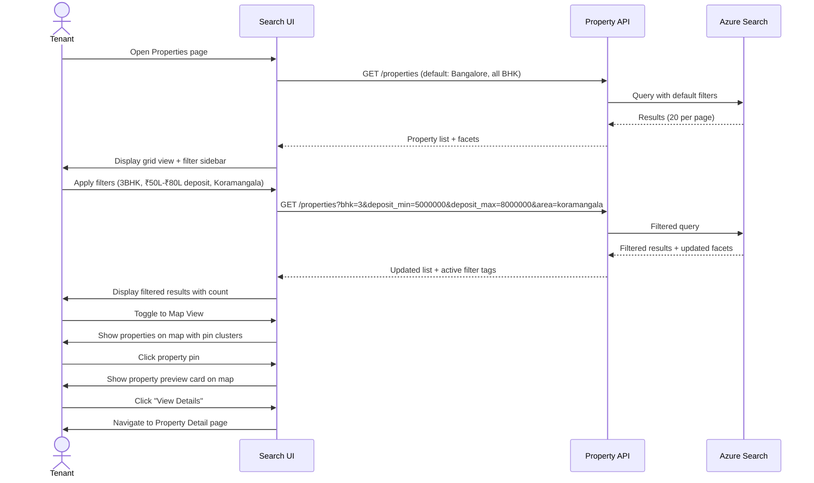

### States

| State | Condition | UI Treatment |
|-------|-----------|--------------|
| Loading | API in flight | Skeleton cards (8) with shimmer |
| Empty | No results for filters | "No properties found" + suggest removing filters |
| Error | API failure | Toast error + retry button |
| Results | Normal | Property grid/list + pagination |
| Map View | Toggle active | Map with pins + floating property cards |

---

## 2. Deposit Simulation Flow

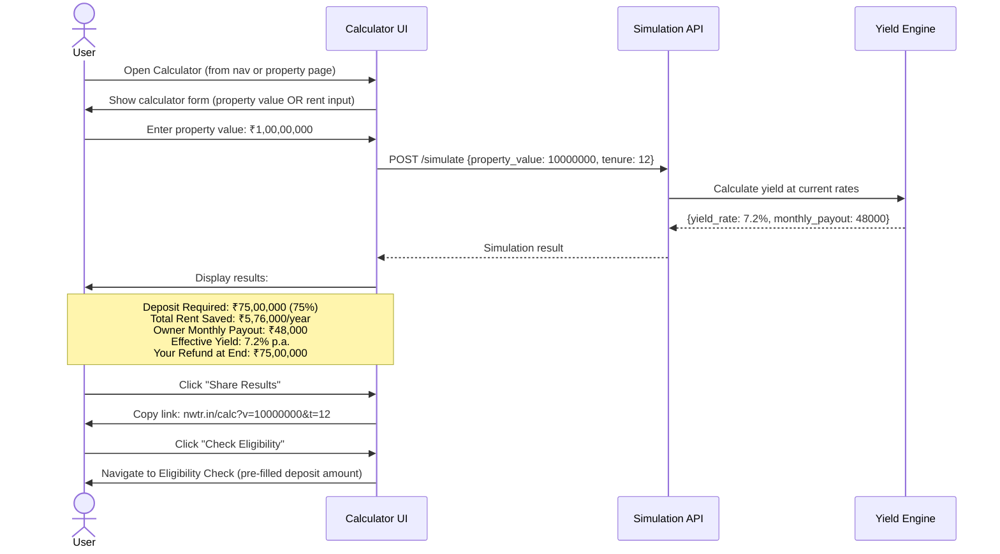

### Comparison View

| Metric | Traditional Rent | NWTR Model |
|--------|-----------------|------------|
| Monthly Out-of-Pocket | ₹48,000 | ₹0 |
| 12-Month Total Spent | ₹5,76,000 | ₹0 |
| Capital Required | ₹96,000 (2-month deposit) | ₹75,00,000 |
| Capital Returned | ₹96,000 | ₹75,00,000 |
| Net Cost Over 12 Months | ₹5,76,000 | ₹0 |

---

## 3. Eligibility Verification Flow

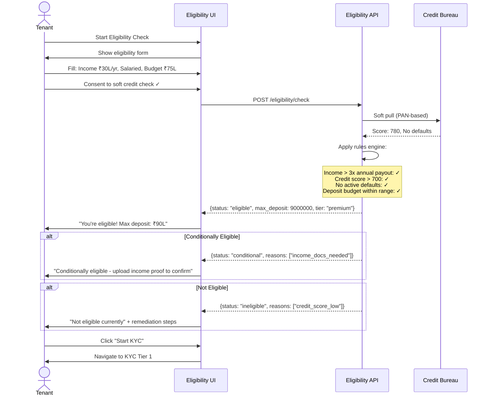

---

## 4. KYC Submission Flow (3 Tiers)

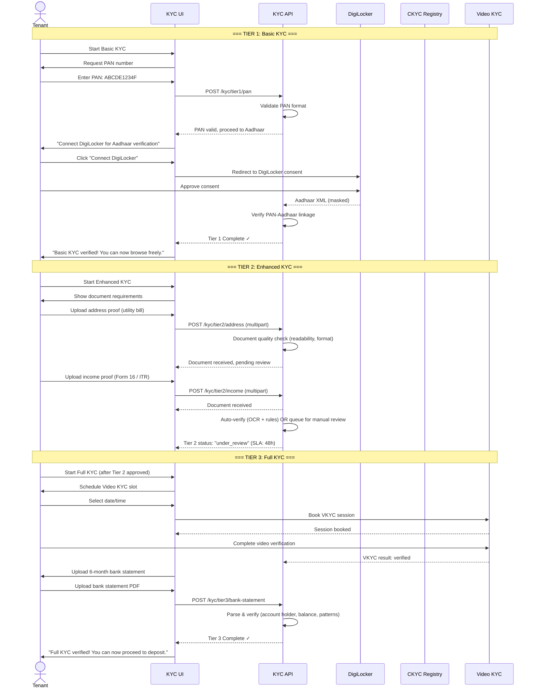

### KYC Progress States

| Tier | Status Options | Unlocks |
|------|---------------|---------|
| Tier 1 | not_started, in_progress, verified, failed | Full browsing, shortlist |
| Tier 2 | not_started, documents_pending, under_review, verified, partially_rejected | Visit scheduling, agreement |
| Tier 3 | not_started, vkyc_scheduled, vkyc_completed, bank_pending, verified | Deposit transfer |

---

## 5. Property Visit Scheduling Flow

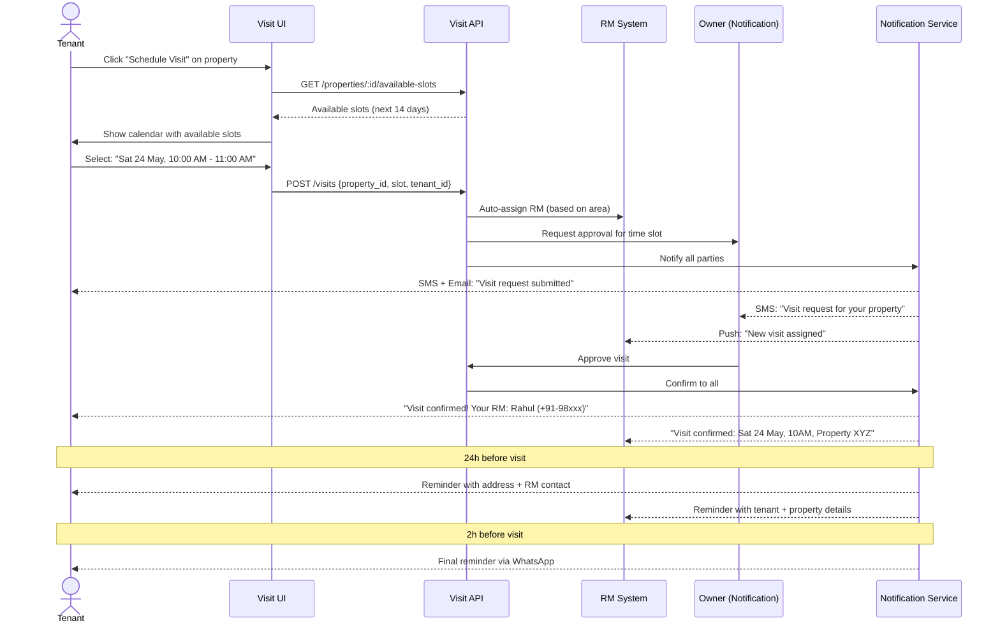

---

## 6. Agreement Signing Flow (e-Sign)

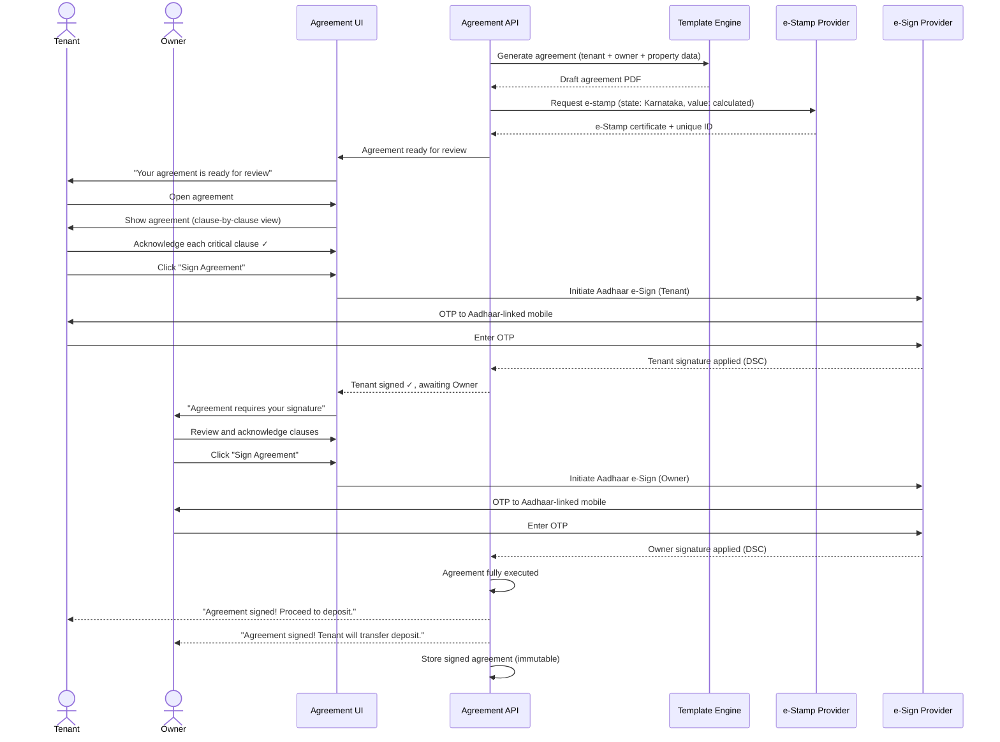

---

## 7. Deposit Transfer Flow

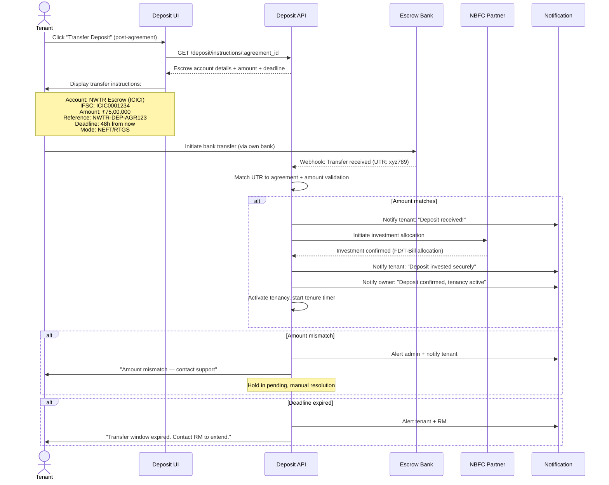

### Transfer Status States

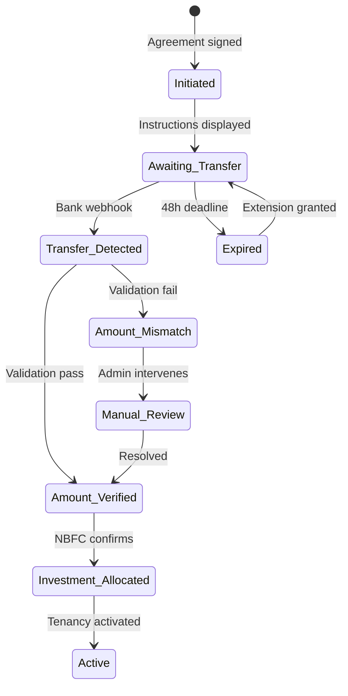

---

## 8. Payout Dashboard Interactions

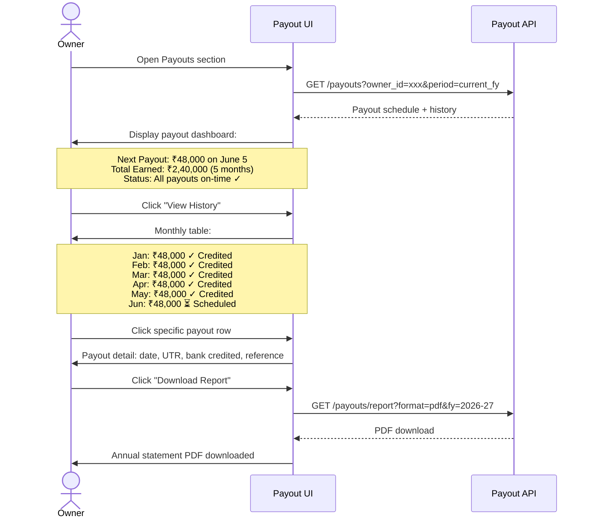

---

## 9. Exit/Refund Initiation Flow

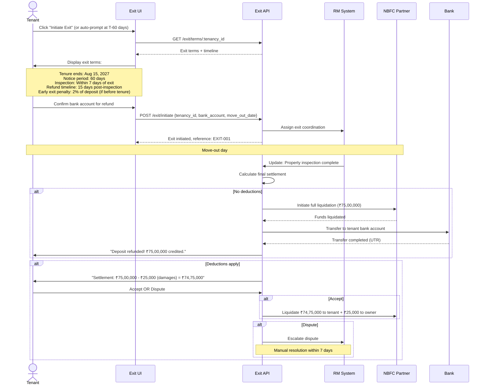

---

## 10. Error States & Recovery Flows

### 10.1 Common Error States

| Error | Screen | Recovery |
|-------|--------|----------|
| Network timeout | Any API call | Auto-retry (3x) → Show retry button with offline indicator |
| Session expired | Any authenticated page | Redirect to login, preserve URL for post-auth redirect |
| KYC document rejected | KYC flow | Show specific reason, highlight fix, re-upload button |
| Deposit transfer failed | Deposit transfer | Show failure reason, RM notification, retry guidance |
| e-Sign OTP expired | Agreement signing | "Resend OTP" button (max 3 attempts per session) |
| Visit cancelled by owner | Visit confirmation | Notify tenant, suggest alternative slots |
| Payment gateway error | Platform fee payment | Retry with alternative method suggestion |

### 10.2 Graceful Degradation

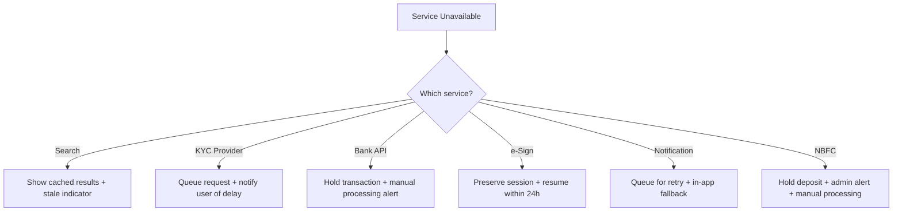

### 10.3 Form Validation UX

| Principle | Implementation |
|-----------|---------------|
| Inline validation | Validate on blur, show error below field immediately |
| Format guidance | Show expected format as placeholder (e.g., "ABCDE1234F" for PAN) |
| Progress preservation | Auto-save form state every 30s, resume on return |
| Error summary | On submit failure, scroll to first error + summary toast |
| Success feedback | Green checkmark animation per field on valid input |
| Disable submit | Button disabled until all required fields valid |

---

## Cross-References

- Application Flow: [docs/01-product/app-flow.md](./app-flow.md)
- Feature Specifications: [docs/01-product/feature-specifications.md](./feature-specifications.md)
- Backend Workflows: [docs/01-product/backend-workflows.md](./backend-workflows.md)
