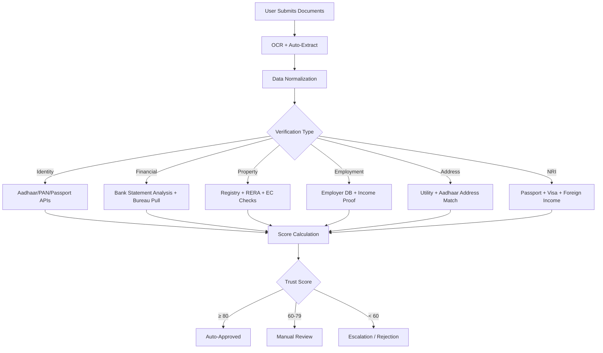
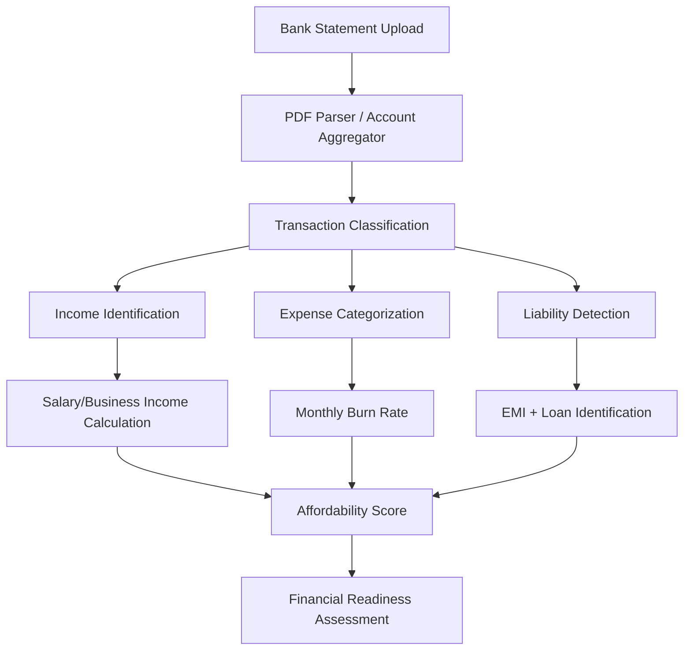
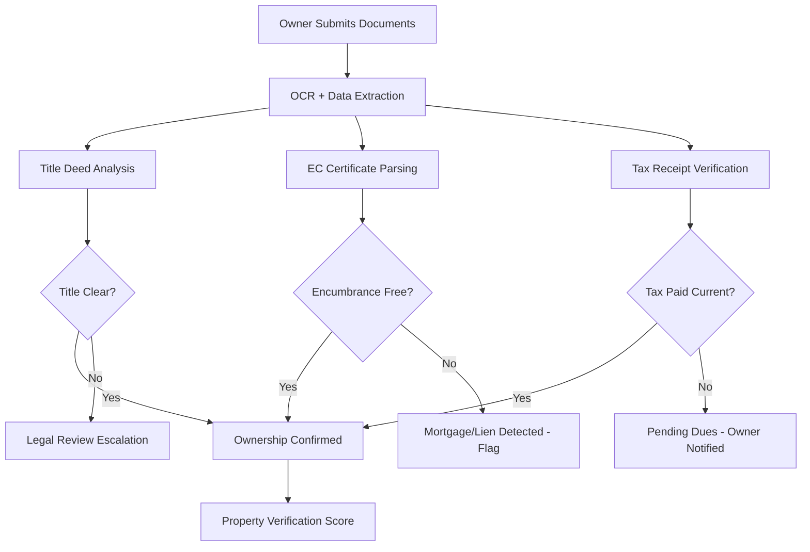
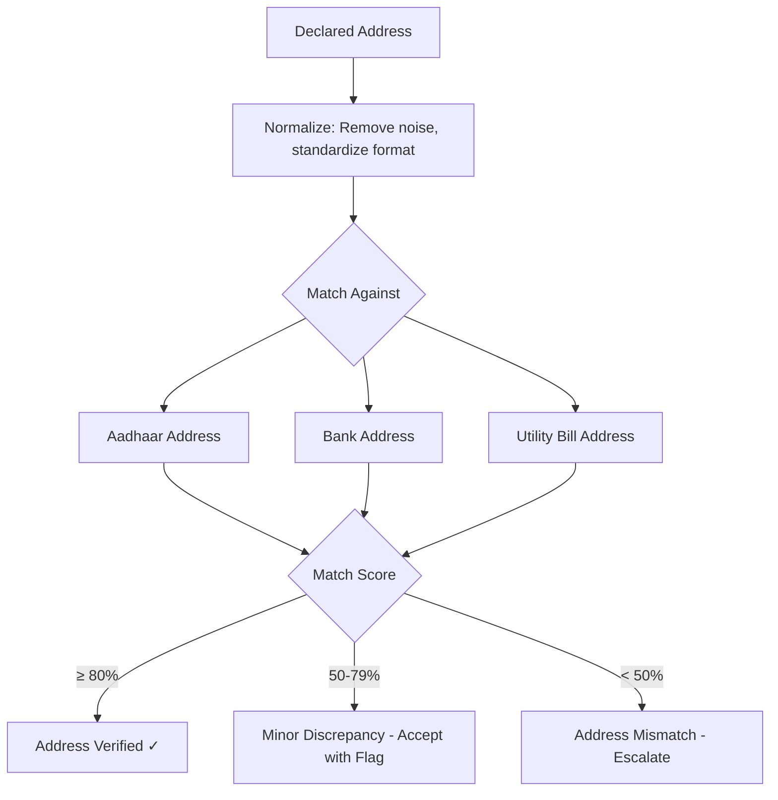
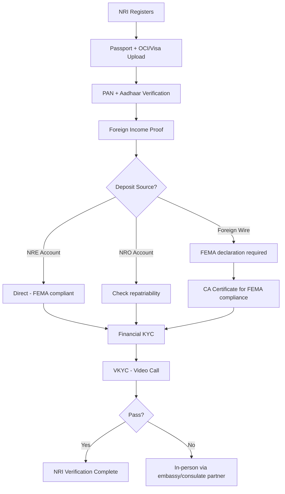
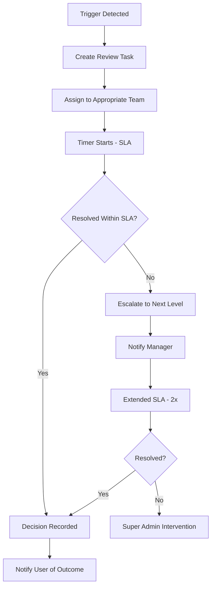
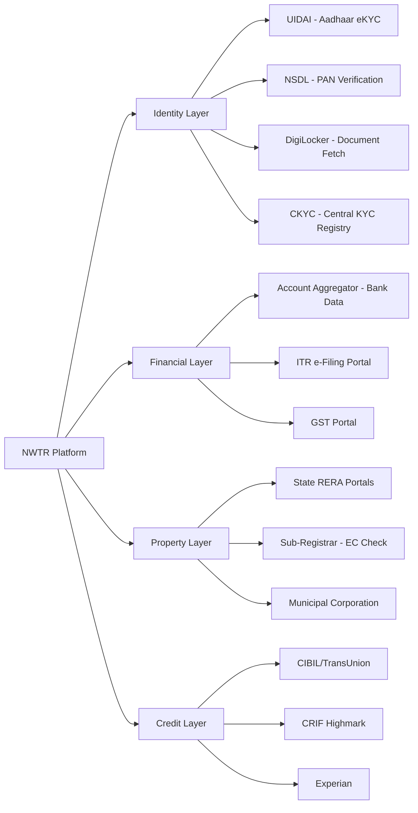

# Verification Flow

---
title: Verification Flow — Identity, Financial, and Property Verification
version: 1.0
audience: Engineering, Compliance, Operations
last-updated: 2026-05-21
status: draft
related-docs:
  - "./kyc-flow.md"
  - "../02-technical/security-architecture.md"
  - "./tenant-journey.md"
---

## TL;DR

NWTR employs a multi-layered verification system covering identity, financial standing, property ownership, employment, address, and NRI-specific checks. Each verification category uses a combination of automated API integrations (DigiLocker, CKYC, NSDL, credit bureaus) and manual review triggers. A composite trust score (0-100) determines user readiness for platform transactions. This document details every verification type, its data sources, scoring methodology, escalation paths, and re-verification triggers.

---

## Verification Architecture Overview

---

## 1. Identity Verification

### 1.1 Aadhaar Verification

| Method | Use Case | Data Returned |
|--------|----------|---------------|
| Aadhaar OTP eKYC | Primary identity check | Name, DOB, Gender, Photo, Address |
| Aadhaar Offline XML | Fallback when OTP fails | Same as above (downloaded by user) |
| DigiLocker fetch | Seamless document access | Aadhaar + linked documents |

**API Integration: UIDAI**
- Endpoint: UIDAI Authentication API via authorized ASA/AUA
- Authentication: OTP-based (biometric not used in digital flow)
- Response time SLA: < 5 seconds
- Fallback: Offline XML upload with share code

### 1.2 PAN Verification

| Check | Method | Validates |
|-------|--------|-----------|
| PAN existence | NSDL/UTI PAN verification API | PAN number is valid and active |
| PAN-Aadhaar link | Seeded status check | PAN linked to Aadhaar (mandatory per IT Act) |
| Name match | Fuzzy matching algorithm | PAN name matches Aadhaar name (±85% threshold) |
| DOB match | Exact match | Date of birth consistency |

**Scoring:**
- PAN valid + linked + name match: 25/25 points
- PAN valid + linked + name fuzzy match (>85%): 20/25
- PAN valid + not linked: 15/25 (flag for user to link)
- PAN invalid or mismatch: 0/25 (reject)

### 1.3 Passport Verification (NRI/Additional)

| Document | Verification | Source |
|----------|-------------|--------|
| Indian passport | Machine Readable Zone (MRZ) parsing | OCR + format validation |
| Passport validity | Expiry date check | Must have > 6 months validity |
| OCI card | OCI number + passport reference | MEA database (manual) |
| Visa | Valid visa for country of residence | OCR + manual review |

---

## 2. Financial Verification

### 2.1 Bank Statement Analysis

**Analysis Parameters:**

| Parameter | Threshold | Weight |
|-----------|-----------|--------|
| Average monthly balance (6 months) | ≥ 20% of deposit | 20% |
| Income stability (variance) | CoV < 30% | 15% |
| Debt-to-income ratio | < 50% | 20% |
| Source of deposit funds (traceable) | Bank trail available | 25% |
| No bounced transactions | Zero in 6 months | 10% |
| Account age | > 2 years preferred | 10% |

### 2.2 ITR Verification

| ITR Type | Acceptable | Tenure Required |
|----------|-----------|-----------------|
| ITR-1 (Salaried) | Yes | Last 2 years |
| ITR-2 (Capital Gains) | Yes | Last 2 years |
| ITR-3 (Business/Profession) | Yes | Last 3 years |
| ITR-4 (Presumptive) | Conditional | Last 3 years |

**Verification Method:**
- ITR-V download from DigiLocker (preferred)
- Manual upload + cross-check via income tax e-filing portal API
- Compare declared income vs bank statement income (±15% tolerance)

### 2.3 Credit Bureau Score (CIBIL/CRIF)

| Score Band | Platform Action | Deposit Limit |
|-----------|----------------|---------------|
| 750+ | Auto-approve financial KYC | Full limit (₹10Cr) |
| 700-749 | Approve with standard review | Up to ₹5Cr |
| 650-699 | Enhanced scrutiny required | Up to ₹2Cr |
| < 650 | Likely rejection (RM escalation) | Case-by-case |
| No history (NTC) | Alternative scoring model | Up to ₹1Cr with additional docs |

**Integration:**
- Bureau: CIBIL (TransUnion) primary, CRIF secondary
- Pull type: Soft pull (no impact to user score)
- Data used: Score, active accounts, DPD history, inquiry count
- Consent: Explicit digital consent captured pre-pull
- Refresh: Valid for 30 days; re-pull if older

---

## 3. Property Verification

### 3.1 Ownership Document Verification

### 3.2 Encumbrance Certificate Check

| Parameter | Requirement |
|-----------|-------------|
| Period | Last 15 years minimum |
| Source | Sub-registrar office (online where available) |
| Check for | Mortgages, liens, court orders, attachment |
| Frequency | At onboarding + at each renewal |
| Red flags | Active mortgage, pending litigation, government acquisition |

### 3.3 RERA Verification

| Scenario | Verification |
|----------|-------------|
| Apartment in registered project | RERA number validated on state portal |
| Villa in plotted development | Development approval + completion certificate |
| Independent house | Municipal building plan approval |
| Pre-RERA property | Occupancy certificate + completion certificate |

### 3.4 Property Valuation Cross-Check

| Source | Method | Priority |
|--------|--------|----------|
| Registered valuer | Physical assessment + report | Primary |
| Circle rate | Government guideline value | Baseline |
| Transaction data | Recent sales in same society/area | Comparative |
| Online aggregators | Market rate reference | Supplementary |

---

## 4. Employment/Income Verification

### 4.1 Salaried Individuals

| Document | Verification Method | Validates |
|----------|-------------------|-----------|
| Salary slips (3 months) | Employer database cross-check | Current income |
| Form 16 | ITR portal verification | Annual income declared |
| Employment letter | Company verification (HR/HRMS) | Active employment |
| LinkedIn profile | Cross-reference (optional) | Tenure and role |

### 4.2 Self-Employed / Business Owners

| Document | Verification Method | Validates |
|----------|-------------------|-----------|
| GST returns (12 months) | GST portal verification | Business activity |
| Business P&L + Balance Sheet | CA certified, cross-check with ITR | Financial health |
| Bank statements (business account) | Account aggregator / upload | Cash flow |
| CA certificate for income | CA registration verification | Stated income |
| Business registration | MCA / GST / Shop Act | Entity existence |

### 4.3 Professionals (Doctors, Lawyers, etc.)

| Document | Verification Method |
|----------|-------------------|
| Professional registration | Medical Council / Bar Council |
| Practice income proof | CA certificate + bank statements |
| Clinic/office proof | Lease deed / ownership |

---

## 5. Address Verification

### 5.1 Methods

| Method | Priority | Timeline |
|--------|----------|----------|
| Aadhaar address (via eKYC) | Primary | Real-time |
| Utility bill (electricity/gas) | Secondary | Manual check (24h) |
| Bank statement address | Tertiary | From financial verification |
| Rent agreement (if existing tenant) | Supporting | Manual check |
| Voter ID address | Alternative | OCR + manual |

### 5.2 Address Match Logic

### 5.3 Address Discrepancy Handling

| Scenario | Action |
|----------|--------|
| Aadhaar has old address (common for renters) | Accept utility bill as current address proof |
| NRI with no Indian address | Accept overseas address + Indian contact |
| Recently relocated | Accept any 2 matching documents |
| Rural address (no clear format) | Manual RM verification |

---

## 6. NRI-Specific Verification

### 6.1 NRI Verification Checklist

| Document | Purpose | Verification |
|----------|---------|-------------|
| Valid Indian passport | Citizenship confirmation | MRZ parsing + expiry check |
| OCI card (if applicable) | Overseas citizen status | MEA records |
| Valid visa / work permit | Legal residence abroad | OCR + validity check |
| Foreign bank statements (6 months) | Income and source of funds | Manual review (translated if needed) |
| FEMA compliance declaration | Foreign exchange regulation | Self-declaration + CA certificate |
| Power of Attorney (if applicable) | Local representative authorized | Notarized + apostilled |
| NRE/NRO account statement | India banking relationship | Account aggregator / upload |

### 6.2 NRI-Specific Flow

### 6.3 FEMA Compliance

| Check | Requirement |
|-------|-------------|
| Source of funds | Must be from legitimate foreign earnings or NRE/NRO |
| Repatriation | NRE funds freely repatriable; NRO limited |
| Tax implications | DTAA benefit declaration if applicable |
| RBI reporting | Transactions > ₹5L reported under LRS |

---

## 7. Verification Scoring System (Trust Score)

### 7.1 Score Composition

| Category | Max Points | Weight |
|----------|-----------|--------|
| Identity (PAN + Aadhaar) | 25 | 25% |
| Financial (Income + Credit) | 30 | 30% |
| Address | 10 | 10% |
| Employment/Income source | 20 | 20% |
| Document quality + consistency | 15 | 15% |
| **Total** | **100** | **100%** |

### 7.2 Score Bands

| Score | Classification | Platform Action |
|-------|---------------|----------------|
| 90-100 | Excellent | Auto-approve, priority matching |
| 80-89 | Good | Auto-approve, standard flow |
| 70-79 | Acceptable | Approve with 1 manual check |
| 60-69 | Borderline | Full manual review required |
| 50-59 | Insufficient | Additional documents requested |
| < 50 | Unqualified | Rejection with guidance |

### 7.3 Score Modifiers

| Modifier | Impact | Condition |
|----------|--------|-----------|
| Returning user (successful tenure) | +10 | Previous completion without issues |
| Referred by verified user | +5 | Referrer has score > 80 |
| Inconsistent data across documents | -10 | Name/address/DOB mismatch |
| Document appears tampered | -25 | Forensic check flag |
| Adverse credit event (recent) | -15 | DPD > 90 in last 12 months |
| PEP (Politically Exposed Person) | -5 | Enhanced monitoring required |

---

## 8. Manual Review Triggers and Escalation

### 8.1 Auto-Escalation Rules

| Trigger | Escalation Level | SLA |
|---------|-----------------|-----|
| Document tampering suspected | Compliance Officer | 4 hours |
| Name mismatch > 20% | Senior Admin | 12 hours |
| PEP/sanctions match | MLRO | 4 hours |
| Credit score < 600 with high deposit | Admin + RM | 24 hours |
| Multiple failed verification attempts (>3) | Admin | 12 hours |
| NRI without Aadhaar | Admin (special handling) | 48 hours |
| Property with active litigation | Legal team | 24 hours |
| Source of funds unclear | Compliance | 24 hours |

### 8.2 Escalation Workflow

---

## 9. Re-verification Scenarios

| Scenario | Trigger | Scope | Timeline |
|----------|---------|-------|----------|
| Annual renewal | 11 months post-verification | Identity + Financial | 30-day window |
| Income change (self-declared) | User updates profile | Financial only | 7 days |
| Address change | User reports new address | Address only | 14 days |
| Property tenure renewal | Same property, new tenure | Abbreviated (delta only) | 14 days |
| Regulatory mandate | RBI/SEBI circular | Full or partial (as directed) | Per directive |
| Suspicious activity | AML flag | Full re-verification | Immediate |
| Document expiry | Passport/visa expires | Document-specific | 30 days before expiry |
| New property (owner) | Owner lists additional property | Property verification only | Standard flow |

---

## 10. Third-Party Integration Map

### 10.1 Integration Architecture

### 10.2 API Details

| Provider | Purpose | Latency SLA | Fallback |
|----------|---------|-------------|----------|
| UIDAI (via ASA) | Aadhaar OTP eKYC | 5 seconds | Offline XML |
| NSDL | PAN verification | 3 seconds | Manual PAN image OCR |
| DigiLocker | Document fetch | 10 seconds | Manual upload |
| CKYC (CERSAI) | KYC record fetch/upload | 15 seconds | Manual KYC |
| Account Aggregator | Bank statements | 30 seconds | PDF upload |
| CIBIL | Credit score | 5 seconds | CRIF as backup |
| CRIF | Credit score (backup) | 5 seconds | Manual bureau report upload |
| State RERA | Project registration | 30 seconds | Manual verification |

### 10.3 Data Flow Compliance

| Requirement | Implementation |
|-------------|---------------|
| Consent management | Explicit opt-in per data source; revocable |
| Data minimization | Only fetch fields needed for verification |
| Storage limitation | Raw API responses purged after extraction (30 days) |
| Purpose limitation | Data used only for stated verification purpose |
| Audit trail | Every API call logged with consent reference |

---

## Cross-References

- [KYC Flow](./kyc-flow.md) — Three-tier KYC architecture details
- [Tenant Journey](./tenant-journey.md) — Stage 4 (Verification) context
- [Owner Journey](./owner-journey.md) — Owner verification requirements
- [Admin Portal](./admin-portal-requirements.md) — KYC management interface
- [Transaction Flow](./transaction-flow.md) — Pre-transaction verification gates
