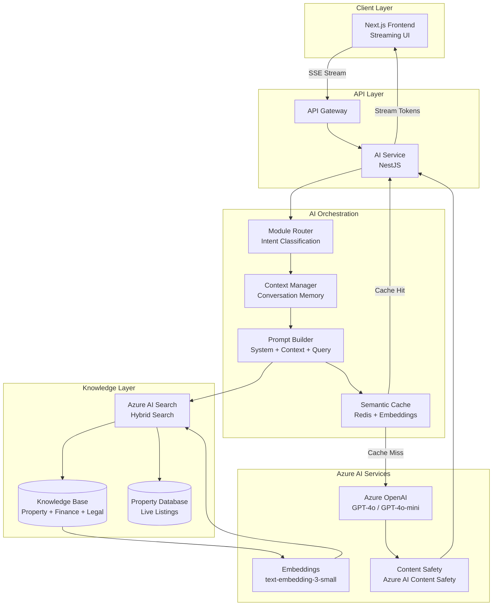
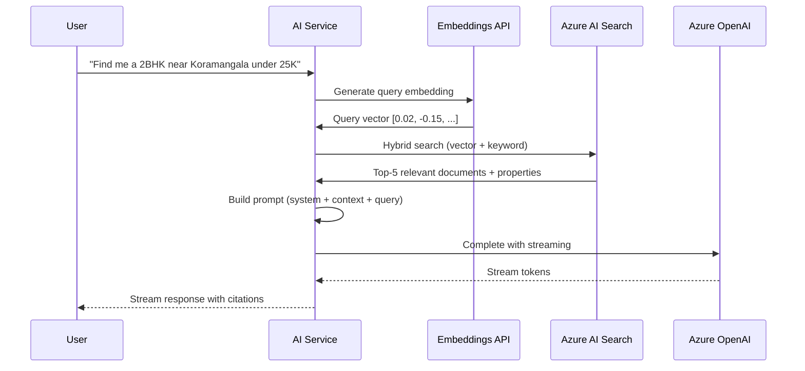
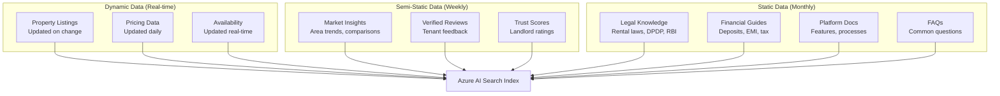
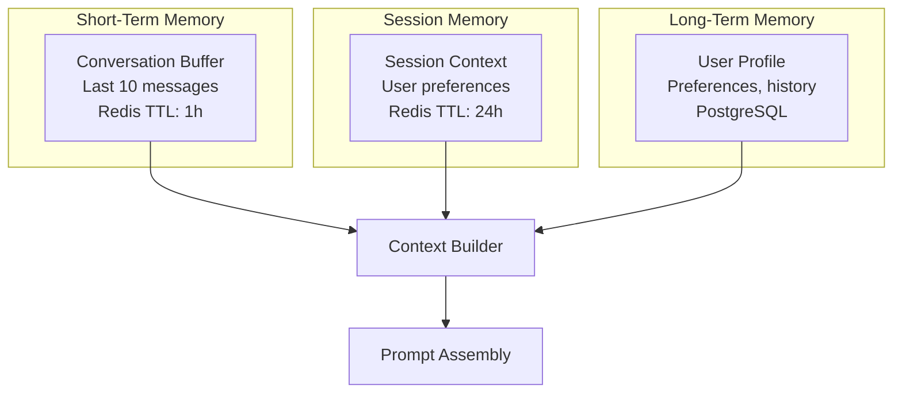
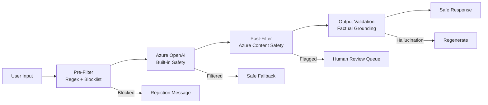

# AI Integration Plan

## TL;DR

NWTR integrates six AI-powered modules (Property Advisor, Deposit Calculator, Onboarding Assistant, Trust Assistant, Smart Search, Financial Comparison) using Azure OpenAI GPT-4o with a RAG pipeline backed by Azure AI Search. The architecture emphasizes streaming responses, intelligent caching, strict token budgets, and content safety filtering. Each module operates with domain-specific system prompts and a shared knowledge base of property data, financial rules, and Indian rental regulations.

---

## 1. AI Architecture Diagram



---

## 2. AI Modules

### Module Overview

| Module | Purpose | Model | Avg Tokens/Call | Priority |
|--------|---------|-------|-----------------|----------|
| Property Advisor | Personalized property recommendations | GPT-4o | 800 | P0 |
| Deposit Calculator | Security deposit explanations & calculations | GPT-4o-mini | 400 | P0 |
| Onboarding Assistant | Guide new users through platform setup | GPT-4o-mini | 600 | P1 |
| Trust Assistant | Answer trust & transparency questions | GPT-4o | 700 | P1 |
| Smart Search | Natural language property search | GPT-4o-mini | 500 | P0 |
| Financial Comparison | Compare rental options, EMI vs rent | GPT-4o | 900 | P2 |

### Module Specifications

**Property Advisor:**
- Understands user preferences (budget, location, amenities, family size)
- Provides personalized shortlists with reasoning
- Explains trade-offs between options
- Learns from user feedback (thumbs up/down)

**Deposit Calculator:**
- Calculates fair security deposits based on property value, location, condition
- Explains RBI guidelines on deposit limits
- Compares NWTR's deposit-free model vs traditional deposits
- Generates shareable deposit comparison reports

**Onboarding Assistant:**
- Guides KYC document upload
- Explains platform features contextually
- Answers common questions (FAQ-driven with RAG fallback)
- Adapts tone based on user persona (tenant vs landlord)

**Trust Assistant:**
- Explains verification processes transparently
- Clarifies how trust scores are calculated
- Addresses concerns about data privacy (DPDP Act compliance)
- Provides dispute resolution guidance

**Smart Search:**
- Converts natural language queries to structured search filters
- Handles complex queries: "2BHK near metro in Indiranagar under 30K with parking"
- Suggests related searches and refinements
- Explains why certain properties match/don't match

**Financial Comparison:**
- Compares rent vs buy vs NWTR flexible rent scenarios
- Calculates total cost of renting (rent + deposits + maintenance + brokerage)
- Projects savings with NWTR's model
- Generates shareable comparison cards

---

## 3. Azure OpenAI Integration

### Deployment Configuration

| Model | Deployment Name | Region | TPM Quota | Use Case |
|-------|----------------|--------|-----------|----------|
| GPT-4o | nwtr-gpt4o-ci | Central India | 30K | Complex reasoning, advice |
| GPT-4o-mini | nwtr-gpt4o-mini-ci | Central India | 60K | Simple tasks, classification |
| text-embedding-3-small | nwtr-embed-ci | Central India | 100K | Knowledge base indexing |

### Token Management

```typescript
interface TokenBudget {
  dailyLimit: number;         // Total tokens per day
  perUserLimit: number;       // Tokens per user per day
  perRequestLimit: number;    // Max tokens per single request
  warningThreshold: number;   // Alert at this percentage
}

const budgets: Record<string, TokenBudget> = {
  'property-advisor': {
    dailyLimit: 30_000,
    perUserLimit: 5_000,
    perRequestLimit: 2_000,
    warningThreshold: 0.8,
  },
  'smart-search': {
    dailyLimit: 15_000,
    perUserLimit: 3_000,
    perRequestLimit: 1_000,
    warningThreshold: 0.8,
  },
};
```

### Rate Limiting Strategy

| Tier | Requests/min | Tokens/min | Burst Allowance |
|------|-------------|-----------|-----------------|
| Free user | 5 | 2,000 | 2x for 30s |
| Standard user | 15 | 5,000 | 3x for 30s |
| Premium user | 30 | 10,000 | 5x for 30s |

### Fallback Strategy

1. Primary: GPT-4o (Central India)
2. Fallback 1: GPT-4o-mini (same region, reduced quality)
3. Fallback 2: Cached/pre-computed responses
4. Fallback 3: Graceful degradation message with retry option

---

## 4. RAG Pipeline Architecture

### Retrieval-Augmented Generation Flow



### Search Configuration

```json
{
  "search_mode": "hybrid",
  "semantic_configuration": "nwtr-semantic",
  "vector_queries": [{
    "kind": "vector",
    "vector": "[query_embedding]",
    "k": 5,
    "fields": "content_vector"
  }],
  "query_type": "semantic",
  "semantic_ranking": true,
  "top": 10,
  "select": "title,content,source,metadata"
}
```

### Chunking Strategy

| Content Type | Chunk Size | Overlap | Strategy |
|-------------|-----------|---------|----------|
| Property descriptions | 500 tokens | 50 tokens | Sentence-boundary |
| Financial guides | 800 tokens | 100 tokens | Section-boundary |
| Legal documents | 1000 tokens | 150 tokens | Paragraph-boundary |
| FAQs | 300 tokens | 0 | Question-answer pairs |
| User reviews | 200 tokens | 0 | Per-review (no splitting) |

---

## 5. Knowledge Base Design

### Knowledge Base Structure



### Index Schema

| Field | Type | Searchable | Filterable | Facetable |
|-------|------|-----------|-----------|-----------|
| id | string | No | Yes | No |
| title | string | Yes | No | No |
| content | string | Yes | No | No |
| content_vector | vector (1536) | Yes (vector) | No | No |
| source_type | string | No | Yes | Yes |
| category | string | No | Yes | Yes |
| city | string | No | Yes | Yes |
| last_updated | datetime | No | Yes | No |
| relevance_score | double | No | Yes | No |

### Knowledge Base Update Pipeline

| Source | Update Frequency | Trigger | Pipeline |
|--------|-----------------|---------|----------|
| Property listings | Real-time | DB change event | Service Bus → Embedding → Index |
| Market insights | Daily (2 AM) | Scheduled | Azure Function → Compute → Index |
| Legal/regulatory | Manual review | PR merge | CI/CD → Validate → Index |
| FAQs | Weekly | Content team update | Admin UI → Review → Index |
| User reviews | On approval | Moderation complete | Event → Embedding → Index |

---

## 6. Prompt Engineering Strategy

### System Prompt Architecture

Each module has a structured system prompt:

```
[ROLE] - Who the AI is and its expertise
[CONTEXT] - Platform-specific knowledge and constraints
[RULES] - Hard constraints (never recommend, always verify, etc.)
[FORMAT] - Output structure and formatting rules
[SAFETY] - Content filtering and ethical guidelines
[PERSONA] - Tone, language preferences, cultural context
```

### Module-Specific Prompts (Abbreviated)

**Property Advisor System Prompt:**
```
You are NWTR's Property Advisor, an expert in Indian residential rentals.
You help tenants find their ideal rental property in Indian cities.

CONSTRAINTS:
- Only recommend properties available on the NWTR platform
- Never guarantee availability (it can change)
- Always mention deposit-free benefits when comparing
- Respect budget constraints strictly (never suggest >10% over budget)
- Use Indian English conventions (lakh, crore, BHK)

FORMAT:
- Lead with top 2-3 recommendations
- Include brief reasoning for each
- Mention trade-offs honestly
- End with a clarifying question to refine search

TONE: Friendly, professional, culturally aware. Like a trusted friend who
knows the real estate market well.
```

### Prompt Versioning

- All system prompts stored in version-controlled files (`/ai/prompts/v{N}/`)
- Changes require PR review by AI team lead
- A/B testing framework for prompt variations
- Rollback capability within 5 minutes

---

## 7. Streaming Response Implementation

### Server-Sent Events (SSE) Architecture

```typescript
// AI Service - Streaming endpoint
@Post('ai/chat')
@UseInterceptors(StreamingInterceptor)
async chat(@Body() dto: ChatRequestDto, @Res() res: Response) {
  res.setHeader('Content-Type', 'text/event-stream');
  res.setHeader('Cache-Control', 'no-cache');
  res.setHeader('Connection', 'keep-alive');

  const stream = await this.aiService.streamCompletion({
    module: dto.module,
    messages: dto.messages,
    context: await this.ragService.retrieve(dto.query),
  });

  for await (const chunk of stream) {
    res.write(`data: ${JSON.stringify(chunk)}\n\n`);
  }

  res.write('data: [DONE]\n\n');
  res.end();
}
```

### Frontend Streaming Consumer

```typescript
// Next.js client-side streaming consumption
async function* streamChat(message: string, module: string) {
  const response = await fetch('/api/ai/chat', {
    method: 'POST',
    body: JSON.stringify({ message, module }),
  });

  const reader = response.body!.getReader();
  const decoder = new TextDecoder();

  while (true) {
    const { done, value } = await reader.read();
    if (done) break;

    const chunk = decoder.decode(value);
    const lines = chunk.split('\n').filter(Boolean);

    for (const line of lines) {
      if (line.startsWith('data: ') && line !== 'data: [DONE]') {
        yield JSON.parse(line.slice(6));
      }
    }
  }
}
```

### Streaming Performance Targets

| Metric | Target | Measurement |
|--------|--------|-------------|
| Time to First Token | < 500ms (p95) | From request to first SSE event |
| Inter-Token Latency | < 50ms | Between consecutive tokens |
| Total Response Time | < 5s (p95) | Full response completion |
| Stream Reliability | > 99.5% | Completed without disconnect |

---

## 8. Conversation Memory & Context Management

### Memory Architecture



### Context Window Management

| Model | Max Context | System Prompt | RAG Context | Conversation | Response |
|-------|------------|---------------|-------------|--------------|----------|
| GPT-4o | 128K | 2K tokens | 4K tokens | 8K tokens | 2K tokens |
| GPT-4o-mini | 128K | 1.5K tokens | 3K tokens | 6K tokens | 1.5K tokens |

### Conversation Summarization

When conversation exceeds 10 messages:
1. Summarize older messages into a compact context paragraph
2. Retain last 5 messages verbatim
3. Store full history in PostgreSQL for analytics
4. Summary refreshed every 5 new messages

---

## 9. AI Safety & Content Filtering

### Content Safety Pipeline



### Safety Rules

| Category | Policy | Action |
|----------|--------|--------|
| Hate speech / discrimination | Zero tolerance | Block + log + review |
| Personal financial advice | Disclaimer required | Append disclaimer |
| Legal advice | Disclaimer required | Append "consult lawyer" |
| PII in responses | Never generate | Strip from output |
| Competitor mentions | Neutral tone only | No disparagement |
| Price manipulation | Prevent | Ground in data only |
| Hallucinated properties | Prevent | Verify against DB |
| Religious/political content | Avoid | Redirect to platform topics |

### Grounding Verification

Every AI response referencing specific data (properties, prices, rules) is verified:
1. Property IDs mentioned must exist in active listings
2. Prices must match current database values (±5% tolerance)
3. Legal claims must cite specific knowledge base documents
4. Statistics must be traceable to source data

---

## 10. Cost Management

### Token Budget Monitoring Dashboard

| Metric | Year 1 Daily | Year 3 Daily | Year 5 Daily |
|--------|-------------|-------------|-------------|
| Total tokens consumed | 100K | 5M | 30M |
| Unique users using AI | 50 | 5,000 | 30,000 |
| Avg tokens per user | 2,000 | 1,000 | 1,000 |
| Cache hit rate (target) | 20% | 40% | 50% |
| Effective cost/user/day | ₹4 | ₹2.5 | ₹2 |

### Cost Control Mechanisms

1. **Hard token caps:** Per-user daily limits enforced at API layer
2. **Semantic caching:** Similar queries return cached responses (30% savings)
3. **Model routing:** Simple queries → GPT-4o-mini (70% cheaper per token)
4. **Pre-computed responses:** Top-50 FAQs served without LLM call
5. **Batch processing:** Non-urgent tasks (summaries, insights) run nightly at lower priority
6. **Token-aware UI:** Show users remaining AI interactions to manage expectations

---

## 11. Performance Optimization

### Response Caching Strategy

| Cache Type | Key | TTL | Hit Rate Target |
|-----------|-----|-----|-----------------|
| Exact match | Hash(module + query + context) | 1 hour | 10% |
| Semantic similarity | Embedding cosine > 0.95 | 30 min | 25% |
| FAQ responses | Category + question hash | 24 hours | 40% |
| Pre-computed insights | Property ID + insight type | 6 hours | 30% |

### Pre-Computation Pipeline

Nightly batch job generates:
- Property summary descriptions (for quick display)
- Area comparison insights (for financial comparison module)
- Common question answers (refreshed from latest data)
- Embedding vectors for new/updated content

### Latency Optimization

| Technique | Latency Reduction | Implementation |
|-----------|-------------------|----------------|
| Streaming (avoid full wait) | Perceived: 70% | SSE from first token |
| Parallel RAG retrieval | 200-400ms | Concurrent search + embed |
| Warm model connections | 100-200ms | Keep-alive HTTP connections |
| Edge-cached embeddings | 50-100ms | Redis embedding cache |
| Prompt pre-compilation | 50ms | Template caching |

---

## 12. Evaluation & Improvement Loop

### Quality Metrics

| Metric | Measurement Method | Target | Review Cadence |
|--------|-------------------|--------|----------------|
| Response Relevance | LLM-as-judge (GPT-4o) | > 4.0/5.0 | Weekly sample |
| Factual Accuracy | Human spot-check | > 95% | Weekly (50 samples) |
| User Satisfaction | Thumbs up/down ratio | > 80% positive | Daily dashboard |
| Task Completion | User achieved goal | > 70% | Weekly cohort |
| Hallucination Rate | Grounding verification | < 2% | Daily automated |
| Response Latency | p95 time-to-complete | < 5s | Real-time monitor |

### Feedback Collection

```mermaid
graph TB
    subgraph "Implicit Signals"
        THUMB[Thumbs Up/Down]
        RETRY[User Retry/Rephrase]
        ABANDON[Conversation Abandon]
        CONVERT[Action Taken After Advice]
    end

    subgraph "Explicit Signals"
        RATING[Star Rating (optional)]
        COMMENT[Free-text Feedback]
        REPORT[Report Inaccuracy]
    end

    subgraph "Analysis Pipeline"
        AGG[Aggregate Signals]
        CLUSTER[Cluster by Module + Topic]
        IDENTIFY[Identify Failure Patterns]
        ACTION[Generate Improvement Actions]
    end

    THUMB --> AGG
    RETRY --> AGG
    ABANDON --> AGG
    CONVERT --> AGG
    RATING --> AGG
    COMMENT --> AGG
    REPORT --> AGG
    AGG --> CLUSTER
    CLUSTER --> IDENTIFY
    IDENTIFY --> ACTION
```

### Improvement Cycle

| Cadence | Activity | Owner |
|---------|----------|-------|
| Daily | Review flagged responses, check hallucination rate | AI Engineer |
| Weekly | Analyze failure clusters, update knowledge base | AI Team |
| Bi-weekly | Prompt optimization experiments (A/B test) | AI Lead |
| Monthly | Full evaluation run (100+ samples per module) | AI Team + Product |
| Quarterly | Model upgrade evaluation, architecture review | Engineering Lead |

### A/B Testing Framework

- Traffic split: 90% control / 10% variant
- Minimum sample size: 200 interactions per variant
- Success metric: Composite (relevance + satisfaction + conversion)
- Auto-promote: Variant wins if statistically significant (p < 0.05) after 1 week
- Auto-rollback: Variant loses if satisfaction drops > 10% in first 24h

---

## Cross-References

- [System Architecture](./system-architecture.md) — Service design and AI service placement
- [Scalability Strategy](./scalability-strategy.md) — AI service scaling approach
- [Cost Optimization](./cost-optimization.md) — AI cost budgets and optimization
- [Security Architecture](./security-architecture.md) — AI safety and data protection
- [API Design](./api-design.md) — AI endpoint specifications
- [Data Architecture](./data-architecture.md) — Knowledge base data models

---

## Revision History

| Version | Date | Author | Changes |
|---------|------|--------|---------|
| 1.0 | 2026-05-21 | AI & Platform Engineering | Initial draft |
