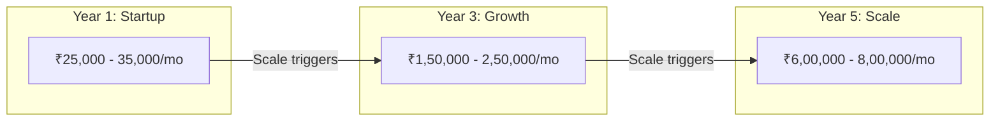
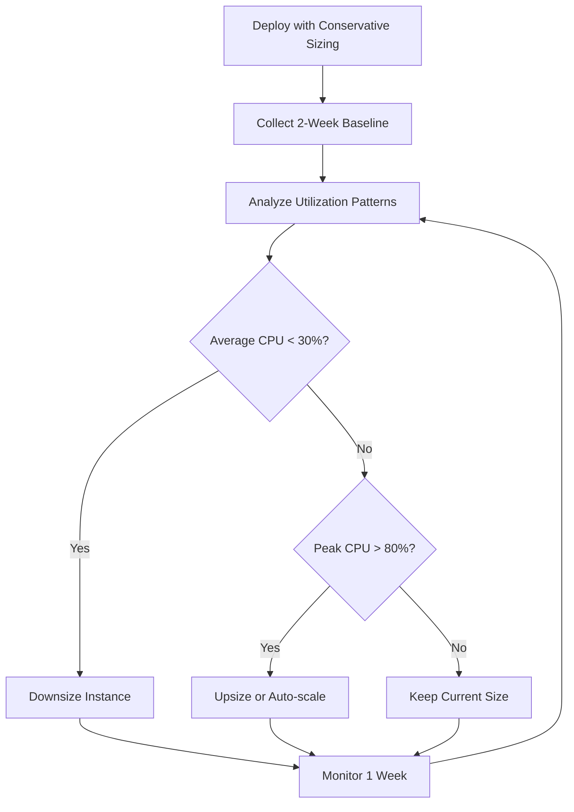
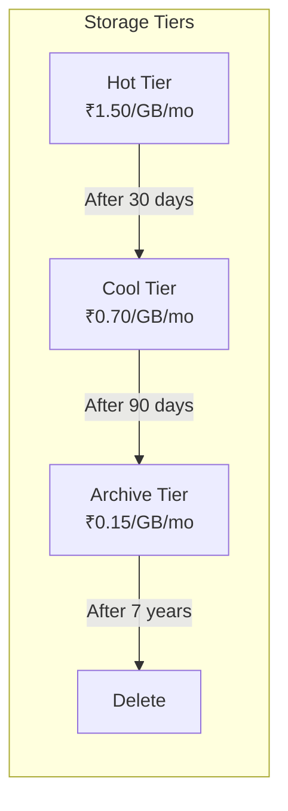
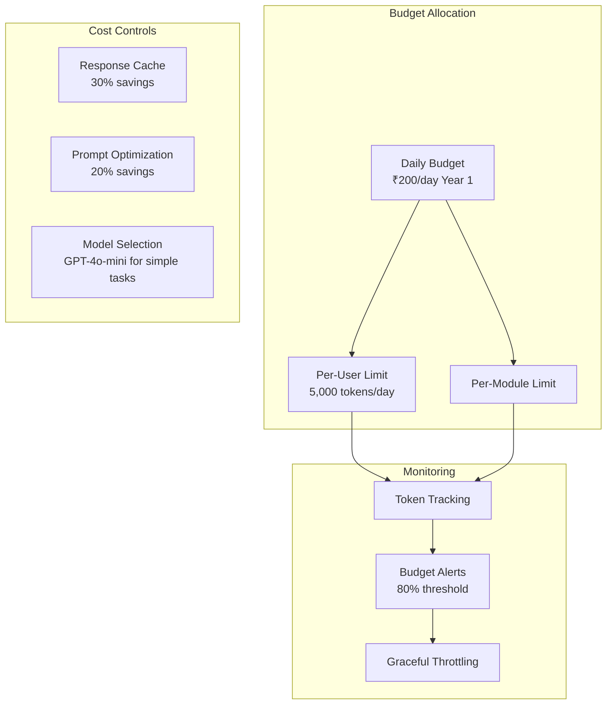
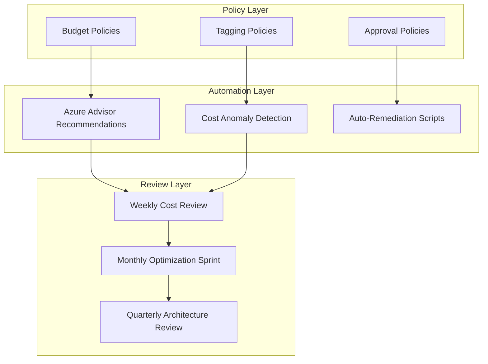

# Cost Optimization

## TL;DR

NWTR's cost optimization strategy defines a FinOps-driven approach to Azure spending across three growth tiers. Year 1 targets ₹25,000-35,000/month using free tiers, scale-to-zero, and serverless patterns. The strategy covers resource right-sizing, reserved instance analysis, storage tiering, AI token budgeting, and governance practices to maintain cost efficiency as the platform scales to ₹7-8L/month at Year 5 with 100K users.

---

## 1. Azure Cost Estimation by Tier

### Total Monthly Cost Projection



### Detailed Cost Breakdown — Year 1 (Startup)

| Service | SKU/Tier | Monthly Cost (₹) | Notes |
|---------|----------|-------------------|-------|
| Azure Container Apps | Consumption plan | 3,000 - 5,000 | Scale-to-zero for non-critical |
| PostgreSQL Flexible | Burstable B2s | 4,000 - 5,000 | 2 vCPU, 4 GB RAM, 128 GB |
| Azure Cache for Redis | Basic C0 | 1,500 | 250 MB, no SLA |
| Azure AI Search | Free tier | 0 | 50 MB, 3 indexes, 10K docs |
| Azure OpenAI | Pay-as-you-go | 4,000 - 6,000 | ~100K tokens/day |
| Azure Blob Storage | Hot (LRS) | 500 - 1,000 | ~50 GB |
| Azure CDN | Standard Microsoft | 500 | Low traffic volume |
| Azure Service Bus | Basic | 500 | < 1M operations |
| Azure Front Door | Standard | 2,000 | WAF included |
| Azure Key Vault | Standard | 200 | < 10K operations |
| Azure Entra ID B2C | First 50K MAU free | 0 | < 500 users |
| Log Analytics | Pay-as-you-go | 1,000 - 2,000 | ~5 GB/month ingestion |
| Application Insights | Pay-as-you-go | 500 - 1,000 | With sampling |
| Azure Monitor | Included | 0 | Platform metrics free |
| GitHub Actions | Free tier | 0 | 2,000 min/month |
| **Total** | | **₹18,200 - 28,700** | |
| Buffer (25%) | | 4,500 - 7,000 | Unexpected usage |
| **Grand Total** | | **₹22,700 - 35,700** | |

### Detailed Cost Breakdown — Year 3 (Growth)

| Service | SKU/Tier | Monthly Cost (₹) | Notes |
|---------|----------|-------------------|-------|
| Azure Container Apps | Dedicated (D4) | 40,000 - 60,000 | Always-on critical services |
| PostgreSQL Flexible | GP D4s_v3 + Replicas | 25,000 - 35,000 | 4 vCPU primary + 2 replicas |
| Azure Cache for Redis | Standard C3 | 12,000 - 15,000 | 6 GB with replication |
| Azure AI Search | Standard S1 | 18,000 - 22,000 | 2 partitions, 2 replicas |
| Azure OpenAI | Pay-as-you-go | 40,000 - 60,000 | ~5M tokens/day |
| Azure Blob Storage | Hot + Cool | 5,000 - 10,000 | ~2 TB total |
| Azure CDN | Standard | 3,000 - 5,000 | Moderate traffic |
| Azure Service Bus | Standard | 3,000 - 5,000 | Multiple queues/topics |
| Azure Front Door | Premium | 8,000 | Advanced WAF rules |
| Key Vault + Identities | Standard | 500 | Higher operation count |
| Azure Entra ID B2C | P1 | 3,000 - 5,000 | 20K MAU |
| Log Analytics | Commitment tier | 5,000 - 8,000 | 100 GB/day |
| Application Insights | Standard | 3,000 - 5,000 | Full telemetry |
| **Total** | | **₹1,65,500 - 2,45,000** | |

### Detailed Cost Breakdown — Year 5 (Scale)

| Service | SKU/Tier | Monthly Cost (₹) | Notes |
|---------|----------|-------------------|-------|
| Azure Container Apps / AKS | Dedicated (D8-D16) | 1,50,000 - 2,50,000 | Full orchestration |
| PostgreSQL Flexible | GP D8s_v3 + Replicas | 80,000 - 1,20,000 | 8 vCPU + 4 replicas |
| Azure Cache for Redis | Premium P2 | 40,000 - 50,000 | 13 GB clustered |
| Azure AI Search | Standard S2 | 60,000 - 80,000 | 3 partitions, 3 replicas |
| Azure OpenAI | PTU + Pay-as-you-go | 1,50,000 - 2,00,000 | 30M tokens/day |
| Azure Blob Storage | Hot + Cool + Archive | 30,000 - 40,000 | ~15 TB total |
| Azure CDN | Premium Verizon | 15,000 - 20,000 | High traffic |
| Azure Service Bus | Premium | 12,000 - 15,000 | Dedicated capacity |
| Other (Monitor, KV, etc.) | Various | 50,000 - 80,000 | Scaled monitoring |
| **Total** | | **₹5,87,000 - 8,55,000** | |

---

## 2. Resource Right-Sizing Strategy

### Right-Sizing Process



### Right-Sizing Review Schedule

| Resource Type | Review Frequency | Tool | Action Threshold |
|--------------|-----------------|------|------------------|
| Container Apps (CPU/Mem) | Weekly | Azure Advisor | Avg utilization < 30% |
| PostgreSQL | Monthly | Query Performance Insights | CPU < 25% sustained |
| Redis | Monthly | Redis INFO metrics | Memory < 40% used |
| AI Search | Quarterly | Search traffic analytics | < 50 QPS on S1 |

### Rightsizing Recommendations Matrix

| Current SKU | Utilization | Recommendation | Savings |
|-------------|------------|----------------|---------|
| Container D4 (4 vCPU) | 20% avg CPU | Downsize to D2 | ~50% |
| PostgreSQL D4s | 15% avg CPU | Switch to Burstable B4ms | ~40% |
| Redis C3 (6 GB) | 1.5 GB used | Downsize to C1 (1 GB) | ~60% |
| AI Search S1 | 10 QPS avg | Stay (headroom for growth) | 0% |

---

## 3. Reserved Instances vs Pay-As-You-Go

### Break-Even Analysis

| Resource | Pay-as-you-go/mo | 1-Year RI/mo | 3-Year RI/mo | Recommendation |
|----------|-----------------|--------------|--------------|----------------|
| PostgreSQL D4s | ₹25,000 | ₹16,000 (36% off) | ₹11,000 (56% off) | 1-Year RI at Year 2 |
| Redis Standard C3 | ₹15,000 | ₹10,500 (30% off) | ₹7,500 (50% off) | 1-Year RI at Year 2 |
| Container Apps (Dedicated) | ₹50,000 | ₹35,000 (30% off) | ₹25,000 (50% off) | 1-Year RI at Year 3 |

### RI Purchase Strategy

**Year 1:** No reservations — usage patterns unpredictable, prioritize flexibility
**Year 2:** 1-year reservations for PostgreSQL and Redis (stable baseline load)
**Year 3:** 1-year reservations for compute; evaluate 3-year for database
**Year 4+:** 3-year reservations for stable workloads; savings plans for compute

### Savings Plans vs Reserved Instances

| Scenario | Best Option | Reason |
|----------|------------|--------|
| Stable, predictable workload | Reserved Instance | Maximum discount |
| Variable compute across SKUs | Savings Plan | Flexibility across VM families |
| New/experimental service | Pay-as-you-go | No commitment risk |
| Batch/background workers | Spot Instances | Up to 90% discount, interruptible OK |

---

## 4. Auto-Scaling Policies

### Scale-to-Zero Configuration (Year 1)

| Service | Scale-to-Zero | Min Active | Activation Trigger |
|---------|--------------|------------|-------------------|
| AI Service | Yes | 0 | HTTP request or queue message |
| Notification Worker | Yes | 0 | Service Bus message |
| Document Generator | Yes | 0 | Queue message |
| Analytics Worker | Yes | 0 | Scheduled trigger |
| API Gateway | No | 2 | Always on |
| Property Service | No | 2 | Always on |
| Payment Service | No | 2 | Always on (compliance) |

### Scheduled Scaling

```yaml
# Scale down during off-peak (11 PM - 7 AM IST)
schedules:
  - name: night-scale-down
    cron: "0 23 * * *"
    timezone: "Asia/Kolkata"
    actions:
      property-service: { minReplicas: 1, maxReplicas: 3 }
      user-service: { minReplicas: 1, maxReplicas: 2 }

  - name: morning-scale-up
    cron: "0 7 * * *"
    timezone: "Asia/Kolkata"
    actions:
      property-service: { minReplicas: 2, maxReplicas: 8 }
      user-service: { minReplicas: 2, maxReplicas: 6 }
```

### Cost Impact of Auto-Scaling

| Strategy | Monthly Savings | Trade-off |
|----------|----------------|-----------|
| Scale-to-zero (non-critical) | ₹3,000 - 5,000 | Cold start latency (2-5s) |
| Night scaling (50% reduction) | ₹5,000 - 8,000 | Slower response at night edge |
| Weekend scaling (30% reduction) | ₹2,000 - 3,000 | Limited if B2C peak weekends |

---

## 5. Storage Tiering

### Blob Storage Lifecycle Policy



### Lifecycle Rules by Container

| Container | Hot → Cool | Cool → Archive | Archive → Delete |
|-----------|-----------|----------------|------------------|
| property-images | 90 days | 365 days | Never |
| user-documents | 30 days | 180 days | 7 years |
| kyc-documents | 30 days | 90 days | 7 years (regulatory) |
| backup-snapshots | 7 days | 30 days | 365 days |
| temp-uploads | 1 day | — | 7 days |
| ai-knowledge-base | Never (always hot) | — | — |

### Storage Cost Projection

| Tier | Year 1 (50 GB) | Year 3 (2 TB) | Year 5 (15 TB) |
|------|----------------|---------------|-----------------|
| Without lifecycle | ₹750/mo | ₹30,000/mo | ₹2,25,000/mo |
| With lifecycle | ₹500/mo | ₹12,000/mo | ₹60,000/mo |
| **Savings** | **33%** | **60%** | **73%** |

---

## 6. CDN Cost Optimization

### CDN Configuration for Cost Efficiency

| Content Type | Cache Duration | Origin Shield | Cost Impact |
|-------------|---------------|---------------|-------------|
| Static assets (JS, CSS) | 365 days (immutable) | Yes | Lowest (< 1% origin hits) |
| Property images | 24 hours | Yes | Low (cache hit > 95%) |
| API responses (public) | 5 minutes | No | Medium (frequent revalidation) |
| API responses (private) | No cache | No | Highest (all requests to origin) |

### CDN Cost Reduction Tactics

- **Aggressive cache headers:** Immutable static assets (hash-based filenames)
- **Image optimization:** WebP/AVIF formats, responsive sizes (reduce bandwidth 40-60%)
- **Origin shield:** Single origin request for popular content
- **Compression:** Brotli for text, optimized encoding for images
- **Purge strategy:** Selective purge on update (not full purge)

---

## 7. Database Cost Management

### Serverless vs Provisioned Comparison

| Workload Pattern | Serverless | Provisioned | Recommendation |
|-----------------|-----------|-------------|----------------|
| Steady load (API) | ₹8,000/mo | ₹5,000/mo | Provisioned |
| Bursty (AI queries) | ₹3,000/mo | ₹5,000/mo | Serverless |
| Off-hours (analytics) | ₹500/mo | ₹5,000/mo | Serverless |
| Dev/test environments | ₹1,000/mo | ₹5,000/mo | Serverless |

### Database Cost Optimization Tactics

| Tactic | Savings | Implementation |
|--------|---------|----------------|
| Burstable SKUs for dev/staging | 60% | Switch non-prod to B-series |
| Stop dev DB at night | 40% | Scheduled start/stop |
| Connection pooling (PgBouncer) | 20% | Reduce required connections → smaller SKU |
| Query optimization | 15-30% | Reduce CPU → smaller SKU possible |
| Read replicas for reports | N/A | Avoid scaling primary for read-heavy analytics |

### PostgreSQL SKU Progression

| Period | Environment | SKU | Monthly Cost |
|--------|-------------|-----|--------------|
| Year 1 | Production | Burstable B2s | ₹4,000 |
| Year 1 | Dev/Staging | Burstable B1ms | ₹1,500 |
| Year 3 | Production | GP D4s_v3 | ₹25,000 |
| Year 3 | Dev/Staging | Burstable B2s | ₹4,000 |
| Year 5 | Production | GP D8s_v3 | ₹60,000 |
| Year 5 | Dev/Staging | GP D4s_v3 | ₹15,000 |

---

## 8. AI Service Cost Management

### Token Budget Architecture



### Token Budget by Module

| AI Module | Model | Daily Token Budget | Monthly Cost (₹) |
|-----------|-------|-------------------|-------------------|
| Property Advisor | GPT-4o | 30,000 | 1,500 |
| Deposit Calculator | GPT-4o-mini | 10,000 | 200 |
| Onboarding Assistant | GPT-4o-mini | 20,000 | 400 |
| Trust Assistant | GPT-4o | 20,000 | 1,000 |
| Smart Search | GPT-4o-mini | 15,000 | 300 |
| Financial Comparison | GPT-4o | 5,000 | 250 |
| **Total** | | **100,000** | **₹3,650** |

### AI Cost Reduction Strategies

| Strategy | Savings | Implementation Complexity |
|----------|---------|--------------------------|
| Response caching (semantic) | 25-35% | Medium (embedding similarity) |
| Prompt compression | 15-20% | Low (remove verbose instructions) |
| Model routing (GPT-4o-mini for simple) | 30-40% | Medium (intent classification) |
| Pre-computed answers for FAQs | 20-30% | Low (static response lookup) |
| Streaming with early termination | 5-10% | Low (stop on user satisfaction) |
| Batch embedding generation | 40% | Low (nightly batch vs real-time) |

---

## 9. Monthly Cost Projections — Year 1

### Month-by-Month Forecast

| Month | Users | Properties | Monthly Cost (₹) | Notes |
|-------|-------|-----------|-------------------|-------|
| 1 | 20 | 10 | 18,000 | Launch, minimal traffic |
| 2 | 50 | 20 | 20,000 | Early adoption |
| 3 | 100 | 35 | 22,000 | Marketing push |
| 4 | 150 | 45 | 23,000 | Steady growth |
| 5 | 200 | 55 | 24,000 | |
| 6 | 250 | 65 | 25,000 | Mid-year checkpoint |
| 7 | 300 | 70 | 26,000 | AI usage increasing |
| 8 | 330 | 75 | 27,000 | |
| 9 | 370 | 80 | 28,000 | |
| 10 | 400 | 85 | 29,000 | |
| 11 | 450 | 90 | 30,000 | |
| 12 | 500 | 100 | 32,000 | Year-end target |
| **Total Year 1** | | | **₹3,04,000** | ~₹25,300 avg/mo |

### Budget Buffer Strategy

- Maintain 25% buffer above forecast for unexpected spikes
- AI costs most variable — cap with hard token limits
- Marketing events may cause 2-3x traffic spikes (plan for 48h burst)

---

## 10. Cost Allocation by Service

### Service-Level Cost Attribution

| Service Domain | Year 1 (%) | Year 3 (%) | Year 5 (%) |
|---------------|-----------|-----------|-----------|
| Compute (containers) | 20% | 30% | 32% |
| Database | 20% | 18% | 16% |
| AI (OpenAI + Search) | 20% | 28% | 30% |
| Storage + CDN | 8% | 7% | 7% |
| Networking (Front Door) | 10% | 5% | 4% |
| Monitoring & Logging | 8% | 5% | 4% |
| Security & Identity | 5% | 3% | 3% |
| Messaging (Service Bus) | 4% | 2% | 2% |
| Other | 5% | 2% | 2% |

### Per-User Economics

| Period | Monthly Cost | Active Users | Cost per User |
|--------|-------------|--------------|---------------|
| Year 1 | ₹25,000 | 500 | ₹50/user |
| Year 3 | ₹2,00,000 | 20,000 | ₹10/user |
| Year 5 | ₹7,50,000 | 100,000 | ₹7.50/user |

Unit economics improve dramatically with scale due to shared infrastructure costs.

---

## 11. FinOps Practices & Governance

### FinOps Maturity Model

| Phase | Period | Focus | Key Activities |
|-------|--------|-------|----------------|
| Crawl | Year 1 | Visibility | Tag resources, set budgets, weekly review |
| Walk | Year 2-3 | Optimization | Right-size, RIs, automated policies |
| Run | Year 4-5 | Operations | Real-time optimization, team accountability |

### Governance Framework



### FinOps Team Responsibilities

| Role | Responsibility | Cadence |
|------|---------------|---------|
| Engineering Lead | Approve resource provisioning | Per request |
| Platform Engineer | Right-sizing, automation | Weekly |
| Finance | Budget tracking, forecasting | Monthly |
| CTO | Strategic cost decisions | Quarterly |

### Cost Optimization Checklist (Monthly)

- [ ] Review Azure Advisor recommendations
- [ ] Check for idle/unattached resources
- [ ] Verify auto-scaling is working (not over-provisioned)
- [ ] Review AI token usage vs budget
- [ ] Check storage lifecycle policies executing correctly
- [ ] Validate dev/staging resources stopped after hours
- [ ] Review cost anomaly alerts from past month
- [ ] Update forecast based on growth trajectory

---

## Cross-References

- [Scalability Strategy](./scalability-strategy.md) — Resource sizing by scale tier
- [Deployment Architecture](./deployment-architecture.md) — Infrastructure resource definitions
- [DevOps Plan](./devops-plan.md) — Cost monitoring alerts and dashboards
- [AI Integration Plan](./ai-integration-plan.md) — AI token budgets and optimization
- [Executive Summary](../00-executive/executive-summary.md) — Business case and ROI

---

## Revision History

| Version | Date | Author | Changes |
|---------|------|--------|---------|
| 1.0 | 2026-05-21 | Platform Engineering | Initial draft |
