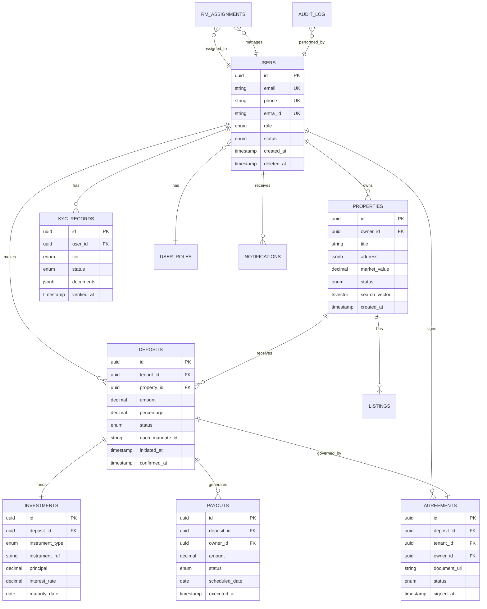

# Database Schema

---
title: Database Schema  
version: "1.0"  
audience: engineering  
last-updated: 2026-05-21  
status: draft  
related-docs:
  - "./system-architecture.md"
  - "../01-product/escrow-deposit-logic.md"
  - "../01-product/transaction-flow.md"
  - "./api-contracts.md"
---

## TL;DR

NWTR uses PostgreSQL as the primary relational store with schema-per-service isolation. Core entities span Users, Properties, Deposits, Investments, Payouts, Agreements, and KYC_Records. All financial operations are immutably audited. The database employs row-level security for tenant isolation, date-based partitioning for high-volume tables, and a soft-delete pattern across all entities. Data retention aligns with PMLA (8 years financial), DPDP Act (consent-based), and RERA requirements.

---

## Entity-Relationship Diagram



---

## Schema Isolation Strategy

Each microservice owns a dedicated PostgreSQL schema:

| Schema | Owner Service | Key Tables |
|--------|--------------|------------|
| `auth` | Auth Service | sessions, refresh_tokens, mfa_configs, login_attempts |
| `users` | User Service | users, user_profiles, user_preferences, user_documents |
| `properties` | Property Service | properties, listings, property_media, amenities |
| `kyc` | KYC Service | kyc_records, kyc_documents, verification_attempts, credit_scores |
| `deposits` | Deposit Service | deposits, investments, nach_mandates, deposit_calculations |
| `payouts` | Payout Service | payouts, payout_schedules, reconciliation_records, bank_accounts |
| `notifications` | Notification Service | notifications, notification_preferences, templates |
| `ai` | AI Service | chat_sessions, chat_messages, recommendations, embeddings_cache |
| `rm` | RM Service | rm_assignments, sla_records, escalations, rm_performance |
| `audit` | Shared | audit_log, data_changes, compliance_events |

---

## Core Table Definitions

### users.users

| Column | Type | Constraints | Description |
|--------|------|-------------|-------------|
| id | UUID | PK, DEFAULT gen_random_uuid() | Primary identifier |
| entra_id | VARCHAR(128) | UNIQUE, NOT NULL | Azure Entra ID B2C object ID |
| email | VARCHAR(255) | UNIQUE, NOT NULL | Primary email |
| phone | VARCHAR(15) | UNIQUE, NOT NULL | Indian mobile (+91) |
| first_name | VARCHAR(100) | NOT NULL | Legal first name |
| last_name | VARCHAR(100) | NOT NULL | Legal last name |
| role | user_role_enum | NOT NULL | TENANT, OWNER, RM, ADMIN, SUPER_ADMIN |
| status | user_status_enum | NOT NULL, DEFAULT 'active' | active, suspended, deactivated |
| kyc_tier | SMALLINT | NOT NULL, DEFAULT 0 | 0=none, 1=basic, 2=full, 3=enhanced |
| avatar_url | TEXT | NULLABLE | Profile photo blob URL |
| metadata | JSONB | DEFAULT '{}' | Extensible attributes |
| created_at | TIMESTAMPTZ | NOT NULL, DEFAULT NOW() | Creation timestamp |
| updated_at | TIMESTAMPTZ | NOT NULL, DEFAULT NOW() | Last modification |
| deleted_at | TIMESTAMPTZ | NULLABLE | Soft delete marker |

### properties.properties

| Column | Type | Constraints | Description |
|--------|------|-------------|-------------|
| id | UUID | PK | Property identifier |
| owner_id | UUID | FK → users.users(id), NOT NULL | Property owner |
| title | VARCHAR(200) | NOT NULL | Listing headline |
| description | TEXT | NOT NULL | Full description |
| property_type | property_type_enum | NOT NULL | apartment, house, villa, commercial |
| address_line1 | VARCHAR(255) | NOT NULL | Street address |
| address_line2 | VARCHAR(255) | NULLABLE | Additional address |
| city | VARCHAR(100) | NOT NULL | City |
| state | VARCHAR(100) | NOT NULL | State |
| pincode | VARCHAR(6) | NOT NULL | PIN code |
| latitude | DECIMAL(10,8) | NULLABLE | Geo coordinate |
| longitude | DECIMAL(11,8) | NULLABLE | Geo coordinate |
| market_value | DECIMAL(15,2) | NOT NULL | Assessed property value (INR) |
| carpet_area_sqft | INTEGER | NOT NULL | Carpet area |
| bedrooms | SMALLINT | NOT NULL | BHK count |
| bathrooms | SMALLINT | NOT NULL | Bathroom count |
| furnishing | furnishing_enum | NOT NULL | unfurnished, semi, fully |
| status | property_status_enum | NOT NULL, DEFAULT 'draft' | draft, listed, occupied, unlisted |
| verified_at | TIMESTAMPTZ | NULLABLE | Admin verification date |
| rera_id | VARCHAR(50) | NULLABLE | RERA registration number |
| search_vector | TSVECTOR | Generated | Full-text search |
| metadata | JSONB | DEFAULT '{}' | Amenities, features |
| created_at | TIMESTAMPTZ | NOT NULL, DEFAULT NOW() | |
| updated_at | TIMESTAMPTZ | NOT NULL, DEFAULT NOW() | |
| deleted_at | TIMESTAMPTZ | NULLABLE | |

### deposits.deposits

| Column | Type | Constraints | Description |
|--------|------|-------------|-------------|
| id | UUID | PK | Deposit identifier |
| tenant_id | UUID | FK → users.users(id), NOT NULL | Depositing tenant |
| property_id | UUID | FK → properties.properties(id), NOT NULL | Target property |
| owner_id | UUID | FK → users.users(id), NOT NULL | Property owner |
| agreement_id | UUID | FK → agreements(id), NULLABLE | Linked agreement |
| amount | DECIMAL(15,2) | NOT NULL, CHECK > 0 | Deposit amount (INR) |
| percentage | DECIMAL(5,2) | NOT NULL, CHECK BETWEEN 70 AND 80 | % of market value |
| status | deposit_status_enum | NOT NULL, DEFAULT 'pending' | pending, mandate_created, confirmed, active, matured, returned |
| nach_mandate_id | VARCHAR(64) | NULLABLE | NACH mandate reference |
| utr_number | VARCHAR(30) | NULLABLE | Bank UTR for confirmation |
| initiated_at | TIMESTAMPTZ | NOT NULL, DEFAULT NOW() | |
| mandate_created_at | TIMESTAMPTZ | NULLABLE | |
| confirmed_at | TIMESTAMPTZ | NULLABLE | |
| matured_at | TIMESTAMPTZ | NULLABLE | |
| returned_at | TIMESTAMPTZ | NULLABLE | |
| metadata | JSONB | DEFAULT '{}' | |
| created_at | TIMESTAMPTZ | NOT NULL, DEFAULT NOW() | |
| updated_at | TIMESTAMPTZ | NOT NULL, DEFAULT NOW() | |

### deposits.investments

| Column | Type | Constraints | Description |
|--------|------|-------------|-------------|
| id | UUID | PK | Investment identifier |
| deposit_id | UUID | FK → deposits(id), UNIQUE, NOT NULL | 1:1 with deposit |
| instrument_type | instrument_enum | NOT NULL | fd, t_bill, g_sec, sgl |
| instrument_ref | VARCHAR(100) | NOT NULL | External reference number |
| principal | DECIMAL(15,2) | NOT NULL | Invested amount |
| interest_rate | DECIMAL(5,4) | NOT NULL | Annual rate (e.g., 0.0725) |
| maturity_date | DATE | NOT NULL | Instrument maturity |
| nbfc_account_id | VARCHAR(64) | NOT NULL | NBFC partner account |
| status | investment_status_enum | NOT NULL | active, matured, liquidated |
| created_at | TIMESTAMPTZ | NOT NULL, DEFAULT NOW() | |
| updated_at | TIMESTAMPTZ | NOT NULL, DEFAULT NOW() | |

### payouts.payouts

| Column | Type | Constraints | Description |
|--------|------|-------------|-------------|
| id | UUID | PK | Payout identifier |
| deposit_id | UUID | FK → deposits.deposits(id), NOT NULL | Source deposit |
| owner_id | UUID | FK → users.users(id), NOT NULL | Recipient owner |
| amount | DECIMAL(12,2) | NOT NULL, CHECK > 0 | Payout amount (INR) |
| payout_month | DATE | NOT NULL | Month of payout |
| status | payout_status_enum | NOT NULL, DEFAULT 'scheduled' | scheduled, processing, executed, failed, reversed |
| payment_method | payment_method_enum | NOT NULL | neft, upi, imps |
| bank_reference | VARCHAR(64) | NULLABLE | Bank transaction ref |
| scheduled_date | DATE | NOT NULL | Planned execution date |
| executed_at | TIMESTAMPTZ | NULLABLE | Actual execution time |
| failure_reason | TEXT | NULLABLE | If failed |
| retry_count | SMALLINT | DEFAULT 0 | Retry attempts |
| created_at | TIMESTAMPTZ | NOT NULL, DEFAULT NOW() | |
| updated_at | TIMESTAMPTZ | NOT NULL, DEFAULT NOW() | |

### kyc.kyc_records

| Column | Type | Constraints | Description |
|--------|------|-------------|-------------|
| id | UUID | PK | KYC record identifier |
| user_id | UUID | FK → users.users(id), NOT NULL | Subject user |
| tier | kyc_tier_enum | NOT NULL | basic, full, enhanced |
| status | kyc_status_enum | NOT NULL, DEFAULT 'pending' | pending, in_review, verified, rejected, expired |
| aadhaar_hash | VARCHAR(64) | NULLABLE | SHA-256 of Aadhaar (not stored raw) |
| pan_number | VARCHAR(10) | NULLABLE | Encrypted PAN |
| ckyc_number | VARCHAR(14) | NULLABLE | Central KYC ID |
| credit_score | SMALLINT | NULLABLE | CIBIL/CRIF score |
| documents | JSONB | NOT NULL, DEFAULT '[]' | Document references array |
| verification_notes | TEXT | NULLABLE | Reviewer notes |
| verified_by | UUID | FK → users.users(id), NULLABLE | Admin who verified |
| verified_at | TIMESTAMPTZ | NULLABLE | |
| expires_at | TIMESTAMPTZ | NULLABLE | KYC validity expiry |
| created_at | TIMESTAMPTZ | NOT NULL, DEFAULT NOW() | |
| updated_at | TIMESTAMPTZ | NOT NULL, DEFAULT NOW() | |

---

## Index Strategy

### Primary Query Patterns and Indexes

```sql
-- Users: lookup by external ID, email, phone
CREATE UNIQUE INDEX idx_users_entra_id ON users.users(entra_id) WHERE deleted_at IS NULL;
CREATE UNIQUE INDEX idx_users_email ON users.users(email) WHERE deleted_at IS NULL;
CREATE UNIQUE INDEX idx_users_phone ON users.users(phone) WHERE deleted_at IS NULL;
CREATE INDEX idx_users_role ON users.users(role) WHERE deleted_at IS NULL;

-- Properties: owner lookup, status filter, geo search, full-text
CREATE INDEX idx_properties_owner ON properties.properties(owner_id) WHERE deleted_at IS NULL;
CREATE INDEX idx_properties_status ON properties.properties(status) WHERE deleted_at IS NULL;
CREATE INDEX idx_properties_city_status ON properties.properties(city, status) WHERE deleted_at IS NULL;
CREATE INDEX idx_properties_geo ON properties.properties USING GIST (
    ST_MakePoint(longitude, latitude)
) WHERE deleted_at IS NULL;
CREATE INDEX idx_properties_search ON properties.properties USING GIN(search_vector);
CREATE INDEX idx_properties_market_value ON properties.properties(market_value) WHERE status = 'listed';

-- Deposits: tenant lookup, property lookup, status tracking
CREATE INDEX idx_deposits_tenant ON deposits.deposits(tenant_id);
CREATE INDEX idx_deposits_property ON deposits.deposits(property_id);
CREATE INDEX idx_deposits_status ON deposits.deposits(status);
CREATE INDEX idx_deposits_owner_status ON deposits.deposits(owner_id, status);

-- Payouts: scheduling queries, owner history
CREATE INDEX idx_payouts_scheduled ON payouts.payouts(scheduled_date, status)
    WHERE status = 'scheduled';
CREATE INDEX idx_payouts_owner_month ON payouts.payouts(owner_id, payout_month);
CREATE INDEX idx_payouts_deposit ON payouts.payouts(deposit_id);

-- KYC: user lookup, status-based queries
CREATE INDEX idx_kyc_user ON kyc.kyc_records(user_id);
CREATE INDEX idx_kyc_status ON kyc.kyc_records(status);
CREATE INDEX idx_kyc_expiry ON kyc.kyc_records(expires_at) WHERE status = 'verified';

-- Audit: time-range queries, entity lookups
CREATE INDEX idx_audit_timestamp ON audit.audit_log(created_at);
CREATE INDEX idx_audit_entity ON audit.audit_log(entity_type, entity_id);
CREATE INDEX idx_audit_user ON audit.audit_log(user_id, created_at);
```

---

## Partitioning Strategy

### Time-Based Partitioning (High-Volume Tables)

```sql
-- Payouts: partitioned by month for efficient scheduled queries
CREATE TABLE payouts.payouts (
    -- columns as above
) PARTITION BY RANGE (payout_month);

CREATE TABLE payouts.payouts_2026_01 PARTITION OF payouts.payouts
    FOR VALUES FROM ('2026-01-01') TO ('2026-02-01');
-- Auto-created via pg_partman

-- Audit log: partitioned by month (write-heavy, time-range queries)
CREATE TABLE audit.audit_log (
    -- columns
) PARTITION BY RANGE (created_at);

-- Notifications: partitioned by month
CREATE TABLE notifications.notifications (
    -- columns
) PARTITION BY RANGE (created_at);
```

### List Partitioning (Multi-Region Future-Proofing)

```sql
-- Properties can be partitioned by city/region for locality
CREATE TABLE properties.properties (
    -- columns
) PARTITION BY LIST (state);
```

---

## Audit Tables

### audit.audit_log

| Column | Type | Description |
|--------|------|-------------|
| id | BIGSERIAL | Monotonically increasing ID |
| event_type | VARCHAR(50) | create, update, delete, access, export |
| entity_type | VARCHAR(50) | Table/entity name |
| entity_id | UUID | Affected record ID |
| user_id | UUID | Acting user |
| user_role | user_role_enum | Role at time of action |
| ip_address | INET | Client IP |
| user_agent | TEXT | Client user agent |
| changes | JSONB | Before/after diff |
| metadata | JSONB | Additional context |
| created_at | TIMESTAMPTZ | Immutable timestamp |

All financial tables (deposits, investments, payouts) have corresponding `_history` tables that capture every state transition with the acting user and timestamp.

---

## Soft Delete Pattern

All user-facing entities implement soft delete:

```sql
-- Standard soft-delete columns on all tables
deleted_at TIMESTAMPTZ NULLABLE
deleted_by UUID NULLABLE REFERENCES users.users(id)

-- All queries include the filter
WHERE deleted_at IS NULL

-- Partial unique indexes respect soft deletes
CREATE UNIQUE INDEX idx_users_email ON users.users(email) WHERE deleted_at IS NULL;
```

Financial records (deposits, investments, payouts, audit_log) are **never** soft-deleted — they are immutable for compliance.

---

## Multi-Tenancy Approach

NWTR uses **row-level security (RLS)** rather than schema-per-tenant:

```sql
-- Enable RLS on tenant-visible tables
ALTER TABLE deposits.deposits ENABLE ROW LEVEL SECURITY;

-- Tenants see only their own deposits
CREATE POLICY tenant_isolation ON deposits.deposits
    FOR ALL
    TO app_tenant_role
    USING (tenant_id = current_setting('app.current_user_id')::uuid);

-- Owners see deposits on their properties
CREATE POLICY owner_isolation ON deposits.deposits
    FOR SELECT
    TO app_owner_role
    USING (owner_id = current_setting('app.current_user_id')::uuid);

-- RMs see their assigned users' data
CREATE POLICY rm_isolation ON deposits.deposits
    FOR SELECT
    TO app_rm_role
    USING (tenant_id IN (
        SELECT user_id FROM rm.rm_assignments
        WHERE rm_id = current_setting('app.current_user_id')::uuid
    ));

-- Admins and Super Admins bypass RLS
CREATE POLICY admin_bypass ON deposits.deposits
    FOR ALL
    TO app_admin_role, app_super_admin_role
    USING (true);
```

---

## Migration Strategy

- **Tool**: TypeORM migrations (versioned, timestamped)
- **Naming**: `YYYYMMDDHHMMSS-descriptive-name.ts`
- **Execution**: Automated via CI/CD pipeline (staging → production)
- **Rollback**: Every migration includes a `down()` method
- **Zero-downtime**: Additive changes only in production; destructive changes behind feature flags
- **Review**: All migrations require DBA review for production

### Migration Workflow

1. Developer creates migration locally
2. PR review includes migration SQL review
3. Staging deployment runs migration automatically
4. Production deployment: migration runs in pre-deploy hook
5. Post-deploy validation confirms schema state

---

## Data Retention Policies

| Data Category | Retention Period | Legal Basis | Action at Expiry |
|--------------|-----------------|-------------|------------------|
| Financial transactions | 8 years | PMLA 2002, Income Tax Act | Archive to cold storage |
| KYC documents | 8 years post-relationship | PMLA 2002, RBI KYC norms | Secure deletion |
| Agreements | 30 years | Indian Limitation Act | Archive to cold storage |
| User PII (active) | Account lifetime | DPDP Act 2023 consent | N/A |
| User PII (deleted) | 180 days post-deletion | DPDP Act 2023 | Irreversible anonymization |
| Audit logs | 7 years | SOC 2, ISO 27001 | Archive to cold storage |
| Chat/AI interactions | 1 year | Internal policy | Anonymize and aggregate |
| Session/auth logs | 90 days | Security policy | Purge |
| Notifications | 1 year | Internal policy | Purge |

---

## Cross-References

- [System Architecture](./system-architecture.md) — Service decomposition and data flows
- [API Contracts](./api-contracts.md) — How services expose this data
- [RBAC Model](./rbac-model.md) — Row-level security policies
- [Security Architecture](./security-architecture.md) — Encryption and data protection
