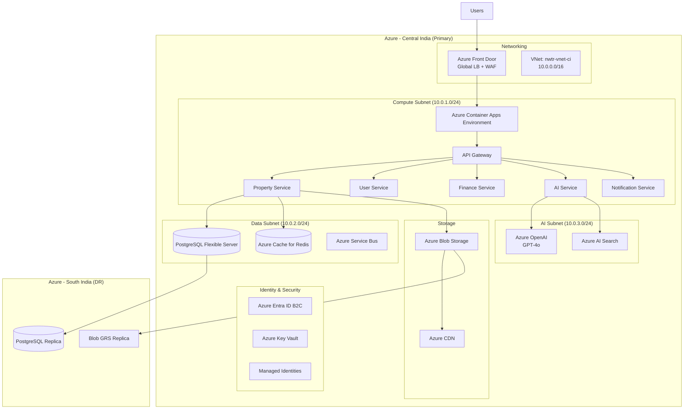
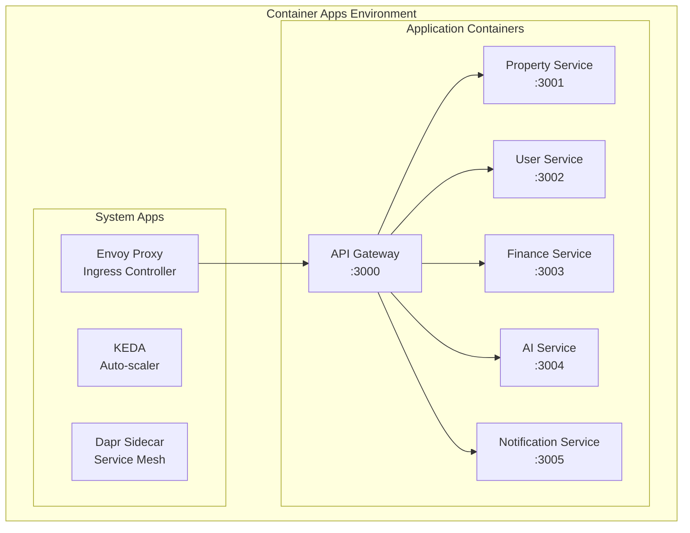
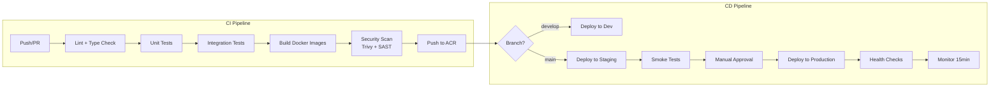
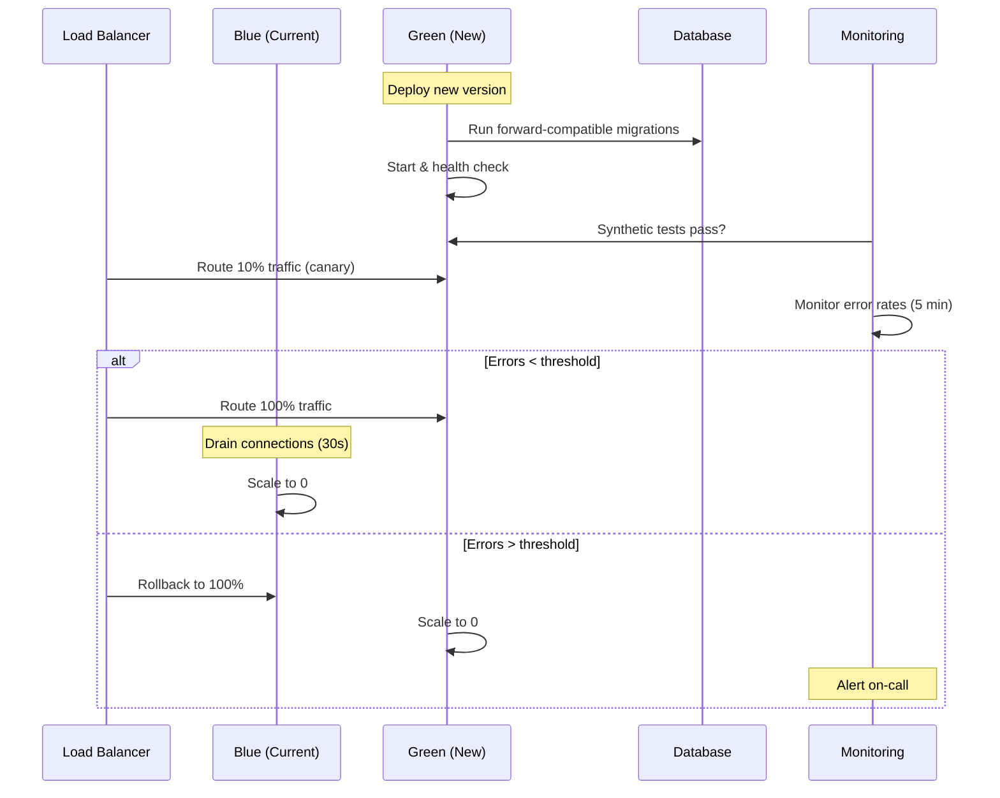
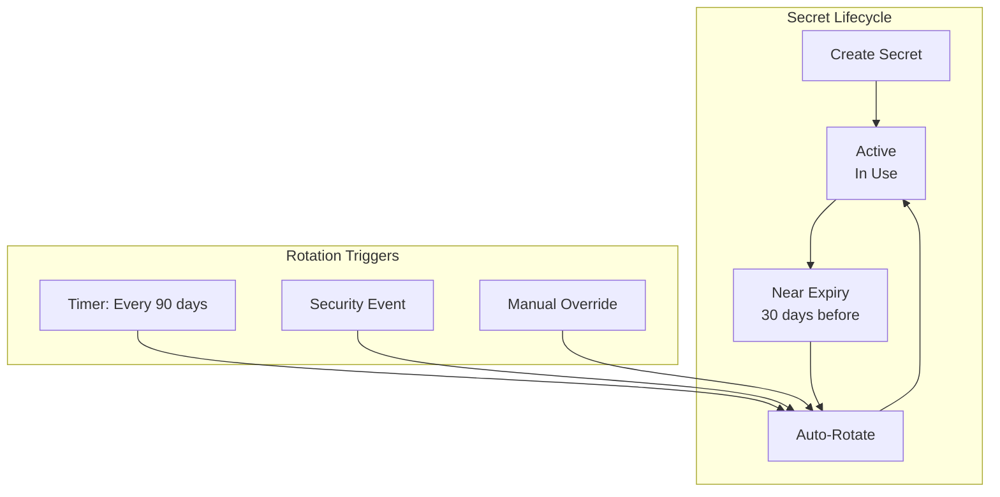

# Deployment Architecture

## TL;DR

NWTR deploys on Azure India regions using Azure Container Apps for microservice orchestration, GitHub Actions for CI/CD, and Terraform for infrastructure-as-code. The architecture supports blue-green deployments with zero-downtime database migrations, automated secret rotation, and a multi-environment promotion strategy (dev → staging → production). DR targets: RPO < 1 hour, RTO < 4 hours.

---

## 1. Infrastructure Diagram



---

## 2. Azure Resource Topology

### Resource Group Structure

| Resource Group | Purpose | Resources |
|---------------|---------|-----------|
| rg-nwtr-network-ci | Networking | VNet, NSGs, Private Endpoints, Front Door |
| rg-nwtr-compute-ci | Compute | Container Apps Environment, Container Apps |
| rg-nwtr-data-ci | Data | PostgreSQL, Redis, Service Bus |
| rg-nwtr-ai-ci | AI Services | Azure OpenAI, AI Search |
| rg-nwtr-storage-ci | Storage | Blob Storage, CDN Profiles |
| rg-nwtr-security-ci | Security | Key Vault, Managed Identities, B2C |
| rg-nwtr-monitoring-ci | Observability | Log Analytics, App Insights, Alerts |

### Region Strategy

| Region | Role | Services |
|--------|------|----------|
| Central India | Primary | All services |
| South India | DR / Read Replicas | PostgreSQL replica, Blob GRS |
| West India | Future expansion | Reserved for Year 3+ |

### Naming Convention

```
{resource-type}-nwtr-{service}-{environment}-{region-code}
```

Examples: `ca-nwtr-api-prod-ci`, `psql-nwtr-main-prod-ci`, `kv-nwtr-secrets-prod-ci`

---

## 3. Container Orchestration

### Azure Container Apps Configuration

Azure Container Apps (ACA) is selected over AKS for Year 1-3 due to reduced operational overhead, built-in auto-scaling, and cost efficiency at our scale.



### Container Specifications

| Service | CPU | Memory | Min Replicas | Max Replicas |
|---------|-----|--------|--------------|--------------|
| API Gateway | 0.5 | 1 Gi | 2 | 10 |
| Property Service | 0.5 | 1 Gi | 2 | 8 |
| User Service | 0.25 | 0.5 Gi | 2 | 6 |
| Finance Service | 0.5 | 1 Gi | 2 | 6 |
| AI Service | 1.0 | 2 Gi | 1 | 5 |
| Notification Service | 0.25 | 0.5 Gi | 0 | 3 |

### AKS Migration Trigger (Year 4+)

Migrate to AKS when any of these thresholds are met:
- Total containers exceed 30 distinct services
- Custom networking requirements (service mesh, mTLS)
- Need for GPU workloads (on-premise AI inference)
- Regulatory requirement for dedicated compute

---

## 4. CI/CD Pipeline

### GitHub Actions Workflow



### Pipeline Stages

```yaml
# .github/workflows/deploy.yml (simplified)
name: CI/CD Pipeline
on:
  push:
    branches: [develop, main]
  pull_request:
    branches: [main]

jobs:
  ci:
    runs-on: ubuntu-latest
    steps:
      - uses: actions/checkout@v4
      - name: Install dependencies
        run: pnpm install --frozen-lockfile
      - name: Lint & Type Check
        run: pnpm lint && pnpm typecheck
      - name: Unit Tests
        run: pnpm test --coverage
      - name: Build
        run: pnpm build
      - name: Docker Build & Push
        uses: azure/docker-login@v1
        with:
          login-server: nwtracr.azurecr.io

  deploy-staging:
    needs: ci
    if: github.ref == 'refs/heads/main'
    environment: staging
    steps:
      - name: Deploy to Container Apps
        uses: azure/container-apps-deploy-action@v1

  deploy-production:
    needs: deploy-staging
    environment: production
    steps:
      - name: Blue-Green Deploy
        run: ./scripts/blue-green-deploy.sh
```

### Build Performance Targets

| Stage | Target Duration | Alert Threshold |
|-------|----------------|-----------------|
| Lint + Type Check | < 2 min | > 4 min |
| Unit Tests | < 5 min | > 8 min |
| Integration Tests | < 8 min | > 12 min |
| Docker Build | < 3 min | > 5 min |
| Total Pipeline | < 20 min | > 30 min |

---

## 5. Environment Strategy

### Environment Matrix

| Environment | Purpose | Data | Infra Scale | Access |
|-------------|---------|------|-------------|--------|
| Local | Developer workstation | Seeded mock data | Docker Compose | Individual |
| Dev | Integration testing | Synthetic data | 1x minimum | Engineering team |
| Staging | Pre-production validation | Anonymized prod clone | 0.5x production | Engineering + QA |
| Production | Live users | Real data | Full scale | Operations team |

### Environment Parity

All environments use identical Docker images with environment-specific configuration injected via:
- Azure App Configuration (feature flags, service URLs)
- Azure Key Vault (secrets, connection strings)
- Environment variables (non-sensitive config)

### Feature Flag Strategy

Feature flags managed via Azure App Configuration enable:
- Gradual rollouts (percentage-based)
- Environment-specific features
- Kill switches for new functionality
- A/B testing support

---

## 6. Blue-Green Deployment Strategy



### Deployment Safeguards

- **Canary Phase:** 10% traffic for 5 minutes before full cutover
- **Automatic Rollback:** Error rate > 1% or p95 latency > 2x baseline triggers rollback
- **Connection Draining:** 30-second graceful shutdown for old instances
- **Deployment Windows:** Production deploys only Mon-Thu, 10 AM - 4 PM IST
- **Deploy Freeze:** No production deploys on month-end (25th-1st) due to payment processing

---

## 7. Database Migrations (Zero-Downtime)

### Migration Strategy

All migrations follow the **expand-contract pattern**:

1. **Expand:** Add new columns/tables (backward-compatible)
2. **Migrate:** Backfill data, update application code
3. **Contract:** Remove deprecated columns/tables (after full rollout)

### Migration Rules

- Never rename columns directly — add new, migrate data, drop old
- Never drop columns in the same release that stops using them
- Always add columns as nullable or with defaults
- Large data migrations run as background jobs, not in-transaction
- Maximum migration transaction duration: 30 seconds

### Migration Tooling

```bash
# TypeORM migration workflow
pnpm typeorm migration:generate -n AddPropertyRating
pnpm typeorm migration:run  # Forward migration
pnpm typeorm migration:revert  # Rollback capability
```

### Pre-Migration Checklist

- [ ] Migration tested against staging with production-volume data
- [ ] Rollback migration written and tested
- [ ] Application backward-compatible with both old and new schema
- [ ] Estimated lock duration < 5 seconds
- [ ] Backup created before execution

---

## 8. Secret Rotation Automation

### Azure Key Vault Integration



### Rotation Schedule

| Secret Type | Rotation Period | Method |
|-------------|----------------|--------|
| Database passwords | 90 days | Azure Function + Key Vault event |
| API keys (internal) | 90 days | Dual-key rotation |
| Redis password | 90 days | Azure automation |
| Service Bus connection | 180 days | Key regeneration |
| B2C signing keys | 365 days | Certificate rotation |
| SSL certificates | Auto (Let's Encrypt) | Azure Front Door managed |

### Zero-Downtime Secret Rotation

Uses dual-key (primary/secondary) pattern:
1. Generate new secret as secondary
2. Update all consumers to accept both keys
3. Promote new secret to primary
4. Deprecate old secret after 24h grace period

---

## 9. Infrastructure as Code

### Terraform Structure

```
infrastructure/
├── modules/
│   ├── networking/
│   ├── compute/
│   ├── database/
│   ├── ai-services/
│   ├── storage/
│   ├── security/
│   └── monitoring/
├── environments/
│   ├── dev/
│   │   ├── main.tf
│   │   ├── variables.tf
│   │   └── terraform.tfvars
│   ├── staging/
│   └── production/
├── shared/
│   ├── backend.tf
│   └── providers.tf
└── scripts/
    ├── plan.sh
    └── apply.sh
```

### State Management

- Terraform state stored in Azure Blob Storage with state locking via Azure Blob leases
- Separate state files per environment
- State encryption at rest via Azure Storage encryption
- Access controlled via Managed Identity (CI) and Azure RBAC

### Drift Detection

Automated weekly drift detection via GitHub Actions:
- `terraform plan` runs against all environments
- Differences reported as GitHub Issues
- Critical drift (security groups, IAM) triggers immediate alerts

---

## 10. Disaster Recovery Strategy

### RPO/RTO Targets

| Tier | RPO | RTO | Scope |
|------|-----|-----|-------|
| Critical (Payments, Auth) | 5 min | 30 min | Full service restoration |
| High (Property, Search) | 1 hour | 2 hours | Degraded mode acceptable |
| Medium (AI, Analytics) | 4 hours | 8 hours | Queued processing acceptable |
| Low (Reports, Notifications) | 24 hours | 24 hours | Manual recovery acceptable |

### Geo-Redundancy Configuration

| Service | Primary | Secondary | Replication |
|---------|---------|-----------|-------------|
| PostgreSQL | Central India | South India | Async (< 5 min lag) |
| Blob Storage | Central India | South India | GRS (async) |
| Redis | Central India | N/A (rebuild) | Snapshot export daily |
| Key Vault | Central India | South India | Geo-replication |
| Service Bus | Central India | South India | Geo-DR pairing |

### DR Runbook (Summary)

1. **Detection:** Azure Monitor alerts on region failure (< 2 min)
2. **Assessment:** On-call verifies scope (5 min)
3. **Decision:** DR Director authorizes failover (5 min)
4. **Execution:** Automated failover script targets South India (15 min)
5. **Validation:** Health checks and synthetic tests confirm recovery (10 min)
6. **Communication:** Status page updated, stakeholders notified

---

## 11. SSL/TLS Certificate Management

### Certificate Strategy

| Domain | Certificate Type | Provider | Auto-Renewal |
|--------|-----------------|----------|--------------|
| *.nwtr.in | Wildcard | Azure Front Door Managed | Yes (auto) |
| api.nwtr.in | SAN Certificate | Azure Front Door Managed | Yes (auto) |
| Internal services | Private CA | Azure Key Vault | Yes (90-day) |

### TLS Configuration

- Minimum TLS version: 1.2
- Preferred: TLS 1.3 where supported
- HSTS enabled with 1-year max-age
- Certificate transparency logging enabled
- OCSP stapling enabled on Front Door

---

## Cross-References

- [Scalability Strategy](./scalability-strategy.md) — Capacity planning and scaling triggers
- [DevOps Plan](./devops-plan.md) — Monitoring, alerting, and incident response
- [Cost Optimization](./cost-optimization.md) — Infrastructure cost management
- [Security Architecture](./security-architecture.md) — Security controls and compliance
- [System Architecture](./system-architecture.md) — Service design and communication patterns

---

## Revision History

| Version | Date | Author | Changes |
|---------|------|--------|---------|
| 1.0 | 2026-05-21 | Platform Engineering | Initial draft |
