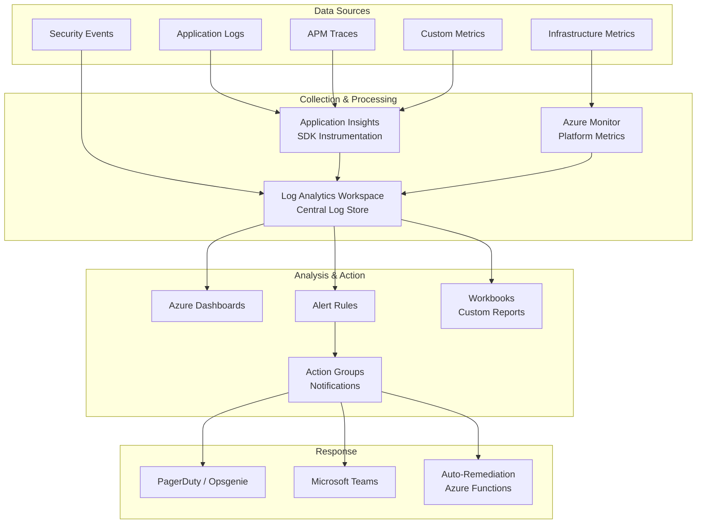
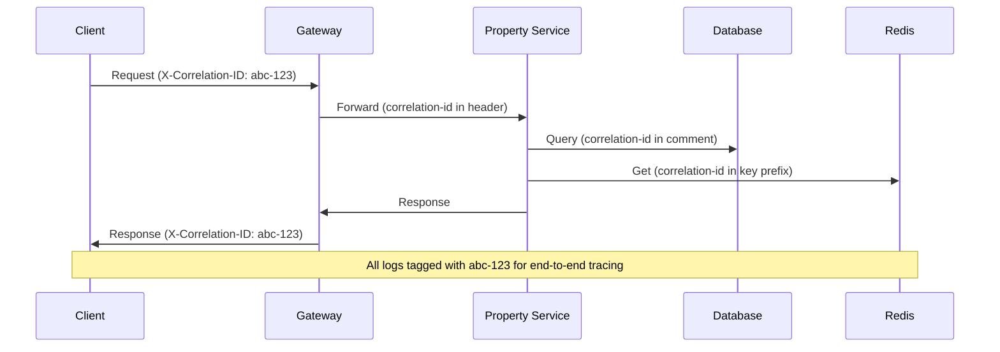
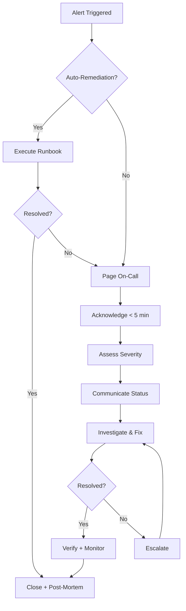
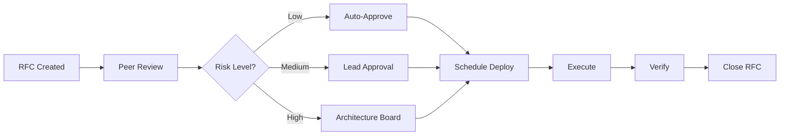

# DevOps Plan

## TL;DR

NWTR's DevOps strategy establishes a comprehensive observability stack using Azure Monitor and Application Insights, structured logging with correlation IDs, tiered alerting aligned to SLA commitments, and a formal incident management process. The plan covers the full operational lifecycle: monitoring, alerting, incident response, backup, disaster recovery testing, and change management — ensuring 99.9% uptime for critical services.

---

## 1. Monitoring Stack

### Architecture Overview



### Application Insights Configuration

| Service | Sampling Rate | Custom Metrics | Live Metrics |
|---------|--------------|----------------|--------------|
| API Gateway | 100% (Year 1) | Request routing, auth | Yes |
| Property Service | 100% | Search latency, cache hit | Yes |
| Finance Service | 100% (no sampling) | Transaction success/fail | Yes |
| AI Service | 50% | Token usage, response time | Yes |
| Notification Service | 25% | Delivery rate, failures | No |
| Frontend (Next.js) | 10% | Core Web Vitals, errors | No |

### Key Dashboards

| Dashboard | Audience | Refresh Rate | Key Widgets |
|-----------|----------|-------------|-------------|
| Platform Health | Engineering | Real-time | Service map, error rates, latency |
| Business Metrics | Product/Exec | 5 min | Active users, transactions, revenue |
| AI Performance | AI Team | 1 min | Token usage, response quality, costs |
| Security Posture | Security | 5 min | Failed logins, suspicious activity |
| Cost Tracker | Finance | 1 hour | Daily spend, forecast, anomalies |

---

## 2. Logging Strategy

### Structured Log Format

All services emit JSON-structured logs with mandatory fields:

```typescript
interface LogEntry {
  timestamp: string;        // ISO 8601
  level: 'debug' | 'info' | 'warn' | 'error' | 'fatal';
  service: string;          // e.g., "property-service"
  correlationId: string;    // Propagated across service calls
  traceId: string;          // W3C Trace Context
  spanId: string;           // Current span
  userId?: string;          // Authenticated user (PII-safe hash)
  action: string;           // e.g., "property.search"
  message: string;          // Human-readable description
  metadata?: Record<string, unknown>;  // Additional context
  error?: {
    code: string;
    message: string;
    stack?: string;         // Only in non-production
  };
}
```

### Correlation ID Propagation



### Log Retention Policy

| Log Category | Hot Storage | Warm Storage | Archive | Total Retention |
|-------------|------------|--------------|---------|-----------------|
| Application | 30 days | 90 days | 1 year | 2 years |
| Security/Audit | 90 days | 1 year | 5 years | 7 years |
| Performance | 14 days | 60 days | — | 90 days |
| Infrastructure | 30 days | 90 days | — | 1 year |
| Debug (verbose) | 7 days | — | — | 7 days |

### PII Handling in Logs

- User emails, phone numbers, Aadhaar numbers: **NEVER logged**
- User IDs: Hashed before logging
- IP addresses: Logged for security events only, rotated after 30 days
- Request bodies: Logged at DEBUG level only, with PII fields redacted

---

## 3. Alerting Rules

### Alert Severity Levels

| Severity | Response Time | Notification | Example |
|----------|--------------|--------------|---------|
| P1 - Critical | 5 min | Phone + SMS + Teams | Service down, data breach |
| P2 - High | 15 min | SMS + Teams | Payment failures > 5% |
| P3 - Medium | 1 hour | Teams + Email | Latency degradation |
| P4 - Low | 4 hours | Email | Disk usage > 80% |

### Alert Rules Configuration

| Alert | Condition | Severity | Action |
|-------|-----------|----------|--------|
| Service Down | Health check fails 3x consecutive | P1 | Page on-call + auto-restart |
| Error Spike | Error rate > 5% (5 min window) | P2 | Page on-call |
| Latency Degradation | p95 > 2x baseline (10 min) | P3 | Notify channel |
| Payment Failure | > 3 consecutive failures | P1 | Page on-call + notify finance |
| Database CPU | > 85% for 10 min | P2 | Notify + auto-scale if possible |
| Redis Memory | > 80% capacity | P3 | Notify + eviction policy review |
| Disk Space | > 80% used | P4 | Notify + auto-expand |
| Certificate Expiry | < 30 days remaining | P3 | Notify + auto-renew |
| AI Token Budget | > 80% daily budget | P3 | Notify + rate limit |
| Security: Brute Force | > 10 failed logins/IP/5min | P2 | Block IP + notify security |
| Security: Data Exfil | Unusual data download pattern | P1 | Block + page security |
| Cost Anomaly | > 150% daily average | P3 | Notify finance + engineering |

### Alert Suppression

- Maintenance windows suppress non-P1 alerts
- Deployment windows suppress latency alerts for 10 minutes
- Dependent alerts auto-suppress (e.g., DB down suppresses all service alerts)

---

## 4. Health Checks & Readiness Probes

### Health Check Endpoints

| Service | Liveness | Readiness | Startup |
|---------|----------|-----------|---------|
| All services | `GET /health/live` | `GET /health/ready` | `GET /health/startup` |

### Health Check Logic

```typescript
// Liveness: Is the process alive?
// Returns 200 if process is running (no dependency checks)
@Get('health/live')
liveness() {
  return { status: 'ok', timestamp: new Date().toISOString() };
}

// Readiness: Can the service handle traffic?
// Checks all critical dependencies
@Get('health/ready')
async readiness() {
  const checks = await Promise.allSettled([
    this.db.query('SELECT 1'),
    this.redis.ping(),
    this.serviceBus.isConnected(),
  ]);
  const allHealthy = checks.every(c => c.status === 'fulfilled');
  return { status: allHealthy ? 'ok' : 'degraded', checks };
}

// Startup: Has initial bootstrap completed?
// Runs once during container startup
@Get('health/startup')
startup() {
  return {
    status: this.bootstrapComplete ? 'ok' : 'starting',
    migrationsRun: this.migrationsComplete,
    cacheWarmed: this.cacheReady,
  };
}
```

### Probe Configuration (Container Apps)

| Probe Type | Interval | Timeout | Failure Threshold | Success Threshold |
|-----------|----------|---------|-------------------|-------------------|
| Liveness | 10s | 3s | 3 | 1 |
| Readiness | 5s | 5s | 3 | 1 |
| Startup | 5s | 10s | 30 | 1 |

---

## 5. On-Call Rotation & Incident Management

### On-Call Structure

| Tier | Scope | Rotation | Escalation After |
|------|-------|----------|-----------------|
| Primary | First responder | Weekly | 10 min |
| Secondary | Escalation engineer | Weekly (offset) | 20 min |
| Tertiary | Engineering lead | Monthly | 30 min |
| Executive | CTO / VP Eng | Permanent | 1 hour (P1 only) |

### Incident Management Process



### Incident Severity Classification

| Severity | Definition | Communication | Post-Mortem |
|----------|-----------|---------------|-------------|
| SEV-1 | Full outage, data loss risk | Status page + every 15 min | Required within 48h |
| SEV-2 | Partial outage, major degradation | Status page + every 30 min | Required within 1 week |
| SEV-3 | Minor impact, workaround available | Internal channel | Optional |
| SEV-4 | Cosmetic, no user impact | Ticket only | Not required |

---

## 6. Runbooks for Common Issues

### Runbook Index

| ID | Issue | Auto-Remediation | Manual Steps |
|----|-------|-----------------|--------------|
| RB-001 | Service unresponsive | Restart container | Check logs, verify deps |
| RB-002 | Database connection pool exhausted | Kill idle connections | Scale pool, check leaks |
| RB-003 | Redis memory full | Evict expired keys | Analyze key patterns, resize |
| RB-004 | AI service rate limited | Queue requests | Check token usage, adjust limits |
| RB-005 | Payment gateway timeout | Retry with backoff | Check provider status, failover |
| RB-006 | Certificate expired | Auto-renew trigger | Manual cert upload if auto fails |
| RB-007 | Disk space critical | Purge temp files | Expand volume, archive old data |
| RB-008 | DDoS detected | WAF auto-block | Engage Azure DDoS Protection |
| RB-009 | Database replication lag | Alert only | Check primary load, verify network |
| RB-010 | Deployment rollback needed | Auto-rollback trigger | Manual revision switch |

### Runbook Template

```markdown
## RB-001: Service Unresponsive

### Symptoms
- Health check returning 5xx
- Alert: "Service Down" triggered

### Automated Response
1. Container restart (attempt 1/3)
2. Wait 30s, recheck health
3. If still unhealthy, page on-call

### Manual Investigation
1. Check container logs: `az containerapp logs show`
2. Verify dependency health (DB, Redis, Service Bus)
3. Check recent deployments (potential bad release)
4. Check resource utilization (OOM kill?)

### Resolution
- If OOM: Increase memory limit
- If dependency: Fix dependency (see relevant runbook)
- If bad release: Rollback to last known good revision

### Escalation
If unresolved after 15 min → Escalate to Secondary
```

---

## 7. Performance Monitoring (APM)

### Custom Metrics

| Metric | Type | Labels | Alert Threshold |
|--------|------|--------|-----------------|
| `api.request.duration` | Histogram | service, endpoint, status | p95 > 200ms |
| `db.query.duration` | Histogram | service, query_type | p95 > 100ms |
| `cache.hit.ratio` | Gauge | service, cache_type | < 80% |
| `ai.token.usage` | Counter | model, module | > daily budget |
| `payment.success.rate` | Gauge | provider, type | < 95% |
| `queue.depth` | Gauge | queue_name | > 100 messages |
| `queue.processing.time` | Histogram | queue_name | p95 > 30s |

### Application Performance Baselines

Baselines established after 2 weeks of stable production traffic:

| Endpoint | Baseline p50 | Baseline p95 | Degradation Alert |
|----------|-------------|-------------|-------------------|
| GET /properties | 45ms | 120ms | p95 > 240ms |
| POST /properties/search | 80ms | 250ms | p95 > 500ms |
| POST /auth/login | 60ms | 150ms | p95 > 300ms |
| POST /payments | 200ms | 500ms | p95 > 1000ms |
| POST /ai/chat | 500ms | 2000ms | p95 > 4000ms |

---

## 8. Cost Monitoring & Alerts

### Azure Cost Management Configuration

| Alert | Threshold | Notification |
|-------|-----------|--------------|
| Daily spend anomaly | > 150% of 7-day average | Email + Teams |
| Monthly budget (80%) | 80% of monthly budget consumed | Email to finance |
| Monthly budget (100%) | 100% of monthly budget reached | Email + SMS to CTO |
| Resource idle | Resource unused > 7 days | Weekly report |
| Reserved Instance utilization | < 80% utilization | Weekly report |

### Cost Allocation Tags

All resources tagged with:
- `environment`: dev / staging / production
- `service`: property / user / finance / ai / notification
- `team`: platform / product / data
- `cost-center`: engineering / operations / ai

---

## 9. Backup Strategy

### Backup Matrix

| Resource | Method | Frequency | Retention | Location |
|----------|--------|-----------|-----------|----------|
| PostgreSQL | Automated PITR | Continuous | 35 days | Same region |
| PostgreSQL | Full snapshot | Daily (2 AM IST) | 90 days | GRS (South India) |
| Redis | RDB Snapshot | Every 6 hours | 7 days | Blob Storage |
| Blob Storage | GRS Replication | Continuous | N/A (built-in) | South India |
| Key Vault | Soft-delete + purge protection | Continuous | 90 days | Same region |
| App Configuration | Export | Daily | 30 days | Blob Storage |
| Terraform State | Blob versioning | On every change | 365 days | GRS |

### Backup Verification

| Test | Frequency | Success Criteria |
|------|-----------|------------------|
| PostgreSQL restore to dev | Weekly | Full restore < 30 min, data integrity verified |
| Redis restore | Monthly | Snapshot loads successfully |
| Full DR restore drill | Quarterly | All services operational in DR region < 4h |
| Individual table restore | Monthly | Selected tables restore correctly |

---

## 10. Disaster Recovery Testing Schedule

### DR Test Calendar

| Quarter | Test Type | Scope | Duration | Participants |
|---------|-----------|-------|----------|--------------|
| Q1 | Tabletop exercise | Full platform | 2 hours | All engineering |
| Q2 | Component failover | Database + Redis | 4 hours | Platform team |
| Q3 | Full DR drill | Region failover | 8 hours | All engineering + ops |
| Q4 | Chaos engineering | Random failures | Ongoing (1 week) | Platform team |

### DR Test Acceptance Criteria

- [ ] All P1 services recover within RTO
- [ ] Data loss within RPO targets (verified by checksum)
- [ ] Monitoring functional in DR region
- [ ] External integrations reconnect (payment, SMS)
- [ ] DNS failover completes within expected timeframe
- [ ] Runbooks accurate and complete (no undocumented steps)

---

## 11. Change Management Process

### Change Categories

| Category | Approval | Lead Time | Rollback Plan |
|----------|----------|-----------|---------------|
| Standard (routine deploy) | Automated (CI/CD) | 0 | Automated rollback |
| Normal (infra change) | Peer review + Lead | 24h | Terraform revert |
| Emergency (hotfix) | Post-hoc review | 0 | Automated rollback |
| Major (architecture) | Architecture review board | 1 week | Full rollback plan |

### Change Request Process



### Post-Implementation Review

Every change tracked with:
- Deployment timestamp and duration
- Rollback executed (yes/no)
- Incidents caused (linked)
- Performance impact (before/after metrics)

---

## Cross-References

- [Deployment Architecture](./deployment-architecture.md) — Infrastructure and CI/CD pipeline details
- [Scalability Strategy](./scalability-strategy.md) — Performance targets and scaling triggers
- [Cost Optimization](./cost-optimization.md) — Cost monitoring and budget management
- [Security Architecture](./security-architecture.md) — Security event monitoring and compliance
- [AI Integration Plan](./ai-integration-plan.md) — AI service monitoring specifics

---

## Revision History

| Version | Date | Author | Changes |
|---------|------|--------|---------|
| 1.0 | 2026-05-21 | Platform Engineering | Initial draft |
