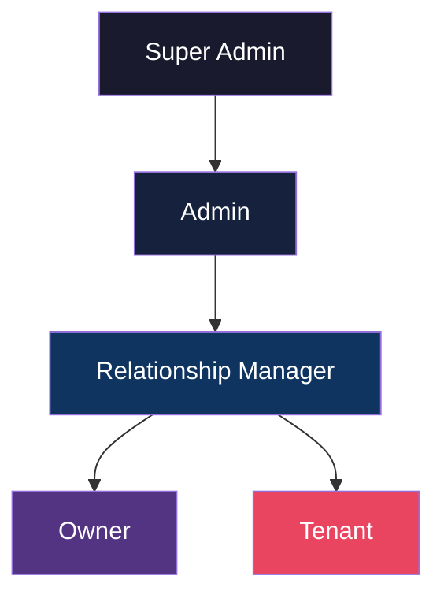
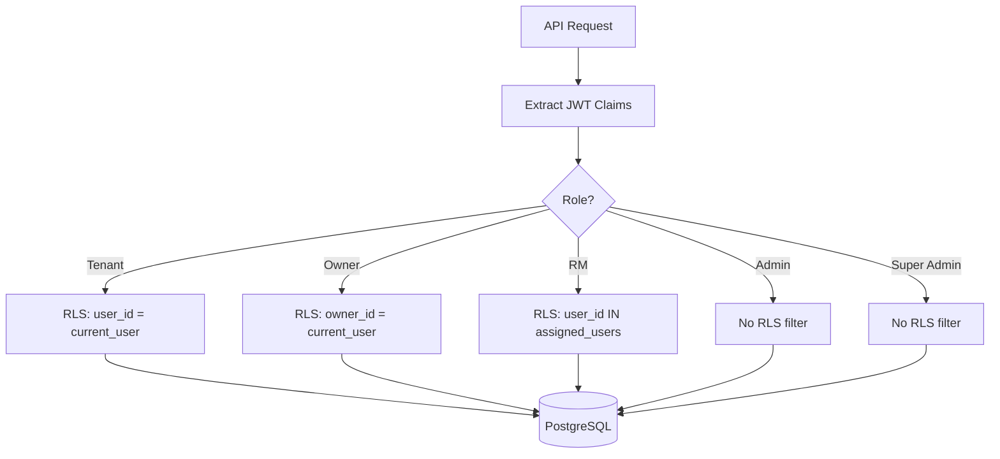
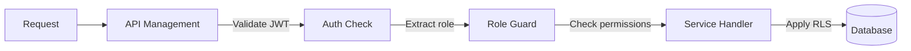
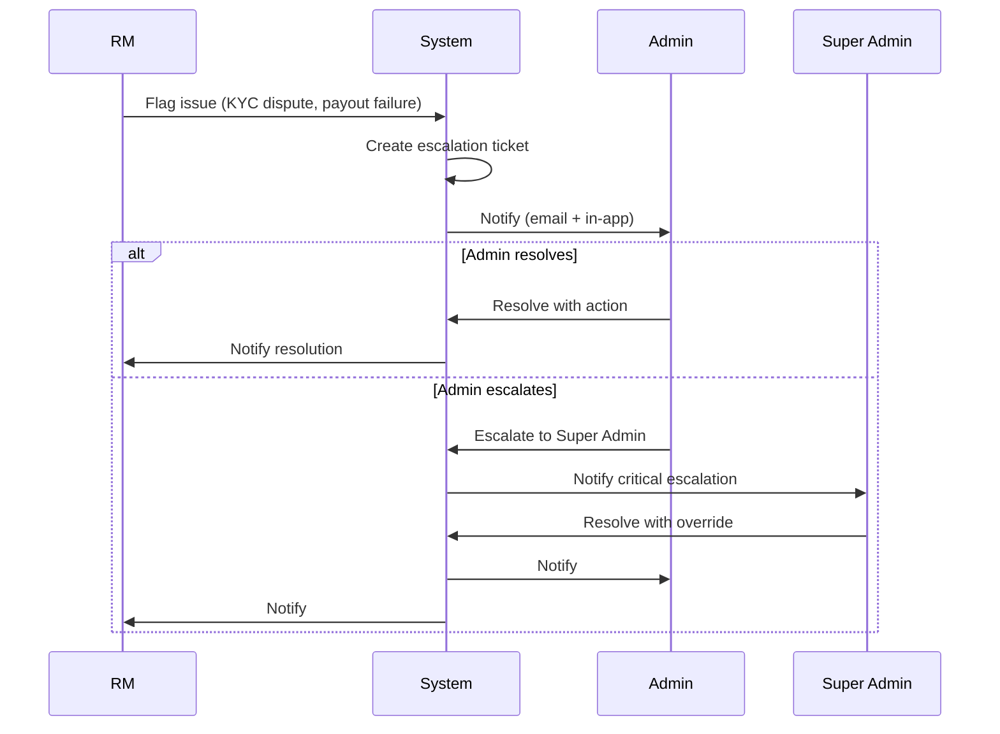

# RBAC Model

---
title: RBAC Model  
version: "1.0"  
audience: engineering  
last-updated: 2026-05-21  
status: draft  
related-docs:
  - "./system-architecture.md"
  - "../01-product/admin-portal-requirements.md"
  - "./security-architecture.md"
  - "../01-product/prd.md"
---

## TL;DR

NWTR implements a hierarchical RBAC model with 5 roles (Tenant, Owner, RM, Admin, Super Admin) enforced at three layers: Azure Entra ID B2C (identity), API Gateway (route-level), and database (row-level security). Custom JWT claims carry role and permissions. Each role has scoped access to resources, features, and data visibility. The model supports escalation paths, feature flags per role, and complete audit logging of privileged actions.

---

## Role Hierarchy



### Role Definitions

| Role | Description | Count (est.) | Portal |
|------|------------|--------------|--------|
| **Tenant** | End-user who deposits money and occupies property | 10,000+ | Tenant Portal |
| **Owner** | Property owner who lists and receives monthly payouts | 5,000+ | Owner Portal |
| **RM** | Relationship Manager assigned to manage tenants/owners | 50-200 | RM Portal |
| **Admin** | Operations team managing platform, approvals, disputes | 10-30 | Admin Portal |
| **Super Admin** | System architects with full platform access | 2-5 | Super Admin Portal |

---

## Permission Matrix

### Resource × Action × Role

| Resource | Action | Tenant | Owner | RM | Admin | Super Admin |
|----------|--------|--------|-------|------|-------|-------------|
| **Properties** | List (public) | ✅ | ✅ | ✅ | ✅ | ✅ |
| | View detail | ✅ | ✅ | ✅ | ✅ | ✅ |
| | Create | ❌ | ✅ | ❌ | ✅ | ✅ |
| | Update (own) | ❌ | ✅ | ❌ | ✅ | ✅ |
| | Update (any) | ❌ | ❌ | ❌ | ✅ | ✅ |
| | Delete | ❌ | ❌ | ❌ | ✅ | ✅ |
| | Verify/Approve | ❌ | ❌ | ✅ | ✅ | ✅ |
| **Deposits** | View own | ✅ | ✅* | ✅** | ✅ | ✅ |
| | Create | ✅ | ❌ | ❌ | ✅ | ✅ |
| | Cancel (own) | ✅*** | ❌ | ❌ | ✅ | ✅ |
| | View all | ❌ | ❌ | ❌ | ✅ | ✅ |
| | Return/Liquidate | ❌ | ❌ | ❌ | ✅ | ✅ |
| **Payouts** | View own | ❌ | ✅ | ✅** | ✅ | ✅ |
| | Schedule | ❌ | ❌ | ❌ | ✅ | ✅ |
| | Execute | ❌ | ❌ | ❌ | ✅ | ✅ |
| | Retry failed | ❌ | ❌ | ❌ | ✅ | ✅ |
| | Reconcile | ❌ | ❌ | ❌ | ✅ | ✅ |
| **KYC** | Submit own | ✅ | ✅ | ❌ | ❌ | ❌ |
| | View own status | ✅ | ✅ | ✅** | ✅ | ✅ |
| | Review/Approve | ❌ | ❌ | ✅ | ✅ | ✅ |
| | Override/Reject | ❌ | ❌ | ❌ | ✅ | ✅ |
| **Users** | View own profile | ✅ | ✅ | ✅ | ✅ | ✅ |
| | Update own | ✅ | ✅ | ✅ | ✅ | ✅ |
| | View assigned | ❌ | ❌ | ✅ | ✅ | ✅ |
| | View any | ❌ | ❌ | ❌ | ✅ | ✅ |
| | Suspend/Deactivate | ❌ | ❌ | ❌ | ✅ | ✅ |
| | Delete | ❌ | ❌ | ❌ | ❌ | ✅ |
| | Assign role | ❌ | ❌ | ❌ | ❌ | ✅ |
| **Agreements** | View own | ✅ | ✅ | ✅** | ✅ | ✅ |
| | e-Sign | ✅ | ✅ | ❌ | ❌ | ❌ |
| | Generate | ❌ | ❌ | ✅ | ✅ | ✅ |
| | Void/Cancel | ❌ | ❌ | ❌ | ✅ | ✅ |
| **AI/Chat** | Use chatbot | ✅ | ✅ | ✅ | ✅ | ✅ |
| | View analytics | ❌ | ❌ | ❌ | ✅ | ✅ |
| **RM Assignments** | View own | ❌ | ❌ | ✅ | ✅ | ✅ |
| | Create/Reassign | ❌ | ❌ | ❌ | ✅ | ✅ |
| **System Config** | View | ❌ | ❌ | ❌ | ✅ | ✅ |
| | Modify | ❌ | ❌ | ❌ | ❌ | ✅ |
| **Audit Logs** | View own | ✅ | ✅ | ✅ | ✅ | ✅ |
| | View all | ❌ | ❌ | ❌ | ✅ | ✅ |
| | Export | ❌ | ❌ | ❌ | ❌ | ✅ |

*Owner sees deposits on their properties  
**RM sees data for assigned users only  
***Only before mandate confirmation

---

## Azure Entra ID B2C Configuration

### User Flows

| Flow | Purpose | Custom Policies |
|------|---------|-----------------|
| SignUp_SignIn | Registration + login | Custom role selection, phone verification |
| PasswordReset | Self-service password reset | Rate-limited, notification on reset |
| ProfileEdit | Profile updates | Limited fields, re-auth for sensitive |
| MFA_Setup | TOTP/SMS MFA enrollment | Required for financial operations |

### App Registrations

| App | Type | Scopes |
|-----|------|--------|
| nwtr-spa | SPA (PKCE) | openid, profile, offline_access, nwtr.api |
| nwtr-api | Web API | nwtr.api.read, nwtr.api.write, nwtr.api.admin |
| nwtr-service | Daemon (client credentials) | nwtr.api.service (service-to-service) |

---

## Custom Claims and Scopes

### JWT Custom Claims

```json
{
  "extension_role": "tenant",
  "extension_kyc_tier": 2,
  "extension_rm_id": "uuid-of-assigned-rm",
  "extension_permissions": ["deposits:create", "deposits:read", "properties:read"],
  "extension_features": ["ai_chat", "deposit_calculator"],
  "extension_org_id": "optional-company-id"
}
```

### Permission Scopes by Role

| Role | Scopes |
|------|--------|
| Tenant | `properties:read`, `deposits:create`, `deposits:read:own`, `kyc:submit`, `ai:chat`, `notifications:read:own` |
| Owner | `properties:create`, `properties:update:own`, `payouts:read:own`, `kyc:submit`, `ai:chat`, `notifications:read:own` |
| RM | `users:read:assigned`, `kyc:review`, `properties:verify`, `deposits:read:assigned`, `agreements:generate` |
| Admin | `users:read:all`, `users:manage`, `deposits:manage`, `payouts:manage`, `kyc:override`, `system:read`, `audit:read` |
| Super Admin | `*` (all scopes) + `system:config`, `users:delete`, `audit:export`, `roles:assign` |

---

## Row-Level Security

### Implementation Pattern



### RLS Policies

| Table | Tenant Policy | Owner Policy | RM Policy |
|-------|--------------|--------------|-----------|
| deposits | `tenant_id = current_user` | `owner_id = current_user` | `tenant_id IN (assigned)` |
| payouts | ❌ (no access) | `owner_id = current_user` | `owner_id IN (assigned)` |
| properties | Public (listed only) | `owner_id = current_user` | All listed + assigned |
| kyc_records | `user_id = current_user` | `user_id = current_user` | `user_id IN (assigned)` |
| agreements | `tenant_id = current_user` | `owner_id = current_user` | `tenant_id OR owner_id IN (assigned)` |

---

## Feature Flags by Role

| Feature | Tenant | Owner | RM | Admin | Super Admin |
|---------|--------|-------|------|-------|-------------|
| AI Chat Assistant | ✅ | ✅ | ✅ | ✅ | ✅ |
| Property Search (Semantic) | ✅ | ✅ | ✅ | ✅ | ✅ |
| Deposit Calculator | ✅ | ❌ | ✅ | ✅ | ✅ |
| NACH Mandate Creation | ✅ | ❌ | ❌ | ✅ | ✅ |
| Payout Dashboard | ❌ | ✅ | ✅ | ✅ | ✅ |
| KYC Review Panel | ❌ | ❌ | ✅ | ✅ | ✅ |
| Bulk Operations | ❌ | ❌ | ❌ | ✅ | ✅ |
| System Configuration | ❌ | ❌ | ❌ | ❌ | ✅ |
| User Role Management | ❌ | ❌ | ❌ | ❌ | ✅ |
| Audit Log Export | ❌ | ❌ | ❌ | ❌ | ✅ |
| Analytics Dashboard | ❌ | ❌ | ✅* | ✅ | ✅ |
| Dispute Resolution | ❌ | ❌ | ✅ | ✅ | ✅ |

*RM sees only assigned-portfolio analytics

---

## API Endpoint Access Control

### Route Guard Implementation



### Endpoint → Role Mapping

| Endpoint Pattern | Tenant | Owner | RM | Admin | SA |
|-----------------|--------|-------|------|-------|------|
| `GET /api/v1/properties` | ✅ | ✅ | ✅ | ✅ | ✅ |
| `POST /api/v1/properties` | ❌ | ✅ | ❌ | ✅ | ✅ |
| `POST /api/v1/deposits` | ✅ | ❌ | ❌ | ✅ | ✅ |
| `GET /api/v1/payouts` | ❌ | ✅ | ✅ | ✅ | ✅ |
| `POST /api/v1/payouts/bulk-execute` | ❌ | ❌ | ❌ | ✅ | ✅ |
| `GET /api/v1/users` | ❌ | ❌ | ❌ | ✅ | ✅ |
| `DELETE /api/v1/users/:id` | ❌ | ❌ | ❌ | ❌ | ✅ |
| `PUT /api/v1/system/config` | ❌ | ❌ | ❌ | ❌ | ✅ |
| `GET /api/v1/audit/export` | ❌ | ❌ | ❌ | ❌ | ✅ |
| `POST /api/v1/kyc/review` | ❌ | ❌ | ✅ | ✅ | ✅ |
| `POST /api/v1/rm/assign` | ❌ | ❌ | ❌ | ✅ | ✅ |

---

## Frontend Route Guards

### Next.js Middleware Implementation

| Route Pattern | Allowed Roles | Redirect if Denied |
|--------------|---------------|-------------------|
| `/tenant/*` | Tenant | /auth/login |
| `/owner/*` | Owner | /auth/login |
| `/rm/*` | RM | /auth/login |
| `/admin/*` | Admin, Super Admin | /auth/login |
| `/super-admin/*` | Super Admin | /admin (if Admin), /auth/login |
| `/properties/*` | All authenticated | /auth/login |
| `/auth/*` | Unauthenticated | /{role}/dashboard |

### Component-Level Guards

```typescript
// Permission-based component rendering
<PermissionGate permission="deposits:create">
  <DepositButton />
</PermissionGate>

// Role-based section visibility
<RoleGate roles={['admin', 'super_admin']}>
  <BulkOperationsPanel />
</RoleGate>

// Feature flag gate
<FeatureGate feature="ai_chat">
  <ChatWidget />
</FeatureGate>
```

---

## Escalation Patterns

### RM → Admin Escalation



### Escalation Triggers

| Trigger | From | To | SLA |
|---------|------|-----|-----|
| KYC rejection dispute | RM | Admin | 24 hours |
| Payout failure (3+ retries) | System | Admin | 4 hours |
| Deposit return dispute | RM | Admin | 48 hours |
| Security incident | System | Super Admin | 1 hour |
| Data deletion request (DPDP) | Admin | Super Admin | 72 hours |
| System configuration change | Admin | Super Admin | Approval required |

---

## Audit Logging per Role Action

### What Gets Logged

| Role | Actions Logged | Retention |
|------|---------------|-----------|
| Tenant | Login, deposit actions, document uploads, profile changes | 7 years |
| Owner | Login, listing changes, payout views, agreement signing | 7 years |
| RM | All data access, KYC reviews, escalations, assignment changes | 7 years |
| Admin | All actions including bulk ops, user management, overrides | 7 years |
| Super Admin | All actions + config changes, role assignments, data exports | Permanent |

### Audit Event Schema

```json
{
  "eventId": "uuid",
  "timestamp": "ISO-8601",
  "actor": {
    "userId": "uuid",
    "role": "admin",
    "ip": "203.0.113.45",
    "userAgent": "Mozilla/5.0..."
  },
  "action": "kyc.override_reject",
  "resource": {
    "type": "kyc_record",
    "id": "uuid",
    "owner": "uuid"
  },
  "changes": {
    "before": { "status": "pending" },
    "after": { "status": "rejected" }
  },
  "reason": "Document appears fraudulent",
  "metadata": { "escalationId": "uuid" }
}
```

### Privileged Action Alerts

Actions by Admin/Super Admin trigger real-time alerts:
- User suspension or deletion
- KYC override (approve/reject without standard flow)
- Payout manual execution
- System configuration changes
- Role assignment changes
- Bulk data exports
- Audit log access

---

## Cross-References

- [System Architecture](./system-architecture.md) — Auth Service and gateway layer
- [Database Schema](./database-schema.md) — RLS policies and user tables
- [API Contracts](./api-contracts.md) — Endpoint authentication requirements
- [Security Architecture](./security-architecture.md) — Identity security controls
