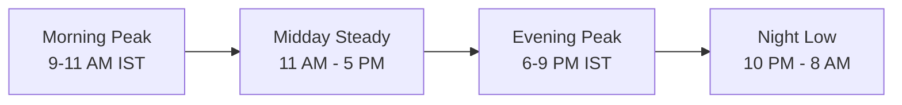
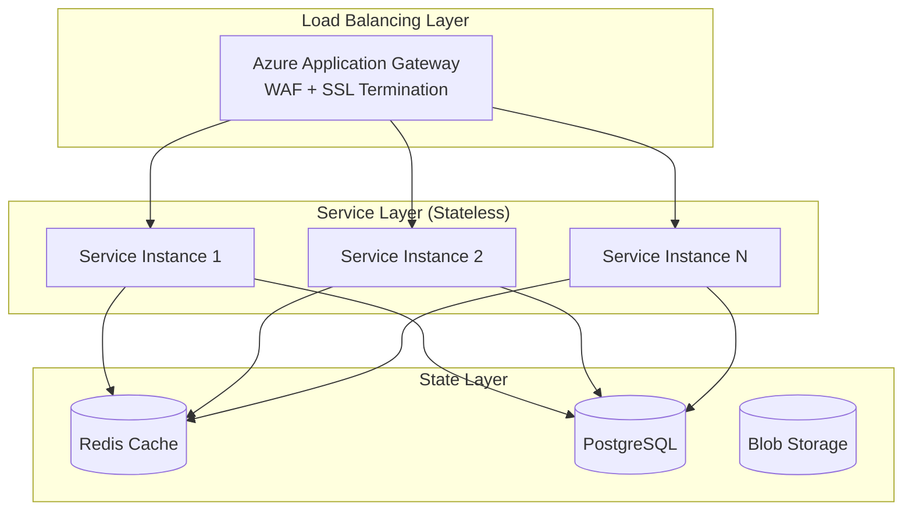
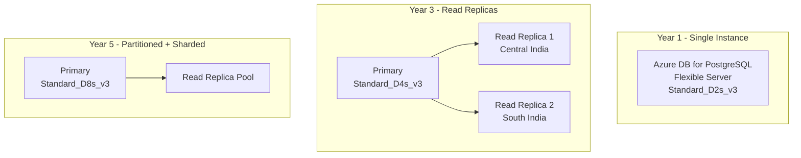
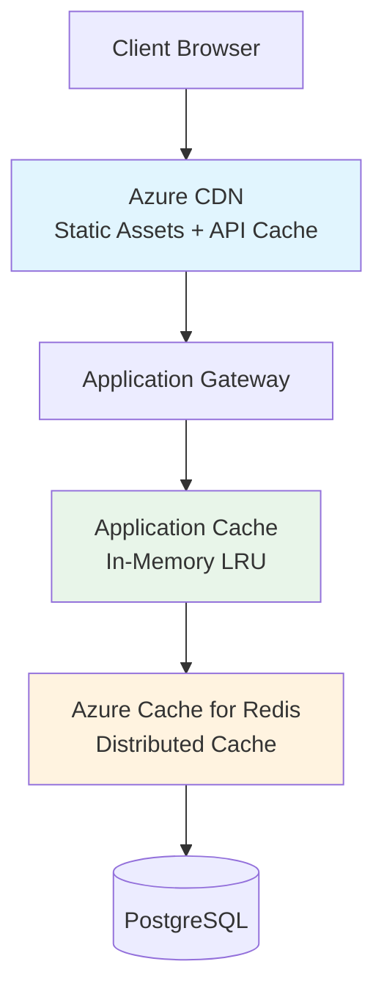
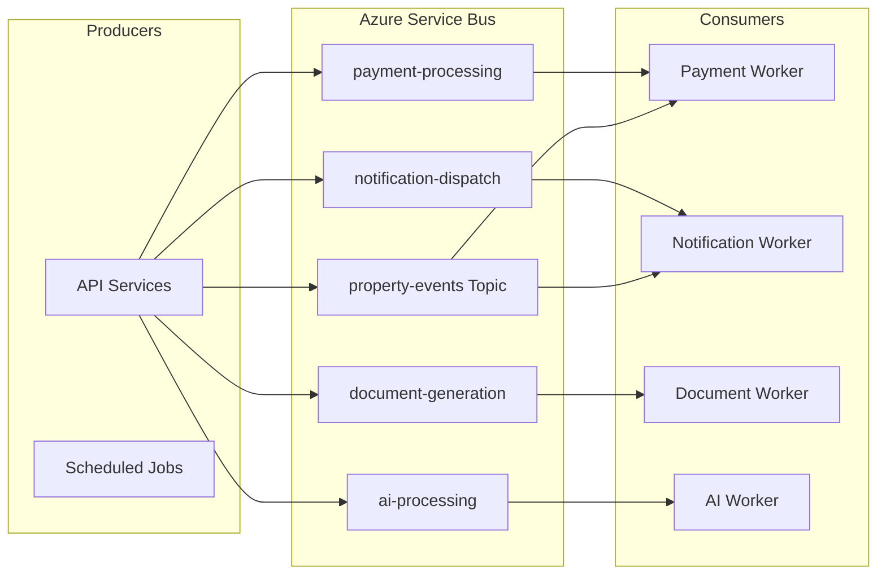

# Scalability Strategy

## TL;DR

NWTR's scalability strategy defines a three-tier growth model (Startup → Growth → Scale) with specific capacity targets, horizontal scaling patterns, and performance budgets. The architecture is designed to scale from 100 to 10,000 properties and from 500 to 100,000 users over five years using stateless microservices, managed Azure services with elastic scaling, and aggressive caching at every layer.

---

## 1. Growth Projections & Capacity Planning

### Scale Tier Definitions

| Metric | Year 1 (Startup) | Year 3 (Growth) | Year 5 (Scale) |
|--------|-------------------|------------------|-----------------|
| Properties | 100 | 2,000 | 10,000 |
| Active Users | 500 | 20,000 | 100,000 |
| Monthly Transactions | 500 | 20,000 | 100,000 |
| API Requests/day | 50,000 | 2,000,000 | 15,000,000 |
| Peak RPS | 5 | 100 | 500 |
| Data Volume (DB) | 5 GB | 100 GB | 500 GB |
| Blob Storage | 50 GB | 2 TB | 15 TB |
| AI Tokens/day | 100,000 | 5,000,000 | 30,000,000 |

### Traffic Patterns



Property search and AI advisor interactions peak during evening hours (6-9 PM IST) when tenants browse post-work. Landlord dashboard activity peaks in the morning (9-11 AM IST). Financial transactions cluster around month-start (1st-5th) and month-end (25th-30th).

---

## 2. Horizontal Scaling Patterns

### Stateless Service Architecture



**Design Principles:**

- All NestJS microservices are stateless — no in-memory session state
- JWT tokens carry authentication context; no server-side sessions
- File uploads stream directly to Azure Blob Storage
- Background job state persisted in PostgreSQL/Redis, not in worker memory
- Configuration injected via environment variables and Azure App Configuration

### Auto-Scaling Configuration

| Service | Min Instances | Max Instances | Scale Trigger |
|---------|--------------|---------------|---------------|
| API Gateway | 2 | 10 | CPU > 70% or RPS > 100/instance |
| Property Service | 2 | 8 | CPU > 65% or queue depth > 50 |
| User Service | 2 | 6 | CPU > 70% |
| AI Service | 1 | 5 | Queue depth > 10 or latency > 3s |
| Payment Service | 2 | 6 | Transaction queue > 20 |
| Search Service | 1 | 4 | Query latency > 500ms |

### Scale-to-Zero (Startup Tier)

During Year 1, non-critical services scale to zero during off-peak hours:

- AI Advisory Service: 0-2 instances (scale from zero on first request)
- Analytics Workers: 0-1 instances (triggered by scheduled events)
- Notification Service: 0-2 instances (event-driven activation)

---

## 3. Database Scaling

### PostgreSQL Scaling Strategy



**Year 1 (Startup):**
- Single Azure Database for PostgreSQL Flexible Server
- Standard_D2s_v3 (2 vCPU, 8 GB RAM)
- 128 GB storage with auto-grow
- Point-in-time restore (35-day retention)
- Connection pooling via PgBouncer (built into Flexible Server)

**Year 3 (Growth):**
- Primary: Standard_D4s_v3 (4 vCPU, 16 GB RAM)
- 2 read replicas for query distribution
- Read/write splitting at application layer using NestJS interceptors
- Table partitioning on `transactions` (by month) and `audit_logs` (by quarter)
- Connection pool: max 200 connections via PgBouncer

**Year 5 (Scale):**
- Primary: Standard_D8s_v3 (8 vCPU, 32 GB RAM)
- Read replica pool (3-4 replicas) with load-balanced reads
- Horizontal partitioning on `properties` (by city/region)
- Archival of cold data (transactions > 2 years) to separate store
- Connection pool: max 500 connections

### Connection Pooling Strategy

```typescript
// NestJS TypeORM configuration with read/write splitting
{
  replication: {
    master: { host: process.env.DB_PRIMARY_HOST, port: 5432 },
    slaves: [
      { host: process.env.DB_REPLICA_1_HOST, port: 5432 },
      { host: process.env.DB_REPLICA_2_HOST, port: 5432 },
    ],
  },
  extra: {
    max: 50,          // per-instance pool size
    idleTimeoutMillis: 30000,
    connectionTimeoutMillis: 5000,
  },
}
```

### Partitioning Strategy

| Table | Partition Key | Strategy | Trigger |
|-------|--------------|----------|---------|
| transactions | created_at (monthly) | Range | > 1M rows |
| audit_logs | created_at (quarterly) | Range | > 5M rows |
| properties | city_id | List | > 50K rows |
| messages | conversation_id hash | Hash | > 10M rows |

---

## 4. Caching Layers

### Multi-Tier Caching Architecture



### Cache Layer Specifications

| Layer | Technology | TTL | Use Cases |
|-------|-----------|-----|-----------|
| Browser | HTTP Cache Headers | 1h-24h | Static assets, images |
| CDN | Azure CDN (Microsoft) | 5min-1h | Property images, JS/CSS bundles |
| API Response | Redis | 30s-5min | Property listings, search results |
| Session | Redis | 24h | User sessions, auth tokens |
| Application | In-memory LRU | 10s-60s | Config, feature flags, hot data |
| Query | Redis | 1min-10min | Complex aggregations, reports |

### Redis Cluster Configuration

**Year 1:** Azure Cache for Redis Basic (C1 - 1 GB)
**Year 3:** Azure Cache for Redis Standard (C3 - 6 GB) with replication
**Year 5:** Azure Cache for Redis Premium (P2 - 13 GB) with clustering (2-4 shards)

### Cache Invalidation Strategy

```typescript
// Event-driven cache invalidation via Azure Service Bus
@EventPattern('property.updated')
async handlePropertyUpdate(data: PropertyUpdateEvent) {
  await this.cacheService.invalidatePattern(`property:${data.id}:*`);
  await this.cacheService.invalidatePattern(`search:city:${data.cityId}:*`);
  await this.cdnService.purge(`/api/properties/${data.id}`);
}
```

---

## 5. Async Processing

### Azure Service Bus Architecture



### Queue Specifications

| Queue | Max Delivery | Lock Duration | Dead Letter | Workers |
|-------|-------------|---------------|-------------|---------|
| payment-processing | 3 | 60s | Yes (manual review) | 2-4 |
| notification-dispatch | 5 | 30s | Yes (retry after 1h) | 1-3 |
| document-generation | 3 | 120s | Yes (alert) | 1-2 |
| ai-processing | 3 | 90s | Yes (fallback response) | 1-3 |
| kyc-verification | 2 | 300s | Yes (manual escalation) | 1-2 |

### Background Worker Patterns

- **Competing Consumers:** Multiple workers on payment queue for throughput
- **Priority Queues:** VIP tenants get priority AI processing
- **Scheduled Messages:** Rent reminders scheduled 3 days before due date
- **Deferred Processing:** Large report generation queued for off-peak execution

---

## 6. Search Index Scaling

### Azure AI Search Tier Progression

| Tier | Period | Partitions | Replicas | Indexes | Docs |
|------|--------|-----------|----------|---------|------|
| Free | Development | 1 | 1 | 3 | 10,000 |
| Basic | Year 1 | 1 | 1 | 15 | 1M |
| Standard S1 | Year 3 | 2 | 2 | 50 | 10M |
| Standard S2 | Year 5 | 3 | 3 | 200 | 50M |

### Index Design

- **properties-index:** Property listings with vector embeddings for semantic search
- **knowledge-base-index:** FAQs, financial guides, legal explanations for RAG
- **users-index:** Tenant/landlord profiles for matching algorithms
- **transactions-index:** Payment history for analytics queries

---

## 7. File Storage Scaling

### Azure Blob Storage Architecture

| Container | Access Tier | CDN | Lifecycle |
|-----------|------------|-----|-----------|
| property-images | Hot | Yes (24h cache) | Move to Cool after 90 days |
| documents | Hot | No | Move to Cool after 30 days, Archive after 1 year |
| user-uploads | Hot | No | Move to Cool after 60 days |
| backups | Cool | No | Move to Archive after 90 days, delete after 7 years |
| ai-knowledge | Hot | No | Retain indefinitely |

### Image Processing Pipeline

Upload → Azure Function (resize/optimize) → Store variants (thumb/medium/full) → CDN distribution

Variants: Thumbnail (150x150), Medium (600x400), Full (1200x800), Original (preserved)

---

## 8. Performance Budgets

### API Performance Targets

| Endpoint Category | p50 | p95 | p99 | Max |
|-------------------|-----|-----|-----|-----|
| Authentication | 50ms | 150ms | 300ms | 500ms |
| Property CRUD | 80ms | 200ms | 400ms | 800ms |
| Property Search | 100ms | 300ms | 500ms | 1000ms |
| AI Chat (first token) | 200ms | 500ms | 1000ms | 2000ms |
| Payment Processing | 150ms | 400ms | 800ms | 1500ms |
| File Upload (per MB) | 100ms | 300ms | 500ms | 1000ms |

### Frontend Performance Targets

| Metric | Target | Measurement |
|--------|--------|-------------|
| First Contentful Paint | < 1.2s | Lighthouse |
| Largest Contentful Paint | < 2.0s | Core Web Vitals |
| Time to Interactive | < 3.0s | Lighthouse |
| Cumulative Layout Shift | < 0.1 | Core Web Vitals |
| First Input Delay | < 100ms | Core Web Vitals |
| Bundle Size (initial) | < 200 KB gzipped | Build analysis |

---

## 9. Load Testing Strategy

### Test Phases

1. **Baseline Tests:** Establish performance baselines at current load
2. **Stress Tests:** Gradually increase to 3x expected peak
3. **Spike Tests:** Sudden 10x traffic bursts (simulating viral marketing)
4. **Soak Tests:** Sustained load for 24h to detect memory leaks
5. **Chaos Tests:** Random service failures during load

### Tools & Schedule

| Tool | Purpose | Frequency |
|------|---------|-----------|
| k6 (Grafana) | API load testing | Weekly (automated) |
| Playwright | Frontend performance | Per deployment |
| Azure Load Testing | Full-stack stress tests | Monthly |
| Chaos Studio | Resilience testing | Quarterly |

### Load Test Scenarios

```yaml
scenarios:
  property_search_spike:
    executor: ramping-vus
    stages:
      - duration: 2m, target: 50
      - duration: 5m, target: 200
      - duration: 2m, target: 500
      - duration: 5m, target: 500
      - duration: 2m, target: 0
    thresholds:
      http_req_duration: ['p(95)<300']
      http_req_failed: ['rate<0.01']
```

---

## 10. Cost vs Performance Trade-offs

### Tier-Based Resource Allocation

| Component | Startup (₹/month) | Growth (₹/month) | Scale (₹/month) |
|-----------|-------------------|-------------------|-------------------|
| Compute (Container Apps) | ₹8,000 | ₹60,000 | ₹2,50,000 |
| PostgreSQL | ₹5,000 | ₹30,000 | ₹1,20,000 |
| Redis Cache | ₹2,500 | ₹15,000 | ₹50,000 |
| Azure AI Search | ₹0 (Free) | ₹20,000 | ₹80,000 |
| Blob Storage + CDN | ₹1,000 | ₹10,000 | ₹40,000 |
| Service Bus | ₹500 | ₹5,000 | ₹15,000 |
| Azure OpenAI | ₹5,000 | ₹50,000 | ₹2,00,000 |
| **Total** | **₹22,000** | **₹1,90,000** | **₹7,55,000** |

### Optimization Levers by Tier

**Startup:** Scale-to-zero, free tiers, single-region, minimal redundancy
**Growth:** Reserved instances (1-year), right-sizing, caching aggressively
**Scale:** Reserved instances (3-year), spot instances for workers, multi-region CDN, custom caching layers

---

## Cross-References

- [Deployment Architecture](./deployment-architecture.md) — Infrastructure provisioning details
- [Cost Optimization](./cost-optimization.md) — Detailed cost analysis and FinOps practices
- [DevOps Plan](./devops-plan.md) — Monitoring and alerting for scale events
- [AI Integration Plan](./ai-integration-plan.md) — AI service scaling specifics
- [System Architecture](./system-architecture.md) — Overall system design

---

## Revision History

| Version | Date | Author | Changes |
|---------|------|--------|---------|
| 1.0 | 2026-05-21 | Platform Engineering | Initial draft |
