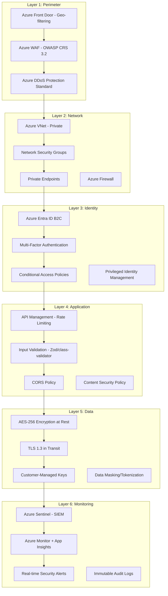
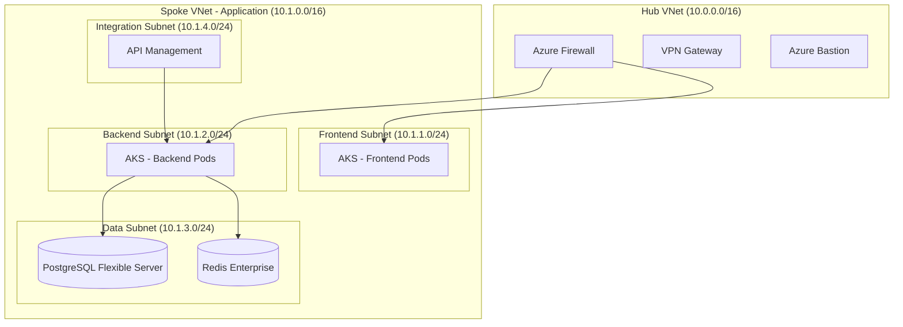
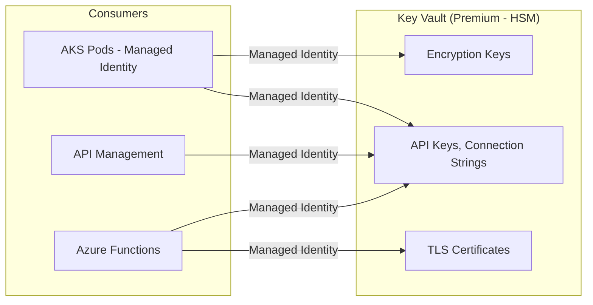
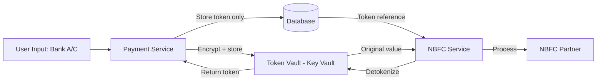
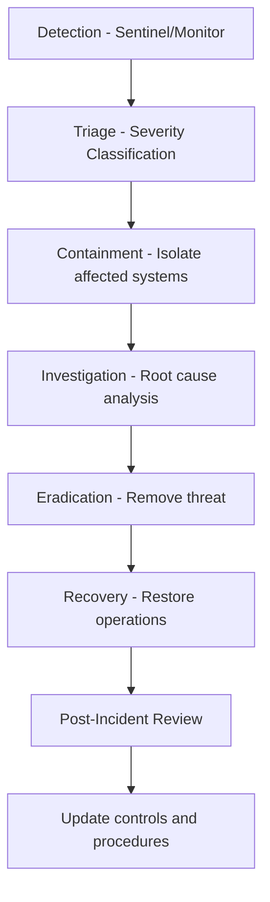

# Security Architecture

---
title: Security Architecture  
version: "1.0"  
audience: engineering  
last-updated: 2026-05-21  
status: draft  
related-docs:
  - "./system-architecture.md"
  - "../01-product/kyc-flow.md"
  - "../04-appendix/regulatory-reference.md"
  - "./rbac-model.md"
---

## TL;DR

NWTR implements defense-in-depth security across network, application, data, and identity layers. Financial data protection aligns with PCI-DSS principles and RBI data localization mandates. All data at rest uses AES-256 encryption with customer-managed keys; in transit uses TLS 1.3. Azure Key Vault manages secrets with automatic rotation. The platform complies with DPDP Act 2023 (consent-based processing), PMLA (KYC/AML), and targets ISO 27001 + SOC 2 Type II certification. Continuous vulnerability management includes SAST, DAST, SCA, and scheduled penetration testing.

---

## Defense-in-Depth Model



---

## Network Security

### Azure VNet Architecture



### Network Security Controls

| Control | Implementation | Purpose |
|---------|---------------|---------|
| **VNet Isolation** | Hub-spoke topology, peering | Segment workloads |
| **NSGs** | Deny-all default, explicit allow rules | Micro-segmentation |
| **Private Endpoints** | PostgreSQL, Redis, Blob, Key Vault, Service Bus | No public internet exposure for data |
| **Azure Firewall** | FQDN filtering, threat intelligence | Egress control |
| **DDoS Protection** | Standard tier on public-facing VNet | Volumetric attack mitigation |
| **Bastion** | Jump box for admin access | No public RDP/SSH |
| **Service Endpoints** | Azure Storage, SQL | Restrict PaaS access to VNet |

### Outbound Access Control

Only whitelisted external endpoints are reachable from the application VNet:

| Destination | Purpose | Protocol |
|------------|---------|----------|
| DigiLocker API | KYC verification | HTTPS (mutual TLS) |
| CKYC Registry | Central KYC lookup | HTTPS (mutual TLS) |
| CIBIL/CRIF API | Credit scoring | HTTPS |
| NBFC Partner API | Investments, mandates | HTTPS (mutual TLS + HMAC) |
| Razorpay API | Payment processing | HTTPS |
| Azure Entra ID | Authentication | HTTPS |
| Azure OpenAI | AI features | HTTPS (Private Endpoint) |

---

## Application Security

### OWASP Top 10 Mitigations

| Risk | Mitigation | Implementation |
|------|-----------|----------------|
| **A01: Broken Access Control** | RBAC + RLS, permission checks at every layer | NestJS Guards, PostgreSQL RLS policies |
| **A02: Cryptographic Failures** | AES-256 at rest, TLS 1.3, no PII in logs | Azure Key Vault, structured logging |
| **A03: Injection** | Parameterized queries, input validation | TypeORM (no raw SQL), class-validator, Zod |
| **A04: Insecure Design** | Threat modeling, secure SDLC | Architecture reviews, design docs |
| **A05: Security Misconfiguration** | IaC (Bicep), security baselines, no defaults | Azure Policy, CIS benchmarks |
| **A06: Vulnerable Components** | Dependency scanning, automatic updates | Dependabot, Snyk, npm audit |
| **A07: Auth Failures** | Azure Entra B2C, MFA, account lockout | Conditional access, brute-force protection |
| **A08: Data Integrity Failures** | Signed deployments, integrity checks | CI/CD pipeline verification, SRI |
| **A09: Logging Failures** | Comprehensive audit logging | Azure Monitor, Sentinel, immutable logs |
| **A10: SSRF** | URL allowlisting, network egress control | Azure Firewall FQDN rules |

### Input Validation

All API inputs validated at two levels:

1. **DTO Validation** (NestJS): `class-validator` decorators with strict whitelist
2. **Schema Validation** (Frontend): Zod schemas mirroring backend DTOs

```typescript
// Strict validation - reject unknown fields
@UsePipes(new ValidationPipe({ whitelist: true, forbidNonWhitelisted: true }))
```

### Security Headers

| Header | Value | Purpose |
|--------|-------|---------|
| `Strict-Transport-Security` | `max-age=31536000; includeSubDomains; preload` | Force HTTPS |
| `Content-Security-Policy` | Strict policy with nonces | Prevent XSS |
| `X-Content-Type-Options` | `nosniff` | Prevent MIME sniffing |
| `X-Frame-Options` | `DENY` | Prevent clickjacking |
| `Referrer-Policy` | `strict-origin-when-cross-origin` | Limit referrer leakage |
| `Permissions-Policy` | Restrictive (no camera, microphone for most) | Feature control |

---

## Data Encryption

### At-Rest Encryption

| Data Store | Encryption | Key Management |
|-----------|-----------|----------------|
| PostgreSQL | TDE (AES-256) | Azure-managed + CMK rotation (90 days) |
| Redis | AES-256 | Azure-managed |
| Blob Storage | AES-256 | CMK in Key Vault |
| Service Bus | AES-256 | Azure-managed |
| Backups | AES-256 | CMK (separate from primary) |

### In-Transit Encryption

| Channel | Protocol | Minimum Version |
|---------|----------|-----------------|
| Client → CDN | TLS | 1.3 |
| CDN → API Gateway | TLS | 1.3 |
| Service-to-Service | mTLS | 1.3 |
| Service → Database | TLS | 1.2 (Azure enforced minimum) |
| Service → Redis | TLS | 1.2 |
| Service → External APIs | TLS | 1.2 + certificate pinning |

### Field-Level Encryption

Sensitive PII fields encrypted at application level before storage:

| Field | Method | Key Rotation |
|-------|--------|-------------|
| Aadhaar number | SHA-256 hash (never stored raw) | N/A (one-way) |
| PAN number | AES-256-GCM | 90 days |
| Bank account number | AES-256-GCM | 90 days |
| Phone number (in logs) | Masked (last 4 only) | N/A |

---

## Secret Management

### Azure Key Vault Configuration



### Secret Rotation Policy

| Secret Type | Rotation Frequency | Method |
|------------|-------------------|--------|
| Database credentials | 30 days | Automated (Azure) |
| API keys (external) | 90 days | Automated with dual-key |
| Encryption keys (CMK) | 90 days | Automated |
| TLS certificates | Auto-renew (Let's Encrypt / Azure) | Automated |
| JWT signing keys | 180 days | Automated (B2C policy) |
| Service Bus connection strings | 90 days | Automated |
| NBFC HMAC secrets | 90 days | Coordinated rotation |

### Access Policy

- **No secrets in code**: All secrets via Key Vault references
- **No secrets in environment variables**: Mounted at runtime via CSI driver
- **Managed Identity**: All Azure service authentication via MI (no credentials)
- **Least privilege**: Each service has access only to its required secrets

---

## Identity Security

### Multi-Factor Authentication

| Scenario | MFA Required | Method |
|----------|-------------|--------|
| Login (all roles) | Optional (user choice) | TOTP, SMS |
| Financial operations (deposit, payout) | Mandatory | TOTP |
| Admin/Super Admin login | Always | TOTP + device trust |
| Sensitive profile changes | Step-up auth | TOTP |
| Agreement e-Sign | Aadhaar OTP | Aadhaar e-Sign gateway |

### Conditional Access Policies

| Policy | Condition | Action |
|--------|-----------|--------|
| Require MFA for Admins | Role = Admin/Super Admin | Enforce MFA always |
| Block legacy auth | Non-modern auth protocols | Block |
| Risky sign-in | Medium/High risk detection | Require MFA + verification |
| Impossible travel | Login from distant locations < 2hr | Block + alert |
| Device compliance | Unmanaged device + Admin role | Block |
| IP restriction (Admin) | Outside corporate IP range | Block or require MFA |

### Session Management

| Parameter | Value | Rationale |
|-----------|-------|-----------|
| Access token lifetime | 30 minutes | Limit exposure window |
| Refresh token lifetime | 14 days (rolling) | UX balance |
| Idle session timeout | 15 minutes (financial pages) | NIST SP 800-63B |
| Absolute session maximum | 12 hours | Force re-authentication |
| Concurrent sessions | 3 per user | Detect compromise |
| Token revocation | Immediate (Redis blacklist) | Instant logout capability |

---

## API Security

### Rate Limiting (Defense Against Abuse)

Multi-tier rate limiting applied at API Management:
- **Global**: 10,000 req/min across platform
- **Per-user**: Role-based (see API Contracts)
- **Per-endpoint**: Sensitive endpoints have lower limits
- **Per-IP**: Anonymous/unauthenticated requests

### Input Validation Rules

| Input Type | Validation | Sanitization |
|-----------|-----------|--------------|
| Email | RFC 5322, DNS MX check | Lowercase, trim |
| Phone | Indian format, 10 digits | Strip formatting |
| Amounts | Positive decimal, max 10Cr | Round to 2 decimals |
| File uploads | MIME type check, magic bytes | Virus scan (Azure Defender) |
| Free text | Max length, no HTML/script | HTML entity encoding |
| UUIDs | v4 format validation | Strict regex |
| Dates | ISO-8601, reasonable range | UTC normalization |

### CORS Policy

```json
{
  "allowedOrigins": [
    "https://app.nwtr.in",
    "https://owner.nwtr.in",
    "https://rm.nwtr.in",
    "https://admin.nwtr.in"
  ],
  "allowedMethods": ["GET", "POST", "PUT", "PATCH", "DELETE"],
  "allowedHeaders": ["Authorization", "Content-Type", "X-Request-ID"],
  "exposedHeaders": ["X-RateLimit-Remaining", "X-Request-ID"],
  "maxAge": 3600,
  "allowCredentials": true
}
```

---

## Financial Data Protection

### PCI-DSS Alignment

While NWTR does not directly process card payments (handled by Razorpay), financial data protection follows PCI-DSS principles:

| Principle | Implementation |
|-----------|---------------|
| **Network segmentation** | Dedicated data subnet, NSG isolation |
| **Encryption** | AES-256 at rest, TLS 1.3 in transit |
| **Access control** | RBAC + RLS, MFA for financial operations |
| **Monitoring** | Real-time alerting on financial anomalies |
| **Tokenization** | Bank account numbers tokenized after verification |
| **Audit trail** | Immutable logging of all financial operations |

### Tokenization Strategy



---

## Compliance Controls

### DPDP Act 2023 (Digital Personal Data Protection)

| Requirement | Control | Implementation |
|------------|---------|----------------|
| **Lawful purpose** | Consent management | Granular consent collection at registration |
| **Purpose limitation** | Data classification | Tagged fields with purpose metadata |
| **Data minimization** | Collection controls | Only required fields per KYC tier |
| **Storage limitation** | Retention automation | Automated purge/anonymize at policy expiry |
| **Accuracy** | User self-service | Profile edit + periodic re-verification |
| **Security safeguard** | Defense-in-depth | This entire document |
| **Accountability** | DPO, audit trail | Designated DPO, immutable logs |
| **Right to erasure** | Deletion workflow | Anonymization (preserving financial records) |
| **Breach notification** | Incident response | 72-hour notification SLA to DPA |
| **Cross-border** | Data localization | All data in Azure India regions |

### RBI Data Localization

- All payment and financial data stored exclusively in Azure India Central / India South
- No replication to non-Indian regions
- Database geo-restriction policies enforced via Azure Policy
- Compliance audited quarterly

### PMLA KYC/AML Controls

| Control | Implementation |
|---------|---------------|
| Customer identification | Aadhaar + PAN + address verification |
| Risk categorization | Tiered KYC (Basic → Full → Enhanced) |
| Transaction monitoring | Threshold alerts (₹10L+ single, ₹50L+ cumulative) |
| Suspicious activity reporting | Automated STR generation to FIU |
| Record keeping | 8-year retention post-relationship |
| PEP screening | Name matching against PEP databases |

---

## Incident Response Plan

### Severity Classification

| Severity | Definition | Response Time | Examples |
|----------|-----------|---------------|----------|
| **P1 - Critical** | Active breach, data exfiltration | 15 minutes | Unauthorized data access, ransomware |
| **P2 - High** | Vulnerability actively exploited | 1 hour | Auth bypass, privilege escalation |
| **P3 - Medium** | Potential exposure, no active exploit | 4 hours | Misconfiguration, exposed endpoint |
| **P4 - Low** | Minor finding, no immediate risk | 24 hours | Informational vulnerability |

### Response Workflow



### Communication Plan

| Stakeholder | P1 Notification | P2 Notification |
|------------|-----------------|-----------------|
| Security Team | Immediate (PagerDuty) | Immediate |
| CTO/Engineering Lead | 15 minutes | 1 hour |
| CEO/Leadership | 30 minutes | 4 hours |
| Legal/Compliance | 1 hour | Next business day |
| Affected Users | 72 hours (DPDP mandate) | As needed |
| DPA (DPDP Board) | 72 hours (if personal data breach) | N/A |

---

## Vulnerability Management

### SAST (Static Application Security Testing)

| Tool | Stage | Scope |
|------|-------|-------|
| SonarQube | PR gate | All source code |
| Semgrep | CI pipeline | Security-focused rules |
| ESLint Security Plugin | Pre-commit | TypeScript/JavaScript |
| tfsec | CI pipeline | Bicep/Terraform IaC |

### DAST (Dynamic Application Security Testing)

| Tool | Frequency | Scope |
|------|-----------|-------|
| OWASP ZAP | Weekly (automated) | All API endpoints |
| Burp Suite Pro | Monthly (manual) | Critical workflows |
| Azure Defender for APIs | Continuous | Runtime protection |

### Dependency Scanning (SCA)

| Tool | Trigger | Action |
|------|---------|--------|
| Dependabot | Daily | Auto-PR for patches |
| Snyk | PR gate | Block on critical/high |
| npm audit | CI pipeline | Warn on moderate+ |
| Trivy | Container build | Block on critical |

### Container Security

| Control | Tool | Frequency |
|---------|------|-----------|
| Image scanning | Trivy + Azure Defender | Every build |
| Base image updates | Dependabot | Weekly |
| Runtime protection | Azure Defender for Containers | Continuous |
| Admission control | Azure Policy (AKS) | Every deployment |
| Signed images | Notation (Notary v2) | Every deployment |

---

## Penetration Testing Schedule

| Type | Frequency | Scope | Provider |
|------|-----------|-------|----------|
| Network pentest | Quarterly | External + internal network | Third-party CERT-In empaneled |
| Application pentest | Bi-annually | All 5 portals + APIs | Third-party |
| Red team exercise | Annually | Full platform (social engineering included) | Third-party |
| Cloud configuration | Quarterly | Azure resource review | Internal + azqr tool |
| Mobile (future) | On release | Mobile app (if launched) | Third-party |

### Remediation SLA

| Finding Severity | Remediation Deadline |
|-----------------|---------------------|
| Critical | 24 hours |
| High | 7 days |
| Medium | 30 days |
| Low | 90 days |
| Informational | Next release cycle |

---

## SOC 2 Type II Control Mapping

| Trust Service Criteria | Control | NWTR Implementation |
|----------------------|---------|---------------------|
| **CC1.1** | Control environment | Security policies, CISO role, security training |
| **CC2.1** | Information communication | Security awareness program, incident playbooks |
| **CC3.1** | Risk assessment | Quarterly risk assessments, threat modeling |
| **CC4.1** | Monitoring activities | Azure Sentinel SIEM, real-time alerting |
| **CC5.1** | Control activities | Automated policy enforcement (Azure Policy) |
| **CC6.1** | Logical access | RBAC, MFA, least privilege, access reviews |
| **CC6.2** | System access registration | Azure Entra ID lifecycle management |
| **CC6.3** | Access removal | Automated deprovisioning on offboarding |
| **CC6.6** | System boundaries | Network segmentation, private endpoints |
| **CC6.7** | Data transmission | TLS 1.3, mutual TLS, certificate pinning |
| **CC6.8** | Malicious software | Azure Defender, endpoint protection |
| **CC7.1** | Monitoring infrastructure | Azure Monitor, Application Insights |
| **CC7.2** | Anomaly detection | Sentinel analytics rules, ML-based detection |
| **CC7.3** | Security incident response | Documented IRP, regular tabletop exercises |
| **CC7.4** | Incident response notifications | PagerDuty integration, escalation matrix |
| **CC8.1** | Change management | PR reviews, CI/CD gates, approval workflows |
| **CC9.1** | Risk mitigation | Insurance, SLAs, redundancy, DR planning |
| **A1.1** | Processing capacity | Auto-scaling, load testing, capacity planning |
| **A1.2** | Recovery objectives | RPO: 1 hour, RTO: 4 hours, DR region |
| **C1.1** | Confidentiality classification | Data classification (Public/Internal/Confidential/Restricted) |
| **C1.2** | Confidentiality disposal | Crypto-shred on deletion, retention automation |
| **PI1.1** | Processing integrity | Input validation, checksums, reconciliation |

---

## Cross-References

- [System Architecture](./system-architecture.md) — Network topology and service deployment
- [Database Schema](./database-schema.md) — Encryption and data retention
- [API Contracts](./api-contracts.md) — Authentication and rate limiting
- [RBAC Model](./rbac-model.md) — Access control implementation
- [Executive Summary](../00-executive/executive-summary.md) — Compliance requirements context
