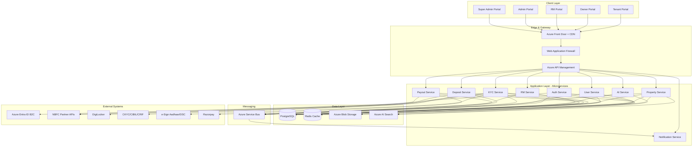
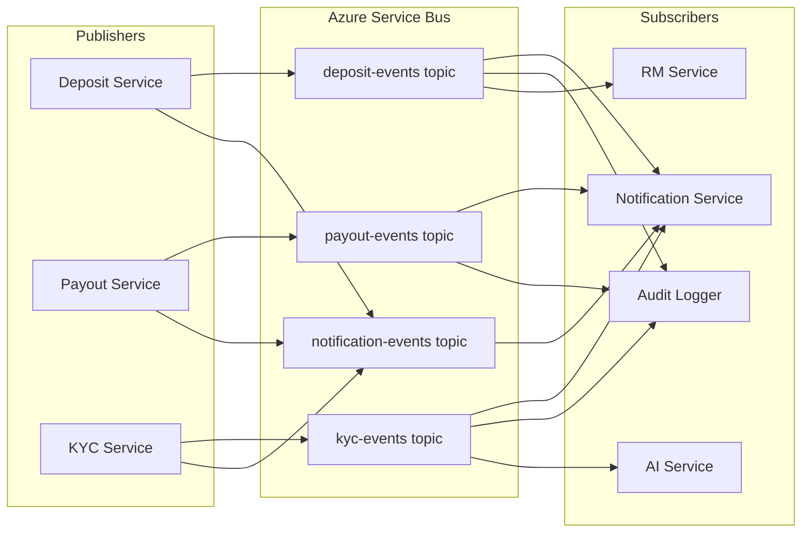
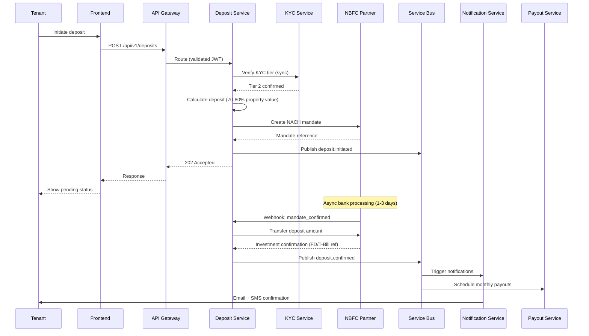
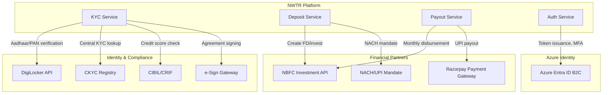
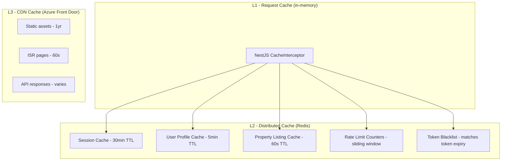
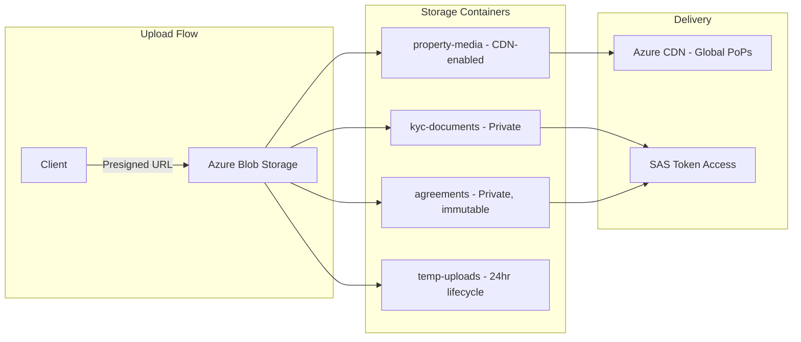
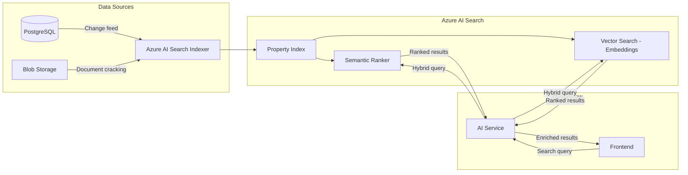

# System Architecture

---
title: System Architecture  
version: "1.0"  
audience: engineering  
last-updated: 2026-05-21  
status: draft  
related-docs:
  - "../01-product/prd.md"
  - "./api-contracts.md"
  - "./database-schema.md"
  - "./deployment-architecture.md"
  - "./security-architecture.md"
---

## TL;DR

NWTR is built on a microservices architecture deployed on Microsoft Azure (India Central/South). Nine core services communicate via synchronous REST (internal mesh) and asynchronous events (Azure Service Bus). The frontend is a Next.js 15 App Router application with SSR/ISR strategies per route. Azure API Management provides the gateway layer with rate limiting, auth validation, and request routing. Redis powers multi-layer caching, Azure Blob Storage handles documents/media, and Azure AI Search delivers semantic property discovery.

---

## High-Level Architecture



---

## Microservices Decomposition

| Service | Responsibility | Tech | Database Schema | Port |
|---------|---------------|------|-----------------|------|
| **Auth Service** | Authentication, token management, MFA orchestration | NestJS | `auth.*` | 3001 |
| **User Service** | Profile management, preferences, document storage | NestJS | `users.*` | 3002 |
| **Property Service** | Listing CRUD, search indexing, media management | NestJS | `properties.*` | 3003 |
| **KYC Service** | Identity verification, CKYC/CIBIL integration, tier management | NestJS | `kyc.*` | 3004 |
| **Deposit Service** | Deposit calculation, NACH mandate, investment tracking | NestJS | `deposits.*` | 3005 |
| **Payout Service** | Monthly payout scheduling, reconciliation, NBFC settlement | NestJS | `payouts.*` | 3006 |
| **Notification Service** | Email, SMS, push, WhatsApp, in-app notifications | NestJS | `notifications.*` | 3007 |
| **AI Service** | Chat, property recommendations, RAG pipeline | NestJS | `ai.*` | 3008 |
| **RM Service** | Relationship manager assignments, SLA tracking, escalations | NestJS | `rm.*` | 3009 |

### Service Boundaries

Each service owns its database schema (schema-per-service isolation within shared PostgreSQL clusters). Cross-service data access occurs exclusively through APIs or events — never direct database queries.

---

## Communication Patterns

### Synchronous (REST)

Internal service-to-service calls use REST over private VNet with mTLS. Used for:
- Real-time data lookups (e.g., Deposit Service queries User Service for KYC tier)
- Orchestrated workflows requiring immediate response
- Health checks and service discovery

### Asynchronous (Azure Service Bus)

Event-driven communication for:
- Deposit lifecycle events (`deposit.initiated`, `deposit.confirmed`, `deposit.matured`)
- Payout events (`payout.scheduled`, `payout.executed`, `payout.failed`)
- KYC status changes (`kyc.submitted`, `kyc.verified`, `kyc.rejected`)
- Notification triggers (all services publish, Notification Service subscribes)
- Audit trail generation



### Message Contracts

All Service Bus messages follow a standard envelope:

```json
{
  "messageId": "uuid-v4",
  "correlationId": "trace-id",
  "source": "deposit-service",
  "type": "deposit.confirmed",
  "version": "1.0",
  "timestamp": "ISO-8601",
  "data": {},
  "metadata": { "userId": "", "tenantId": "" }
}
```

---

## API Gateway Layer

Azure API Management sits at the edge, providing:

| Capability | Implementation |
|-----------|---------------|
| **Authentication** | JWT validation (Azure Entra ID B2C tokens) |
| **Rate Limiting** | Per-user, per-IP, per-subscription tier |
| **Request Routing** | Path-based routing to backend services |
| **Request/Response Transformation** | Header injection, payload shaping |
| **Caching** | Response caching for read-heavy endpoints |
| **Logging** | Request/response logging to Azure Monitor |
| **Circuit Breaking** | Backend health probes, automatic failover |
| **CORS** | Centralized CORS policy management |
| **API Versioning** | URL path versioning (`/api/v1/`, `/api/v2/`) |

---

## Frontend Architecture

### Next.js 15 App Router

```mermaid
graph TB
    subgraph "Next.js Application"
        subgraph "App Router"
            LAYOUT[Root Layout - Auth Provider, Theme]
            TENANT[/tenant/* - Tenant Portal]
            OWNER[/owner/* - Owner Portal]
            RMR[/rm/* - RM Portal]
            ADMIN[/admin/* - Admin Portal]
            SA[/super-admin/* - Super Admin Portal]
        end

        subgraph "Rendering Strategy"
            SSR[SSR - Auth-gated pages]
            ISR[ISR - Property listings, 60s revalidate]
            STATIC[Static - Marketing, Help pages]
            CSR[CSR - Real-time dashboards]
        end

        subgraph "State Management"
            ZUSTAND[Zustand - Client state]
            RQ[React Query - Server state]
            CTX[React Context - Theme, Auth]
        end
    end

    LAYOUT --> TENANT & OWNER & RMR & ADMIN & SA
    TENANT --> SSR & ISR
    OWNER --> SSR
    RMR --> SSR & CSR
    ADMIN --> SSR & CSR
```

### Rendering Strategy by Route

| Route Pattern | Strategy | Revalidation | Rationale |
|--------------|----------|-------------|-----------|
| `/properties/*` | ISR | 60 seconds | Frequently browsed, tolerates slight staleness |
| `/tenant/dashboard` | SSR | On-demand | Personalized, real-time deposit status |
| `/owner/payouts` | SSR | On-demand | Financial data must be current |
| `/admin/analytics` | CSR | WebSocket | Real-time metrics dashboard |
| `/help/*`, `/about` | Static | Build-time | Content rarely changes |

### UI Component Architecture

- **Design System**: TailwindCSS utility-first with custom tokens
- **Animations**: Framer Motion (page transitions, micro-interactions) + GSAP (complex scroll-driven animations on marketing pages)
- **Component Library**: Headless UI patterns with shadcn/ui base components
- **Forms**: React Hook Form + Zod validation (mirrors backend DTOs)

---

## Data Flow: Deposit Lifecycle



---

## External Integration Architecture



### Integration Patterns

| Integration | Pattern | Retry | Circuit Breaker | Timeout |
|------------|---------|-------|-----------------|---------|
| DigiLocker | REST + OAuth 2.0 | 3x exponential | 5 failures/30s | 30s |
| CKYC | REST + mutual TLS | 3x exponential | 5 failures/60s | 45s |
| CIBIL/CRIF | REST + API key | 2x exponential | 3 failures/30s | 60s |
| NBFC APIs | REST + mTLS + HMAC | 3x exponential | 5 failures/60s | 90s |
| Razorpay | REST + webhook | 3x linear | 5 failures/30s | 30s |
| e-Sign | REST + OAuth 2.0 | 2x exponential | 3 failures/30s | 120s |

---

## Caching Strategy

### Redis Cache Layers



| Cache Layer | Data | TTL | Invalidation |
|------------|------|-----|-------------|
| Session | JWT claims, user context | 30 min | Logout event |
| User Profile | Name, role, preferences | 5 min | Profile update event |
| Property Listings | Search results, listing cards | 60 sec | Property update event |
| Rate Limits | Request counters per user/IP | Sliding window | Automatic |
| Token Blacklist | Revoked JWTs | Token expiry | Automatic |
| OTP/Verification | Temp codes | 5-10 min | On verification |

---

## File Storage Architecture



| Container | Access | Encryption | Retention | Purpose |
|-----------|--------|-----------|-----------|---------|
| `kyc-documents` | Private (SAS) | AES-256 + CMK | 8 years (PMLA) | Aadhaar, PAN, address proof |
| `property-media` | CDN public | AES-256 | Listing lifetime | Photos, videos, floor plans |
| `agreements` | Private (SAS) | AES-256 + CMK | 30 years | Rental agreements, e-signed docs |
| `temp-uploads` | Private | AES-256 | 24 hours | Upload staging |
| `audit-exports` | Private | AES-256 + CMK | 7 years | Compliance exports |

---

## Search Architecture

### Azure AI Search Pipeline



### Index Schema

- **Fields**: location, price_range, bedrooms, area_sqft, amenities, description, owner_verified, listing_status
- **Semantic Configuration**: description, amenities (semantic fields)
- **Vector Fields**: description_embedding (1536 dimensions, Azure OpenAI text-embedding-ada-002)
- **Scoring Profiles**: Boost verified owners, recent listings, high-quality photos
- **Filters**: Faceted navigation on location, price, bedrooms, amenities

---

## Deployment Architecture

| Environment | Purpose | Azure Region | Scale |
|------------|---------|-------------|-------|
| Development | Feature development | India Central | Single instance |
| Staging | Pre-production validation | India Central | Production-mirror |
| Production | Live platform | India Central (primary), India South (DR) | Auto-scaled |

### Container Orchestration

All microservices are containerized (Docker) and deployed to **Azure Kubernetes Service (AKS)** with:
- Horizontal Pod Autoscaler (CPU/memory/custom metrics)
- Pod Disruption Budgets for zero-downtime deployments
- Network Policies for inter-service communication control
- Azure Monitor + Application Insights for observability

---

## Cross-References

- [Database Schema](./database-schema.md) — Entity details and relationships
- [API Contracts](./api-contracts.md) — Endpoint specifications
- [RBAC Model](./rbac-model.md) — Role and permission design
- [Security Architecture](./security-architecture.md) — Defense-in-depth controls
- [Executive Summary](../00-executive/executive-summary.md) — Business context
