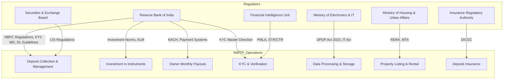

# Regulatory Reference — NWTR

## TL;DR

NWTR operates at the intersection of financial services (NBFC regulations), real estate (RERA), data privacy (DPDP Act), and anti-money laundering (PMLA). The primary regulatory bodies are RBI (financial operations), SEBI (potential CIS classification), MoHUA (Model Tenancy Act), and MeitY (data protection). This document provides a comprehensive map of all applicable regulations, their specific provisions relevant to NWTR, compliance obligations, and the legal opinions required before launch.

---

## 1. Regulatory Landscape Map



---

## 2. RBI Regulations

### 2.1 NBFC Registration & Classification

| Regulation | Reference | Relevance to NWTR |
|:---|:---|:---|
| NBFC Registration | RBI Act, Section 45-IA | NWTR's partner must be RBI-registered NBFC |
| NBFC-ND-SI Classification | Master Direction DNBR.PD.007/03.10.119/2016-17 | Non-Deposit taking, Systemically Important (asset size > ₹500 Cr) |
| NBFC-ICC (Investment & Credit Companies) | RBI Circular Oct 2019 | Merged classification for lending + investment NBFCs |
| Net Owned Fund Requirement | Scale Based Regulation (Oct 2022) | Base layer: ₹10 Cr NOF minimum |
| Capital Adequacy (CRAR) | Master Direction Ch. IV | Minimum 15% for NBFC-ND-SI |

### 2.2 Scale-Based Regulation Framework (Oct 2022)

NWTR's NBFC partner classification:

```
Base Layer: ₹10 Cr NOF, basic regulatory requirements
Middle Layer: ₹500-₹1000 Cr assets, enhanced governance
Upper Layer: >₹1000 Cr or systemic importance, near-bank regulation
Top Layer: Supervisory determination only
```

**NWTR Phase 1 Target**: Partner with Middle Layer NBFC (₹500+ Cr assets, established compliance).
**NWTR Phase 2**: Own NBFC-ICC license at Base Layer, scale to Middle.

### 2.3 Digital Lending Guidelines (September 2022)

| Provision | Circular Ref | NWTR Compliance Requirement |
|:---|:---|:---|
| LSP Registration | RBI/DOR/FIN/REC/77/03.10.001/2022-23 | NWTR registers as Lending Service Provider with NBFC partner |
| Loan disbursement to borrower account | Para 5(a) | Deposits flow to escrow, not NWTR operating account |
| Key Fact Statement (KFS) | Para 6 | All deposit terms disclosed upfront in standardized format |
| Cooling-off period | Para 7 | 3-day no-penalty withdrawal after deposit |
| Data access restrictions | Para 8 | NWTR cannot access tenant phone/contacts/gallery |
| Grievance redressal | Para 10 | Nodal officer appointment, 30-day resolution SLA |
| First Loss Default Guarantee | Circular Sept 2023 | If NWTR provides FLDG, capped at 5% of loan portfolio |

### 2.4 KYC Master Direction (Updated 2023)

| Provision | Reference | Application |
|:---|:---|:---|
| Customer Due Diligence (CDD) | Para 16-22 | All tenants and owners at onboarding |
| Enhanced Due Diligence (EDD) | Para 23-25 | Deposits ≥₹50L (PEP screening, source of funds) |
| Video KYC (V-CIP) | Circular Jan 2020 + Amendments | Tier 3 KYC for HNI deposits |
| Periodic KYC Update | Para 38 | High-risk: annual; Medium: biennial; Low: 10 years |
| Aadhaar-based eKYC | Para 17A | Permitted for NBFC-registered entities |
| CKYC compliance | Para 56-60 | Upload to CERSAI within 10 days of KYC completion |
| Beneficial Ownership | Para 28-30 | Required for corporate tenants/owners |

### 2.5 Account Aggregator Framework

| Aspect | Reference | NWTR Use |
|:---|:---|:---|
| Master Direction | RBI/DNBR/2016-17/46 | Consent-based financial data access |
| Consent Architecture | AA Technical Standards v2.0 | FIP → AA → FIU model for bank statements |
| Data Types Accessible | ReBIT FI Schema | Deposit, savings, mutual fund, insurance, tax |
| Consent Duration | Per consent artifact | Single-use for eligibility; standing for monitoring |

### 2.6 Investment Norms for NBFCs

| Instrument | RBI Norm | NWTR Allocation |
|:---|:---|:---|
| Government Securities | Mandatory: 15% of deposits in liquid assets | 20% allocation exceeds minimum |
| Corporate Bonds | Only investment-grade (BBB- or above) | NWTR restricts to AAA/AA only |
| Fixed Deposits | With scheduled banks, DICGC covered | 35% allocation with multi-bank spread |
| Mutual Funds | Permitted in debt funds | Liquid funds only (5% for payout buffer) |

---

## 3. SEBI Regulations — CIS Risk

### 3.1 Collective Investment Scheme Definition

**SEBI (CIS) Regulations, 1999 — Section 11AA of SEBI Act:**

A scheme is a CIS if it meets ALL four criteria:
1. **Pooling**: Contributions from investors are pooled
2. **Utilization**: Pooled funds utilized for investment
3. **Returns**: Investors receive profits/income from investment
4. **Management**: Scheme managed by scheme operator

### 3.2 NWTR's Defensive Position

| CIS Criterion | NWTR Argument | Strength |
|:---|:---|:---:|
| Pooling | Per-agreement segregation; no pooling across tenants | STRONG |
| Utilization | Funds invested by regulated NBFC (not NWTR) | MODERATE |
| Returns | Tenant receives REFUND (not return on investment); yield goes to owner | STRONG |
| Management | NBFC manages investments; NWTR is platform/LSP only | MODERATE |

### 3.3 Required Legal Safeguards

1. **Tier-1 legal opinion**: Engage AZB & Partners / Cyril Amarchand Mangaldas / Trilegal
2. **Structural separation**: NWTR never touches investment decisions (NBFC autonomy documented)
3. **Per-tenant segregation**: No commingling of deposits
4. **Tenant not an investor**: Deposit agreement explicitly states tenant has no investment relationship
5. **Owner receives rental income** (not investment returns): Payout framed as "guaranteed rent"

---

## 4. PMLA Compliance

### 4.1 Applicable Provisions

| Provision | Section/Rule | NWTR Obligation |
|:---|:---|:---|
| Customer identification | Rule 9 | Verify identity before account opening |
| Record maintenance | Section 12 | Maintain records for 5 years post-relationship |
| STR filing | Rule 7 | Report suspicious transactions to FIU within 7 days |
| CTR filing | Rule 7A | Report cash transactions ≥₹10L (or ₹50L aggregate/month) |
| Cross-border wire reporting | Rule 7B | Report all cross-border transfers ≥₹5L |
| PEP identification | Rule 9(1)(ba) | Enhanced due diligence for politically exposed persons |
| Beneficial ownership | Rule 9(3) | Identify beneficial owners for non-individual clients |

### 4.2 Transaction Monitoring Thresholds

| Threshold | Action | Timeline |
|:---:|:---|:---|
| Single transaction ≥₹10L cash | CTR to FIU-IND | Within 15 days of month-end |
| Aggregate ₹50L+/month | Enhanced monitoring | Continuous |
| Cross-border ≥₹5L | Cross-border wire report | Within 15 days |
| Suspicious activity (any amount) | STR to FIU-IND | Within 7 days of suspicion |
| Series of connected transactions | Pattern analysis | Automated + quarterly review |

### 4.3 Record Retention

- Transaction records: 5 years from date of transaction
- KYC records: 5 years after business relationship ends
- STR/CTR filings: 5 years from filing date
- Correspondence with FIU: Permanent

---

## 5. DPDP Act 2023 (Digital Personal Data Protection)

### 5.1 Key Provisions Affecting NWTR

| Provision | Section | Impact |
|:---|:---|:---|
| Consent requirement | Section 6 | Explicit consent for each data processing purpose |
| Purpose limitation | Section 5 | Data used only for stated purpose |
| Data minimization | Section 4(2) | Collect only what's necessary |
| Storage limitation | Section 8(5) | Delete when purpose fulfilled (conflicts with PMLA 5-year retention) |
| Right to erasure | Section 12 | Must honor unless legal obligation overrides |
| Data localization | Section 16 | Personal data stored within India (unless notified country) |
| Breach notification | Section 8(6) | Notify Data Protection Board + affected persons "without delay" |
| Children's data | Section 9 | No processing of children's data (under 18) without parent consent |
| Significant Data Fiduciary | Section 10 | Additional obligations if notified (DPO, audit, DPIA) |

### 5.2 Conflict Resolution: DPDP vs PMLA

| DPDP Right | PMLA Obligation | Resolution |
|:---|:---|:---|
| Right to erasure (Sec 12) | 5-year record retention (Rule 9) | PMLA prevails (Sec 17(2)(a) DPDP — "legal obligation" exception) |
| Purpose limitation | Ongoing monitoring for AML | Separate consent artifact for compliance monitoring |
| Data minimization | Comprehensive KYC requirements | Collect maximum at KYC, restrict access by role |

---

## 6. RERA Compliance

### 6.1 Real Estate (Regulation and Development) Act, 2016

| Aspect | Provision | NWTR Applicability |
|:---|:---|:---|
| Registration requirement | Section 3 | Applies to developers selling/leasing; NWTR may be exempt as a platform |
| Agent registration | Section 9 | NWTR may need real estate agent registration in each state |
| Karnataka RERA | K-RERA Rules 2017 | Bangalore launch requires K-RERA agent registration |
| Information disclosure | Section 11 | Property details, approvals, completion certificates |
| Advertising standards | Section 12 | No false claims about property features or returns |

### 6.2 Agent Registration Requirements

For Bangalore launch:
- K-RERA Real Estate Agent registration (Form G)
- Fee: ₹25,000 for individuals, ₹2,00,000 for companies
- Renewal: Every 5 years
- Compliance: Maintain books of accounts, annual audit

---

## 7. FEMA Compliance (NRI Module)

### 7.1 Applicable FEMA Provisions

| Provision | Reference | NRI Customer Impact |
|:---|:---|:---|
| NRE Account repatriation | FEMA (Deposit) Regulations, 2016 | Deposit from NRE account is freely repatriable |
| NRO Account restrictions | FEMA Regulation 4 | Deposit from NRO subject to $1M/year repatriation cap |
| Immovable property | FEMA (Acquisition of Immovable Property) Rules | NRI can rent; no ownership transfer in NWTR model |
| Reporting requirements | AP (DIR Series) Circulars | AD bank reporting for large transactions |
| Tax treaty implications | DTAA provisions | TDS rate may vary by country of residence |

### 7.2 Liberalised Remittance Scheme (LRS)

- LRS limit: $250,000/financial year for resident Indians remitting abroad
- **Not directly applicable** to NWTR (domestic transactions)
- Relevant only if NWTR expands to cross-border deposits or NRI refunds to foreign accounts

---

## 8. Model Tenancy Act (MTA) 2021

### 8.1 Key Provisions

| Provision | Section | Impact on NWTR |
|:---|:---|:---|
| Security deposit cap | Section 8 | Maximum 2 months' rent for residential premises |
| Deposit refund timeline | Section 8(3) | Within 1 month of tenancy termination |
| Written tenancy agreement | Section 4 | Mandatory for all tenancies |
| Registration with Rent Authority | Section 4(1) | Required within 2 months of agreement |

### 8.2 NWTR's Legal Distinction

**Critical argument**: NWTR's deposit is NOT a "security deposit" under MTA.

| Security Deposit (MTA) | NWTR Investment Deposit |
|:---|:---|
| Held by landlord | Held by NBFC in escrow |
| Refundable against property condition | Refundable unconditionally (minus legitimate deductions) |
| Capped at 2 months rent | Based on property value (50-80%) |
| No yield obligation | Yield generation is the core mechanism |
| Part of landlord-tenant relationship | Three-party financial arrangement |

**Legal opinion required**: Confirm that NWTR's "investment deposit to a third-party platform" is legally distinct from a "security deposit to landlord" under state-specific Rent Control Acts and MTA.

### 8.3 State-Specific Variations

| State | Rent Control Act | Security Deposit Provision | NWTR Risk Level |
|:---|:---|:---|:---:|
| Karnataka | Karnataka Rent Act, 1999 | 10 months max (Sec 33) | MEDIUM |
| Maharashtra | Maharashtra Rent Control Act, 1999 | 3 months (Sec 7) | HIGH |
| Delhi | Delhi Rent Control Act, 1958 | Not specified | LOW |
| Tamil Nadu | TN Buildings (Lease & Rent Control) Act | Not specified | LOW |
| Telangana | AP/TS Building (Lease, Rent & Eviction) Control Act | 3 months | HIGH |

---

## 9. IT Act & Cybersecurity

### 9.1 Information Technology Act, 2000

| Provision | Section | NWTR Obligation |
|:---|:---|:---|
| Reasonable security practices | Section 43A | Implement IS/ISO/IEC 27001 or equivalent |
| Intermediary guidelines | Section 79 + IT Rules 2021 | If classified as intermediary: grievance officer, content moderation |
| Data breach liability | Section 43A | Compensation for failure to protect sensitive data |
| Electronic agreements | Section 10A | Digital agreements legally valid |
| Electronic signatures | Section 3A | Aadhaar eSign valid for agreements |

### 9.2 CERT-In Reporting (April 2022 Directions)

| Incident Type | Reporting Timeline |
|:---|:---|
| Data breach | Within 6 hours of detection |
| Unauthorized access | Within 6 hours |
| Ransomware/malware attack | Within 6 hours |
| DDoS attack | Within 6 hours |

Additional requirements:
- Maintain logs for 180 days (within India)
- Designate SPOC for CERT-In coordination
- Report to users affected by breach

---

## 10. Compliance Calendar

| Month | Obligation | Regulator | Frequency |
|:---|:---|:---|:---|
| Monthly | CTR filing | FIU-IND | Monthly (by 15th of next month) |
| Monthly | CKYC upload (new customers) | CERSAI | Within 10 days of KYC |
| Quarterly | NBFC return filing (NBS-7) | RBI | Quarterly |
| Quarterly | Compliance certificate to Board | Internal | Quarterly |
| Half-Yearly | ALM return | RBI | June & December |
| Annually | Statutory audit | RBI | Within 6 months of FY end |
| Annually | K-RERA compliance filing | K-RERA | Annual |
| Annually | DPDP compliance audit | DPB | Annual (if Significant DF) |
| As needed | STR filing | FIU-IND | Within 7 days of suspicion |
| As needed | Data breach reporting | CERT-In | Within 6 hours |
| Every 5 years | K-RERA agent renewal | K-RERA | 5-year cycle |

---

## 11. Legal Opinion Roadmap

### Pre-Launch (Mandatory)

| Opinion | Law Firm Tier | Purpose | Estimated Cost |
|:---|:---|:---|:---:|
| CIS vs NBFC deposit classification | Tier-1 (AZB/CAM/Trilegal) | Confirm deposits are NOT a CIS | ₹15-25L |
| MTA security deposit distinction | Tier-1 | Confirm investment deposit ≠ security deposit | ₹8-12L |
| FEMA compliance for NRI module | Tier-1 | Confirm NRI deposit/refund structure | ₹5-8L |
| LSP registration validity | Tier-2 | Confirm NWTR qualifies as LSP under DL Guidelines | ₹3-5L |

### Post-Launch (Within 6 Months)

| Opinion | Purpose |
|:---|:---|
| State-specific rent control analysis | Expansion to Maharashtra, Telangana |
| NBFC-ICC license feasibility | Phase 2 own-license assessment |
| Consumer protection | Applicability of Consumer Protection Act, 2019 |
| Competition law | CCI assessment if market share grows |

---

## 12. Regulatory Risk Register

| Risk | Probability | Severity | Mitigation | Owner |
|:---|:---:|:---:|:---|:---|
| SEBI CIS classification | LOW (with safeguards) | EXISTENTIAL | Per-tenant segregation, legal opinion, NBFC structure | Legal + CEO |
| MTA deposit cap enforcement | MEDIUM | HIGH | Legal distinction, state-specific strategy | Legal |
| RBI policy change (DL Guidelines) | LOW | MEDIUM | Structural flexibility, compliance buffer | Compliance |
| DPDP Act enforcement action | LOW | MEDIUM | DPO appointment, privacy-by-design | CTO + DPO |
| K-RERA registration denial | LOW | LOW | Agent registration before platform launch | Operations |
| PMLA/FIU scrutiny | MEDIUM | HIGH | Robust AML program, proactive STR filing | Compliance |

---

## Cross-References

| Topic | Document |
|:---|:---|
| Compliance strategy and NBFC structure | [Trust & Compliance Strategy](../00-executive/trust-compliance-strategy.md) |
| Risk analysis with regulatory scenarios | [Risk Analysis](../00-executive/risk-analysis.md) |
| KYC implementation details | [KYC Flow](../01-product/kyc-flow.md) |
| Security architecture (data protection) | [Security Architecture](../02-technical/security-architecture.md) |
| Escrow and investment mechanics | [Escrow & Deposit Logic](../01-product/escrow-deposit-logic.md) |
| Full terminology definitions | [Glossary](./glossary.md) |
